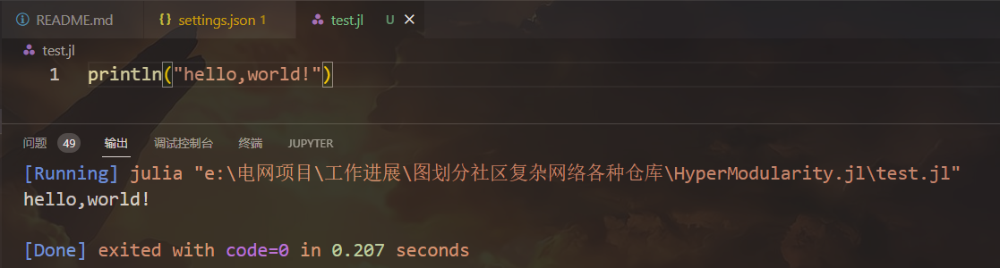

# Julia简介

## 历史

- 2012年诞生，MATLAB用户开发的，用作科学计算。

MATLAB——慢、收费

C——接近底层，缺乏抽象能力

C++——开发效率低

Python——太慢

## 特点

- 核心语言小，和C一样的速度，和Python一样简介，MATLAB类似的数学表达符号。
- 用作高性能计算：并行计算、分布式计算。
- 有Lisp的宏和元编程工具

## 使用场景

数据处理相关：机器学习、数据处理、算法仿真、数值分析。

一般用Python做模型验证，然后用C++做实现，Julia避免了这两步。

## 缺点

- 基于JIT（即时编译），第一次运行的时间比较慢，不适合小规模只运行一次的任务。
- 生态不够强，没有很多API。
- 命令行工具缺乏，不适合做终端开发。

# Julia安装

[官网](https://julialang.org/)直接安装，Download 最新版本，Julia的REPL编译器。

推荐编辑器有三种：Juno（Julia Pro）、VS Code、Jupyter

VS Code配置

- 安装两个插件：Julia、Code Runner，

- 在user setting中设置Julia的可执行路径。

  ```json
  "julia.executablePath": "D:\\Julia-1.7.3\\bin\\julia.exe"
  ```



Jupyter notebook

- "]"进入Package模式
- add IJulia
- using IJulia（这里注意，要按清除键返回julia环境）
- IJulia.notebook（提示要安装Jupyter但是我已经有了，比较奇怪，暂时没管，直接在jupyter notebook打开可用）

## 更改Pkg存放位置

[Julia](https://so.csdn.net/so/search?q=Julia&spm=1001.2101.3001.7020)的Pkg下载包默认下载到user目录下的`.julia`，可能会导致C盘占用过大，建议更改存放路径。

设置一个环境变量，名为：`JULIA_DEPOT_PATH`，值为：`你需要的路径`。

## jupyter运行julia

在jupyter中打开其他盘的方法：

1、使用“win+R”打开运行，输入cmd点击确定。

2、在打开的cmd中使用cd命令进入其它盘

3、使用jupyter notebook命令启动jupyter即可打开所在盘。

直接选中对应代码块，shift+enter即可运行。