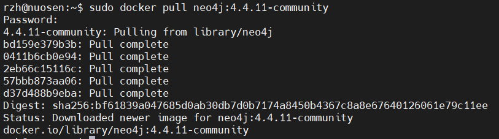
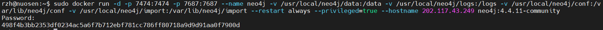
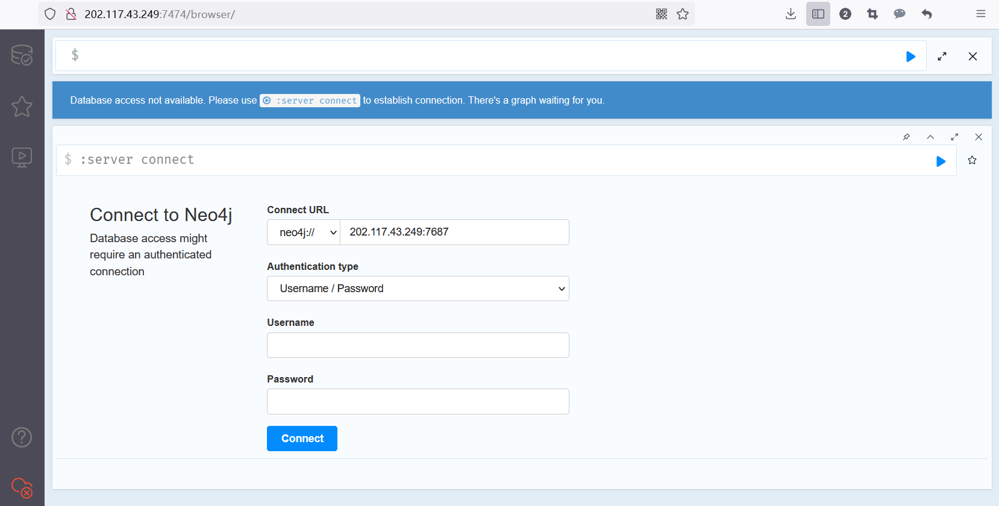

# 基于docker部署neo4j

> 告警日志大数据小组

**服务器型号：Ubuntu 18.04.5 LTS**

**Docker 版本号：20.10.2（服务器已有）**

参考文章：

1. [使用docker安装neo4j](https://blog.csdn.net/Maple470/article/details/86494128 )
2. [Docker 安装部署 neo4j](https://blog.csdn.net/weixin_44037416/article/details/125560775)

## 拉取镜像

需要使用root权限：

```bash
sudo docker pull neo4j:4.4.11-community
```



## 执行镜像命令

```bash
docker run -d -p 7474:7474 -p 7687:7687 --name neo4j \
  -v /usr/local/neo4j/data:/data \
  -v /usr/local/neo4j/logs:/logs \
  -v /usr/local/neo4j/conf:/var/lib/neo4j/conf \
  -v /usr/local/neo4j/import:/var/lib/neo4j/import \
  --restart always --privileged=true --hostname 202.117.43.249
neo4j:4.4.11-community
```

设置容器映射端口、名称、挂载位置（usr/local下）

设置自启动、主机root权限、主机名称设置



## 修改数据库密码



初始用户名密码为：neo4j

修改为：XJTUwangan#1024 ——区分大小写