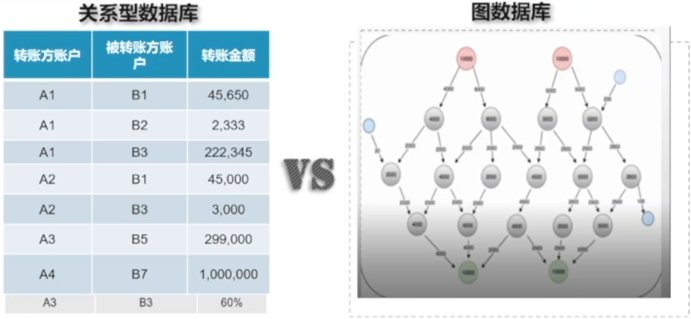
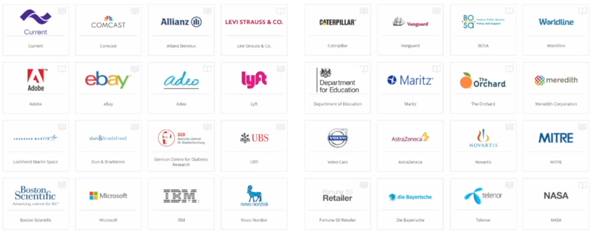
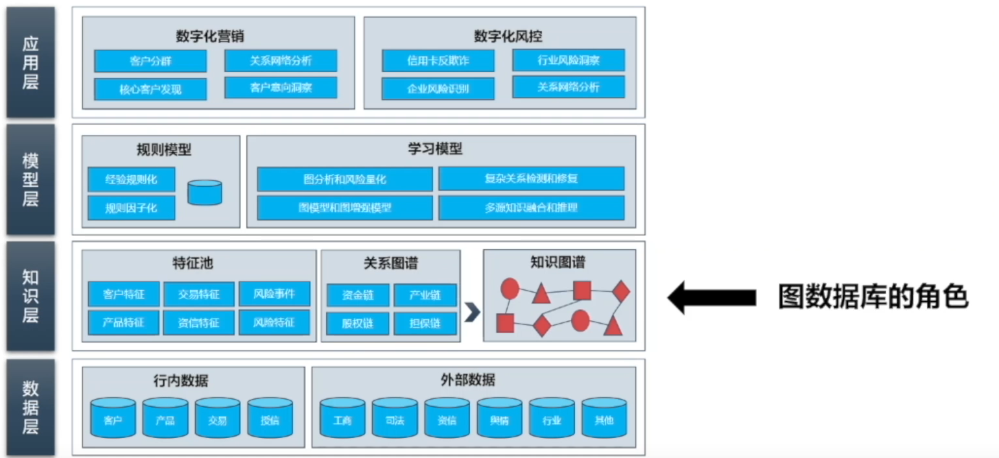
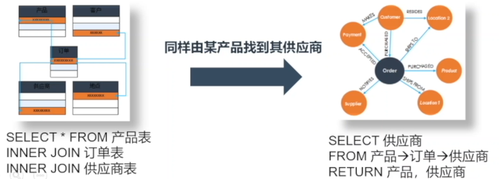
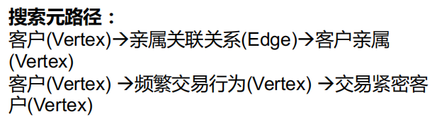
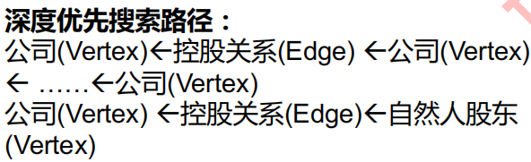

# 图数据库介绍

## 图的概念

顶点+边：G=(V,E)

分类：（三种范式）

**超图**（Hyper Graph）、**属性图**（Property Graph）、**三元组**（RDF）

1. 超图：实体通过超边相连，一条超边对应一类关系
2. 属性图：每个实体，所有关系都有自己的属性
3. 三元组（资源描述框架）：资源信息、属性、属性值

图数据库使用的图模型——**属性图**

- 节点（vertex）：实体/实例，用标签（label）表示其类型
- 边（edge）：两实体的关系，源+目标，关系类型（type）表明其类型
- 属性（properties）：键值对，描述节点和边的属性信息

## 图数据库vs.关系型数据库

**1. 对比**

|          |            关系型数据库            |                图数据库                |
| :------: | :--------------------------------: | :------------------------------------: |
| 存储模型 |   用**二维表**存储实体与关系信息   |  用**点与边的集合**存储实体与关系信息  |
| 查询模型 |    基于**扫描行、过滤行与聚合**    |  基于点边组成**路径的遍历与中间计算**  |
| 分析类型 | 适用于**简单数据查找与描述性统计** |     适用于**关联分析与预测性分析**     |
| 实时查询 |    **物理隔离的表建立关联较慢**    | 基于图结构的存储，**关联扩展响应极快** |

**2. 实例**

——资金流从嫌疑账户开始，经过多个账户中转，最后如何回流到本身账户

- 关系型数据库：需要结合大量业务规则和算法模型来实现；很难或者无法通过SQL直接实现业务查询需求，经常涉及多度表关联操作
- 图数据库：过简单自然的建模与直接的图查询语句，更符合人类直觉；可快速的开发出图查询代码；可为下游模型提供优质的特征数据。

## 发展

1. 发展流行趋势迅猛
2. 学术界研究从2018年开始暴涨
3. 工业界许多图数据库解决方案

## 产品分类

1. 运营模式
   - 企业版：性能高、稳定；采购成本高
   - 开源社区：成本低、定制化开发；维护难度大
   - 云服务：依托第三方云

2. 面向场景
   - 操作型：企业级事务应用程序
   - 知识图谱（RDF）：RDF知识图谱
   - 多模态图：针对相同数据运行不同类型的查询——图查询、键值对查询
   - 分析图：完全面向批处理的计算平台，集成各种算法

3. 产品定位
   - **图计算系统 OLAP**：侧重计算、不能实时更新，适用于实时性要求不高、数据量大场景
   - **图数据库 OLTP**：图存储计算、实时查询、更新，适用于实时性要求高、逻辑计算简单场景

## 架构

1. **开发流程**：
   1. 定义图模式 ——业务访谈/数据梳理
   2. 加载数据——数据抽取/转换/映射
   3. 创建查询——图规则/算法开发
   4. 测试查询——查询测试/调优
   5. 服务上线——生产上线

2. **技术架构**：

# 图查询的概念及应用

## 图查询概念

- 场景：多张数据表之间有多个不同的关联键，常常需要使用**多张表的信息进行复杂关联**。

- 特点：会用到多次、甚至**未知次数的表联接**，甚至可能有**环路**问题。

- 问题：**增加了**数据分析人员的SQL**代码开发难度**以及对**规则逻辑的理解难度**，还会**大量消耗**数据库的**计算资源**。

- 图优势：用图查询去访问图数据库中的数据，不论是**可视化探索**还是**代码开发**，都更**符合人类的直觉**，**减少**了**开发难度**和逻辑**复杂度**，并且**响应速度大大加快**。

关系数据库：两步表关联；图数据库：给出一条路径即可

- **本质**：**在图数据库中，给定搜索的规则（Rule）和模式（Pattern），去访问图数据库中的点、边信息，包括结构信息、属性信息、路径信息等等**。
  - 规则和模式：深度优先遍历、广度优先遍历、给定元路径进行搜索、给定环路结构进行搜索等等。

## 图查询应用

### 搜索个贷失联客户

- 场景：信贷不良资产的处置，寻找客户——借由寻找其亲属或其他关联人来找到失联人。
- 问题：关联人信息往往储存在数据仓库的不同表中，较为隐蔽、结构各异、难以汇总。
- 解决：图数据库中寻找

### 搜索企业交易上下游

- 场景：某一企业的上下游交易流水，清楚的反应了该企业以及所在产业链的现状及发展趋势，可为银行的业务决策、贷前营销、客户拓展、信用评估和风险识别预警等提供数据支持。
- 问题：产业链上存在着行业跨度大，多链路交错的复杂网络特性，不易从中快速有效地获得某企业上下游关联交易信息。并且，基于交易明细表的多次自关联操作耗时巨大、逻辑复杂。
- 解决：使用图查询，更符合人类直觉

### 企业股权穿透探索

- 场景：随着企业集团化、家族化、多元化发展，单一企业通过资本运作组建成商业帝国；各类资本系内部股权不透明，隐形股东和股权代持现象频繁发生，主要股东、控股股东、实际控制人、一致 行动人、最终受益人不明晰；企业与股东个人、企业与企业之间的关系与交互影响愈加复杂，单个客户信用风险的爆发有可能引发整个关联客群的风险。

