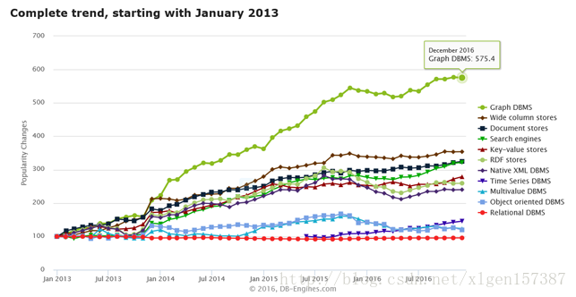
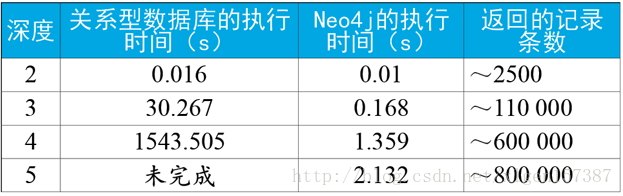
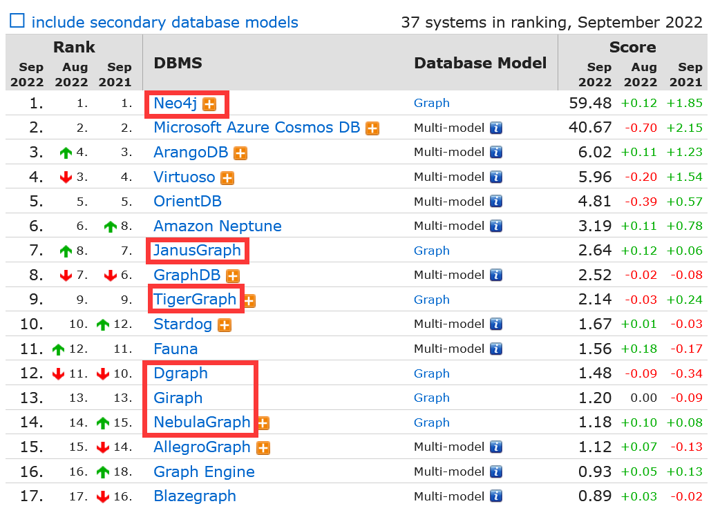
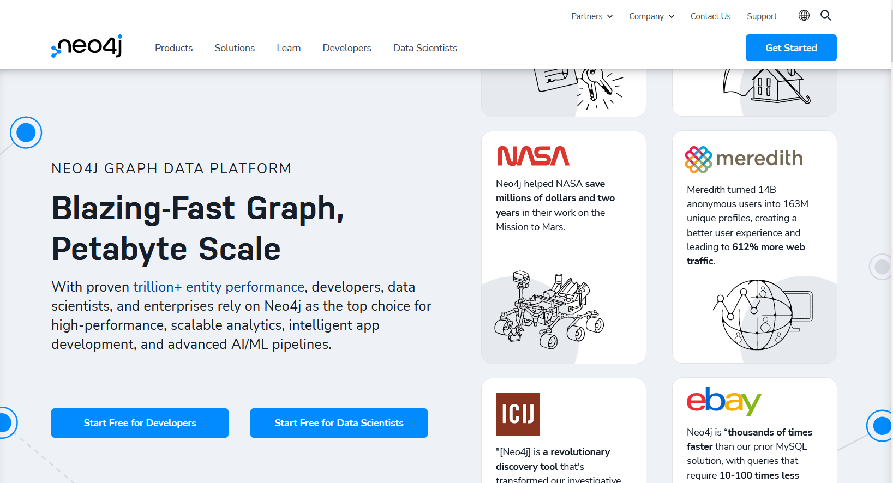
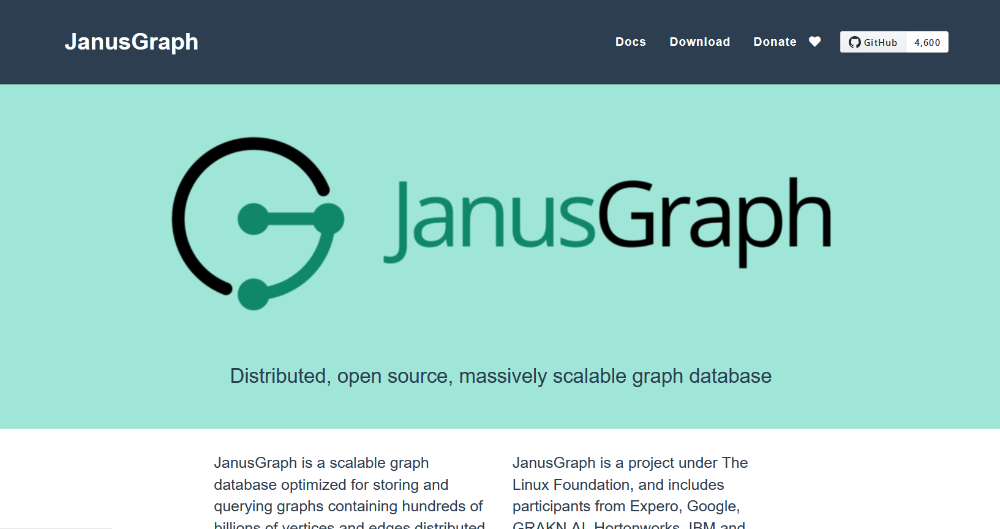
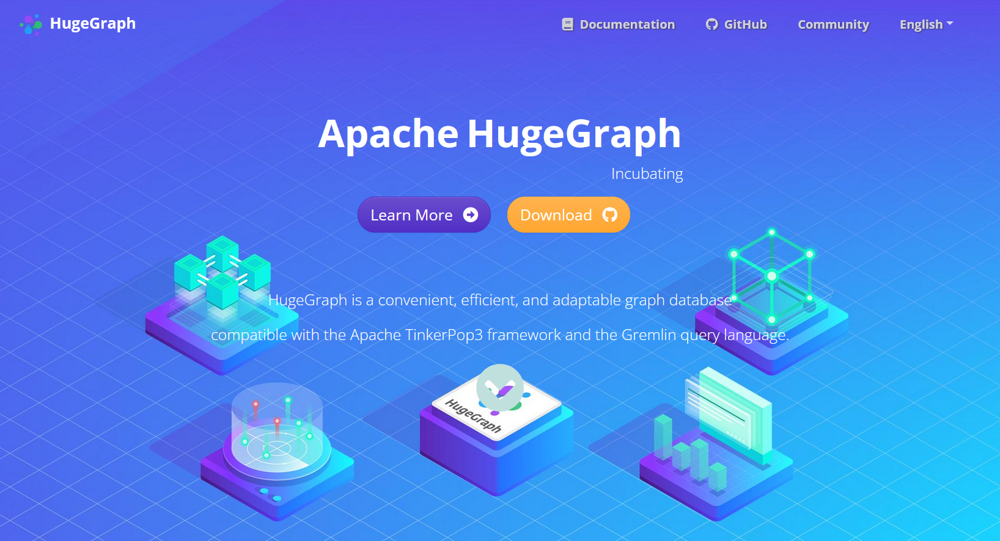
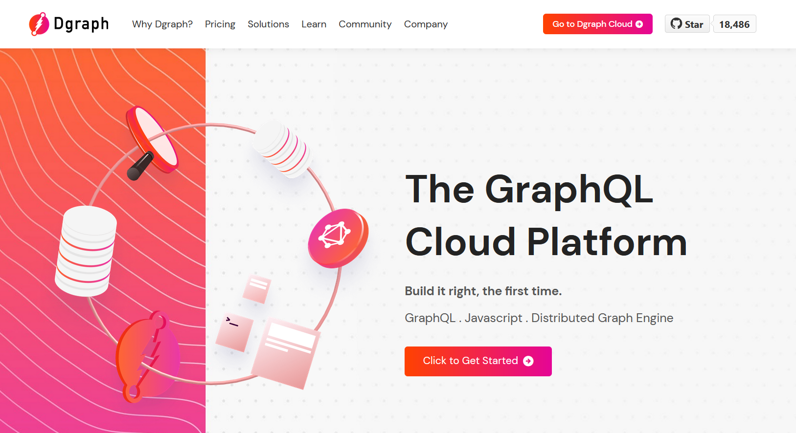
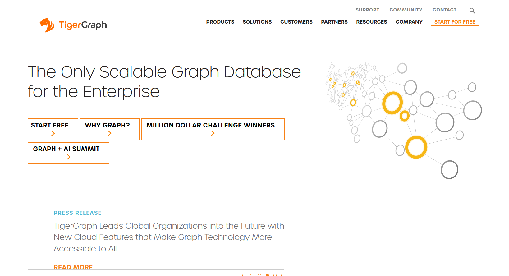
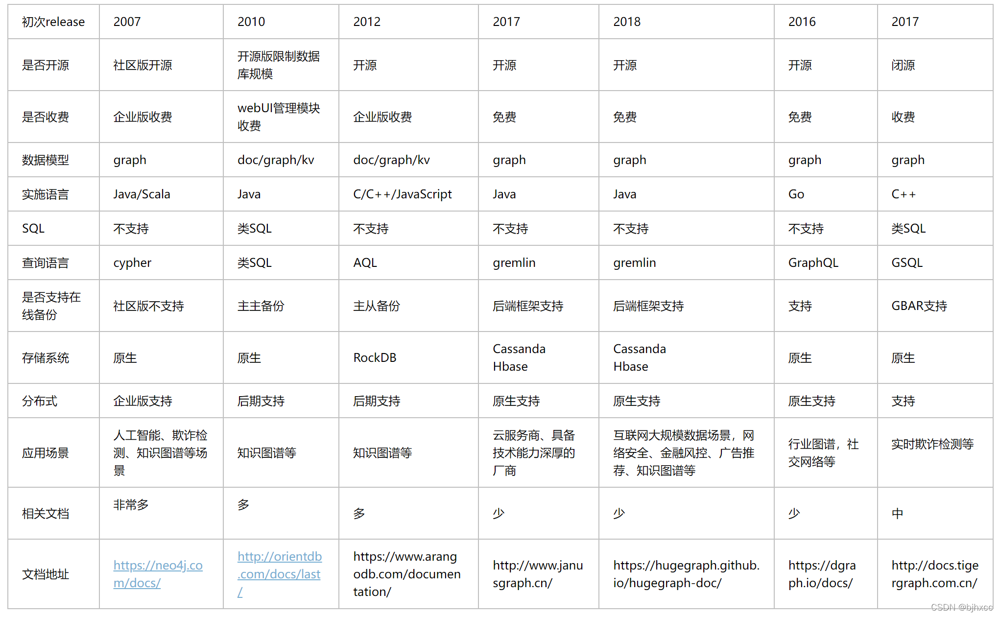

[参考文档1](https://blog.csdn.net/xlgen157387/article/details/79085901) [参考文档2](https://blog.csdn.net/u011397981/article/details/123467458)

# NoSQL数据库

- 出现原因：关系型数据库不再适用——数据建模中的一些缺陷和问题，以及在大数据量和多服务器之上进行水平伸缩的限制
- 分类：
  1. 键-值存储库（Key-Value-stores）;
  2. BigTable实现（BigTable-implementations）;
  3. 文档库（Document-stores）;
  4. **图形数据库**（Graph Database）;

- **图数据库从最近十年的表现来看已经成为关注度最高，也是发展趋势最明显的数据库类型**

# 图数据库的优势

- 一个场景：好友推荐

关系型数据库设计多次甚至无限次表格关联操作，复杂度难以想象。将其转换为图模型，使用深度优先、广度优先、迪杰斯特拉等算法可以很快地找到对应内容。

# 常见图数据库

[图数据库排名](https://db-engines.com/en/ranking/graph+dbms)

## [Neo4j](https://neo4j.com/)

历史悠久且长期处于图数据库领域的主力地位，其功能强大，性能也不错，单节点的服务器可承载上亿级的节点和关系。社区版最多支持 320 亿个节点、320 亿个关系和 640 亿个属性。

- 优点：**有自己的后端存储**，不必如同JanusGraph等一样还要依赖另外的数据库存储。 Neo4j在每个节点中存储了每个边的指针，因而遍历时**效率相当高**。

- 缺点：**企业版付费**。开源的社区版本**只支持单机**，不支持分布式。社区版只能部署成单实例，企业版可以部署成高可用集群，从而可以解决高并发量的问题；**不能做集群**，单个实例故障时影响系统正常运行。社区版只支持冷备份，即需要停止服务后才能进行备份。
- 社区版开源、企业版闭源

## [JanusGraph](https://janusgraph.org/)

可扩展的图数据库，底层依赖于大数据组件，对分布式支持的非常好，也都是完全的开源免费，存储数据模型也都是专为图数据而设计。

- 优点：**和大数据生态结合的非常好**，可以很好地和Spark结合做一些大型的图计算。所以可以很好的和spark的大数据平台进行结合，并且能够支持实时图遍历和分析查询。
- 缺点：**依赖太多**，想要搭建一套完整的JanusGraph，需要同时搭建维护好几套系统，**维护成本非常大**。**稳定性也不太好**。并且三方的一些工具也存在一些问题，所以要用肯定要基于底层（读写）进行性能优化。
- 开源

## [HugeGraph](https://hugegraph.apache.org/)

百度基于JanusGraph开源了HugeGraph，增加了很多特性，提高了易用性及性能，增加了一些图分析算法。

- 优点：可以与Spark GraphX进行链接，借助Spark GraphX图分析算法对HugeGraph的数据进行分析挖掘。HugeGraph还针对图数据库的高频应用做了特定性能优化，并且为用户提供更为高效的使用体验。
- 缺点：基于JanusGraph开源，存在和JanusGraph同样的问题，维护成本高。
- 开源

## [Dgraph](https://dgraph.io/)

基于 golang 开发的开源的分布式图数据库。诞生时间不长, 发展却很迅速，从设计之初就考虑了分布式和扩展性，所以对分布式支持的非常好。

- 优点：不依赖与任何第三方系统，会自动组成集群，运维部署非常简单。维护成本低很多。和 JanusGraph 性能差不多，但复杂查询下，Dgraph 性能远高于 JanusGraph。同时写入性能也整体高于 JanusGraph。
- 缺点：还不支持多重边、一个集群只支持一个图、与大数据生态兼容不足，这些都需要靠后期不断完善。
- 开源

## [TigerGraph](https://www.tigergraph.com/)

TigerGraph是一个目前业界先进的企业级图数据库。系统完全闭源。部分查询算法开源。分为开发版和企业版。开发版免费，但功能受限，比如单点只能构建一个图。企业面收费，支持大规模集群，顶点表数量不受限制。

- 优点：TigerGraph可以通过GSQL实现类存储过程的算法封装，而且已经实现了很多图算法，但是语法结构要比Neo4j复杂的多。
- 缺点：付费图数据库。Neo4j按照cpu收费，TigerGraph按照数据容量（G）来收费，费用较贵。
- 完全闭源，开发版免费，企业版很贵

## 对比表格

