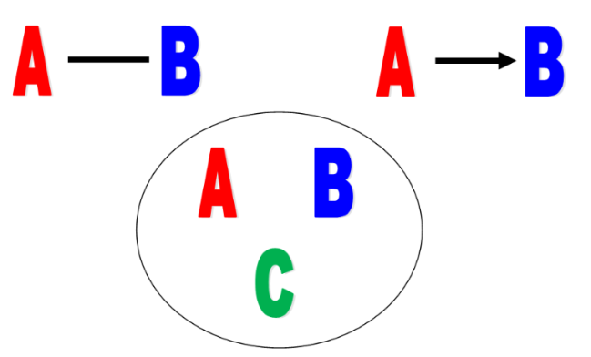
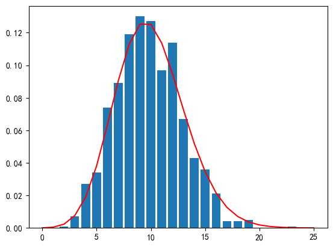
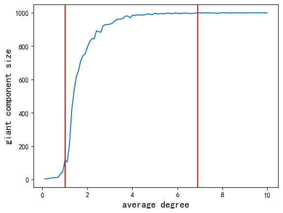

> 关系型数据挖掘（Relational data mining）
>
> - 中心性度量
> - 图模型
> - 基准（benchmarks）
>
> > 简介：使用jupyter notebook、python3、igraph包

# 关系型数据

## 术语

1. 监督学习：分类（classification）、回归（regression）
2. 无监督学习：聚类（clustering）、密度估计（density estimation）、降维（dimension reduction）、异常值检测（outlier detection）。
3. 半监督学习：标记的数据很少，**同时使用标记和未标记的数据**

- 特征：feature（连续、分类或排序）

## 关系型数据

实体表示为点，关系可以表示为边，或超边（是否加权、是否有向）

- A和B是朋友
- A给B发邮件
- A，B和C在同一个团队

关系型数据被建模为图（graphs）或超图（hypergraphs）

$G = (V , E)$, let $n = |V | $and $m = |E|$——得到邻接矩阵（一些性质，不再赘述）

完全图（Complete graph），也叫集团（clique）

---

图会出现在不同场景中：电子邮件交换、蛋白质-蛋白质相互作用图、社交关系（空手道俱乐部）、赛事（大学足球队之间的比赛）

## Issues

一个图里面有很多社区，传统机器学习将向量空间进行嵌入降维后可以进行聚类。

有许多工具可以处理这些数据，抽样等统计技术可用于处理大型数据集。

采样保留关键属性（簇、平均距离等），但这些都**在图形空间中被破坏**。

## Problems

1. 中心性度量
2. 寻找社区
3. 异常检测
4. 种子集扩展（seed set expansion）-局部采样
5. 链路（边缘）预测
6. 半监督学习
7. 向量空间嵌入

# 中心性

## 度中心性

所有边权值之和

入度、出度：入边权值和、出边权值和

归一化度中心性：无权图（出入）度除以$n − 1 = |V | − 1$来获得（假设没有自环）

## 节点中心性

**中心性**（Centrality）：综合考虑节点度和连接到高度数中心的其他节点
$$
c(i)=\sum_{j \in V} a_{i j} c(j)
$$
$\operatorname{det}(A-I) \neq 0$，唯一解为$c=0$——连通图无定义，需要进行扩充定义

- 定义一：**特征向量中心性**（eigenvector centrality）

  将特征向量中心性定义为与（neighbour’s centrality）成比例

  节点i的特征向量中心性是以下方程的解：
  $$
  \lambda c^E(i)=\sum_{j \in V} a_{i j} c^E(j) \\
  \lambda c^E=A c^E
  $$
  有向图，入度和出度分别进行定义

  对于连通图，我们测量与最大特征值相对应的特征向量的中心性，最大特征值是实的和正的（Perron Frobenius），即：
  $$
  c^E(i)=u_1(i)
  $$
  u1是主导特征向量

- 定义二：**接近中心性**（closeness centrality）

  考虑节点之间的最短路径（最小跳数或最小边权重之和）——测地线（geodesic）
  $$
  c^c(i)=\left(\sum_{j \neq i} d_{i j}\right)^{-1}
  $$
  dij为最短路径长度，dii=0，不可达定义为无穷，无权图可定义为节点数n

- 定义三：**介数中心性**（betweenness centrality）

  更常用的方法是考虑所有测地线：

  - 定义$n_{jk}$为节点j和k之间所有的测地线的数量
  - 定义$n_{jk}(i)$为节点j和k之间通过节点i的测地线的数量

  $$
  c^B(i)=\sum_{j \neq i} \sum_{k \neq i, j} \frac{n_{j k}(i)}{n_{j k}}
  $$

- 定义四：**Δ中心性**（delta-centrality）

  考虑从G中删除某些节点i的影响

  - 设P(G)是图G上性能的一些度量
  - 设Gi是通过从图G移除与节点i相邻的所有边而获得的图

  $$
  c^{\Delta}(i)=\frac{P(G)-P\left(G_i\right)}{P(G)}
  $$

  ——注意，我们要保证$P(G)-P(G_i) > 0$

  - 一种可能的P(G)取值：定义图G的影响力E(G)——
    $$
    E(G)=\frac{1}{n(n-1)} \sum_i \sum_{j \neq i} \frac{1}{d_{i j}}
    $$

  说明：

  - 对于不连通图，dij=∞的节点对的贡献为零。
  - 通过考虑节点集，所有中心性度量都可以推广到组中心性度量。——节点集的度定义为非g节点连接到g内节点的数量

- 定义五：谷歌**PageRank**算法中使用的中心性

  思想：互联网中重要页面与许多重要页面相互链接

  - 我们在节点i处随机游走：

    - 以概率$1−d$：跳到随机节点$j∈V$。
    - 以概率$d$：以概率$a_{ij}/d^{out}_i$跳到节点j。
    - 可以用代数或迭代（幂）方法获得PageRank值的解

    $$
    R(i)=\frac{1-d}{n}+d \sum_{j \rightarrow i} \frac{R(j)}{d_j^{\text {out }}}
    $$

  - 在有向图中，我们将中枢（hub）定义为具有高出度的节点，而将权威（authority）定义为具有高度入度的节点。
  - 在无向图中，这两个概念是相同的。

- 定义六：**中枢/权威中心性**（hub/ authority）

  中枢中心性：
  $$
  c^H(i)=\nu \sum_j a_{i j} c^A(j)
  $$
  权威中心性：
  $$
  c^A(i)=\mu \sum_j a_{j i} c^H(j)
  $$
  让$\lambda=\frac{1}{\nu \mu}$，我们有：
  $$
  \begin{aligned}
  & A^t A c^A=\lambda c^A \\
  & A A^t c^H=\lambda c^H
  \end{aligned}
  $$

## 边中心性

- $n_{j k}$：节点j和k之间的测地线数
- $n_{j k}(e)$：通过边e的节点j和k之间的测地线数。

$$
c^B(e)=\sum_j \sum_{k \neq j} \frac{n_{j k}(e)}{n_{j k}}
$$

## 相关性

基础知识：

- 设pi为出现次数为i次的节点在G中的比例，即**度分布**
- 度相关性 度量 由边链接的节点的度之间的关系
- 在同配网络（assortative network）中，高阶节点倾向于更多地连接到其他高阶节点，低阶节点也是如此
- 在异配网络（disassortative network）中，高阶节点倾向于更多地连接到低阶节点，反之亦然。

定义：

- k度节点的**平均最近邻度函数**：
  $$
  k_{n n}(k)=\sum_{k^{\prime}} k^{\prime} P\left(k^{\prime} \mid k\right)
  $$

  - 其中$P\left(k^{\prime} \mid k\right)$是从k度节点出到k'度节点入的概率

  - 如果没有相关性（中性网络-neutral network），有
    $$
    k_{n n}(k)=\frac{\sum_i i^2 \cdot p_i}{\sum_i i \cdot p_i}
    $$
    pi：i度节点的比例

  友谊悖论指出，节点邻居的平均度通常高于其自身的度。这是由于在许多网络中：
  $$
  \frac{\sum_i i^2 \cdot p_i}{\sum_i i \cdot p_i}>>\sum_i i \cdot p_i
  $$
  即：一个节点更可能与中心（高阶节点）链接

- 度相关函数可以近似为：
  $$
  k_{n n}(k)=a k^\mu
  $$

  - $µ>0$表示同配网络
  - $µ≈0$表示中性网络
  - $µ<0$表示异配网络

# 图模型（随机图）

- ER模型：Erdos-Renyi models (ER) 
- CL模型：Chung-Lu model (CL) 
- 配置模型：Configuration model

## ER模型

**概念**：

- G(n, m)模型：n个节点，m条边，任意选两个节点相连。——平均度：k = 2m/n
- G(n, p)模型：n个节点，任意两个节点之间以概率p相连（边数期望为Np）。——平均度期望：k = p(n − 1)
  - 令p = m/N，此时可以转化为第一种模型

**边数分布**：

- $P_m$为G(n，p)模型中有m条边的概率，令$N = \left(\begin{array}{l}n \\2\end{array}\right)$：（典型二项分布）
  $$
  P_m=\left(\begin{array}{l}
  N \\
  m
  \end{array}\right) p^m(1-p)^{N-m}
  $$

- 假设N很大而p（通常）很小，我们可以使用泊松分布（$λ=Np$ 为平均边数的期望）近似二项分布：
  $$
  P_m \approx \frac{e^{-\lambda} \lambda^m}{m !}
  $$

**度分布**：

- 某个点度数为k的概率为$p_k$：（$λ = (n − 1)p$ 为平均度的期望）
  $$
  p_k=\left(\begin{array}{c}
  n-1 \\
  k
  \end{array}\right) p^k(1-p)^{n-1-k} \approx \frac{e^{-\lambda} \lambda^k}{k !}
  $$

- 由于近似服从泊松分布，此类模型不生成hubs节点，即真实网络中常见的高阶节点。

- 可以绘制度分布直方图，用poisson分布曲线可以很好地拟合

  

**巨型连通分量**（Giant connected component-巨片）：（期望平均度$k = p(n − 1)$）——三种状态

1. $k<1$：亚临界状态；没有巨片，集群主要是树。

2. $k>1$：超临界状态；单个巨片，小集群主要是树。

3. $k>>log(n)$：连通状态；没有孤立的节点或小集群。

——从折线图可以看出，k为1是分界点，一旦超过1，巨片占比迅速扩大；到k = 7逐渐稳定达到100%

## CL模型

### 伯努利Chung-Lu模型

**模型**：

- 网络G中的节点为：$V = \{v_1, . . . , v_n\}$

- 每个节点的度为：$k_i = deg_G(v_i)$

- 两个节点i和j连接边的概率为：（$vol(V)$为图的体积——所有节点的度数和）
  $$
  p_{i j}=\frac{\operatorname{deg}_G\left(v_i\right) \operatorname{deg}_G\left(v_j\right)}{\operatorname{vol}(V)}, i \neq j \text { and } p_{i i}=\frac{\left(\operatorname{deg}_G\left(v_i\right)\right)^2}{2 \operatorname{vol}(V)}
  $$

**分布**：

- 我们将$\mathcal{C} \mathcal{L}_1(G)$定义为使用模型1获得的图G的分布：
  $$
  \mathbb{E}_{G^{\prime} \sim \mathcal{C} \mathcal{L}_1(G)}\left(\operatorname{deg}_{G^{\prime}}\left(v_i\right)\right)=\operatorname{deg}_G\left(v_i\right), 1 \leq i \leq n
  $$
  其中图$G'$为获得的新随机图：$G'(V, E')\sim\mathcal{C} \mathcal{L}_1(G)$

  - $\mathbb{E}\left(\left|E^{\prime}\right|\right)=|E|$，但一般情况下$|E'|\neq|E|$
  - 没有重复边
  - 有自环

——该模型在实际中不常用，其时间复杂度为$O(n^2)$

### O(m) Chung-Lu模型

**模型**：

- 只需要$O(|E|)$的时间复杂度，更常用

- 在顶点V中选择$|E|$条边，$e = (u_1, u_2)$

- $u_i$根据多项式分布从V独立采样：
  $$
  p(v_i) = deg_G(v_i)/vol(V )
  $$

- 边可以重复，所以我们得到的是预期的边数而不是概率

**分布**：

- 我们将$\mathcal{C} \mathcal{L}_2(G)$定义为使用模型1获得的图G的分布：
  $$
  \mathbb{E}_{G^{\prime} \sim \mathcal{C} \mathcal{L}_2(G)}\left(\operatorname{deg}_{G^{\prime}}\left(v_i\right)\right)=\operatorname{deg}_G\left(v_i\right), 1 \leq i \leq n
  $$
  其中图$G'$为获得的新随机图：$G'(V, E')\sim\mathcal{C} \mathcal{L}_2(G)$

  - 我们总是有$|E'|=|E|$
  - 允许存在多条边
  - 也允许有自环

**注意**：

- 对于模型II，我们可以忽略重复的多条边，这会减小图的总度期望（体积）
- 对于这两种模型，我们都可以忽略自边（自环），这会再次减小总体积

## 配置模型（Degree Sequence）

**提出**：

- Chung Lu模型是边生成的概率模型，生成度序列的期望和原来的相等。
- 对于配置模型，我们为节点指定一个精确的度序列$d_1, ..., d_n$
- 所有具有n个节点和这个精确度序列的图 被认为是以相同的概率出现的。

**模型**：

- 对于每个节点i，我们指定$d_i$个残边（stubs）——半条边

- 残边随机互联

- 可能会产生自环或重复边

- 对于该模型，节点$i \neq j$之间的预期边数为：
  $$
  \begin{aligned}
  e_{i j} & =\frac{d_i d_j}{2 m-1}
  \end{aligned}
  $$
  对于自环：
  $$
  \begin{aligned}
  e_{i i} & =\frac{d_i\left(d_i-1\right)}{2(2 m-1)}
  \end{aligned}
  $$
  

  边总数的期望为：
  $$
  m=\frac{1}{2} \sum_i d_i
  $$