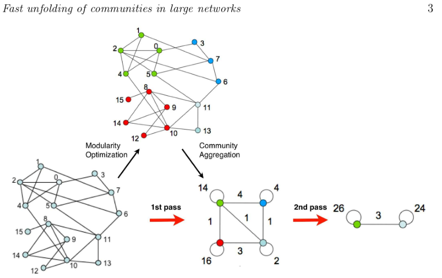
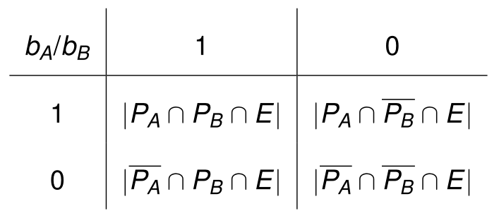
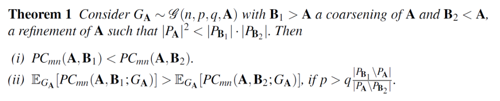

> 社区结构
>
> - 图划分（graph partitions）算法比较
> - 图聚类算法
> - 图上的集成聚类（ECG）

# 图社区

1. 定义
2. 谱分割
3. Girvan-Newman聚类
4. 基准：种植分区，LFR
5. 模块度
6. 算法

## 定义

两个**基本假设**：[Barabasi,Network Science]

1. 一个网络的社区结构在其布局图中是唯一的。
2. 一个社区是网络中的一个局部密集连接子图。

**模型**：

- 对于一个图$G = (V , E)$，考虑由一个节点$V_C⊂V$的子集诱导的连接子图C（C中的节点满足$i∈V_C$）。

**内部外部度**：

- 定义节点$i∈V_C$的**内部度**（其在子图C内的度）：$d^{int}_i (C)$

- 节点i的**外部度**是：$d^{ext}_i (C) = d_i - d^{int}_i (C)$

  其中$d_i$是节点i在G中的总度

**强弱社区**：

- 如果对每个节点 $i∈V_C$ ， $d^{int}_i (C) > d^{ext}_i (C)$，则C是一个**强社区**（strong community）
- 如果对每个节点 $i∈V_C$ ， $\sum_{i \in V_C} d_i^{\text {int }}(C)>\sum_{i \in V_C} d_i^{e x t}(C)$，则C是一个**弱社区**（weak community）

**集团和核**：

- **集团**（clique）是G的一个完全连接的子图。
- **k核**（k-core）是G的一个最大连接子图，其中所有节点的度数至少为k
  - 我们可以通过反复删除所有度数小于k的节点来找到k-cores
  - 如果一个节点属于k-core但不属于(k+1)-core，那么这个节点的核心度（coreness）为k

**簇（聚类）**：

- 大小为k的图$G = (V, E)$的聚类（clustering）是一个节点$V = V_1 \cup...\cup V_k$的分区，其中：
  - 所有$V_i \cap V_j=\empty \space i \neq j$
  - 对于每个部分（或集群）$V_i$，其诱导子图$G_i$是连通的

## 谱聚类

> 谱聚类（Spectral clustering）是一个庞大的话题，本课程只介绍明谱分割（spectral bisection）
>
> 参考：
>
> https://blog.csdn.net/weixin_45591044/article/details/122747024
>
> https://blog.csdn.net/SL_World/article/details/104423536

**模型**：

- 考虑未加权的无向图$G = (V , E)$，邻接矩阵为A

- D是节点度组成的对角矩阵

- $L = D - A$是G的（未归一化的）拉普拉斯系数矩阵

- **G中的社群结构与L的特征分解之间关系紧密**

- 对于所有的$f \in \mathbb{R}^n$：
  $$
  f^t L f=\frac{1}{2} \sum_{i, j} a_{i j}\left(f_i-f_j\right)^2
  $$
  因此，当$a_{ij}>0$时，使上述表达式最小化相当于使$f_i≈f_j$

**求解**：

- 考虑**比率切分法** [ratio-cut](https://blog.sciencenet.cn/blog-798994-862473.html) ：$V=S \cup S^c$

  > 与之对应的还有normalized-cut（将拉普拉斯矩阵归一化）

  $$
  \operatorname{Rcut}\left(S, S^c\right)=\frac{\operatorname{Vol\partial S}}{|S|}+\frac{\operatorname{Vol\partial S}}{\left|S^c\right|} \\
  where \operatorname{Vol}(\partial S)=\left|\left\{e:|E \cap S|=\left|E \cap S^c\right|=1\right\}\right|
  $$
  这可以近似求解为：
  $$
  \min _{f \in \mathbb{R}^n} f^t L f ; f \perp 1,\|f\|=\sqrt{n}
  $$
  其中，**结果是对应于L的第二个最小特征值的特征向量**——结论推导见[参考博客](https://blog.csdn.net/weixin_45591044/article/details/122747024)

**讨论**：

- L是对称的和半正定的，所以所有的特征值都是**实数和非负数**。

- L有最小的特征值0；这个特征值的倍数对应于G中连接组件的数量。

- 因此，我们可以对这些特征值进行排序，同时对它们各自的特征向量进行排序。

  $0 = λ_1 ≤ λ_2... ≤ λ_n$

**非连通图情况**：

- 有至少两个0特征值
- 按照第二小特征值对应的特征向量，有0和非0两种情况，按这个分类即可。

**连通图情况**：

- 考虑一个连通图G。它只有一个0特征值。

- 在一个连通图中，特征向量$u_2$对应于费德勒向量中的$λ_2>0$。

- 谱分割是基于费德勒向量（第二小的特征向量）中条目的符号。——正为一类，负为另一类

**多个社区**：

- 如果有2个以上的聚类，这样的过程可以被递归应用
- 这是一个分裂性层次聚类的例子
- 然而，它可能表现得很糟糕，可能会分割本来存在的社区
- 所以我们去$u_2, ... u_k$，再利用k-means等算法对得到的特征向量进行聚类

**总结**：

一般适用于分组数量已知的情况，核心是最小化割边总和并最大化每个簇的节点数

## GN算法

> Girvan-Newman算法

**步骤**：

- 计算每个 $e ∈ E $的边介数，并删除具有最高值的边
- 将生成的图按连通分支拆分（簇）并递归地应用该方法
- 这会产生一个聚类层次结构，我们可以将其表示为树状图

——根据一些标准选择最好的分区，比如模块度（modularity）、或指定集群数量

**问题**：

- 该算法的一个问题是它的时间复杂度：$O(m^2n)$
- 对于非常稀疏的图，也有 $O(n^3) $，仍然很高
- 其他算法可以达到 $O(m)$ 或 $O(n log n)$

## 基准

**为什么要有社区基准模型**？

- 测试和比较算法
- 控制噪音水平、社区规模等
- 真实图数据很少有真实值（ground-truth）
- 有ground-truth，但可能与基本假设不一致

### 种植-分区模型

> Planted partitions model

1. **固定节点数 n 和社区数 k**，对于社区，我们：
- **平均分配**节点到每个社区
  
- 或将每个节点**独立分配**给社区 i，概率为 $p_i$，$\sum p_i=1$
  
2. 对于分别在社区i和社区j中的节点对$(i, j)$，我们**按照概率$P(i, j)$添加边**
   - 可以指定$P(i, i)=p_{in}$、$P(i, j)=p_{out}, \space i \neq j$

### LFR模型

> Lancichinetti-Fortunato-Radicchi model

1. **固定节点数 n**
2. 设定**三个主要参数**：
   
   1. $γ_1$：**节点度**服从 $p_n ∝ n^{−γ_1}$ 的幂律分布；推荐值为 $2 ≤ γ_1 ≤ 3$。
   2. $γ_2$：**社区规模**服从 $p_k ∝ k^{−γ_2}$ 的幂律分布；推荐值为 $1 ≤ γ_2 ≤ 2$。
   3. $0 ≤ µ ≤ 1$：对于每个节点，这是连接到其他社区的边的预期比例，而 $(1 − µ)$ 是其自己社区内的比例。
   
   ——$µ$ 称为**噪声水平或混合参数**

3. 把每个节点都分配到社区
   - 存在**允许重叠社区**的变体
   - 可以提供额外参数来**限制度分布**（平均和最大度）**和社区大小**（最小和最大）
   - 从配置模型开始，重新连接节点以逼近目标分布
   - 初始阶段可以使用BA等其他模型

基准代码生成 3 个文件：

1. 包含节点标记为 1 的边列表的文件
2. 包含节点列表及其社区成员的文件，社区也被标记为 1
3. 具有度分布、社区大小分布和混合参数等统计信息的文件

**讨论**：

- LFR 的可扩展性有些受限，一些可扩展的基准模型有：

  - RMAT ，生成具有幂律度数分布的图；在 Graph-500 中使用

  - BTER (Block Two-level ER)，生成服从幂律度分布以及社区结构的图

  - SBM（Stochastic Block Model），它也生成具有社区结构的图。

    ——它最简单的定义是种植分区模型的变体。

## 模块度

**引言**：

- Barabasi 的第三个基本假设：**随机连线的网络缺乏固有的社区结构**
- 模块度使用随机连接作为空模型来量化某些图分区的社区结构

**模型**：

- 考虑无向图 $G = (V , E)$

- 令$|V| = n$, $|E| = m$, $d_i$ 为节点 i 的度数

- 设 $a_{ij} = a_{ji} = 1$ 当且仅当 $(i, j) ∈ E$，否则为 0；设$a_{ii} = 2$当且仅当 $(i, i) ∈ E $

- 当我们随机连线时，节点 i 和 j 之间的预期边数（概率）为： 
  $$
  p_{ij}=\frac{d_id_j}{2m}
  $$

- 令 $V = C_1 ∪ · · · C_k$，将图划分为 k 个簇。对于某些簇 $C_l$，定义：
  $$
  q_{C_l}=\frac{1}{2 m} \sum_{i, j \in C_l}\left(a_{i j}-p_{i j}\right)
  $$
  展开为：
  $$
  q_{C_l}=\frac{\sum_{i, j \in C_l} a_{i j}}{2 m}-\frac{\sum_{i, j \in C_l} d_i d_j}{(2 m)^2}
  $$
  令：
  $$
  e(C_l) = |{e ∈ E ; e⊆C_l}|
  $$

  $$
  \operatorname{Vol}\left(C_l\right)=\sum_{i \in C_l} d_i
  $$

  代入可得：
  $$
  q_{C_l}=\frac{e\left(C_l\right)}{m}-\left(\frac{\operatorname{Vol}\left(C_l\right)}{2 m}\right)^2
  $$

- 模块度最终定义为：
  $$
  q=\sum_{l=1}^k \frac{e\left(C_l\right)}{m}-\left(\frac{\operatorname{Vol}\left(C_l\right)}{2 m}\right)^2
  $$
  

  我们将上面的第一项称为边缘贡献（edge contribution），将第二项称为度税（degree tax）

- 图的模块度 $q^∗(G)$ 有时被定义为所有可能分区中上述指标所取的最大值

**讨论（局限）**：

- Barabasi 的第四个基本假设：**对于一个给定的网络，具有最大模块化的分区对应于最佳社区结构**。

- 然而，模块化有一些已知的问题——"最佳 "可能并不总是转化为 "直观"。

  基于模块化的算法受到**分辨率限制**问题的影响：

  - 考虑l个大小为m的集团（m-clique）组成的环，$n=l·m$
  - 当$m(m - 1)< l - 2$时，对相邻的集团进行分组，模块度高于每个集团自己形成集群
  - 正如我们将说明的那样，一些基于模块化的算法因此**倾向于对已有社区进行组合**

## 算法

**CNM**：

> CNM算法（Clauset、Newman、Moore），也称为快速贪心算法（Fast Greedy）

- 开始，每个顶点作为一个单独集群
- 选择最能提高模块度的一对集群（如果有的话），然后合并它们
- 当没有办法提高模块度的时候停止
- 复杂度：$O(n^2)$，稀疏图更少

**Louvain**：

> 也称为多级算法（Multilevel algorithm）或快速折叠算法（fast unfolding）

- 开始，每个顶点作为一个单独集群
- 循环遍历每个顶点，将其移动到模块度增加最多（如果有的话）的邻居社区
- 重复以上步骤，直到没有任何提升空间为止
- 将每个社区折叠成一个节点并重新运行上述步骤——另一个层级
- 当图折叠到单个节点（或者当最后一级没有移动）时停止
- 复杂度：$O(n log n)$

**Infomap**：

- Infomap基于信息论：使用概率随机游走和压缩算法来实现
- 给定 G 和一个初始化分区方案，尽可能高效地编码随机游走
- 利用随机游走往往在同一社区中停留更长时间的性质
- 优化图方程：社区间游走的平均位数+社区内游走的平均位数
- 复杂度：$O(n log n)$

**标签传播**：

- 开始，每个顶点作为一个单独集群，有自己的簇标签
- 循环遍历每个顶点，每个顶点都采用其邻居中最流行的标签（使用随机来打破死锁）
- 当每个顶点具有与其邻域中最频繁出现的标签相同的簇标签时，算法停止
- 复杂度：$O(m)$

——注意：此算法速度很快，但并不总能收敛到一个解。

**其他**：

1. WalkTrap：一种基于短距离随机游走的分层算法。它的复杂度是 $O(n^2 log n)$。
2. Leading eigenvector（前导特征向量）：基于模块化矩阵的谱分解。对于每个双分区，其复杂度为 $O(n(n + m))$

> Louvain和Infomap的算法目前被认为是最先进的。
>
> 2023年评论：应该是Leiden算法

# 图分区的比较（指标）

1. 介绍：图聚类 
2. 常见的相似性测度量
3. 与二元分类的联系 
4. 图感知度量 （Graph-aware measures）
5. 拓扑学特征

## 图聚类

**符号描述**：

$G = (V , E), E ⊂ V × V , |V | = n, |E| = m$

- A，邻接矩阵：$a_{ij} = 1 ⇔ (i, j) ∈ E$
- $d_i$：顶点i的程度

**术语解释**：

- 图聚类/分割（clustering/partitioning）：将顶点分割成相连的子图
- 社区发现（Community finding）：并非所有的顶点都需要被分配到一个群组中去
- 模糊聚类（Fuzzy clustering）：节点不属于、属于一个或多个群组

**图划分**：$\bold A = \{A_1, A_2, ..., A_k\}$，为节点集$V$的一个划分（partition）

- 每个$A_i$诱导出一个连通子图
- 是连通分支的泛化
  - 集群内的边密度大；集群间的边密度小

**应用**：

- 图聚类是关系型EDA（互联网数据分析）的一个重要工具
  - 图尺寸缩减
  - 社区检测
  - 异常检测
  - ……

- 如何挑选聚类算法？
  - 集群的质量
  - 稳定性
  - 效率（时间空间）
  - 其他：不需要指定聚类的数量（k）、集群的层次结构等

**优化目标**：

- 这是无监督学习，所以没有明确的目标函数

- 不同算法使用不同的目标函数：

  1. 模块度：

  $$
  Q=\frac{1}{2 m} \sum_{i, j \in \text {同一簇} }\left(a_{i j}-\frac{d_i d_j}{2m}\right)
  $$

  2. N-cut

  $$
  \sum_i \frac{\text { cut }\left(A_i, \overline{A_i}\right)}{\# \text { edges in } A_i}
  $$

**不同分割方法对比**：

- 质量的衡量标准：$sim(\bold T, \bold A) \space \text {w.r.t. ground truth partition} \space \bold T$
- 稳定性的衡量标准：同一算法的运行多次比较$sim(\bold A, \bold {A'})$
- 比较算法之间的结果：$sim(\bold A, \bold B)$

## 相似性

**总体分类**：

- 基于成对计数（Pairwise-counting）
  $$
  P W_f(\mathbf{A}, \mathbf{B})=\frac{\left|P_A \cap P_B\right|}{f\left(\left|P_A\right|,\left|P_B\right|\right)}
  $$

- 基于信息论
  $$
  M I_f(\mathbf{A}, \mathbf{B})=\frac{I(\mathbf{A}, \mathbf{B})}{f(H(\mathbf{A}), H(\mathbf{B}))}
  $$

- 基于卡方分布（$χ^2$）
  $$
  \begin{gathered}
  X_f^2(\mathbf{A}, \mathbf{B})=\frac{X^2(\mathbf{A}, \mathbf{B})}{f((k-1),(r-1))} \\
  f(x, y) \in\{\min (x, y), \max (x, y), \operatorname{mean}(x, y), \sqrt{x y}\}
  \end{gathered}
  $$

**基于成对计数**：

- 考虑对图节点的两个划分：

  $\bold A = (A_1, ..., A_k) = (\{1, 2, .., 7\}, \{8\}, · · · )$

  $\bold B = (B_1, ..., B_r ) = (\{1\}, \{2, 3, 4\}, \{5, 6, 7, 8\}, · · · )$

- 度量指标基于A和B里面各个集群中的成对元素

  $P_A = \{(1, 2), (1, 3), (1, 4), (1, 6), (1, 7), (2, 3), · · · \}$

  $P_B = \{(2, 3), (2, 4), (3, 4), (5, 6), (5, 7), (5, 8), · · · \}$

- 关键值为：$|P_A ∩ P_B|$

- 示例：

  1. Jaccard 指数：
     $$
     \frac {|P_A ∩ P_B|} {|P_A ∪ P_B|}
     $$
     
  
  2. 兰德指数
  
  $$
  \frac {|P_A ∩ P_B| + |\overline {P_A} ∩ \overline {P_B}|} {\left(\begin{array}{c}
  n \\ 2 \end{array}\right)}
  $$

**基于信息论**：

- 基于 A 和 B 之间的互信息

- 关键值为：
  $$
  I(\mathbf{A}, \mathbf{B})=\sum_{i, j} \frac{\left|A_i \cap B_j\right|}{n} \log \frac{\left|A_i \cap B_j\right| / n}{\left|A_i\right|\left|B_j\right| / n^2}
  $$

- 示例：归一化互信息 (NMI)：
  $$
  \frac {I(\bold A, \bold B)} {(H(\bold A)+H(\bold B))/2}
  $$

**基于卡方分布**：

- 关键值为：
  $$
  X^2(\mathbf{A}, \mathbf{B})=\sum_{i, j} \frac{1}{\left|A_i\right|\left|B_j\right|}\left(\left|A_i \cap B_j\right|-\frac{\left|A_i\right|\left|B_j\right|}{n}\right)^2
  $$

- 示例：Cramer 的 V指标 和 Tschurprow 的 T指标

**测量指标vs.大小分布**：

> 问题：比较不同大小的分区时，这些度量指标表现怎么样？
>
> 实验（多次重复）：

- $\bold A$：节点V的划分 $|V|=10$
- $\bold B^{(t)}$，V 的随机分区 $|\bold B^{(t)}| =t$，$t = 2、5、10、20、30、40、50、 100$
- 测量 $\bold A$ 和所有分区 $\bold B^{(t)}$ 之间的相似性——期望所有相似度都很低

——结果：只有兰德系数变得接近1，其他都随着t的增大减小或趋向0

**按概率进行调整**：

> 实现 “在聚类结果随机产生的情况下，指标应该接近零”

$$
\text { Adjusted Similarity }(\mathbf{A}, \mathbf{B})=\frac{\operatorname{Similarity}(\mathbf{A}, \mathbf{B})-\operatorname{Expected} \operatorname{Sim}\left(\left|A_i\right|^{\prime} s,\left|B_j\right|^{\prime} s\right)}{1-\text { Expected } \operatorname{Sim}\left(\left|A_i\right|^{\prime} s,\left|B_j\right|^{\prime} s\right)}
$$

- 成对计数指标的调整：
  $$
  A P W_f(\mathbf{A}, \mathbf{B})=\frac{\left|P_A \cap P_B\right|-\left|P_A\right|\left|P_B\right| /\left(\begin{array}{c}
  n \\
  2
  \end{array}\right)}{f\left(\left|P_A\right|,\left|P_B\right|\right)-\left|P_A\right|\left|P_B\right| /\left(\begin{array}{c}
  n \\
  2
  \end{array}\right)}
  $$

- Jaccard 没有已知的调整形式

- 调整兰德指数定义为：
  $$
  ARI(\bold A, \bold B) = APW_{mean}(\bold A, \bold B)
  $$

- 基于信息论和基于 $χ^2$ 的也可以针对机会进行调整
- 最常用的有：
  1. ARI：调整兰德系数
  2. AMI：调整互信息

——调整后的指标在随机下都趋近于0

## 二元划分

> 我们已经有了对比划分的指标，但我们**根本没有考虑图拓扑**。
>
> 测量相似性时应该考虑边吗？
>
> 这就引出了下面要讲的图感知测量，在这之前，要先讲下二元划分

**边分类**：

- 图分区可以由节点 V 上的集合分区表示

  $\bold A = (\{1\}, \{2, 3, 4\}, \{5, 6, 7, 8\}, \{9, 10, 11\}, \{12\})$

- 我们还可以考虑二元边分类（顶点是否在同一簇中）

  $(2, 3), (2, 4), (3, 4), ..., (9, 10), (9, 11), (10, 11) → class 1$——两端节点在同一簇的边
  $(1, 2), (4, 5), (8, 10), (11, 12) → class 0$——两端节点在不同簇的边

- 更正式地说，对于顶点分区 A，我们定义长度为 m 的二元向量 $b_A$，其中，对于每条边 $e = (i, j) ∈ E$：
  $$
  b_{\mathbf{A}}(e)=\left\{\begin{array}{cc}
  1 & \exists A_k \in \mathbf{A} \mid i, j \in A_k \\
  0 & \text { otherwise. }
  \end{array}\right.
  $$

- 更进一步地，可以利用此方法对类别1边子集的边进行搜寻。

**二元分类器的评估**：

- 考虑 $b_A$ 和 $b_B$，两个二元边分类器。

- 用于比较二元分类器的四个基本计数是：

  

- 对应的各种度量指标如下：
  $$
  \begin{aligned}
  准确性——& \mathrm{gR}: \frac{\left|P_A \cap P_B \cap E\right|+\left|\overline{P_A} \cap \overline{P_B} \cap E\right|}{|E|} \\
  Jaccard——& \text { gJ: } \frac{\left|P_A \cap P_B \cap E\right|}{\left|\left(P_A \cup P_B\right) \cap E\right|} \\
  F 分数 (β = 1)——& \mathrm{gPW}_{m n}: \frac{\left|P_A \cap P_B \cap E\right|}{\frac{1}{2}\left(\left|P_A \cap E\right|+\left|P_B \cap E\right|\right)} \\
  余弦相似度——& \mathrm{gPW}_{g m n}: \frac{\left|P_A \cap P_B \cap E\right|}{\sqrt{\left|P_A \cap E\right|\left|P_B \cap E\right|}} \\
  Simpson——& \mathrm{gPW}_{\min }: \frac{\left|P_A \cap P_B \cap E\right|}{\min \left\{\left|P_A \cap E\right|,\left|P_B \cap E\right|\right\}} \\
  Braun\&Banquet——& \mathrm{gPW}_{\max }: \frac{\left|P_A \cap P_B \cap E\right|}{\max \left\{\left|P_A \cap E\right|,\left|P_B \cap E\right|\right\}} \\
  &
  \end{aligned}
  $$

## 图感知度量

**（调整）图感知度量**：

- 上一节的指标可以用二元分类向量的乘积表示：

  $\left|P_A \cap P_B \cap E\right| = |b_A · b_B|$

- 我们提出一系列成对计数的图感知度量指标：（一个是普通、另一个是调整后的）
  $$
  P C_f(\mathbf{A}, \mathbf{B} ; G)=\frac{\left|b_{\mathbf{A}} \cdot b_{\mathbf{B}}\right|}{\left.f\left(\left|b_{\mathbf{A}}\right|,\left|b_{\mathbf{B}}\right|\right)\right)}, \quad A P C_f(\mathbf{A}, \mathbf{B} ; G)=\frac{\left|b_{\mathbf{A}} \cdot b_{\mathbf{B}}\right|-\frac{\left|b_{\mathbf{A}}\right| \cdot\left|b_{\mathbf{B}}\right|}{|E|}}{f\left(\left|b_{\mathbf{A}}\right|,\left|b_{\mathbf{B}}\right|\right)-\frac{\left|b_{\mathbf{A}}\right| \cdot\left|b_{\mathbf{B}}\right|}{|E|}}
  $$

**实验**：

- 在LFR模型构建的社区中，调整图感知度量的性能指标都很好
- 不同种类的度量指标的度量效果不同（引子）

**补充**：

——**图感知**和**图无关**度量在解决问题方面具有相反的行为

> 图无关度量即前面说的普通相似性指标ARI等

- 设 G 的真实社区情况为 A， 并设 B1 和 B2 分别是 A 的粗化和细化
- 在某些情况下，**在图无关度量下A更接近B2（细化）；在图感知度量下A更接近B1（粗化）**
  - 当使用图无关的度量时，集群的数量更多
  - 图感知度量生成的集群的数量更少

- 这两种指标都获得高值是我们做图聚类所希望的

---

定理的公式化描述：

- 考虑Girvan 和 Newman 模型的变体 G(n, p, q, A)，用于研究具有社区结构的图族
- 图有 n 个顶点，A为分区结果
  - p为随机选择两个节点，其中的边在同一分区内的比例；
  - q为随机选择两个节点，其中的边在不同分区内的比例。

---

## 拓扑特征

- 验证集群的另一种方法是比较集群的拓扑特征：参考Orman et al.,arXiv:1206.4987

- 示例：对于具有 $n_c$ 个节点和 $m_c$ 个边的社区 $c$——

  - 缩放密度(scaled density)：$n_c \cdot m_c /\left(\begin{array}{c}
    n_c \\
    2
    \end{array}\right)$

  - 内部传递性(internal transitivity)：$\frac{1}{n_c} \sum_{i \in c} \frac{e_c(i)}{\left(\begin{array}{c}
    d_c(i) \\
    2
    \end{array}\right)}$

    其中 $e_c(i)$ 是 c 中 i 的邻居之间的边数，$d_c(i)$ 是 c 中 i 的度数。

- 可以将特征作为簇大小的函数进行比较——比较聚类算法结果和ground truth的图形相似度

## 结论

- 使用**调整后的基于集合的相似性度量**，可以减少度量对分区粒度的偏差，消除随机性
- **图无关（ARI，AMI）和图感知（AGRI）度量是互补**的：在评估算法的优越性时应同时使用它们

# 图的集成聚类（ECG）

1. 共识聚类和 ECG
2. 分辨率和稳定性
3. LFR 图上的研究
4. 一些真实的图示例
5. ECG 权重
6. 在异常检测中的应用