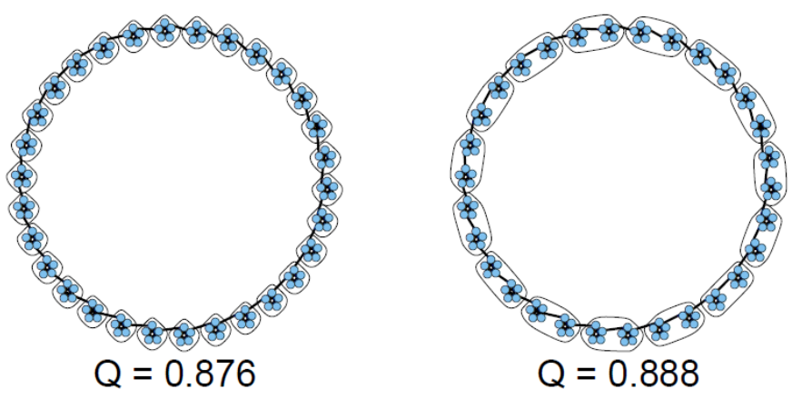

> 社区结构
>
> - 图划分（graph partitions）算法比较
> - 图聚类算法
> - 图上的集成聚类（ECG）

# 图社区

1. 定义
2. 谱分割
3. Girvan-Newman聚类
4. 基准：种植分区，LFR
5. 模块度
6. 算法

## 定义

两个**基本假设**：[Barabasi,Network Science]

1. 一个网络的社区结构在其布局图中是唯一的。
2. 一个社区是网络中的一个局部密集连接子图。

**模型**：

- 对于一个图$G = (V , E)$，考虑由一个节点$V_C⊂V$的子集诱导的连接子图C（C中的节点满足$i∈V_C$）。

**内部外部度**：

- 定义节点$i∈V_C$的**内部度**（其在子图C内的度）：$d^{int}_i (C)$

- 节点i的**外部度**是：$d^{ext}_i (C) = d_i - d^{int}_i (C)$

  其中$d_i$是节点i在G中的总度

**强弱社区**：

- 如果对每个节点 $i∈V_C$ ， $d^{int}_i (C) > d^{ext}_i (C)$，则C是一个**强社区**（strong community）
- 如果对每个节点 $i∈V_C$ ， $\sum_{i \in V_C} d_i^{\text {int }}(C)>\sum_{i \in V_C} d_i^{e x t}(C)$，则C是一个**弱社区**（weak community）

**集团和核**：

- **集团**（clique）是G的一个完全连接的子图。
- **k核**（k-core）是G的一个最大连接子图，其中所有节点的度数至少为k
  - 我们可以通过反复删除所有度数小于k的节点来找到k-cores
  - 如果一个节点属于k-core但不属于(k+1)-core，那么这个节点的核心度（coreness）为k

**簇（聚类）**：

- 大小为k的图$G = (V, E)$的聚类（clustering）是一个节点$V = V_1 \cup...\cup V_k$的分区，其中：
  - 所有$V_i \cap V_j=\empty \space i \neq j$
  - 对于每个部分（或集群）$V_i$，其诱导子图$G_i$是连通的

## 谱聚类

> 谱聚类（Spectral clustering）是一个庞大的话题，本课程只介绍明谱分割（spectral bisection）
>
> 参考：
>
> https://blog.csdn.net/weixin_45591044/article/details/122747024
>
> https://blog.csdn.net/SL_World/article/details/104423536

**模型**：

- 考虑未加权的无向图$G = (V , E)$，邻接矩阵为A

- D是节点度组成的对角矩阵

- $L = D - A$是G的（未归一化的）拉普拉斯系数矩阵

- **G中的社群结构与L的特征分解之间关系紧密**

- 对于所有的$f \in \mathbb{R}^n$：
  $$
  f^t L f=\frac{1}{2} \sum_{i, j} a_{i j}\left(f_i-f_j\right)^2
  $$
  因此，当$a_{ij}>0$时，使上述表达式最小化相当于使$f_i≈f_j$

**求解**：

- 考虑**比率切分法** [ratio-cut](https://blog.sciencenet.cn/blog-798994-862473.html) ：$V=S \cup S^c$

  > 与之对应的还有normalized-cut（将拉普拉斯矩阵归一化）

  $$
  \operatorname{Rcut}\left(S, S^c\right)=\frac{\operatorname{Vol\partial S}}{|S|}+\frac{\operatorname{Vol\partial S}}{\left|S^c\right|} \\
  where \operatorname{Vol}(\partial S)=\left|\left\{e:|E \cap S|=\left|E \cap S^c\right|=1\right\}\right|
  $$
  这可以近似求解为：
  $$
  \min _{f \in \mathbb{R}^n} f^t L f ; f \perp 1,\|f\|=\sqrt{n}
  $$
  其中，**结果是对应于L的第二个最小特征值的特征向量**——结论推导见[参考博客](https://blog.csdn.net/weixin_45591044/article/details/122747024)

**讨论**：

- L是对称的和半正定的，所以所有的特征值都是**实数和非负数**。

- L有最小的特征值0；这个特征值的倍数对应于G中连接组件的数量。

- 因此，我们可以对这些特征值进行排序，同时对它们各自的特征向量进行排序。

  $0 = λ_1 ≤ λ_2... ≤ λ_n$

**非连通图情况**：

- 有至少两个0特征值
- 按照第二小特征值对应的特征向量，有0和非0两种情况，按这个分类即可。

**连通图情况**：

- 考虑一个连通图G。它只有一个0特征值。

- 在一个连通图中，特征向量$u_2$对应于费德勒向量中的$λ_2>0$。

- 谱分割是基于费德勒向量（第二小的特征向量）中条目的符号。——正为一类，负为另一类

**多个社区**：

- 如果有2个以上的聚类，这样的过程可以被递归应用
- 这是一个分裂性层次聚类的例子
- 然而，它可能表现得很糟糕，可能会分割本来存在的社区
- 所以我们去$u_2, ... u_k$，再利用k-means等算法对得到的特征向量进行聚类

**总结**：

一般适用于分组数量已知的情况，核心是最小化割边总和并最大化每个簇的节点数

## GN算法

> Girvan-Newman算法

**步骤**：

- 计算每个 $e ∈ E $的边介数，并删除具有最高值的边
- 将生成的图按连通分支拆分（簇）并递归地应用该方法
- 这会产生一个聚类层次结构，我们可以将其表示为树状图

——根据一些标准选择最好的分区，比如模块度（modularity）、或指定集群数量

**问题**：

- 该算法的一个问题是它的时间复杂度：$O(m^2n)$
- 对于非常稀疏的图，也有 $O(n^3) $，仍然很高
- 其他算法可以达到 $O(m)$ 或 $O(n log n)$

## 基准

**为什么要有社区基准模型**？

- 测试和比较算法
- 控制噪音水平、社区规模等
- 真实图数据很少有真实值（ground-truth）
- 有ground-truth，但可能与基本假设不一致

### 种植-分区模型

> Planted partitions model

1. **固定节点数 n 和社区数 k**，对于社区，我们：
- **平均分配**节点到每个社区
  
- 或将每个节点**独立分配**给社区 i，概率为 $p_i$，$\sum p_i=1$
  
2. 对于分别在社区i和社区j中的节点对$(i, j)$，我们**按照概率$P(i, j)$添加边**
   - 可以指定$P(i, i)=p_{in}$、$P(i, j)=p_{out}, \space i \neq j$

### LFR模型

> Lancichinetti-Fortunato-Radicchi model

1. **固定节点数 n**
2. 设定**三个主要参数**：
   
   1. $γ_1$：**节点度**服从 $p_n ∝ n^{−γ_1}$ 的幂律分布；推荐值为 $2 ≤ γ_1 ≤ 3$。
   2. $γ_2$：**社区规模**服从 $p_k ∝ k^{−γ_2}$ 的幂律分布；推荐值为 $1 ≤ γ_2 ≤ 2$。
   3. $0 ≤ µ ≤ 1$：对于每个节点，这是连接到其他社区的边的预期比例，而 $(1 − µ)$ 是其自己社区内的比例。
   
   ——$µ$ 称为**噪声水平或混合参数**

3. 把每个节点都分配到社区
   - 存在**允许重叠社区**的变体
   - 可以提供额外参数来**限制度分布**（平均和最大度）**和社区大小**（最小和最大）
   - 从配置模型开始，重新连接节点以逼近目标分布
   - 初始阶段可以使用BA等其他模型

基准代码生成 3 个文件：

1. 包含节点标记为 1 的边列表的文件
2. 包含节点列表及其社区成员的文件，社区也被标记为 1
3. 具有度分布、社区大小分布和混合参数等统计信息的文件

**讨论**：

- LFR 的可扩展性有些受限，一些可扩展的基准模型有：

  - RMAT ，生成具有幂律度数分布的图；在 Graph-500 中使用

  - BTER (Block Two-level ER)，生成服从幂律度分布以及社区结构的图

  - SBM（Stochastic Block Model），它也生成具有社区结构的图。

    ——它最简单的定义是种植分区模型的变体。

## 模块度

**引言**：

- Barabasi 的第三个基本假设：**随机连线的网络缺乏固有的社区结构**
- 模块度使用随机连接作为空模型来量化某些图分区的社区结构

**模型**：

- 考虑无向图 $G = (V , E)$

- 令$|V| = n$, $|E| = m$, $d_i$ 为节点 i 的度数

- 设 $a_{ij} = a_{ji} = 1$ 当且仅当 $(i, j) ∈ E$，否则为 0；设$a_{ii} = 2$当且仅当 $(i, i) ∈ E $

- 当我们随机连线时，节点 i 和 j 之间的预期边数（概率）为： 
  $$
  p_{ij}=\frac{d_id_j}{2m}
  $$

- 令 $V = C_1 ∪ · · · C_k$，将图划分为 k 个簇。对于某些簇 $C_l$，定义：
  $$
  q_{C_l}=\frac{1}{2 m} \sum_{i, j \in C_l}\left(a_{i j}-p_{i j}\right)
  $$
  展开为：
  $$
  q_{C_l}=\frac{\sum_{i, j \in C_l} a_{i j}}{2 m}-\frac{\sum_{i, j \in C_l} d_i d_j}{(2 m)^2}
  $$
  令：
  $$
  e(C_l) = |{e ∈ E ; e⊆C_l}|
  $$

  $$
  \operatorname{Vol}\left(C_l\right)=\sum_{i \in C_l} d_i
  $$

  代入可得：
  $$
  q_{C_l}=\frac{e\left(C_l\right)}{m}-\left(\frac{\operatorname{Vol}\left(C_l\right)}{2 m}\right)^2
  $$

- 模块度最终定义为：
  $$
  q=\sum_{l=1}^k \frac{e\left(C_l\right)}{m}-\left(\frac{\operatorname{Vol}\left(C_l\right)}{2 m}\right)^2
  $$
  

  我们将上面的第一项称为边缘贡献（edge contribution），将第二项称为度税（degree tax）

- 图的模块度 $q^∗(G)$ 有时被定义为所有可能分区中上述指标所取的最大值

**讨论（局限）**：

- Barabasi 的第四个基本假设：**对于一个给定的网络，具有最大模块化的分区对应于最佳社区结构**。

- 然而，模块化有一些已知的问题——"最佳 "可能并不总是转化为 "直观"。

  基于模块化的算法受到**分辨率限制**问题的影响：

  - 考虑l个大小为m的集团（m-clique）组成的环，$n=l·m$
  - 当$m(m - 1)< l - 2$时，对相邻的集团进行分组，模块度高于每个集团自己形成集群
  - 正如我们将说明的那样，一些基于模块化的算法因此**倾向于对已有社区进行组合**

## 算法

### CNM

### Louvain

### Infomap

### 标签传播

### 其他