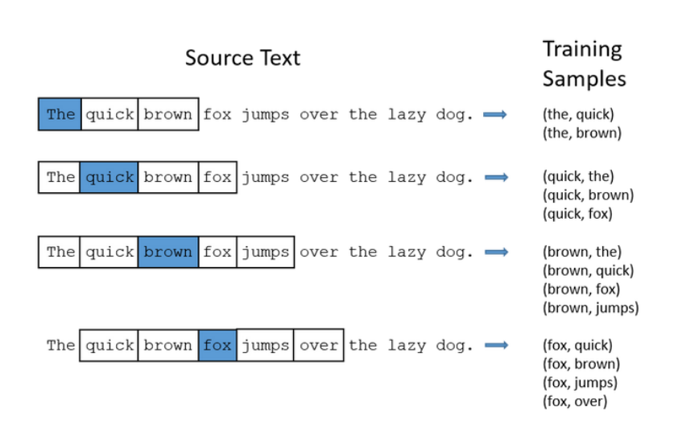
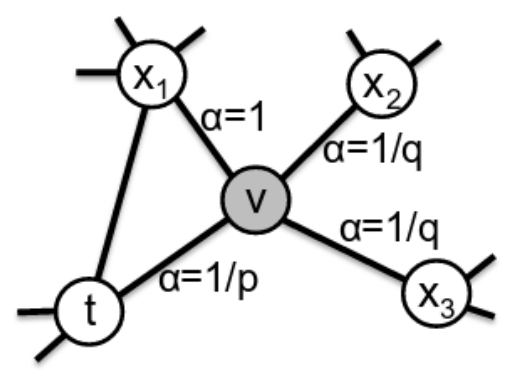

> 高级操作
>
> - 图嵌入（Graph Embedding）
> - 图半监督学习（SSL）
> - 超图

# 图嵌入

> Graph Embedding，也叫图表示学习(Network Representation Learning)

1. 图嵌入的快速概述
2. 一些算法：node2vec、LINE、Verse
3. 比较嵌入算法的框架
4. 示例

## 概述

**目标**：

- **将网络（节点）映射到向量（特征）空间**

- 将相似节点映射到向量空间中的附近位置。“相似”可能有不同含义：
  - 图拓扑上较近
  - 图中相似的角色（例如：度相似）
  - 相似的节点属性

**应用实例**：

1. 特征学习（不是特征工程）
2. 可视化
3. 链接预测
4. 社区检测
5. 异常检测
6. 网络演化（动力学）

**形式化描述**：

- 输入：G = (V , E)
- 输出：特征向量 $z_v ∈ \mathbb{R}^k, ∀v ∈ V$

### 算法

——大部分算法基于**随机游走**和 用于词嵌入的 **SkipGram** 方法

- 词的语义由其上下文决定(A word can be characterized by the company it keeps)
- 相似上下文中的词（相近的词）具有相似的含义
- 考虑每个单词周围的窗口；构建“词向量”（例如：word2vec）
- 使用这些作为训练数据

**SkipGram**：

使用滑动窗口邻域对每个词上下文的相关词进行组合，构建“词向量”

**DeepWalk**（深度游走）：

- 单词——对应于节点 $v ∈ V$
- 句子——对应于图 G 上的随机游走
- 句子中的词频呈现幂律分布——游走中的顶点也呈现幂律分布

**node2vec**：

- 定义了有偏随机游走（biased random walks）*混合了广度和深度优先搜索*
- 关键参数：
  - p：控制重新访问同一节点的概率（留在附近）
  - q：控制探索更远的概率

- 参数允许在以下之间进行权衡：
  - **低 p**：在本地探索；这将侧重于图形拓扑结构中的**社区结构**（同质性）；
  - **低q**：探索更远；这允许捕获节点之间的一些**结构相似性**（例如：集线器hubs，网桥bridges）；

**其他算法**：

统计表见课件

在我们的测试中使用了：

1. node2vec：q=1，p各不相同
2. VERSE：来自相似性度量（具有个性化page rank）的多功能图嵌入算法：使用默认参数
3. LINE：Large-scale Information Network Embedding（大规模信息网络嵌入），它使用邻接矩阵的近似分解来尝试保留一阶和二阶邻近度

## 比较框架

> - 我应该使用哪种嵌入算法？
> - 如何选择参数？
> - 我怎么知道这种嵌入算法对图的表示就好？ 
> - GIGO：向量空间中的错误表示会导致错误的结果......
>
> 算法之间的结果可能会有很大差异，并且随着参数的选择也会有很大不同

### 概述

**框架模型**：

给定具有度分布 $w = (w_1, . . . , w_n)$ 的 n 个顶点上图 G = (V , E) 及其顶点到 k 维空间的嵌入，$ ε : V → \mathbb R^k$。

- 我们的目标是为这个嵌入分配一个“**分歧分数**”(divergence score)。
- 分数越低，嵌入越好。这将使我们能够在不同的维度上比较多个嵌入的结果

**总述**：

- 非随机图表现出类似社区的结构，所以我们一般：
  1. 将节点分组为集群
  2. 测量簇之间和簇内的边缘密度
  3. 通过 计算散度分数 将其与嵌入（矢量）空间中空间模型的预测密度进行比较
  4. 选择得分最高的嵌入

- 我们的框架中有**两个主要部分**：
  1. 图拓扑视图：一个好的、稳定的**图聚类算法**；我们默认使用 ECG，但我们也尝试使用 Louvain 和 InfoMap
  2. 空间视图：我们引入了基于**度分布** w 和**嵌入** ε 的**几何 Chung-Lu (GCL) 模型**。

### 几何Chung-Lu(GCL) 模型

**Chung-Lu 模型**：（引子）

- 在原始的 Chung-Lu 模型中，每个集合 $e = {v_i, v_j}, v_i, v_j ∈ V$ 被独立采样为边，概率为：

  $$
  p_{i, j}= \begin{cases}\frac{\operatorname{deg}_G\left(v_i\right) \operatorname{deg}_G\left(v_j\right)}{2|E|}, & i \neq j \\ \frac{\operatorname{deg}_G^2\left(v_i\right)}{4|E|}, & i=j\end{cases}
  $$

- 它产生的分布保留了每个顶点的预期度数

**几何Chung-Lu(GCL) 模型**：

> - 考虑预期的度分布：
>
>   $w = (w_1, . . . , w_n) = (deg_G(v_1), . . . , deg_G(v_n))$
>
> - 以及节点$ ε : V → \mathbb R^k$ 的嵌入，以便我们知道所有距离：
>
>   $d_{i,j} = dist(ε(v_i), ε(v_j))$
>
> - 模型应该满足 $p_{i,j} ∝ g(d_{i,j})$，g为递减函数，因此长边的出现频率应该低于短边

- 我们使用以下**归一化函数** $g ：[0, ∞) → [0, 1]$ 其中 $α ∈ [0, ∞)$是一个定值：
  $$
  \begin{gathered}
  g(d):=\left(1-\frac{d-d_{\text {min }}}{d_{\max }-d_{\min }}\right)^\alpha, \\
  d_{\text {min }}=\min \{\operatorname{dist}(\mathcal{E}(v), \mathcal{E}(w)): v, w \in V\} \\
  d_{\max }=\max \{\operatorname{dist}(\mathcal{E}(v), \mathcal{E}(w)): v, w \in V\}
  \end{gathered}
  $$
  ——我们使用裁剪（clipping）来强制 $g(d_{min}) < 1$ 和/或 $g(d_{max}) > 0$
  - 当 α = 0 时，此模型退化为原始的 Chung-Lu 模型，忽略了节点对的距离
  - 参数 α 越大，对长边的厌恶越大
  - 因此，模型的唯一参数是 α ∈ [0, ∞)
  - 在实践中，我们会尝试一系列值并保持最佳拟合。

- GCL模型是基于顶点集$V = {v_1, . . . , v_n}$ 上的随机图$\mathcal G(\bold W, \mathcal{E}, α)$其中 vi, vj, 形成一条边的概率为：
  $$
  p_{i,j} = x_ix_jg(d_{i,j})
  $$

  - 权重选择：$x_i ∈ \mathbb R_+$

- 顶点vi的**度期望**为：
  $$
  w_i=\sum_j p_{i, j}=x_i \sum_j x_j g\left(d_{i, j}\right)
  $$

定理：当 G 中的最大度数小于所有其他顶点的度数之和时，仅有唯一的权重选择。

——由于 G 的每个连通分量都可以独立嵌入，我们可以假设 G 是连通的，因此 G 的最小度数至少为 1。因此，除非 G 是 n 个顶点上的星形，否则这个非常温和的条件是平凡的。

**我们要做的，就是通过选择权重，使得度分布期望等于原图度分布。**

### 解GCL模型

我们使用一个简单的数值近似程序

1. 从任意向量开始 $\bold t_0 = (t_0^1 , . . . , t_0^n ) = (1, . . . , 1)$

2. 给定 $\bold t^s = (t^s_1, . . . , t^s_n)$，如果我们以如下概率在 vi 和 vj 之间引入一条边：
   $$
   p^s_{i,j} = t^s_i t^s_j g(d_{i,j})
   $$

3. 那么 vi 的度期望将是：（这对应于上小节度期望）
   $$
   s_i^s=\sum_j p_{i, j}^s=t_i^s \sum_j t_j^s g\left(d_{i, j}\right)
   $$

4. 通过用 $t^s_i (w_i/s^s_i)$ 替换 $t^s_i$ 来调整权重，使 $s^s_i$ 与 $w_i$ 匹配
   - 这也会影响 $\bold s^s$ 的其他值，并且 $\bold t$ 其他部分的变化也会影响 $s^s_i$自身。
   - 因此，我们让每个顶点向正确的方向迈出一小步
   - 这个过程很快收敛到理想状态：对于所有 i，$s^s_i$ 都非常接近 $w_i$。

5. 迭代步骤：

   - 对于每个 i，1 ≤ i ≤ n，我们定义
     $$
     t_i^{s+1}=(1-\epsilon) t_i^s+\epsilon t_i^S\left(w_i / s_i^s\right)=t_i^s+\epsilon t_i^S\left(w_i / s_i^s-1\right)
     $$

   - 重复调整过程直到 $max_i |\bold W_i − s^s_i | <δ$
   - 定义 ε = 0.1 、 δ = 0.001

### 算法

> 计算嵌入分歧分数（embedding divergence score）的算法