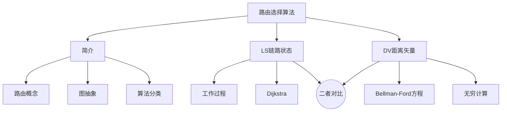
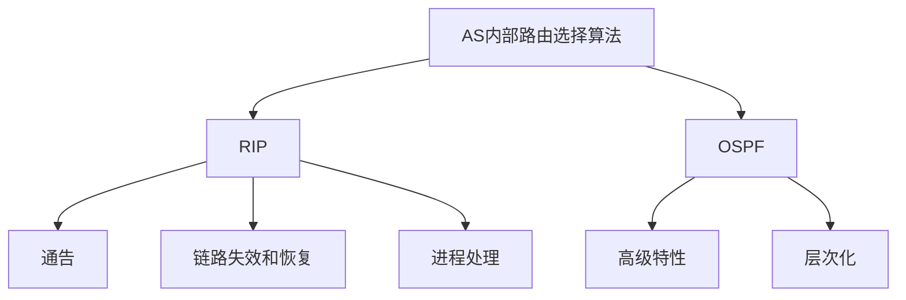
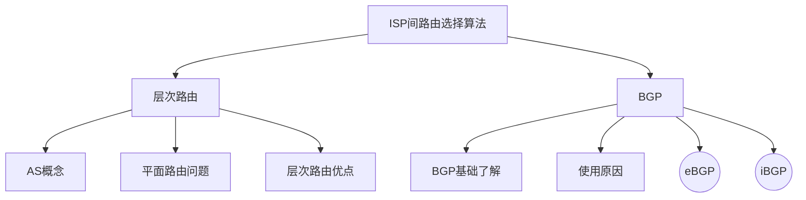
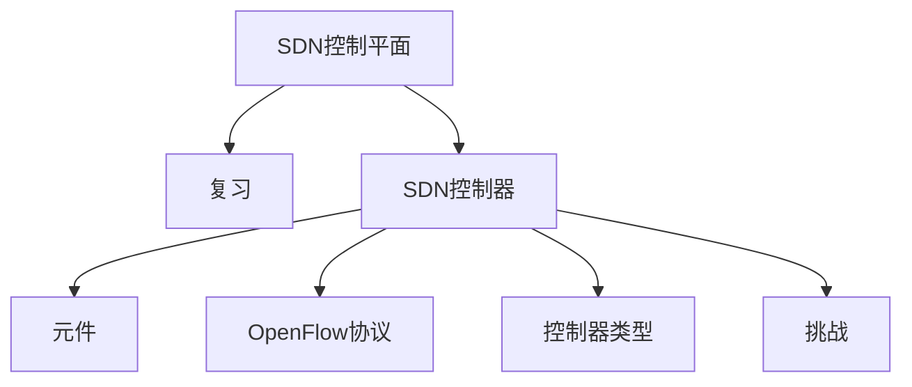

## 第五章 网络层：控制平面

网络层控制平面的工作原理

- 传统路由选择算法
- SDN 控制器
- ICMP
- 网络管理（略）

协议：OSPF, BGP；OpenFlow, ODL 和ONOS控制器,  ICMP, SNMP

内部网关协议：RIP、OSPF；外部网关协议：BGP

## 5.1 导论

数据平面、**控制平面**

2种构建网络控制平面功能的方法：传统、SDN

SDN：控制器与本地控制代理（CAs） 交互（上一章讲过）

## 5.2 路由选择算法

### 简介

两类：链路状态（LS）、距离矢量（DV）

路由选择算法(routing algorithm)：**网络层软件**的一部分,完成路由功能

**路由**：按照某种指标(传输延迟,所经过的站点数目等)找到一条**从源节点到目标节点的较好路径**。（较好：某种指标较小——跳数、延迟、费用、队列长度等等，体现了使用者偏好）

**以网络为单位**进行路由：路由信息传输、计算和匹配的代价低。计算网络到其他网络如何走。

可以认为是子网到子网的路由，子网出口和最终子网下发路径没有悬念。子网路由进一步可以聚集。——找到**路由器之间（子网之间）的最佳路径**。

**网络的图抽象**：

- 输入：
  1. 网络拓扑（节点-路由器、边-链路）
  2. 边权重-代价
  3. 源节点

- 输出：源到任意节点的最优路径（汇集树）

——汇集树（最小生成树）：此节点到所有其它节点的**最优路径形成的树**。

路由选择算法的**原则**：正确性、简单性、健壮性（带宽、拓扑）、稳定性、公平性、最优性（次优性-某项指标最优）

路由算法**分类**：

1. 全局：有完整的拓扑和边的代价的信息——LS算法
2. 分布式：周边邻居信息（局部信息）——DV算法

- 静态-非自适应、动态-自适应（大部分是动态的）：适应网络拓扑变化、适应通信量的变化

### link state （LS）

——即迪杰斯特拉算法

**工作过程**：

1. 获得整个**网络拓扑**, 网络中所有链路代价等信息
2. 用LS路由算法,计算本站点到其它站点的**最优路径**
3. （分组转发-数据平面）

**链路状态路由选择**（LS）

生成**链路状态分组**（自己邻居的可达情况）、**泛洪**、Dijkstra算法（独立、迭代）

1. **发现**相邻节点，向所有线路发送HELLO分组，发送HELLO应答

2. **测量**到相邻节点的代价(延迟,开销)——回送一个ECHO分组

3. 组装一个分组，描述相邻节点的情况——**链路状态分组**

4. 将分组通过扩散的方法发到所有其它路由器——**泛洪**

   避免广播风暴：设置TTL（年龄字段）、记录转发情况（顺序号）

   保证收到，未收到确认信号就一直重复发送。——可靠泛洪

5. 通过**Dijkstra**算法找出最短路径

经典LS算法实现协议：**OSPF、IS-IS**

**Dijkstra算法**：

准备：

- c(i,j)链路代价、D(v)当前路径代价、p(v)路径中的前序节点（倒着的指针）、N’当前已经知道最优路径的的节点集合（永久节点）

- 节点标记：每一个节点使用(D(v),p(v))标记
- 2类节点：临时、永久

算法过程：

- 初始化，源节点为永久节点、标记源节点的邻居节点的前序节点
- 临时节点中找到一个节点代价最小的临时节点，变为永久节点
- 对临时节点中的邻居进行重新标记
- 开始新循环直到所有节点都成为永久节点

可以在图上直接做，也可以参考列表的方式进行标记。——复杂度O(n^2)，有O(nlogn)的实现

讨论：可能会造成**震荡**。最快路径都去选择，下一周期就会拥塞

### distance vector （DV）

——距离矢量路由选择 即Bellman Ford算法

- 每个节点维护一张路由表：**目标、代价、下一跳邻居**。
- 相邻两邻居定期交换距离矢量
- 根据获得的路由信息,更新路由表

迭代式算法，需要多步迭代才能获得较稳定的结果。

1. **相邻节点间代价**通过真实定期测量获得：跳数(hops), 延迟(delay),队列长度

2. 定期与**相邻节点交换距离矢量**路由表(DV)

实测+交换得到的距离矢量，取最小代价路径，选定下一节点。

具体例子：注意自己到自己不要再从邻居计算！

**特性**：好消息传的快 坏消息传的慢

**Bellman-Ford 方程**(动态规划)：

$d_x (y) = min_v\{c(x,v) + d_v (y) \}$

——不停地迭代最终会收敛到真实情况

- 每个节点维护自己的距离矢量
- 定时测量到所有邻居的代价
- 收到并维护一个它邻居的距离矢量集

核心思路：

1. 定时将自己的距离矢量估计值传送给邻居，让对方算
2. x从邻居收到DV时，自己运算，更新它自己的距离矢量

——最终收敛于实际的最小代价值：分布式、异步迭代算法

- 异步迭代：本地链路代价变化了、邻居距离矢量变化导致迭代计算
- 分布式：每个节点只是在自己的DV改变之后向邻居通告

DV的**无穷计算问题**：

- 好消息传的快：好消息的传播以每一个交换周期前进一个路由器 的速度进行
- 坏消息传的慢：断线会形成环路，每次迭代代价+1，无限次之后, 到A的距离变成INF,不可达

- 减少环路方法：**水平分裂**——可达信息来源邻居，对它表达自己到对应节点的可达信息为INF。坏消息以一次交换一个节点的速度传播。（有环状链路的网络中就无能为力了）

例子：时空图，每次更新自己的距离矢量，三节点网络经过三次迭代收敛到真实状态。

### LS 和 DV 算法的比较

1. 消息复杂度：DV传输的少，更优
2. 收敛时间：LS更短，更优
3. 健壮性：路由器故障时LS更健壮——错误信息影响较小

——2种路由选择算法都有其优缺点，而且在互联网上都有应用

## 5.3 因特网中自治系统内部的路由选择

——内部网关协议，有RIP（DV）和OSPF（LS）

### RIP

——Routing Information Protocol 路由信息协议

- 每条链路cost=1，**max = 15 hops**，16代表不可达
- DV**每隔30秒**和邻居交换DV，通告
- 每个通告包括：**最多25个**目标子网

**通告**：

- 定期30s或请求就发
- 最多25个：适用于小网络

——代价小，比较简单

**链路失效和恢复**：

- 如果180秒没有收到通告信息-->邻居或者链路失效
- 新的通告报文会传递给邻居
- 毒性逆转——水平分裂，达到16即可认为不可达

**进程处理**：

- 以应用进程的方式实现
- 通告报文通过UDP报文传送
- 网络层的协议**使用了传输层的服务，以应用层实体的方式实现**

### OSPF

——Open Shortest Path First 开放最短路径优先（标准可公开获得）

- OSPF通告信息中携带：自己是谁、TTL、每一个邻居路由器一个表项
- 通告信息会传遍AS全部（通过泛洪）

IS-IS路由协议：几乎和OSPF一样

**“高级” 特性**：

1. **安全**: 所有的OSPF报文都是经过认证的，不允许伪造
2. 允许有多个代价相同的路径存在（**负载均衡**）
3. 不同的TOS有多重代价矩阵（**多种指标**的最优路径）
4. Multicast OSPF (MOSPF) ——多播
5. 在大型网络中支持层次性OSPF

**层次化**的OSPF路由：只在自己的范围内进行泛洪，跨小区域的分组路由借由内部路由器（internal routers）、区域边界路由器（area boundary router）、骨干路由器（backbone router）传输，要路由到其他自治区域还要借助主边界路由器（boundary router）进行传输。

## 5.4 ISP之间的路由选择:  BGP

——自治区域之间进行路由

### 层次路由

**自治区域AS**（一个平面的路由）：每次交换信息所有路由器地位一样，维护所有路由器的可达信息。——巨型网络代价太大。

**平面路由的问题**：

- 规模巨大的网络中，路由信息的存储、传输和计算代价巨大
- 管理问题：按照自己的方式管理网络，隐藏自己网络的细节

**层次路由**：“autonomous  systems” （AS）

- 将互联网分成**一个个AS**(路由器区域)
  - 一个AS用AS Number （ASN)唯一标示
  - 一个ISP可能包括1个 或者多个AS
- **每个区域内**采用自己的路由协议算法
- **自治区域之间**运行AS间路由协议

**优点**：

1. 解决了规模问题：AS内部规模可控、每次在总体增加一个节点，扩展性强。
2. 解决了管理问题：各个AS运行不同的内部网关协议、不透露自己的细节。

### BGP

**互联网AS间路由：BGP**

——BGP (Border Gateway Protocol)：边界网关协议-将互联网各个AS粘在一起的胶水

两种方法：

1. **eBGP**（相邻的ASes那里获得子网可达信息）
2. **iBGP**（将可达信息传遍到AS内部的所有路由器）

——基于改进的距离矢量算法：不仅包含代价、也包含详细路径（可以避免环路，保证收敛速度）

网关路由器同时运行eBGP和iBGP协议，通过eBGP向其他网关路由器通告自己的子网可达信息，转发其他的子网可达信息，**信息包含在TCP分组当中，使用内部网关协议进行路由**。（红色的虚线不是物理链路，只是TCP虚拟逻辑链接）

**BGP基础**

1. **BGP 会话**：两个BGP路由器（peers）开机就建立半永久TCP连接，交换BGP报文，通告向不同目标子网前缀的“路径”——“路径矢量”协议，包含每一步到达子网X的跳数序列。
2. 路径的**属性**& **BGP路由**：
   - 属性：AS-PATH、NEXT-HOP（本AS中从哪个网关送走）
   - 路由：自治区之间更加**强调策略**——哪些转发哪些屏蔽，是否接受是否转发等等。

3. **路径通告**：
   - 基本过程：eBGP从其他AS接受通告，iBGP通告给自己AS内部的路由器，连接其他AS的路由器转发通告，加码（加入本AS的跳）
   - 多条可达信息通告时，保留更优的可达路径——对路径打分（基于策略-政治策略、经济策略）

4. **BGP报文**：OPEN、UPDATE、KEEPALIVE、NOTIFICATION——非常复杂，本科了解即可
5. BGP OSPF, **转发表表项**：内部普通路由器通过iBGP学习到了子网X，如何选择网关到达对应子网路由器。根据内部网关协议选择最优路径，内外结合匹配。——路由表项是由**AS内和AS间的路由共同决定**的。
6. BGP **路径选择**：
   - 本地偏好值属性
   - 最短AS-PATH（跳数）
   - 最近的NEXT-HOP路由器：**热土豆路由**——尽快送出去，不操心域间代价
   - 附加的判据（随机、BGP标示等）

7. 通过路径**通告执行策略**：每个ISP感知到的网络和真实不一致（没有收益的路径不去通告）；多宿桩网络，接入多个ISP，一般不会通告自己的ISP可达信息帮助不同ISP传递信息。

**为什么内部外部那么不同**？

- 策略：AS内无需策略，尽可能快；AS外控制通信路径
- 规模：AS内不用太考虑，因为可以细分AS；AS外必须考虑规模
- 性能：AS内性能第一；AS外会有政治、经济等考虑因素

## 5.5 SDN控制平面

### 复习

传统方式 vs SDN方式——水平集成：南向接口、网络操作系统（网络控制器）、本地控制代理、流表

管理更加容易、可编程（集中式）——可以实现各种功能、未来的功能。

传统方式无法设置路径、负载均衡、不同流量采取不同的路由方式。

——**基于流表的匹配+行动**模式。

**SDN 架构**：（上一章讲过）

1. 数据平面交换机
2. SDN控制器
3. 控制应用

### SDN控制器

SDN控制器里的**元件**：

1. **通信层**：南向接口（OpenFlow SNMP）
2. 网络范围的**状态管理层**：分布式数据库
3. 网络控制应用的**界面层**：抽象API（北向接口）

**OpenFlow** 协议：

- 控制器和分组交换机交互协议
- TCP 交换、加密可选
- 3种OpenFlow报文类型：控制器>交换机、异步（交换机>控制器）、对称

1. **控制器-交换机**
   - 特性：状态查询
   - 配置：设置参数
   - 修改状态：增删查改流表
   - packet-out：没匹配到的分组下发转发方案

2. **交换机-控制器**
   - 分组进入：没匹配到的分组发给控制器让控制器决定
   - 流移除：在交换机上删除流表项
   - 端口状态：通告控制器端口的变化

——网络管理员编程app，自动生成对应流表下发给分组交换机。

例子：

1. 南向接口上报
2. 控制器更改信息库，通告应用程序
3. 北向接口被调用（之前注册过）
4. 应用程序重新运行路由选择
5. 下发路由信息到控制器自动计算流表
6. 控制器更新分组交换机的流表

**SDN控制器类型**：（了解即可）

1. OpenDaylight (ODL) 控制器：北向接口叫REST API——控制应用可以在控制器内也可以在控制器外
2. ONOS 控制器——控制应用和控制器分离

**SDN面临的挑战**：

1. 可靠性（SDN控制器失效会宕机）
2. 性能可扩展性：性能跟不上会成为瓶颈
3. 可信性：安全性，怎样认证
4. 特殊应用场景：实时性，超高可靠性、超高安全性
5. 互联网络范围内的扩展性（全网）

## 5.6 ICMP: 因特网控制报文协议

- 由主机、路由器、网关用于传达网络层控制信息：错误报告、Echo 请求和回复（ping）
- 处在网络层，运行在IP协议上（侵入传输层）
- ICMP 报文：类型、编码、第一个导致该ICMP报文IP数据报的头8B

例：ICMP做跟踪路由（发送测试包到不可达端口，中途路由器发送type11 code0回复，三次取平均计算RTT；目标主机发送type3 code3，收到停止）

## **5.7** 网络管理和SNMP

——自治系统（autonomous systems AS）的管理

**5大功能**：

1. 性能管理
2. 故障管理
3. 配置管理
4. 账户管理
5. 安全管理

**网络管理架构**：

- 管理实体
- 被管设备（被管对象）数据被收集在Management Information Base (MIB)

**SNMP协议**：

1. 请求/响应模式
2. 陷阱模式

报文类型（略）

## 总结

- 控制平面功能实现：传统、SDN
- 传统路由选择算法：DV、LS
- 协议：內部（RIP、OSPF）、外部（BGP）
- SDN方式的实现