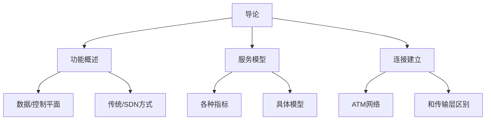
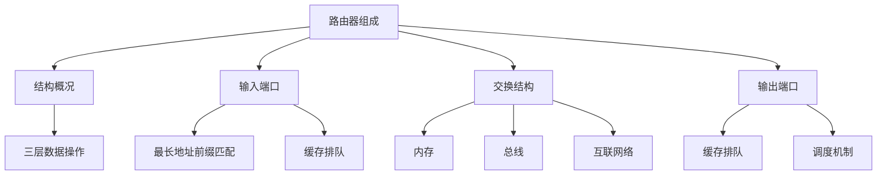
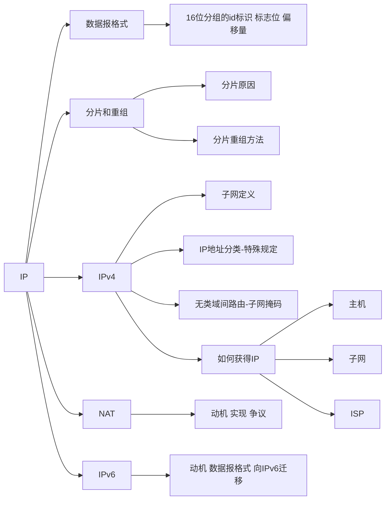
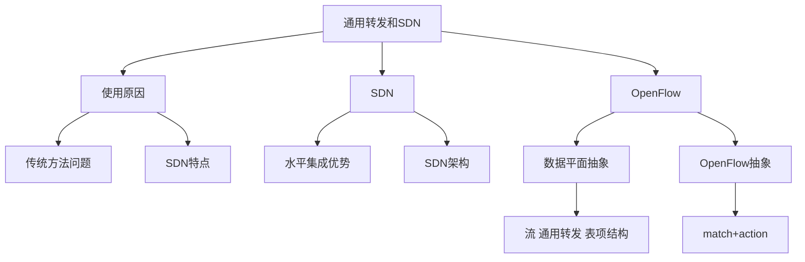

# 第四章 网络层：数据平面

前几章在网络边缘，进入网络核心部分。

1. 导论（数据平面、控制平面）
2. 路由器结构组成
3. IP协议（格式、分片重组、地址转换、IPv4、IPv6）
4. SDN情况下数据平面（流表匹配）

## 4.1 导论

——**数据平面**、控制平面

- 服务模型
- **转发和路由**——分别是数据平面和控制平面，分为传统方式和SDN方式（四种）
- 路由器工作原理
- 通用转发

——协议实例与实现

### 功能概述

**网络层服务**：

- 主机对之间传送段（封装的传输层TCP段UDP数据报）
- 封装、解封装
- 协议存在于每个主机和路由器，路由器检查所有IP数据报头部

**关键功能**：

1. 转发：输入接口转发到输出接口（局部功能）
2. 路由：选择路径到达目标主机（全局功能）——算法、协议

**数据平面、控制平面**：

- 数据平面：转发（依靠路由表）——本地。传统：地址+转发表；SDN：多个字段+流表。
- 控制平面：路由（生成路由表）——全局。传统：路由器中实现；SDN：远程的服务器实现。

传统方式仅依靠IP地址，SDN方式匹配流表依靠**一系列字段**（MAC、配置信息等），SDN除了**转发**还可以**阻止（block）、泛洪、修改**等。SDN厂家的网络控制服务器通过南翔接口算出来流表分配给每个主机。

**传统方式和SDN方式**：

- 传统方式：**路由器** **分布式**计算路由表（Per-router），**两个平面紧耦合**。——很难改运行逻辑。
- SDN方式：**分组交换机**通过南向接口收到网络服务器的**集中控制**，**两个平面分开**。——很好改、可编程。

SDN：软件定义网络（software defined network）

### 服务模型

**指标**：

- 单个数据报：可靠性、延迟。
- 数据报流：保序性、带宽、延迟差（jitter）。

下下页具体模型（这些指标为特定值时表示某种模型）

1. **best effort**（尽力而为）：全部无法保证——IP
2. CBR（恒定速率）——下面都是ATM
3. VBR（变化速率）
4. ABR（可用比特率）
5. UBR（不指名比特率）

### 连接建立

某些架构中有连接（和传输层面向连接区别——连接还体现在交换路径上），如ATM等。

IP无连接建立的功能。

网络层和传输层连接服务区别：

- 网络层: 在2个主机之间，涉及到路径上的一些路由器
- 传输层: 在2个进程之间，很可能只体现在端系统上

## 4.2 路由器组成

### 结构概况

路由：**路由处理器**（运行路由实体软件）产生路由表

转发：**输入端口、输出端口、交换机**（根据路由表局部转发）——真实路由器端口既可以输入也可以输出

每个路由器设备涉及三层的数据：物理层、数据链路层、网络层。最多拆分到网络层。

### 输入端口

- 物理层：物理信号转换成数字信号；
- 数据链路层：检测帧头帧尾，检测是否出错，提取目标mac，一致则收取，把帧交给网络层实体；
- 网络层实体排队，根据路由表，排到队头根据目标IP转发到对应主机。（SDN则查流表，执行对应操作）

为转发**地址空间进行划分**，不同地址空间转发到不同的端口。采用**最长地址前缀匹配**的目标地址表项。

一般使用TCAMs( ternary content addressable memories)硬件实现，在IP匹配时也总使用。

- 可以在**一个时钟周期**内检索出地址，不管表空间有多大
- Cisco Catalyst系列路由器在TCAM中可以存储多达约为**1百万条**路由表项

### 交换结构

——switch fabric

存在**队列缓冲的原因**：存在头部阻塞（Head-of-the-Line (HOL) blocking）如多入一出，匹配输入输出速率瞬时不一致性。

局部交换速率要**n倍于发送速率**（n为输入输出端口个数）

三种**典型交换结构**：

1. **基于memory（内存）**：第一代，拷贝到系统内存头部提取出目标地址，查找转发表，找到对应的输出端口，拷贝到输出端口。——经过两次系统总线，收到内存带宽限制，一次只能转发一个分组。
2. **基于bus（总线）**：此总线不是系统总线，而是switch fabric。——收到总线带宽限制，一次处理一个分组，对于企业网、接入网速度完全够。
3. **基于crossbar（互联网络）**：Banyan（榕树）网络，crossbar(纵横)和其它的互联网络（不同于互联网！）。每次把不同两根线之间短路即可随时接通。可以把分组切开，通过网络时间固定，便于调度。——克服总线带宽限制，对于骨干网来说常使用。

### 输出端口

- 物理层：把链路层的数据变成物理信号打出去；
- 链路层：帧封装，加帧头帧尾，校验等等功能；
- 网络层：排队，排到队头转发，交给链路层网卡。

存在**缓存队列原因**：交换结构速度和输出端口瞬时速度不一致。溢出则会被抛弃掉。

存在**调度规则**，不一定先来的先发（保证对某些应用服务质量的支持）。

缓存**建议规则**（自己看）：拇指规则等。

**调度机制：**

1. **FIFO** (first in first out)**先到先出**

   丢弃策略：

   - tail drop：丢弃刚到达的分组
   - priority：根据优先权丢失/移除分组
   - random：随机地丢弃/移除

2. **优先权调度**：多类，不同类别有不同的优先权。先传高优先级的队列中的分组

3. **Round Robin** (RR)：循环所有类，公平轮换。
4. **Weighted Fair Queuing** (WFQ)：每种分组享用不同权重的优先级占比。

## 4.3 IP: Internet Protocol

——互联网的网络层：路由协议、ICMP 协议（信令协议：报错、测试网络是否通畅-ping）、**IP 协议**

IP协议实现数据平面的转发功能：• **地址约定** • **数据报格式** • **分组处理的约定**

### IP 数据报格式

- 头部：无选项20字节（有可选项，可变长）
  1. 协议版本号（IPv4 0100）
  2. 头部长度（以一当四，即最后乘4字节）
  3. 数据类型（载荷类型，基本废弃了）
  4. 数据报总长
  5. **16位分组的id标识、标志位、偏移量**（用于分片重组）——第二行
  6. TTL（存活倒计时）、上层协议的标识、头部校验和（不校验数据）
  7. 32位源IP、32位目的IP
  8. 可选内容（Options）：一般没有，有的话可以记录自己的路径

- 内容（载荷）：上层协议传输的数据

### 分片和重组

- 网络链路有MTU (最大传输单元)，不同链路层协议的最大承载量不同。

- 大的IP数据报在网络上被分片，需要在接收端重新拼接起来。（8字节切分）。
- 路由器转发的时候不去组合，只管转发，不同片可能经过不同的路径。
- 有某一片（Fragment）没到，所有片全部丢弃。

**分片的方法**：

1. 相同的ID，表示属于同一个分组
2. 不同的偏移量，表明这一片在分组中的未知
3. 最后一个分片fragflag标记为0，表示后面没有分片了（传完了）

### IPv4地址

——IP地址：标识网络设备（主机、路由器）的**接口**。**32位标示**，对主机或者路由器的接口编址。

路由器IP地址一般有两个或两个以上IP地址、主机可以只有一个IP地址。

有线以太网网口链接到以太网络、物理上可以使用交换机连接、无线WiFi接口被WiFi基站连接——同一子网下**一跳可达**，服务由链路层提供。

**子网的定义**：

- 设备和接口断开，构成了一个个**网络的孤岛**。
- 可以分为纯子网、非纯子网（纯子网组成的）

子网的特点：

1. 前缀一样（高位部分相同）、
2. 无需路由器介入（交换机在IP层面看起来就是一跳）——**一跳可达**

例子，几个子网？

- 局域网一般多点连接（通过交换机）、长途连接一般只有两点。
- 一共有6个子网（路由器之间算长途连接，一个子网就两点）

**IP 地址分类**：

**单播地址**：点对点

1. A类：第一位为0，7bit代表网络号，24bit代表主机号
   - 网络数：128-2=126个，全0，全1不使用；
   - 主机数：2^24-2个.
2. B类：前两位10，14bit代表网络号，16bit代表主机号
   - 网络数：2^14-2个；
   - 主机数：2^16-2个.
3. C类：前三位110，21bit代表网络号，8bit代表主机号
   - 网络数：2^21-2个；
   - 主机数：2^8-2个.

**组播地址**：发给属于组内的主机可以接收到

4. D类：前四位1110，28bit代表组播地址号

   

5. E类：前5 为11110，27bit预留将来使用

**广播一般不用在互联网**，只用在局域网通信。

以子网为单位散播子网可达信息，便于组织，一般通过对不同子网进行聚集进一步简化组织查找。

**特殊IP地址**：

- 主机号全为0---本网络

- 网络号全为0---本网络上的某个主机
- 32位全为0--本主机

- 主机部分:全为1--广播地址，这个网络的所有主机
  - 32位全为1--本网络广播地址
  - 只有主机部分全1--远程网络广播地址

- 127开头：回路地址--到IP层会反转朝上。

**内网(专用)IP地址**：

——永远不会被当做公用地址来分配，路由器也不会转发这些IP的分组。

- Class A 10.0.0.0-10.255.255.255 MASK 255.0.0.0
- Class B 172.16.0.0-172.31.255.255 MASK 255.255.0.0
- Class C 192.168.0.0-192.168.255.255 MASK  255.255.255.0

**无类域间路由**：CIDR

——按需分配，不完全按照字节进行划分网络号和主机号，根据需求在任意未知切分。

- **a.b.c.d/x**, 其中 x 是地址中子网号的长度
- **子网掩码**：32位，1代表网络号，0代表主机号
- 路由的时候，和子网掩码进行**与操作**即可提取出子网号。

**转发表表项**：目标子网号、子网掩码、下一条、接口。

**转发算法**：目标地址与子网掩码、匹配目标子网号、将分组转发到不同的接口、发送到下一跳。最后一个路由器解析主机号，转发到对应的主机。——都没有找到,则使用默认表项转发数据报

**如何获得**一个IP地址：

一、主机：配置四项信息

1. 在主机里面配置：**IP地址、子网掩码、默认网关、local-nameserver**。

2. DHCP（动态主机配置协议）：自动获取四个信息。允许主机在加入网络的时候，动态地从服务器那里获得IP地址等信息。plug-and-play

   刚开始源地址0.0.0.0表示本机，目标地址255.255.255.255广播。**可能有多个DHCP所以还需要第二次握手确认**。——运行在UDP之上

   - 主机广播寻找DHCP服务器
   - DHCP 服务器响应
   - 主机请求IP地址
   - DHCP服务器发送地址、子网掩码等四项信息

   自己看一下两次交互的过程

二、子网：从ISP获得地址块中分配一个小地址块

——进一步把主机号做拆分，可以嵌套地划分子网。

层次编址: **路由聚集**

- **子网路由器向主网路由器发布通告**，表明该路由器就是该子网前缀的下一条。
- 主网路由器向自己的ISP发布路由通告，综合多个路由信息向外发布

层次编址: **特殊路由信息**

- 聚集的时候支持有空洞的大概聚集，匹配时可能有多个表项与IP匹配，采用**最长前缀匹配**。

- 聚集可以**有效减少路由通告的数量**，节约资源与计算代价。
- 不同子网掩码也可以使用同一个路由器进行聚集，如公司收购的情况，通告加入不同表项即可。

三、ISP：向ICANN机构申请

### 网络地址转换：NAT

——内部有内网地址，在互联网共享一个外网地址，记录每台设备的分组对应于外网的端口即可。

动机：1.省钱（IP不够用），2.可以方便更改内部IP，3.可以更改ISP，而不用改内网IP，4.外部看不到内网情况。

实现:

- 外出数据包：替换源地址和端口号为NAT IP地址 和新的端口号，目标IP和端口不变
- 记住每个转换替换对
- 进入数据包：替换目标IP地址和端口号，采用存 储在NAT表中的mapping表项，用（源IP，端口）

存在的问题：外部主动连接内部会找不到对应主机和端口，需要进行**内网穿透**。

争议：

1. 违反分层原则（网络层更改了传输层内容）
2. 违反端到端原则，网络核心设备具备了复杂性
3. 地址短缺问题可以被IPv6 解决

NAT 穿越问题：

1. **静态配置**映射
2. **UPnP协议**、IGD协议：动态查询、增加、删除映射表项。
3. **中继**：中继在2个连接之间桥接

###  IPv6

**动机**：

IPv4用完、分组切片重组负担很大、每次头部变化需要重新校验、头部格式改变帮助QoS 

IPv5是实验室版本，被废弃了。

IPv6**不允许分片**，**128位地址**，**40 字节头部**。分组太大了发送错误报告让源主机自己切分。

**头部字段**：

1. 版本号
2. 优先级
3. 流标签（对同一个流的数据做同样的处理）
4. 载荷长度
5. Next header-上层协议
6. hop limit-跳数限制
7. 源、目的IP

移除了Checksum、在头部之外, 被 “Next Header” 字段标示、ICMPv6: ICMP的新版本

**从IPv4到IPv6的平移**：

迁移：逐步升级，不能设置flag day。

- 设置同时支持两种协议的路由器进行转换。
- **隧道**Tunneling：在IPv4路由器之间传输的IPv4数据报中携带IPv6数据报

——至少还需要20年以上

## 4.4 通用转发和SDN

网络层功能：转发、路由（控制平面数据平面相互配合）——传统方法：垂直集成、分布式实现、每个路由器都包含数据平面和控制平面。

### 使用原因

**传统方法特点**：他种类繁多网络设备更改很难，控制平面分布式实现，行为僵化、升级管理很难。

- 垂直集成：硬件、操作系统、协议都私有
- 每台设备包含所有层面的功能：控制功能分布式实现
- 控制逻辑固化：按照固定方式工作

**传统方法问题**：

1. 昂贵
2. 无法改变工作逻辑
3. 管理困难
4. 更新困难

——2005年开始重新思考网络控制平面的处理方式：

- **集中**：远程的控制器集中实现控制逻辑
- **远程**：数据平面和控制平面的分离

### SDN：逻辑上集中的控制平面

远程计算流标，通过南向接口发送到每台分组交换设备，增加匹配规则和对应的操作。

- 可以**随时更改**升级
- 可以让多个分组交换机厂商**参与竞争**——更好的生态
- 可以在网络操作系统上运行**网络应用**

**主要思路**：

- 网络设备数据平面和控制平面分离
- 数据平面-分组交换机：动作有**转发、丢弃、拷贝、泛洪、阻塞**
- 控制平面-控制器+网络应用

分离的**优势**：

- **水平集成**控制平面的开放实现创造出好的**产业生态**
- 集中式实现控制逻辑，网络**管理容易**
- 基于流表的**匹配+行动**的工作方式允许“**可编程的**”分组交换机

——类比: 主框架到PC的演变，水平集成带来业界的繁荣。

**传统方法流量工程的问题**：

1. 自主选择路径，只能通过改变链路代价来实现，非常困难且无法按自己需求实现
2. 两路分拆负载均衡，无法完成，只能完全更换新路由算法
3. 不同流量走不同路由，无法完成，只能基于目标进行转发

**SDN特点**：

1. 分组交换机**通过流表**进行动作（常见协议OpenFlow）
2. 控制平面和数据平面**分离**
3. 控制平面功能在数据**交换设备之外**实现
4. **可编程控制应用**：控制器之上以网络应用形式实现各种网络功能

**SDN 架构**：

1. 数据平面交换机：
   - 基于**南向API**（例如OpenFlow），SDN控制器访问基于流的交换机
   - 使用流表进行匹配控制，流表被控制器计算和安装
   - 采用硬件实现通用转发功能，快速简单
   - 定义了和控制器的协议
2. SDN控制器
   - 维护网络状态信息
   - 通过上面的**北向API**和**网络控制应用**交互
   - 通过下面的**南向API**和**网络交换机**交互
   - 逻辑上集中，物理上可以分布式实现
3. 控制应用
   - 控制的**大脑**： 采用下层提供的服务实现网络功能：路由、接入控制、防火墙、负载均衡
   - 非绑定：可以适配不同公司的设备，生态更健康。

通用转发和SDN过程：查看分组条目属性、匹配流表表项（头部、计数、操作等等）、执行对应操作

### OpenFlow

**数据平面抽象**：

- **流**: 由分组（帧）头部字段所定义（广义的分组）
- **通用转发**：简单的分组处理规则
  1. 模式：字段属性
  2. 行动：丢弃、转发、修改等
  3. 优先权：优先选择那个匹配上的表项
  4. 计数器：匹配上后就+1，有#bytes级别和#packets级别

**流表的表项结构**：

1. Rule（规则、模式）：十几个字段
2. Action（行动）：各种操作
3. Stats（状态、计数）：基于包、基于字节

**OpenFlow 抽象**：

**match+action**（匹配+行动模式）: 统一化各种网络设备提供的功能

- 路由器：基于目标的转发
- 防火墙：基于目标端口、基于源IP等禁止
- 交换机：来自对应mac地址的分组进行转发
- NAT：匹配IP地址和端口号进行重写
- 各种操作……实现各种各样的功能

例子：精确控制两台主机交互数据的路径，在每台分组交换机的流表中进行配置。

**总结**：路由表、流表怎么来？——控制平面（下一章）

