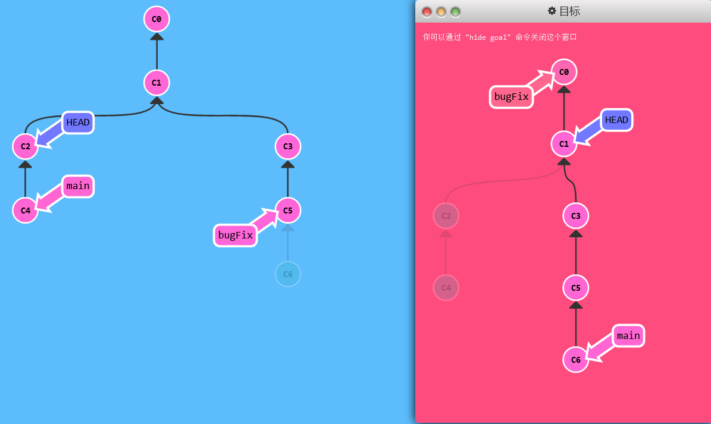

# 分离 HEAD

> 学习在项目的提交树上前后移动的几种方法

## 教学

HEAD 是一个对当前检出记录的符号引用 —— 也就是指向你正在其基础上进行工作的提交记录。

- HEAD 总是指向当前分支上最近一次提交记录。大多数修改提交树的 Git 命令都是从改变 HEAD 的指向开始的。

- HEAD 通常情况下是指向分支名的（如 bugFix）。在你提交时，改变了 bugFix 的状态，这一变化通过 HEAD 变得可见。

## 演示

-  `git checkout C1; git checkout main; git commit; git checkout C2` 
  - HEAD 指向了 `main`，随着提交向前移动。
  - 注意这部分代码并不是真的在查看 HEAD 指向。
  - 如果想看 HEAD 指向，可以通过 `cat .git/HEAD` 查看， 如果 HEAD 指向的是一个引用，还可以用 `git symbolic-ref HEAD` 查看它的指向。

- 分离头指针HEAD：让其指向了某个具体的提交记录而不是分支名。
  - 刚开始指向`HEAD -> main -> C1`
  - `git checkout C1`
  - 变成了`HEAD -> C1`
  - 这就是译者注里面说的不是真正的查看HEAD指向

## 练习

> 从 `bugFix` 分支中分离出 HEAD 并让其指向一个提交记录。
>
> ——通过哈希值指定提交记录。每个提交记录的哈希值显示在代表提交记录的圆圈中。（C1C2之类的）

```shell
git checkout C4
```

# 相对引用1（^）

## 教学

- 实际中提交并非C1C2……而是一串哈希值（40位）。只需要提供能够唯一标识提交记录的前几个字符即可
- 但这样还是很不方便，使用相对引用可以从一个易于记忆的地方（比如 `bugFix` 分支或 `HEAD`）开始计算。
  - 使用 `^` 向上移动 1 个提交记录
  - 使用 `~<num>` 向上移动多个提交记录，如 `~3`

## 演示

> `main^` 是 `main` 的父节点，`main^^` 是 `main` 的第二个父节点

- `git checkout main^` ——切换到当前main分支提交的父节点
- 也可以将 `HEAD` 作为相对引用的参照：` git checkout C3; git checkout HEAD^; git checkout HEAD^; git checkout HEAD^ `——一直使用HEAD向上移动

## 练习

> 切换到 `bugFix` 的父节点。这会进入分离 `HEAD` 状态。

```shell
git checkout bugFix^
```

# 相对引用2（~）

## 教学

该操作符后面可以跟一个数字（可选，不跟数字时与 `^` 相同，向上移动一次），指定向上移动多少次。

## 演示

> 后退四步

- 连续向上后退四个：`git checkout HEAD~4`
- 直接使用 `-f` 选项让分支指向另一个提交 
  - `git branch -f main HEAD~3` 将 main 分支强制指向 HEAD 的第 3 级父提交。

## 练习

> 移动 `HEAD`，`main` 和 `bugFix` 到目标所示的位置
>
> 这一关至少要用到一次直接引用 (即哈希值)



```shell
git checkout HEAD^
git branch -f main C6
git branch -f bugFix bugFix~3
```

# 撤销变更

## 教学

> 撤销变更由底层部分（暂存区的独立文件或者片段）和上层部分（变更到底是通过哪种方式被撤销的）组成。我们这个应用主要关注的是后者。

主要有两种方法用来撤销变更 —— 一是 `git reset`，还有就是 `git revert`。

## 演示

### Git Reset

> 通过把分支记录回退几个提交记录来实现撤销改动。你可以将这想象成“改写历史”。`git reset` 向上移动分支，原来指向的提交记录就跟从来没有提交过一样。

- `git reset HEAD~1`：把 main 分支移回到 `C1`；现在本地代码库根本就不知道有 `C2` 这个提交了。
  - 这种“改写历史”的方法对大家一起使用的远程分支是无效的

### Git Revert

> 撤销更改并**分享**给别人

- `git revert HEAD`：要撤销的提交记录C2后面多了一个新提交`C2'`
  - 新提交记录 `C2'` 引入了**更改** —— 这些更改刚好是用来撤销 `C2` 这个提交的。
  - 也就是说 `C2'` 的状态与 `C1` 是相同的。

## 练习

> 分别撤销 `local` 分支和 `pushed` 分支上的最近一次提交。共需要撤销两个提交（每个分支一个）。
>
> 记住 `pushed` 是远程分支，`local` 是本地分支

```shell
git reset HEAD^
git checkout pushed
git revert HEAD
```

