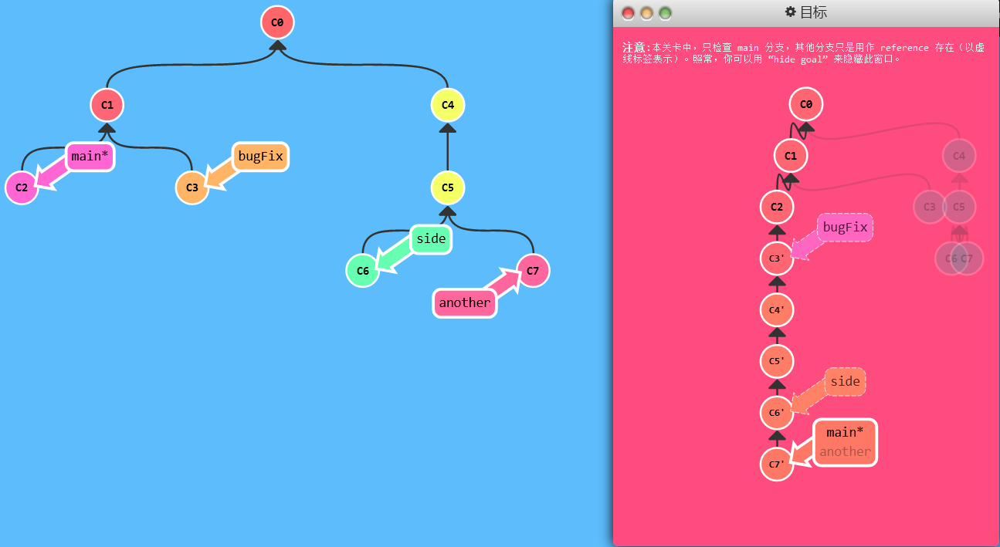
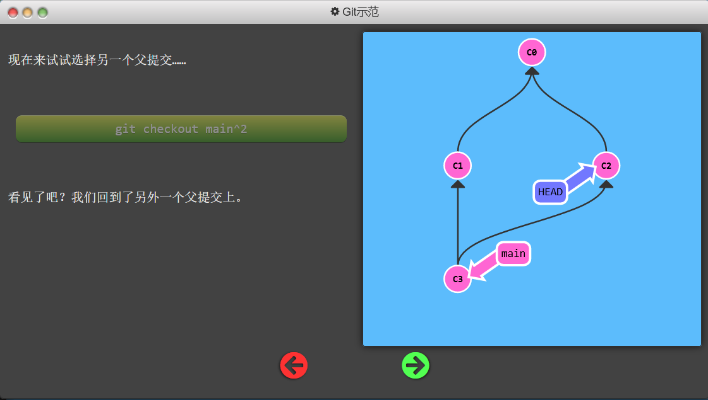
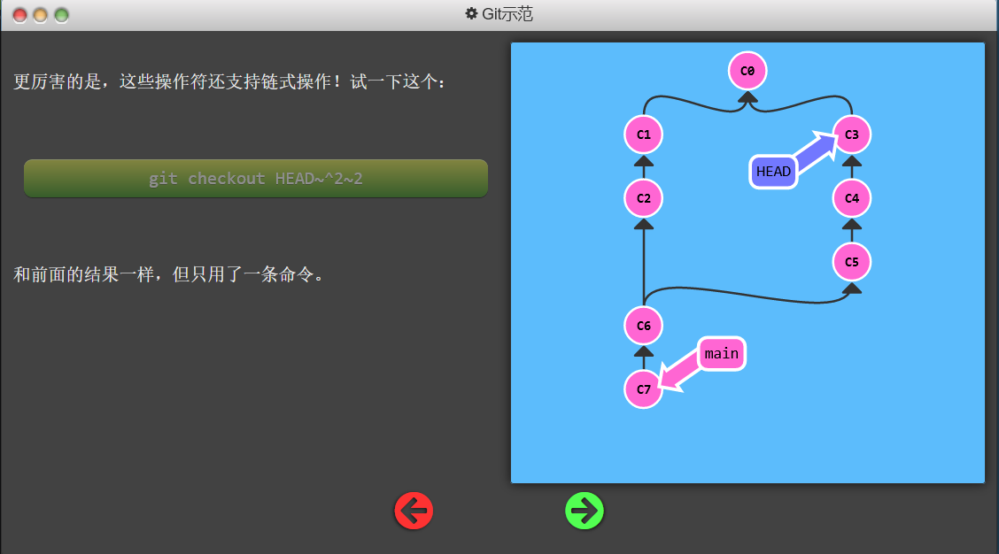
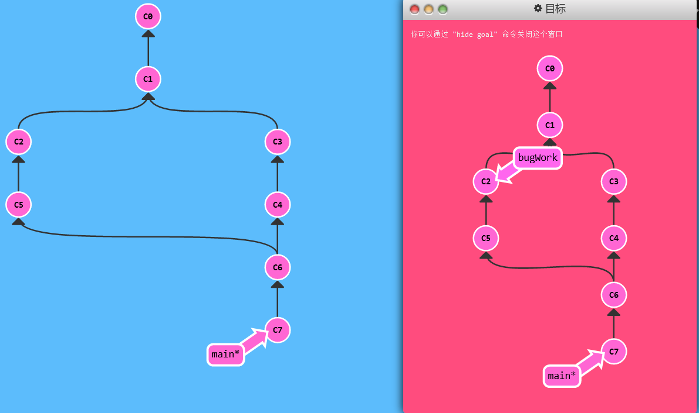
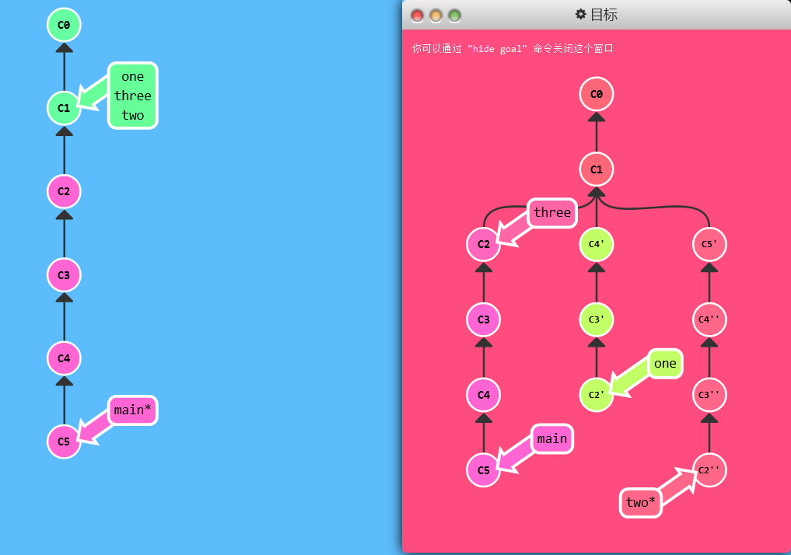

# 多分支 rebase

## 练习

- 我们准备了很多分支！咱们把这些分支 rebase 到 main 上吧。
- 你的领导给你提了点要求 —— 他们希望得到有序的提交历史，也就是我们最终的结果应该是 `C6'` 在 `C7'` 上面， `C5'` 在 `C6'` 上面，依此类推。

——本关不允许使用`cherry-pick`

```shell
git rebase main bugFix
git rebase bugFix side
git rebase side another
git branch -f main 
```



# 两个父节点

## 教学

- 操作符 `^` 与 `~` 符一样，后面也可以跟一个数字。
- 作用是指定合并提交记录的某个父提交
  - Git 默认选择合并提交的“第一个”父提交
  - 添加数字可以选择切换到第几个父提交上

## 演示



- 操作符支持链式操作



## 练习

> 在指定的目标位置创建一个新的分支，要求你使用刚刚讲到的相对引用修饰符

```shell
git checkout HEAD^^2~
git branch bugWork
git checkout main

# 或者一句解决
git branch bugWork HEAD~^2^
```



# 纠缠不清的分支

## 练习

- 现在我们的 `main` 分支是比 `one`、`two` 和 `three` 要多几个提交。出于某种原因，我们需要把 `main` 分支上最近的几次提交做不同的调整后，分别添加到各个的分支上。

- `one` 需要重新排序并删除 `C5`，`two` 仅需要重排排序，而 `three` 只需要提交一次。

```shell
# 强制移动分支指针到指定位置
git branch -f three HEAD~3
git branch -f one HEAD
git branch -f two HEAD
# 拖动修改one分支
git checkout one
git rebase -i HEAD~4  # 修改成指定样子
# 拖动修改two分支
git checkout one
git rebase -i HEAD~4  # 修改成指定样子
```



标准答案：使用`cherry-pick`

```shell
git checkout one
git cherry-pick c4 c3 c2
git checkout two
git cherry-pick c5 c4 c3 c2
git branch -f three c2
```

