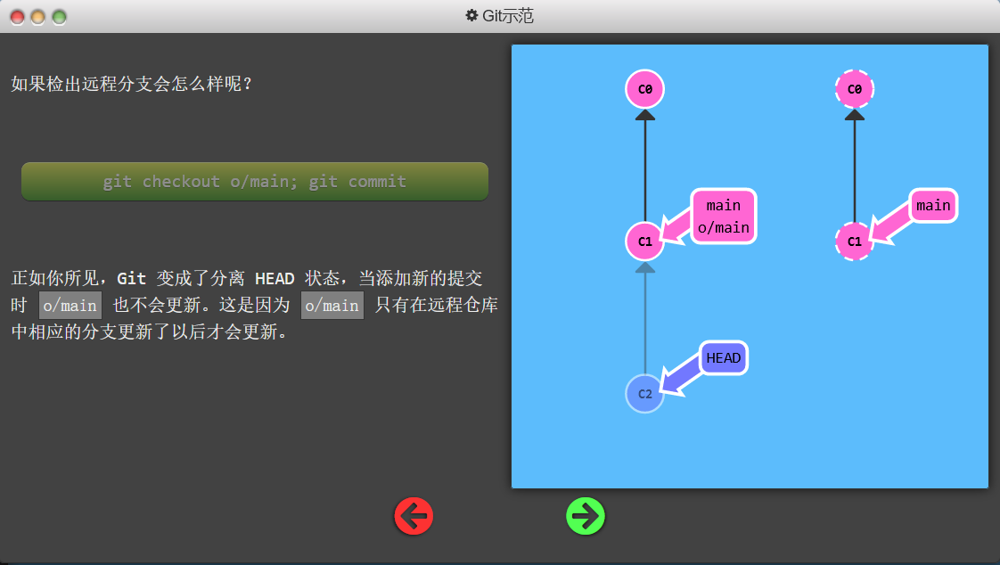
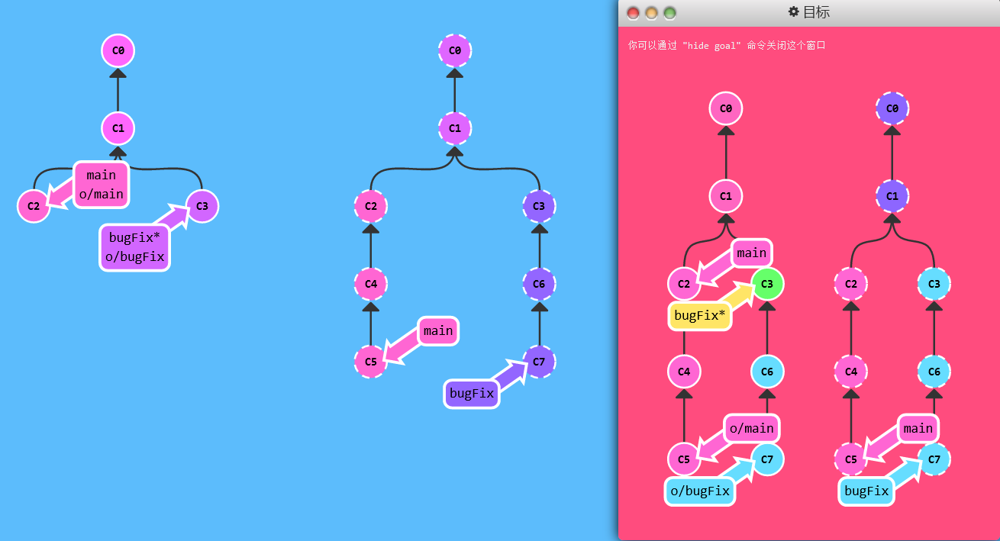
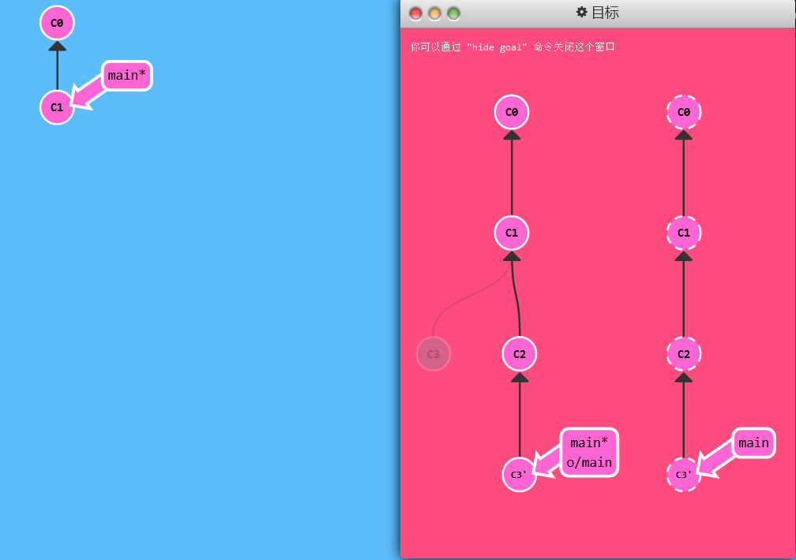
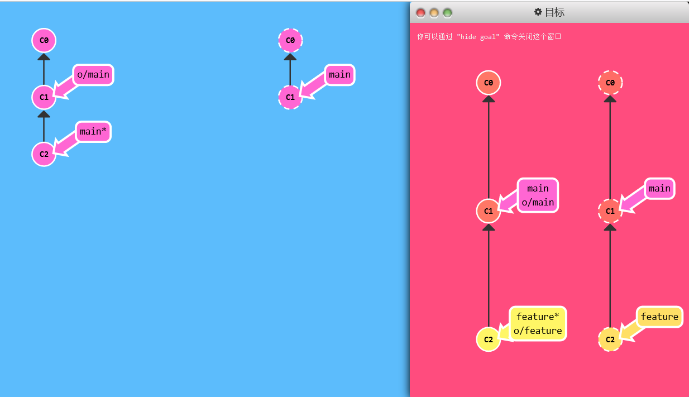

> 远程仓库只是你的仓库在另个一台计算机上的拷贝。你可以通过因特网与这台计算机通信 —— 也就是增加或是获取提交记录
>
> - 远程仓库是一个强大的**备份**。本地仓库也有恢复文件到指定版本的能力, 但所有的信息都是保存在本地的。有了远程仓库以后，即使丢失了本地所有数据, 你仍可以通过远程仓库拿回你丢失的数据
> - 远程让代码**社交**化了! 既然你的项目被托管到别的地方了, 你的朋友可以更容易地为你的项目做贡献(或者拉取最新的变更)

# Git Clone

## 演示

- 创建远程仓库的命令： `git clone`在**本地**创建一个远程仓库的拷贝

## 练习

> 用 `git clone` 复制下你的仓库

```shell
git clone
```

# 远程分支

## 教学

- 在我们的本地仓库多了一个名为 `o/main` 的分支, 这种类型的分支就叫**远程**分支
- 远程分支反映了远程仓库(在你上次和它通信时)的**状态**。这会有助于你理解本地的工作与公共工作的差别 —— 这是你与别人分享工作成果前至关重要的一步
- 远程分支有一个特别的属性，在你检出时**自动进入分离 HEAD 状态**。Git 这么做是出于不能直接在这些分支上进行操作的原因, 你必须在别的地方完成你的工作, （更新了远程分支之后）再用远程分享你的工作成果。

命名规范：

- `<remote name>/<branch name>`
- 如果你看到一个名为 `o/main` 的分支，那么这个分支就叫 `main`，远程仓库的名称就是 `o`
- 使用真正的 Git 时, 你的远程仓库默认为 `origin`

## 演示

- ` git checkout o/main; git commit `
- Git 变成了分离 HEAD 状态，当添加新的提交时 `o/main` 也不会更新。这是因为 `o/main` 只有在远程仓库中相应的分支更新了以后才会更新。



## 练习

> 在 `main` 分支上做一次提交；然后检出 `o/main`，再做一提交。这有助于你理解远程分支的不同，他们的更新只是反映了远程的状态。

```shell
git commit
git checkout o/main
git commit
```

# Git Fetch

> 从远程仓库获取数据
>
> - 我们从远程仓库获取数据时, 远程分支也会更新以反映最新的远程仓库。

## 演示

- 运行`git fetch`，远程最新提交被下载到本地，同时远程分支 `o/main` 也被更新
  - 从远程仓库下载本地仓库中缺失的提交记录
  - 更新远程分支指针(如 `o/main`)

- 远程分支反映了远程仓库在你**最后一次与它通信时**的状态，`git fetch` 就是你与远程仓库通信的方式了

- 不能做的事：不会改变你本地仓库的状态。它不会更新你的 `main` 分支，也不会修改你磁盘上的文件。

## 练习

> 用 `git fetch` 下载所有的提交

```shell
git fetch
```



# Git Pull

> 抓取更新再合并到本地分支

## 演示

- ` git fetch; git merge o/main `：先下载远程更新，再合并到当前分支
-  `git pull` 就是 `git fetch` 和 `git merge`  的缩写

## 练习

```shell
git pull
```

# 模拟团队合作

> “假装”你的同事、朋友、合作伙伴更新了远程仓库，有可能是某个特定的分支，或是几个提交记录
>
> 引入一个自造命令 `git fakeTeamwork`

## 演示

- `git fakeTeamwork` 假装在远程新建一个提交
- `git fakeTeamwork foo 3` 假装在远程foo分支新建三个提交

## 练习

> 克隆一个远程仓库（用 `git clone`），再在刚创建的远程仓库中模拟一些修改，然后在你自己的本地分支上做一些提交，再拉取远程仓库的变更。

```shell
git clone
git fakeTeamwork 2
git commit
git pull
```

# Git Push

> 将**你的**变更上传到指定的远程仓库，并在远程仓库上合并你的新提交记录

## 教程

- `git push` 不带任何参数时的行为与 Git 的一个名为 `push.default` 的配置有关。它的默认值取决于你正使用的 Git 的版本，但是在教程中我们使用的是 `upstream`。
- 在你的项目中进行推送之前，最好检查一下这个配置。

## 演示

- `git pull`：把本地提交上传到远程仓库
  - 我们的远程分支 (o/main) 也同样被更新了

## 练习

> 向远程仓库分享两个提交记录

```shell
git commit
git commit 
git push
```

# 偏离的提交历史

> push和pull的困难来自于远程库提交历史的**偏离**。

## 例子

假设你周一克隆了一个仓库，然后开始研发某个新功能。到周五时，你新功能开发测试完毕，可以发布了。但是 ——  天啊！你的同事这周写了一堆代码，还改了许多你的功能中使用的  API，这些变动会导致你新开发的功能变得不可用。但是他们已经将那些提交推送到远程仓库了，因此你的工作就变成了基于项目**旧版**的代码，与远程仓库最新的代码不匹配了。

- 此时是不允许push的
- 它会强制你先合并远程最新的代码，然后才能分享你的工作。

## 演示

- `git push` 失效，因为远程仓库有未拉取到本地的提交
- 你需要做的就是使你的工作基于最新的远程分支——最直接的方法就是通过 rebase 调整你的工作

方法1：

- ` git fetch; git rebase o/main; git push ` 或 `git pull --rebase; git push`

方法2：

- ` git fetch; git merge o/main; git push ` 或`git pull; git push`

## 练习

> - 克隆你的仓库
> - 模拟一次远程提交（fakeTeamwork）
> - 完成一次本地提交
> - 用 *rebase* 发布你的工作

```shell
git clone
git fakeTeamwork
git commit
git pull --rebase
git push
```



# 锁定的main

> 大型项目中，main（master）分支被锁定保护，需要一些Pull Request流程来合并修改

## 教程

卡住原因：

- 远程服务器拒绝直接推送(push)提交到main, 因为策略配置要求 pull requests 来提交更新.

- 你应该按照流程,新建一个分支, 推送(push)这个分支并申请pull request,但是你忘记并直接提交给了main.现在你**卡住**并且无法推送你的更新.

解决办法：

- 新建一个分支feature, 推送到远程服务器. 然后**reset你的main分支和远程服务器保持一致**, 否则下次你pull并且他人的提交和你冲突的时候就会有问题.

## 练习

```shell
git branch feature
git reset HEAD^
git checkout feature
git push
```



标准答案：

```shell
git reset --hard o/master
git checkout -b feature C2
git push origin feature
```

- `git push` 后接的参数，第一个为远程仓库名（默认为origin），第二个为分支名（默认为当前HEAD指向的）

> [补充](https://www.cnblogs.com/hiccuplh/p/16590607.html) [参考](http://t.zoukankan.com/hodge01-p-10277757.html)
>
> 1、**git reset --hard**
>
> 重置stage区和工作目录里的内容，就是你的没有commit的修改会被全部擦掉
>
> 2、**git reset --soft**
>
> reset --soft：用于版本的回退，只进行对commit操作的回退，不影响工作区的文件。
>
> 在提交代码的时候，commit之后，然后我又在工作区添加了东西，这时候突然发现，上一次的commit有错误的文件，需要重新修改，但是我添加的东西友不想丢失，而且我想修改上一次的提交，这时候可进行git reset --soft 版本号
>
> 3、**git reset --mixed**
>
> reset 不加参数(mixed)：保留工作目录，并清空暂存区

