# 推送主分支

> - 将特性分支集成到 `main` 上
> - 推送并更新远程分支

## 演示

- 快速的更新 `main` 分支并推送到远程：` git pull --rebase; git push `

## 练习

> - 这里共有三个特性分支 —— `side1` `side2` 和 `side3`
> - 我需要将这三分支按顺序推送到远程仓库
> - 因为远程仓库已经被更新过了，所以我们还要把那些工作合并过来

```shell
git fetch
git rebase o/main side1
git rebase side1 side2
git rebase side2 side3
git rebase side3 main
git push
```


# 合并远程仓库

## 教学

rebase的优缺点：

- 优点：Rebase 使你的提交树变得很干净, 所有的提交都在一条线上
- 缺点：Rebase 修改了提交树的历史

## 练习

> 和上一题一样，不过不能用rebase，要用merge

```shell
git fetch
git checkout main
git merge side1
git merge o/main
git merge side2
git merge side3
git push
```

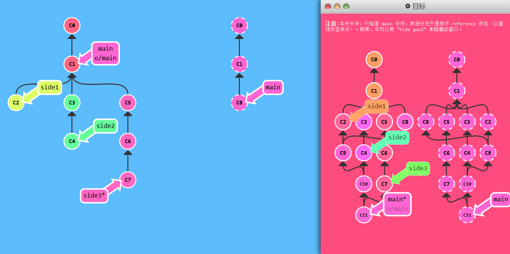

标准答案：

```shell
git checkout main
git pull origin main
git merge side1
git merge side2
git merge side3
git push
```

# 远程追踪

> - pull 操作时, 提交记录会被先下载到 o/main 上，之后再合并到本地的 main 分支。隐含的合并目标由这个关联确定的。
> - push 操作时, 我们把工作从 `main` 推到远程仓库中的 `main` 分支(同时会更新远程分支 `o/main`) 。这个推送的目的地也是由这种关联确定的！

## 教学

- 关联关系就是由分支的“remote tracking”属性决定的。`main` 被设定为跟踪 `o/main` —— 这意味着为 `main` 分支指定了推送的目的地以及拉取后合并的目标。
- 当你克隆仓库的时候, Git 就自动帮你把这个属性设置好了，会看到如下输出：
  - `local branch "main" set to track remote branch "o/main"`

## 演示

- 自定义这个属性：可以让任意分支跟踪 `o/main`——两种方法

  1. `git checkout -b totallyNotMain o/main`，新建分支让他追踪远程main分支

     ` git checkout -b foo o/main; git pull `：foo分支和远程main分支一致，而原来的main分支没变

     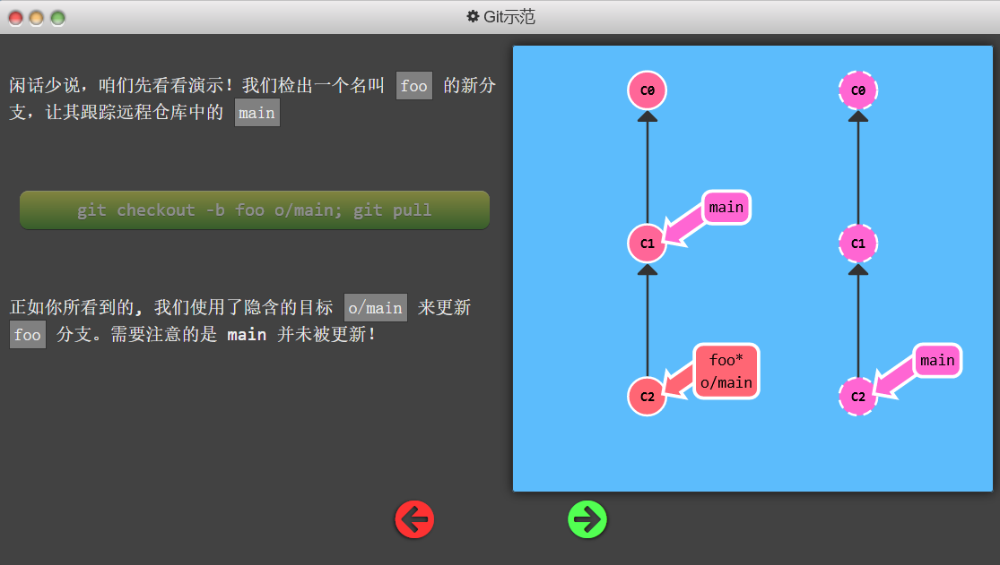

     ` git checkout -b foo o/main; git commit; git push `：本地提交的foo分支被push到了远程的main

     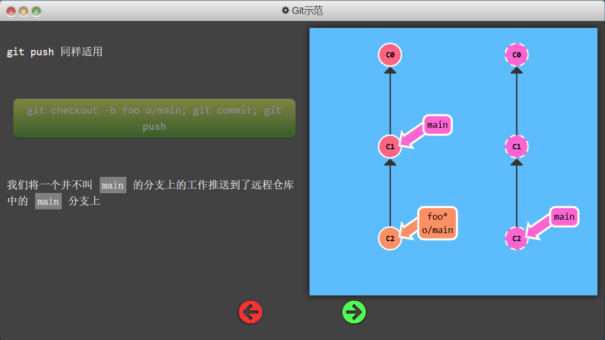

  2. `git branch -u o/main foo`：这样 `foo` 就会跟踪 `o/main` 了。如果当前就在 foo 分支上, 还可以省略 foo
     - 实现的操作和上面的一样，只不过需要提前创建foo分支

## 练习

> 我们在**不**检出 `main` 分支的情况下将工作推送到的远程仓库中的 `main` 分支上

```shell
git checkout -b side o/main # git checkout -b side; git branch -u o/main side
git commit
git pull --rebase  # 注意顺序
git push
```

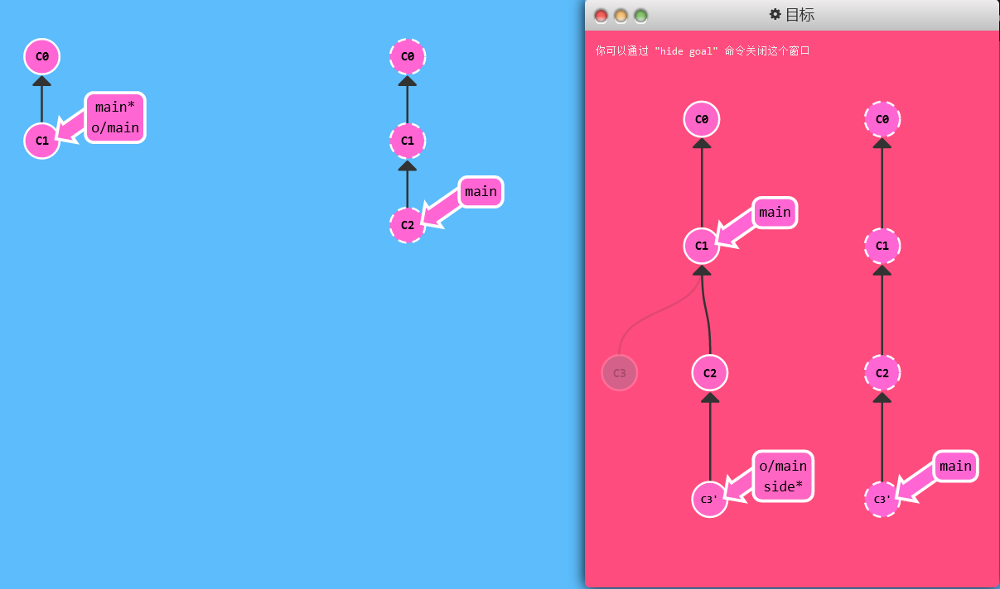

# Git Push的参数

> 未指定参数时，通过当前检出分支的属性来确定远程仓库以及要 push 的目的地

## 教程

- 指定参数语法为：`git push <remote> <place>`
- 如：`git push origin main`*切到本地仓库中的“main”分支，获取所有的提交，再到远程仓库“origin”中找到“main”分支，将远程仓库中没有的提交记录都添加上去，搞定之后告诉我。*
- 因为我们通过指定参数告诉了 Git 所有它需要的信息, 所以它就忽略了我们所检出的分支的属性

## 演示

- 使用参数后不用考虑HEAD的指向（即当前检出状态）

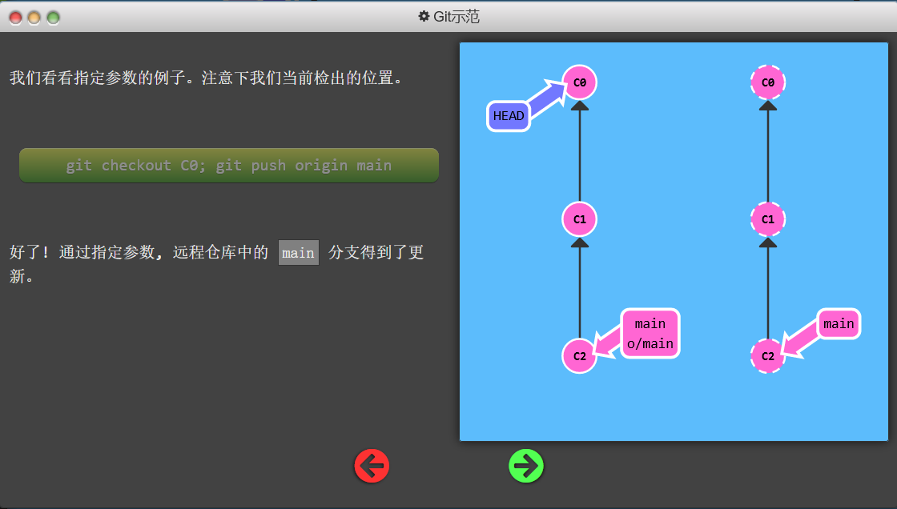

## 练习

> 更新远程仓库中的 `foo` 和 `main`, 但是 `git checkout` 被禁用了

```shell
git push origin main
git push origin foo
```

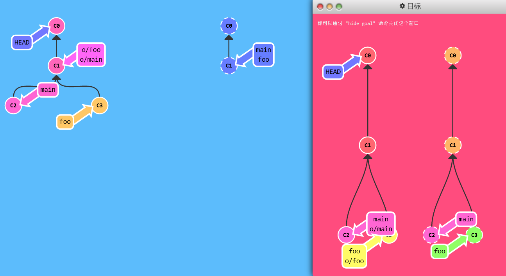

# Git Push的参数2

> 如果来源和去向分支的名称不同呢？比如你想把本地的 `foo` 分支推送到远程仓库中的 `bar` 分支。

## 教学

- 同时为源和目的地指定 `<place> `的话，只需要用冒号 : 将二者连起来就可以了：

  `git push origin <source>:<destination>`

## 演示

- `source` 可以是任何 Git 能识别的位置


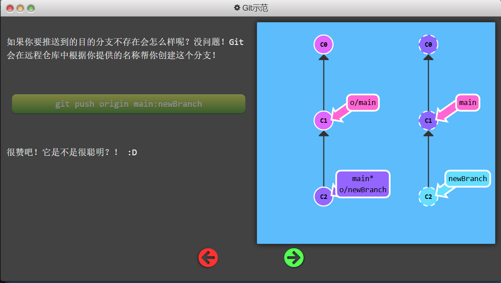

## 练习

```shell
git push origin foo:main
git push origin main^:foo  # git push origin HEAD^:foo
```

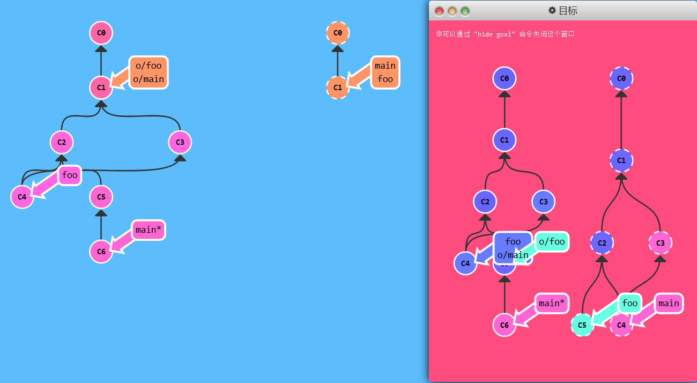

# Git Fetch的参数

> `git fetch` 的参数和 `git push` 极其相似。他们的概念是相同的，只是方向相反罢了（因为现在你是下载，而非上传）

## 教学

```shell
git fetch origin foo
```

- Git 会到远程仓库的 `foo` 分支上，然后获取所有本地不存在的提交，放到本地的 `o/foo` 上。
- 因为fetch不会更改本地分支，所以本地foo分支没有同步
- 直接`<source>:<destination>`的话，确实可以更新本地分支，但不能在当前检出分支上这么做，而且也没有必要，因为pull就是干这个的
- `source` 现在指的是远程仓库中的位置，而 `destination` 才是要放置提交的本地仓库的位置。它与 git push 刚好相反

## 演示

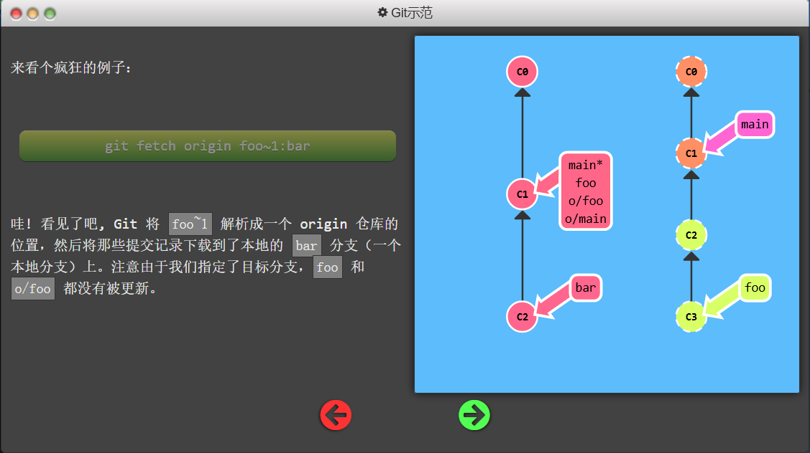

一般没人这样做吧喂

- 如果本地没有bar分支，就会自己新建。和push一样，要是远程没有就新建。

如果 `git fetch` 没有参数，它会下载所有的提交记录到各个远程分支

## 练习

> 抓取目标窗口中指定的提交记录，使用这些魔幻的命令

```shell
git fetch origin foo:main
git fetch origin main^:foo
git checkout foo
git merge main
```

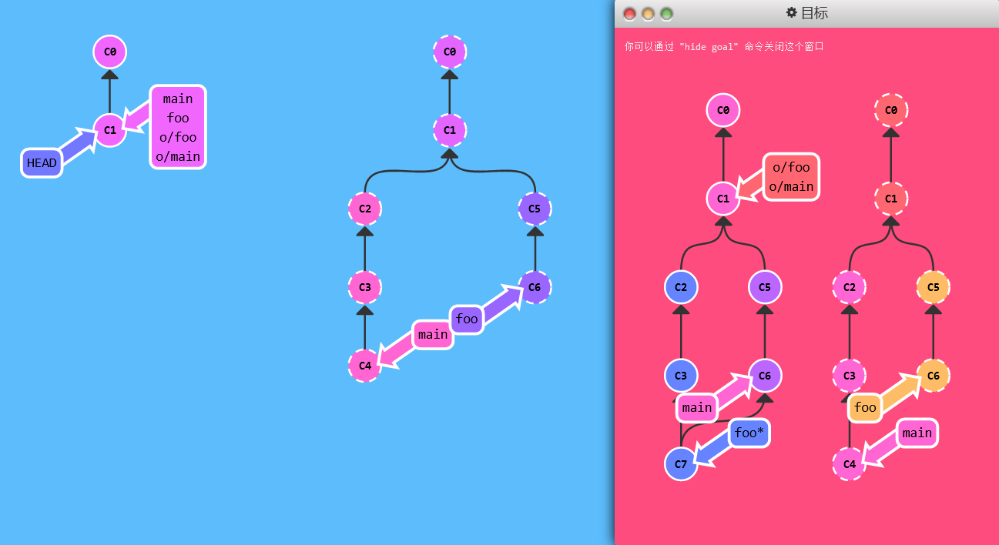

# 没有Source的Source*

## 教学

你可以在 git push 或 git fetch 时不指定任何 `source`，方法就是仅保留冒号和 destination 部分，source 部分留空。

- `git push origin :side`
- `git fetch origin :bugFix`

## 演示

- 如果 push 空  到远程仓库它会删除远程仓库中的分支！
- 如果 fetch 空  到本地，会在本地HEAD位置创建一个新分支

## 练习

> 删除一个远程的分支, 再用 `git fetch` 在本地创建一个新分支

```shell
git fetch origin :bar  # pull也是可以的
git push origin :foo
```

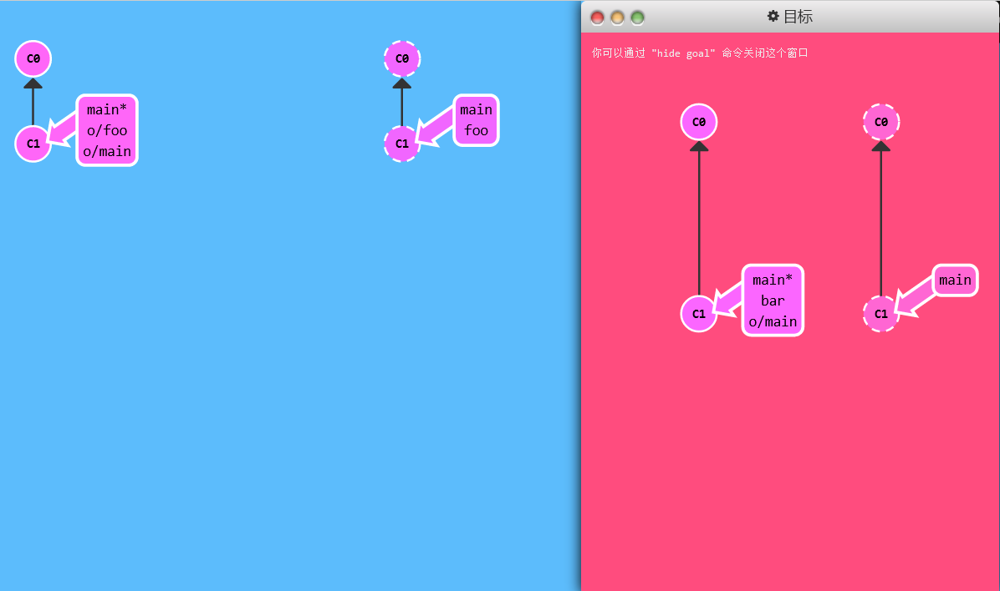

# Git pull 参数

> git pull 到头来就是 fetch 后跟 merge 的缩写。你可以理解为用同样的参数执行 git fetch，然后再 merge 你所抓取到的提交记录。

## 教学

以下命令在 Git 中是等效的:

`git pull origin foo` 相当于：

```shell
git fetch origin foo; git merge o/foo
```

还有...

`git pull origin bar~1:bugFix` 相当于：

```shell
git fetch origin bar~1:bugFix; git merge bugFix
```

## 演示

- git pull 唯一关注的是提交最终合并到哪里（也就是为 git fetch 所提供的 destination 参数传递给merge， merge 到我们的检出位置，**无论**我们当前检出的位置是哪）
- pull 也可以用 `source:destination`

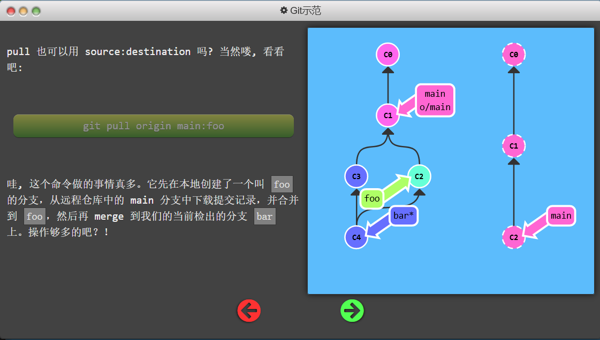

## 练习

> 按照目标窗口中的状态进行操作。你需要下载一些提交，然后创建一些新分支，再合并这些分支到其它分支

```shell
git pull origin bar:foo
git pull origin main:side
```

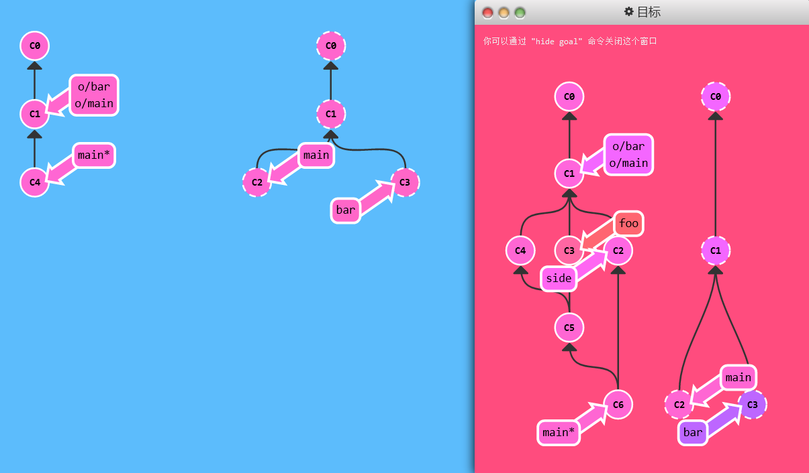

Wow！你通关了！ (ﾉ\^\_\^)ﾉ (ﾉ\^\_\^)ﾉ (ﾉ\^\_\^)ﾉ