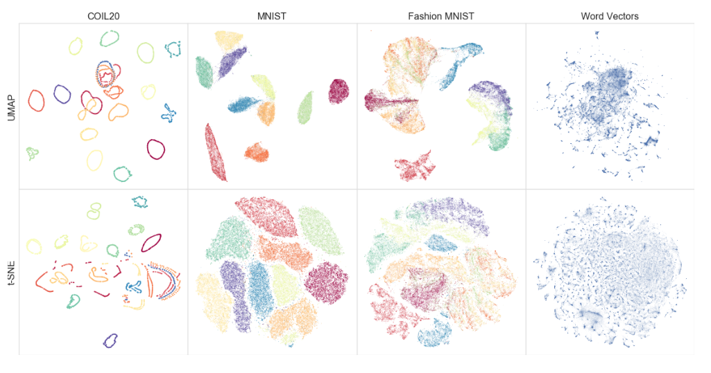

> 菲尔兹数学科学研究所 复杂网络2019夏令营课程
>
> 授课老师来自：Tutte数学与计算研究所 ——加拿大政府研究机构，成立于2011年
>
> 基于Python3、igraph框架。2019.8 [ComplexNetworks2019](https://github.com/ftheberge/ComplexNetworks2019)
>
> 本夏令营的其它课程资料（Julia）：
>
> [day1day2](https://github.com/bkamins/ComplexNetworks2019)
>
> [day3day4day5](https://github.com/pszufe/ComplexNetworks2019)

# 研究领域

1. 密码学
   - 经典密码学
   - 后量子公钥密码学
   - “高级密码学”

2. 数据科学
   - 机器学习理论与实践
   - 图挖掘技术
   - 网络防御和安全应用

3. 脆弱性研究
   - GC系统的网络安全
   - 流水线

# 本课程涉及的内容

1. [UMAP](https://blog.csdn.net/bashendixie5/article/details/124400062)：统一流形逼近和投影——*是一种降维技术，可用于类似于 t-SNE 的可视化，但也可用于一般的非线性降维。UMAP 是一种基于流形学习技术和拓扑数据分析思想的降维算法。它为处理流形学习和降维提供了一个非常通用的框架，但也可以提供具体的具体实现。*
2. 图聚类（Graph clustering）：各算法比较，一种新算法（ECG）
3. 图嵌入（Graph embedding）
4. 图上的半监督学习
5. 超图模块化和聚类

## 拓扑数据分析：UMAP

1. 降维技术
2. [范畴论](https://zhuanlan.zhihu.com/p/527510520)（Utilizes category）和[代数拓扑学](https://www.zhihu.com/topic/20008661/top-answers)（algebraic topology）的使用
3. 真实应用

和[t-SNE](https://blog.csdn.net/sinat_20177327/article/details/80298645)算法的对比

> t-SNE是一种非线性降维算法，非常适用于高维数据降维到 2 维或者 3 维，进行可视化。在实际应用中，t-SNE很少用于降维，主要用于可视化

## ECG：图上的集成聚类

——Ensemble Clustering on Graphs

# 总目录

1. 关系数据挖掘
   - 中心性度量
   - 图模型
   - 基准（benchmarks）

2. 社区结构
   - 图划分（graph partitions）算法比较
   - 图聚类算法
   - 图上的集成聚类（ECG）

3. 图嵌入
4. 图上的半监督学习
5. 超图模块化和聚类