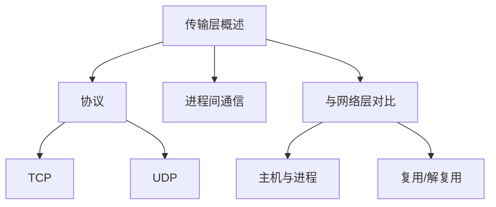
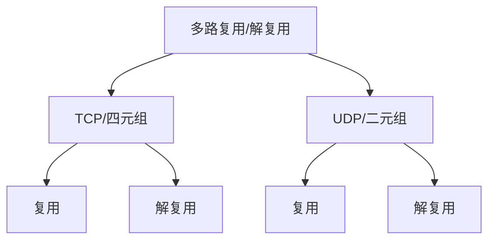
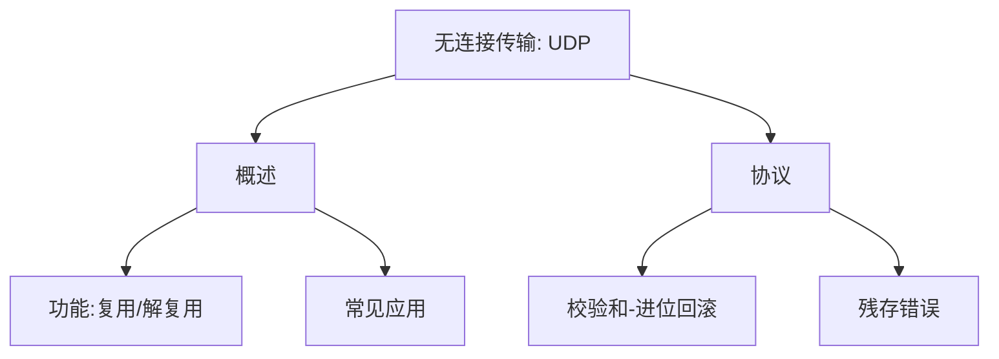
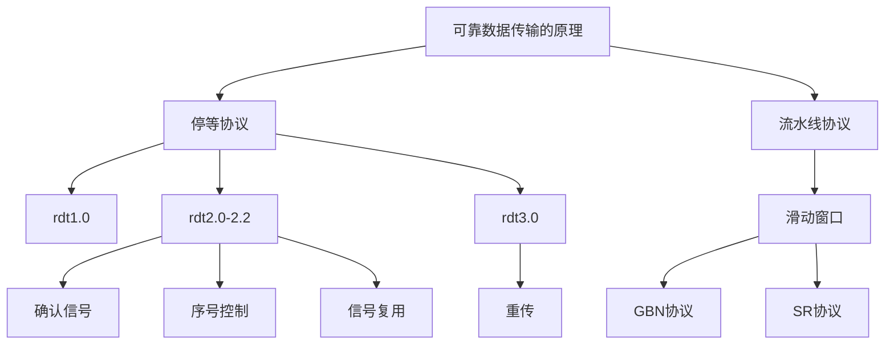
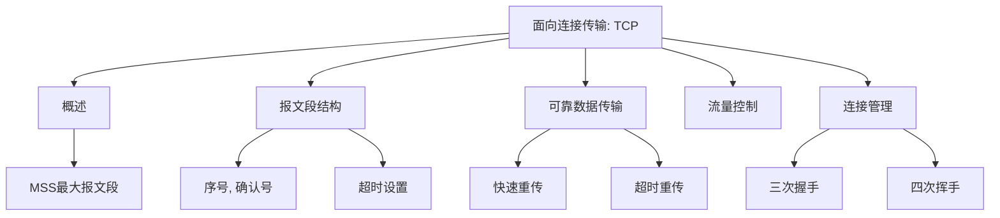
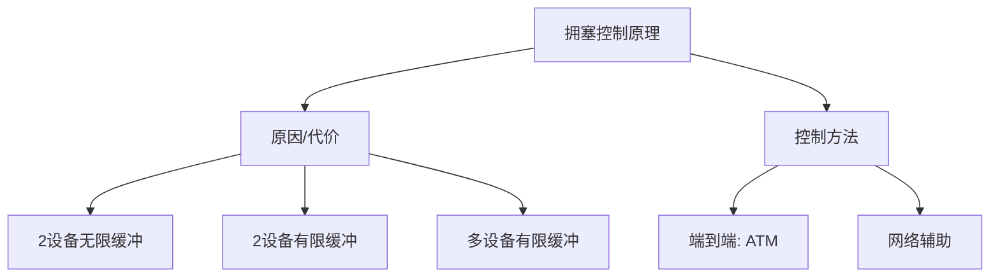
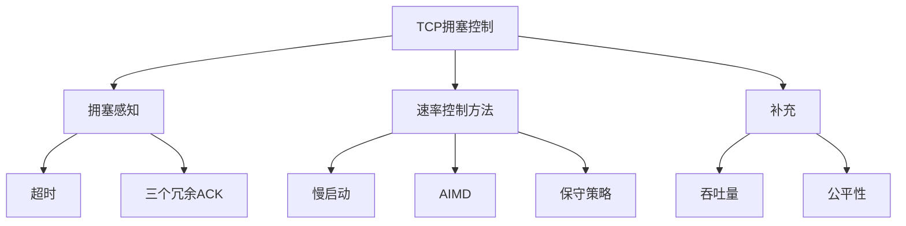

# 第三章 传输层

- 传输层的原理。
  1. 多路复用/解复用、
  2. **可靠数据传输（RDT-经典核心内容）**、
  3. 流量控制、
  4. **拥塞控制**（原因、表现、检测、控制）。
- 传输层协议。
  1. UDP
  2. TCP
  3. TCP拥塞控制

## 3.1 概述和传输层服务

传输服务和协议：

- **进程之间**以**报文（message）为单位**的**逻辑的**通信。

- 发送方**拆分**为报文段，接收方再去掉头、**重组**。不表示报文界限（字节流的服务）。

- 有多种协议可选：Internet——TCP、UDP。

传输层 vs. 网络层：

- 网络层：主机之间；传输层：**进程之间**。
- 不可靠 -> 可靠是可以加强的；不安全 -> 也是可以加强的；但是延迟和带宽这些品质是不可以加强的。
- 最重要的品质加强：复用/解复用，源端做复用、目标端解复用。（通信的双方互为源和目的）。

Internet传输层协议：

- **可靠的、保序TCP**：多路复用/解复用、拥塞控制、流量控制、建立连接。——字节流
- **不可靠、不保序UDP**：多路复用/解复用、无额外更多的服务。——数据报

二者都不能保证带宽和延迟。

## 3.2 多路复用与解复用

通过端口号来实现多路复用、解复用。TCP socket一个整数包含四元组、UDP socket一个整数包含二元组。

- TCP往下交两个东西：socket、数据内容。源端根据socket提交端口、IP信息，目标端收到后根据端口、IP查询socket向上传递，交给正确的应用进程。
- UDP要多交一个东西：目标端口+IP。源端根据信息传送，目标端根据目标端口+IP信息找到对应socket找到进程。

复用：从多个套接字接收来自多个进程的报文，根据套接字对应的IP地址和端口号等信息对报文段用头部加以封装。

解复用：根据报文段的头部信息中的IP地址和端口号将接收到的报文段发给正确的套接字(和对应的应用进程)。

无连接多路复用例子：UDP中socket只与本机IP端口相关，即接收方**只根据目标端口和IP查找socket即可**。

面向连接的解复用例子：**四元组有一个不一样就会定位给不同的socket**，发送到不同的应用进程（同一进程的不同线程）。

## 3.3 无连接传输：UDP

### 概述

**概述**：仅增加了复用、解复用的功能。没有加入其他新功能。可能有丢失和乱序、无连接。

- 常见应用：流媒体、DNS、SNMP（简单网管协议）。

- 一般常见：流媒体、事务型应用（一次往返解决）。
- UDP上可行可靠传输：应用层增加可靠性、特定差错恢复。

### 协议

**协议**：UDP数据报格式：

1. 8字节**头部**——2字节源端口号、2字节目的端口号、数据长度（包括头部）、校验和EDC。
2. **报文部分**——校验和出错后全部丢掉。

必要性：不用连接、简单、载荷占比大（头部小）、没有流量拥塞控制。

**校验和**：**校验范围（D）**的和，判断是否出现了差错。没有通过校验一定错，通过校验不一定错（残存错误）。

发送方做差错控制编码，接收方做差错控制解码。——存在保护范围：数据、头部、部分其他内容。按照16bit的单位分开、每16bit全部加起来作为一个校验和。

要注意的部分：除EDC的部分**进位回滚**（进位的1加到末尾），最后结果求反码（**按位取反**）；接收端加出来全1即通过校验。

## 3.4 可靠数据传输的原理

### 问题描述

（一般化的）可靠数据传输（RDT）：可能是数据链路层、应用层等等。下一层是不可靠数据传输（UDT）。

是网络Top 10问题之一。

**rdt_send()**和**deliver_data()**是本层和上层接口的原语；**udt_send()**和**rdt_rcv()**是本层和下层接口的原语。——针对本层来说。

假设：**渐增式**地开发、双向传输的是两个**单向传输**的结合、**有限状态机** (**FSM**) 来描述发送方和接收方。

- 学习方法：先**假设底层完全可靠**，**逐步增加底层的不可靠性**，本层逐步添加机制，直到完成本层全部功能。
- 虽然数据通信是单向的，但是需要双向的信息交换。
- 有限状态机：通过图形的方式表示实体的状态、连接边的分子代表发生的事件、分母代表采取的动作。迁移到哪个状态取决于发生了什么事件。
- 可靠传输的需求：不出错、不丢失。

### 停等协议

（停止等待协议stop and wait）。

#### Rdt1.0（非停等）

——在可靠信道上的可靠数据传输

下层的信道完全可靠：

- 发送方：接收上层、封装、发送下层。
- 接收方：接收下层、解封装、交给上层。

#### Rdt2.x

**Rdt2.0——具有比特差错的信道（出错）**

下层信道可能会产生反转出错：

- 确认(**ACK**)、否定确认( **NAK**)：发送方收到NAK后，发送方重传分组。
- 采用差错控制编码进行差错检测（EDC的用处）：差错控制编码、缓存->检错->反馈->相应的动作。

状态有所增加：

- 发送方：接收上层、封装、发送下层->等待对方反馈（NAK始终发旧的，ACK返回初始状态）
- 接收方：接收下层、没出错、解封装、交给上层、发送ACK；接收下层、出错了、发送NAK。

**Rdt2.1——带序号控制**

rdt2.0存在的致命问题：**ACK/NAK可能出错、丢失**。——**序号**（发送方在每个分组中加入序号）

ACK/NAK出错的情况下，重新发送上一个分组，有可能形成**重复**，接收方收到**重复直接丢掉**发送ACK即可。

仅需要**0和1两个序号**，发送方四个状态、接收方两个状态。——一次只发送一个未经确认的分组。

状态都加倍了，因为有了0和1的分别。接收方收到不同于当前状态的分组（没错）时、丢掉再发ACK。

接收方不知道ACK/NAK是否被正确地收到，**根据收到下一个分组的情况**判断有没有收到。

**Rdt2.2——无NAK的协议**（只使用ACK，对它做编号）。

使用**上一个分组的正向确认代替当前分组的反向确认**（为一次发送多个数据单位做好准备）。

确认信息减少一半，协议处理简单。双方出错都能继续回到同步状态。

状态转移图和2.1基本相同，仅使用ACK0代替了NAK1，ACK1代替了NAK0。

#### Rdt3.0

——具有**比特差错**和**分组丢失**的信道（**超时重传**：比正常往返稍微长一点）

动机：分组可能丢失，接收方没有收到，互相等待陷入**死锁**。——需要机制来打破。

超时时间设置不一定相同，数据链路层一般比较确定，传输层根据概率分布动态设置。

延时比较长的情况下重传可能造成数据重复，但是没有关系。

状态转移图也是**四个状态**，不同的是发送分组后**启动定时器**，**超时重传**；收到**不同于当前的ACK继续等待**，直到超时重传（和立即重传效果一样）。

一个数据传输的例子（超时设置的不好：**过早地超时**）：这种情况**效率并不高**，正常情况下50%或更低——一半

的分组和确认是重复的。

Rdt3.0已经是**完备的协议**了，可以对抗复杂的情况（出错、丢失）。

存在的**缺点**：在信道容量比较大的情况下，性能很差。

- 1 Gbps的链路（R），15 ms端-端传播延时（t），RTT=30ms，分组大小为1kB（L）
- 传输延迟8us，利用率0.027%，有效带宽270kbps。
- 瓶颈在协议本身——虽然能实现，但是太慢太慢，利用率非常低。

### 流水线协议

（流水线协议pipeline）。

允许发送方在未得到对方确认的情况下一次发送多个分组，最大限度地利用线路资源。增加序号的范围，有缓冲区进行控制。

最经典的**流水线协议**（管道化协议）。两种分类——**回退N步**(GBN go back N)、**选择重传**(SR selective repeat)。

缓冲区目的：发送方（选择重传）、接收方（速度匹配）。

#### 滑动窗口协议

先看一般性协议**滑动窗口**协议（SW slide window）。

对于滑动窗口：SW=1，RW=1，停等；SW>1，RW=1，退回N步；SW>1，RW>1，选择重传。

**发送缓冲区**：发送方同时能够发送多少未经确认的分组（没有确认需要缓存）。链路利用率不能够超100%

**发送窗口**：发送缓冲区的**子集**，存放已发送未确认的分组。**发送窗口最大值小于等于发送缓冲区大小**。

相对表示：分组不动、窗口向前滑动。

前沿滑动：发送出去一个分组，前沿往向前滑动；后沿滑动：收到确认后沿向前滑动（不能超过前沿）。

**接收窗口**：（等同于接收缓冲区）——接收方愿意接收多少分组。

- RW=1，始终给出正确到来分组顺序到来最高序号的确认。**回退N步**——累积确认
- RW>1，收到接收窗口低序号最边缘的分组，才可以向前滑动。高序号到来可以缓存**选择重传**——非累积确认

**窗口互动**：

1. 正常情况：同步向前滑动、传输过程不失序。发送方发送，前沿前滑；接收窗口接收、前滑、确认；发送后沿前滑。
2. 异常GBN互动方式：最后分组乱序（丢失）到达。后面到来的分组抛弃掉，发送累积确认，发送方超时重新发送全部分组。
3. 异常SR互动方式：分组乱序（丢失）到达，前面分组的确认始终没来，触发超时机制，只发送前方未经确认的分组，后面收到的不再重发。（每个分组提供一个定时器）。

GBN、SR相同点：一次能够可发送多个未经确认的分组；区别：乱序或丢失是否需要全部重发、累计确认vs非累计确认、是否为每个分组添加一个定时器。

#### GBN协议

发送方有限状态机：

- 初始化窗口=0 next=base。
- 新来分组在缓冲区范围之内，可以发送，base=next时，重设定时器。
- 超时了，窗口内全部重发。
- 收到确认信号，后沿向前滑动，base=next时，重设定时器。。

接收方有限状态机：

- 初始化进入到等待状态，用一个变量维护等待接收位置。
- 来到分组通过校验，序号和当前等待序号相同，解封装上交，发送确认，接收窗口向前滑动。
- 乱序分组之间丢弃，仅提供最高顺序分组的确认。

#### SR协议

非累积确认，仅对未确认分组进行重传。

**主要区别**：

- 发送方：每个分组设置定时器，重传超时的对应分组、收到最低确认，直接移到最低未确认处。
- 接收方：乱序数据缓存，低分组到来后同一上交，忽略超过范围的分组。

GBN简单，但是需要回退N步，出错回退代价大。SR复杂要维护多个缓冲区和定时器，回退代价小。

分组编号比特数为n时（序号空间大小），GBN协议最大窗口大小为2\^n-1，SR协议最大窗口大小为2\^(n-1)

## 3.5 面向连接的传输：TCP

### 概述

点到点数据通信、可靠的字节流（不维护边界）、流水线-管道化（按MSS大小分成报文段）、发送接收缓存、全双工（同时双向）、面向连接（握手）、有流量控制拥塞控制。

MSS：最大报文段。因为以太网MTU-最大载荷单元有限（一般是1500字节）

### 报文段结构

**head**

- 源\目标**端口号**（各16bit）
- 以字节为单位的**序号**（PDU第一个字节在整个字节流中的偏移量，32bit）初始序号不是从0开始的（防止冲突）
- **确认号**：此处ACK表示对当前号及以后的分组的期待（例ACK 555表示收到了554及以前的-累积确认）
- **首部长度**、**保留位**、**标志位**（RSF：建立TCP连接用）
- **接收窗口**：用于流量控制。
- **校验和**：进位回滚、反码。
- **紧急指针**一般不用、**可选项**。

**body**

#### 序号, 确认号

- 接收方没有规定如何处理乱序报文段（**可删除可缓存**）
- 标志位A**置1**，ACK确认号**才有用**
- 例子telne（回显），Seq和ACK的关系。**ACK为希望对方下一个Seq的值，Seq为对方上一个ACK的值**。

#### 往返延时（RTT）和超时

需求：

- 合理的超时设置（有效保证利用率、不会造成太多重发）

- 一般设置起来是适应式的测量和计算——根据当前网络延迟情况。

设置原理：在短时间内延迟分布比较集中，需要动态自适应地设置——定期测量往返延迟。

方法：

- 对几个最近的测量值SampleRTT求平均**EstimatedRTT**——指数加权移动平均：α = 0.125
- **DevRTT**——当前SampleRTT和EstimatedRTT的偏差的指数加权移动平均：β = 0.25

往返延迟均值+4倍方差：**EstimatedRTT+4DevRTT**

### 可靠数据传输

——某些方面像GBN某些方面像SR。

- 不可靠基础上实现了rdt：管道化、累积确认、单个重传定时器、可以乱序
- 两种方式触发重传：超时、**快速重传**（连续收到三个冗余ACK）

**简化的TCP发送方**——忽略流量控制、重复确认：初始化，初始序号默认、有数据要发（前沿滑动、若无定时设置定时器）、超时到时仅重发最老的分组（再设置定时器）、收到ACK，重设base（后沿滑动），还有未确认字节重启定时器，没有未确认字节时关闭定时器。

伪代码展示此功能实现。

示例1Seq=92，发送了8字节，ACK=100丢了，超时重发92，继续ACK100。（顺序到来的最后一个字节给ACK）

示例2连续发92/8，100/20，92的ACK100超时，重发92/8，收到ACK120，直接移动base到119，超时设置长的话就**避免了重发**。

产生TCP ACK的**建议**：隐忍不发（提高效率）、攒够两个立即发确认、乱序到来赶快请求前面丢的段、部分补齐了缺失，赶快发送剩余缺失的ACK。

**快速重传**：未超时就收到这个段的三个冗余请求——在定时器过时之前重发报文段（算法表示）。

### 流量控制

- 缓冲区TCP往里面写，app从当中读取

- 通过接收窗口告诉发送方空闲尺寸，用于让发送方控制——典型默认大小为4096 字节
- 捎带技术：使用反向的传输携带反馈信息
- **RcvWindow= RcvBuffer-[LastByteRcvd - LastByteRead]**

### 连接管理

——连接建立和连接拆除（同意建立连接、同步、分配资源、变量置位——商量起始序号、缓冲区大小）

**连接建立：**

两次握手挑战：请求可能丢失、超时、乱序。

- 服务器响应重发的连接请求（维护了很多虚假的半连接）
- 重发的连接请求和连接数据都在响应完毕后到达，服务器又响应一整个虚假会话。

三次握手：分别给初始序号，给对方确认（其中两步可以复用），至少三次握手。第三次交互往往和第一次数据传递放在一起。

三次握手可以避免虚假半连接（发送请求方主动关闭）、避免重复响应（没有连接直接扔掉数据、新连接同时开启——初始序号的作用，可以筛选掉老的数据）

一些细节的状态转移图（自己看即可 左边接收方，右边发送方）

**连接拆除：**

两个方向单独**对称式拆除**——每一个方向发送一个拆除请求，再回复一个同意拆除响应。（**并不完美**，存在一方维持连接一方拆除的问题——最后一段不可靠就不可以让连接完美拆除——打仗通讯的例子）

一个填补方案：设置定时，超时没有数据了就真正断开了（也不完美）。

## 3.6 拥塞控制原理

拥塞：数据超过网络处理能力。表现：分组丢失率高很多、延迟很高。也是**Top10的问题**！

### 拥塞的原因/代价

场景1：2个发送端，2个接收端。路由器**无限大**的缓冲。吞吐量达到R/2，接收不再增加，拥塞趋近于无限大。

场景2：一个路由器，**有限的**缓冲。传输层包括重传，丢失多了重传多 ，λ'变大。

2.1：发送端知道路由器缓冲区大小，λ'=λ。

2.2：发送端掌握丢失信息，比接收方带宽高一些才能保证原始速率传输。

2.3：存在重复的可能（超时导致重传），输出比输入少，最终输出接收也达不到R/2。

正反馈变坏，越拥塞越加大，最终导致更加拥塞。——加速变坏

场景3：4个发送端，多重路径，超时／重传。发生拥塞时，空闲空间被最近流量抢走，最终都无法送达（死锁）被抛弃分组的上游传输能力被浪费。

### 拥塞控制方法

目的：在不发生拥塞的前提下尽可能地提高传输速率。

**端到端拥塞控制：**端系统自己判断是否发生拥塞。TCP

**网络辅助的拥塞控制：**网络核心为端系统提供网络状态辅助信息。ATM

### 例：ATM网络

——网络辅助拥塞控制

异步传输网络，曾经互联网的一个实现，数据交换单位叫**信元**（53字节，5字节头部），很小。

延迟比线路交换大，比分组交换小，延迟固定，调度较容易。最终没有广泛使用。

**ABR 拥塞控制**：弹性服务——无拥塞时可以超过要求带宽，拥塞后会限制带宽。 available bit rate

信元分为数据信元和资源管理信元（RM），把资源管理信元的某些位置位

资源管理信元——NI bit轻微拥塞（速率不增加）、CI bit明显拥塞（降低速率）、ER字段（网络可以为两台主机提供多大带宽）

数据信元——EFCI bit设置成了1，RM信元中CI bit就要置位。

## 3.7 TCP 拥塞控制

——端到端拥塞控制，减小网络核心压力

几个问题：**检测拥塞**（轻微拥塞、拥塞）、**解决拥塞**（轻微拥塞、拥塞）、**不产生拥塞的情况下提高速率**

### 拥塞感知

1. 超时：拥塞丢弃或错误丢弃。（误动作很少，即出错丢弃情况很少）——拥塞的指示
2. 三个冗余ACK（一共4个确认），认为当前这个段丢失了（快速重传）——轻微拥塞的指示

### 速率控制方法

CongWin/RTT=rate——未确认情况下可以注入多少字节/往返延迟=单位时间注入多少字节

超时，CongWin降为1MSS（一个分组大小），进入慢启动阶段（1RTT后加倍）直到加到CA——**SS阶段**

3个重复ack，CongWin降为原来的一半——**CA阶段**

SS阶段每个RTT加倍，CA每个RTT线性增加1MSS。

——**拥塞控制和流量控制联合处理**SendWin=min{CongWin, RecvWin}同时满足了流量控制和拥塞控制的目的。

**策略概述**

——慢启动；线性增、乘性减少；超时事件后的保守策略

**慢启动**

刚建立时CongWin = 1 MSS，指数性增加发送速率知道发生丢失，初始值很大，后面增加非常快。

——每收到一个ACK时，CongWin加1。

**AIMD**：线性增、乘性减

1. 丢失事件后将CongWin降为1，将CongWin/2作为阈值，

   三个冗余ACK时，不降为1，而是直接变成CongWin/2，

2. 进入慢启动阶段。下次倍增到CongWin/2，（可忽略不计）
3. CongWin>阈值时，每次加1MSS线性增加。——锯齿形

**保守策略**：参照表格、拥塞控制状态图

- CongWin＜Threshold——指数增长

- CongWin>Threshold——线性增加

- 三个重复的ACKs——Threshold=CongWin/2，CongWin=Threshold+3，线性增加
- 超时事件——Threshold=CongWin/2，CongWin=1 MSS，进入SS阶段

### 补充

**吞吐量**：

W：发生丢失事件时的窗口尺寸，平均窗口尺寸3/4W，平均吞吐量3/4(W/RTT)

未来：网络带宽增加需要保证更低的丢失率

**公平性**：多个主机对分享了瓶颈带宽

每一个会话的有效带宽为 R/K——举例，假设k=2，RTT=RTT'，按照上文方案，最终会收敛到公平位置。

UDP会对TCP连接产生更大的影响（对TCP不公平），两个主机建立多个TCP连接就会占用更多带宽，RTT小也会抢占更多带宽。

## 总结

1. 传输层提供的服务：为应用进程提供逻辑通信——主机进程之间 TCP/UDP
2. 多路复用和解复用 ：TCP四元组、UDP二元组
3. UDP协议：多路复用解复用 UDP报文格式 检错机制：校验和
4. 可靠数据传输：Rdt1.0-3.0-效率不高——流水线协议-GBN/SR
5. TCP协议：报文段格式、可靠传输机制、重传，快速重传、流量控制、三次握手四次挥手（对称拆除）
6. 拥塞控制原理：原因、代价、方式（端到端、网络辅助控制）
7. TCP的拥塞控制：三大原则

