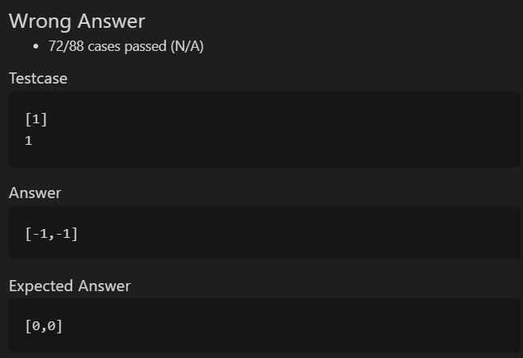
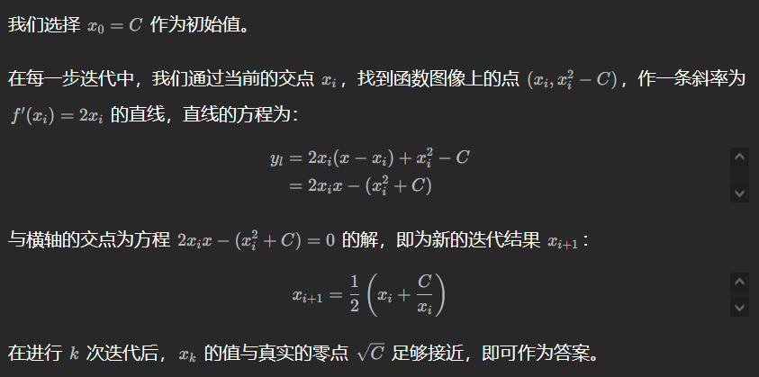

# 基础知识

> 数组是存放在连续内存空间上的相同类型数据的集合，可以方便的通过下标索引的方式获取到下标下对应的数据

- 下标从0开始
- 存储空间地址连续
- 元素不能删除，只能覆盖

注：C++ vector的底层实现是array，vector是容器。

[C++常见容器](https://blog.csdn.net/weixin_43719763/article/details/127147035)

# 二分法

## 704二分查找

给定一个 n 个元素有序的（升序）整型数组 nums 和一个目标值 target  ，写一个函数搜索 nums 中的 target，如果目标值存在返回下标，否则返回 -1。

可以用二分法的条件：

- 有序
- 无重复元素

**循环不变量规则**：在while寻找中每一次边界的处理都要坚持根据区间的定义来操作

每次更新left一定是middle+1，因为闭区间不需要考虑一定不满足条件的位置

1. 闭区间：循环判别使用<=，每次更新right=middle-1
2. 左闭右开：循环判别使用<，每次更新right=middle

**似乎左闭右开效率更高，此方案可以避免left==right后再更新middle**

### C++

相关知识：

1. vector类的一些方法

```c++
创建一维vector
vector<int> nums; //不指定长度
vector<int> nums(n); //指定长度
 
添加元素
nums.push_back(1); //直接在末端添加元素1
 
删除元素
nums.resize(num.size-i); //删除后面i个元素
nums.pop_back(); //删除最后一个元素
 
获取长度
nums.size();
 
判空
nums.empty();
nums.size()==0;
```

2. 引用参数传递

函数参数一般分为三种，一种是纯粹的值传递数据参数，第二种是地址传递，第三种是引用传递

- 纯值：形参局部变量不改变实参全局变量
- 地址：传入地址形参（*a）实参（&a），改变全局变量
- 引用：传入引用形参（&a）实参（a），改变全局变量

防止left+right溢出（超出整数范围），可以使用`int middle = left + (right - left) >> 1;`

法二：

```c++
class Solution {
public:
    int search(vector<int>& nums, int target) {
        int left = 0;
        int right = nums.size();
        while (left < right) {
            // int middle = (left + right) >> 1;
            // 防止left+right溢出（超出整数范围）
            int middle = left + (right - left) >> 1;
            if (nums[middle] < target) {
                left = middle + 1;
            } else if (nums[middle] > target) {
                right = middle;
            } else {
                return middle;
            }
        }
        return -1;
    }
};
```

### Python

相关知识：

Python整除是`\\`

python可以不用考虑溢出，因为它的整数int型足够大

法一：

```python
class Solution:
    def search(self, nums: List[int], target: int) -> int:
        left = 0
        right = len(nums) - 1
        while left <= right:
            middle = (left + right) // 2
            if nums[middle] < target:
                left = middle + 1
            elif nums[middle] > target:
                right = middle -1
            else:
                return middle
        return -1
```

## 35搜索插入位置

### C++

```c++
class Solution {
public:
    int searchInsert(vector<int>& nums, int target) {
        int left = 0;
        int right = nums.size();
        int mid = 0;
        while (left < right) {
            mid = left + (right - left) / 2;
            if (nums[mid] < target) {
                left = mid + 1;
            } else if (nums[mid] > target) {
                right = mid;
            } else {
                return mid;
            }
        }
        return right;
    }
};
```

**一定要返回right，返回middle就错了。**按二分法定义，

- 左闭右开区间的时候右指针一定是该插入的位置。
- 闭区间下应该是right+1。

### Python

```python
class Solution:
    def searchInsert(self, nums: List[int], target: int) -> int:
        left = 0
        right = len(nums)
        while left < right:
            mid = (left + right) // 2
            if nums[mid] < target:
                left = mid + 1
            elif nums[mid] > target:
                right = mid
            else:
                return mid
        return right
```

## 34在排序数组中查找元素的第一个和最后一个位置

### C++

1. 方法1：分别找左右边界，两次二分查找；再判断左右边界的范围
   - 情况一：target 在数组范围的右边或者左边，例如数组{3, 4, 5}，target为2或者数组{3, 4, 5},target为6，此时应该返回{-1, -1}
   - 情况二：target 在数组范围中，且数组中不存在target，例如数组{3,6,7},target为5，此时应该返回{-1, -1}
   - 情况三：target 在数组范围中，且数组中存在target，例如数组{3,6,7},target为6，此时应该返回{1, 1}

- **使用大于等于二分法查到的一定是左边界，使用小于等于二分法查到的一定是右边界。**
- 左边界使用右指针，右边界使用左指针。
- **为什么border不可以是-1**：有可能在边界上，leftbordee找到的是-1，不好判断。



```c++
// 左闭右开区间法
class Solution {
public:
    vector<int> searchRange(vector<int>& nums, int target) {
        int left = 0;
        int right = nums.size();
        int leftBorder = -2, rightBorder = -2;
        while (left < right) {
            int mid = left + (right - left) / 2;
            if (nums[mid] < target) {
                left = mid + 1;
            } else {
                right = mid;
                leftBorder = right - 1;
            }
        }
        left = 0;
        right = nums.size();
        while (left < right) {
            int mid = left + (right - left) / 2;
            if (nums[mid] <= target) {
                left = mid + 1;
                rightBorder = left;
            } else {
                right = mid;
            }
        }
        // cout << leftBorder << ' ' << rightBorder << endl;
        // 情况一
        if (leftBorder == -2 || rightBorder == -2) return {-1, -1};
        // 情况三
        if (rightBorder - leftBorder > 1) return {leftBorder + 1, rightBorder - 1};
        // 情况二
        return {-1, -1};
    }
};
```

2. 方法2
   - 二分查找 target，使用大于等于，找左边界
   - 二分查找失败，返回false，结果为[-1,-1]
   - 二分查找成功，返回true，向右游走找右边界
   - 复杂度O(n)，但是一般情况下达不到，可以通过

```c++
class Solution {
public:
    vector<int> searchRange(vector<int>& nums, int target) {
        int left = 0;
        int right = nums.size();
        int leftPos = -2; // 第一次找到的位置
        bool find = false; // 是否找到
        while (left < right) {
            int mid = left + (right - left) / 2;
            if (nums[mid] < target) {
                left = mid + 1;
            } else {
                right = mid;
                leftPos = mid - 1;
            }
            if (nums[mid] == target) find = true;
        }
        if (!find) {
            return {-1, -1};
        } else {
            int rightPos;
            for (rightPos = leftPos + 1; rightPos < nums.size() && nums[rightPos] == target; rightPos++) {}
            return {leftPos + 1, rightPos - 1};
        }

    }
};
```

3. 方法3（略）
   - 找target，使用大于等于，找左边界
   - 找target+1，使用大于等于，找左边界，减1得target右边界
   - 判断情况返回即可
   - 其实也是两次二分查找

### Python

闭区间法1：

```python
class Solution:
    def searchRange(self, nums: List[int], target: int) -> List[int]:
        left = 0
        right = len(nums) - 1
        leftPos = -2
        while left <= right:
            mid = (left + right) // 2
            if (nums[mid] < target):
                left = mid + 1
            else:
                right = mid - 1
                leftPos = right
        left = 0
        right = len(nums) - 1
        rightPos = -2
        while left <= right:
            mid = (left + right) // 2
            if (nums[mid] <= target):
                left = mid + 1
                rightPos = left
            else:
                right = mid - 1
        if rightPos - leftPos > 1 and rightPos != -2 and leftPos != -2:
            return [leftPos + 1, rightPos - 1]
        return [-1, -1]
```

## 69*x 的平方根

1. 二分法，每次看mid平方和x的关系
   - 一些小技巧：对于0，1的特殊情况直接返回；使用`int mid = left + (right - left) / 2;``if (mid > x / mid)`等方法防止溢出。
   - 起始右闭区间为n/2时，左区间从1开始，防止输入2 时死循环。
   - 使用闭区间可以避免4的一半2平方是4，从n/2开始会漏掉的问题。
   - 使用右开区间就需要注意要么对4特殊考虑，要么开头从x开始。

2. 牛顿法



### C++

```c++
class Solution {
public:
    int mySqrt(int x) {
        if (x == 0 || x == 1) return x; // 特殊情况直接返回
        int left = 1;
        int right = x / 2;
        int ans = 1;
        while (left <= right) {
            int mid = left + (right - left) / 2; // 防止溢出
            if (mid > x / mid) { // 防止溢出
                right = mid - 1;
            } else {
                left = mid + 1;
                ans = mid; // 小于等于才符合取整的要求
            }
        }
        return ans;
    }
};
```

```c++
class Solution {
public:
    int mySqrt(int x) {
        if (x == 0) return 0;
        double C = x, x0 = x, xi = x;
        while (true) {
            xi = 0.5 * (x0 + C / x0);
            if (fabs(x0 - xi) < 1e-7) {
                break;
            }
            x0 = xi;
        }
        return int(x0);
    }
};
```

### Python

```python
class Solution:
    def mySqrt(self, x: int) -> int:
        if x <= 1:
            return x
        left = 1
        right = x // 2
        while left <= right:
            mid = left + (right - left) // 2
            if mid <= x / mid:  # 不能落了等于，会有刚好满足的情况
                left = mid + 1
                ans = mid
            else:
                right = mid - 1
        return ans
```

```python
class Solution:
    def mySqrt(self, x: int) -> int:
        if x == 0:
            return x
        C, x0, x1 = x, x, x
        while True:
            x1 = 0.5 * (x0 + C / x0)
            if abs(x0 - x1) < 1e-7:
                break
            x0 = x1
        return int(x0)
```


## 367有效的完全平方数

1. 二分法：

   - 需要注意舍入误差，前面为防止溢出判断时加的`if (mid > num / mid)`，在运算时可能出现不满足条件但返回满足的情况，需要再加一层判断，此时不用担心舍入误差。

   - 或者直接使用long也行

2. 数学法：（骚）
   - 平方数性质1 4=1+3 9=1+3+5 16=1+3+5+7以此类推，模仿它可以使用一个while循环，不断减去一个从1开始不断增大的奇数，若最终减成了0，说明是完全平方数，否则，不是。
3. 牛顿法：同上，迭代找到零点，判断`int(x0) * int(x0) == num`即可。

### C++

```c++
class Solution {
public:
    bool isPerfectSquare(int num) {
        if (num == 1) return true;  // 特殊情况
        int left = 1;
        int right = num / 2;
        while (left <= right) {
            int mid = left + (right - left) / 2;
            if (mid < num / mid) {
                left = mid + 1;
            } else if (mid > num / mid) {
                right = mid - 1;
            } else {
                if (mid * mid == num) {
                    return true;  // 防止舍入误差，加个判断，此时不会溢出可放心使用
                } else {
                    return false;
                }
            }
        }
        return false;
    }
};
```

```c++
class Solution {
public:
    bool isPerfectSquare(int num) {
        int item = 1;
        while (num > 0) {
            num -= item;
            item += 2;
        }
        return num == 0;
    }
};
```

### Python

```python
class Solution:
    def isPerfectSquare(self, num: int) -> bool:
        if num == 1: return True
        left = 1
        right = num // 2
        while left <= right:
            mid = left + (right - left) // 2
            if (mid ** 2 < num):
                left = mid + 1
            elif (mid ** 2 > num):
                right = mid - 1
            else:
                return True
        return False
```

# 快慢指针

## 27移除元素

**数组的元素在内存地址中是连续的，不能单独删除数组中的某个元素，只能覆盖。**

1. 爆破法，可以通过，复杂度$O(n^2)$
2. 双指针法：**在数组和链表的操作中是非常常见的**
   - 快指针：寻找新数组的元素 ，新数组就是不含有目标元素的数组
   - 慢指针：指向更新新数组下标的位置

3. 左右指针法：两头逼近，找左边等于val的和右边不等于val的，把右边移到左边，最终返回左指针。

### C++

1. 爆破法

```c++
class Solution {
public:
    // 爆破法
    int removeElement(vector<int>& nums, int val) {
        int slowIndex = 0;
        for (int fastIndex = 0; fastIndex < nums.size(); fastIndex++) {
            if (nums[fastIndex] != val) {
                nums[slowIndex++] = nums[fastIndex];
            }
        }
        return slowIndex;
    }
};
```

2. 快慢指针法

```c++
class Solution {
public:
    // 快慢指针法
    int removeElement(vector<int>& nums, int val) {
        int slowIndex = 0;
        for (int fastIndex = 0; fastIndex < nums.size(); fastIndex++) {
            if (nums[fastIndex] != val) {
                nums[slowIndex++] = nums[fastIndex];
            }
        }
        return slowIndex;
    }
};
```

### Python

双指针法

```python
class Solution:
    def removeElement(self, nums: List[int], val: int) -> int:
        # 双指针法
        slowIndex = 0
        for fastIndex in range(len(nums)):
            if nums[fastIndex] != val:
                nums[slowIndex] = nums[fastIndex]
                slowIndex += 1
        return slowIndex
```

## 26删除排序数组中的重复项

- 典型的快慢指针法

### C++

```c++
class Solution {
public:
    int removeDuplicates(vector<int>& nums) {
        int slowIndex = 0;  // 慢指针指示插入单一数值位置
        int nowNum = nums[0];
        for (int fastIndex = 0; fastIndex < nums.size(); fastIndex++) {  // 快指针指示遍历末尾
            if (nums[fastIndex] != nowNum) {
                nums[slowIndex++] = nowNum;
                nowNum = nums[fastIndex];
            }
        }
        nums[slowIndex++] = nowNum;  // 最后一个存入
        return slowIndex;
    }
};
```

### Python

```python
class Solution:
    def removeDuplicates(self, nums: List[int]) -> int:
        slowIndex = 0
        numNow = nums[0]
        for fastIndex in range(len(nums)):
            if (nums[fastIndex] != numNow):
                nums[slowIndex] = numNow
                slowIndex += 1
                numNow = nums[fastIndex]
        nums[slowIndex] = numNow
        return slowIndex + 1
```

## 283移动零

- 双指针遍历非0元素，最后补0

### C++

```c++
class Solution {
public:
    void moveZeroes(vector<int>& nums) {
        int slowIndex = 0; // 慢指针
        for (int fastIndex = 0; fastIndex < nums.size(); fastIndex++) {
            if (nums[fastIndex] != 0) {
                nums[slowIndex++] = nums[fastIndex];  // 替换非0元素
            }
        }
        for (;slowIndex < nums.size(); slowIndex++) {
            nums[slowIndex] = 0; // 末尾补0
        }
    }
};
```

### Python

```python
class Solution:
    def moveZeroes(self, nums: List[int]) -> None:
        """
        Do not return anything, modify nums in-place instead.
        """
        slowIndex = 0
        for fastIndex in range(len(nums)):
            if (nums[fastIndex] != 0):
                nums[slowIndex] = nums[fastIndex]
                slowIndex += 1
        while slowIndex < len(nums):
            nums[slowIndex] = 0
            slowIndex += 1
```

## 844*比较含退格的字符串


- 准备两个指针 i, j 分别指向 S，T 的末位字符，再准备两个变量 skipS，skipT 来分别存放 S，T 字符串中的 # 数量。

- 从后往前遍历 S，所遇情况有三，

  1. 若当前字符是 #，则 skipS 自增 1； 
  2. 若当前字符不是 #，且 skipS 不为 0，则 skipS 自减 1； 
  3. 若当前字符不是 #，且 skipS 为 0，则代表当前字符不会被消除，我们可以用来和 T 中的当前字符作比较。

  作者：[御三五 🥇](https://leetcode.cn/problems/backspace-string-compare/solutions/683776/shuang-zhi-zhen-bi-jiao-han-tui-ge-de-zi-8fn8/)
  来源：力扣（LeetCode）
  著作权归作者所有。商业转载请联系作者获得授权，非商业转载请注明出处。

注意：

1. 必须加入判断防止数组-1索引超界
2. 在保证无退格后的真实情况中，若一个字符串遍历完，另一个还有，说明不匹配，要考虑到

### C++

基础知识：

C++中字符串长度：`S.length()`

```c++
class Solution {
public:
    bool backspaceCompare(string s, string t) {
        int i = s.length() - 1, j = t.length() - 1;  // 字符串遍历变量
        int backS = 0, backT = 0;
        while (i >= 0 || j >= 0) {
            if (i >= 0) {  // 防止某个指针减到-1以后数组越界
                if (s[i] == '#') {  // 为#号时清空自增
                    backS++;
                    i--;
                    continue;
                } else if (backS > 0) {  // 不为#号但后面有清空时清空不考虑
                    backS--;
                    i--;
                    continue;
                }
            }
            if (j >= 0) {
                if (t[j] == '#') {
                    backT++;
                    j--;
                    continue;
                } else if (backT > 0) {
                    backT--;
                    j--;
                    continue;
                }
            }
            if (i >= 0 && j >= 0) {
                if (s[i] != t[j]) {
                    return false;
                }
            } else if (i >= 0 || j >= 0) {  // 有一个字符串先跑完了，此时为false
                return false;
            }
            i--; j--;
        }
        return true;
    }
};
```

内部两个判断退格的条件语句continue太多，写成循环更好一些：

```c++
while (i >= 0) {
    if (S[i] == '#') {
        skipS++, i--;
    } else if (skipS > 0) {
        skipS--, i--;
    } else {
        break;
    }
}
while (j >= 0) {
    if (T[j] == '#') {
        skipT++, j--;
    } else if (skipT > 0) {
        skipT--, j--;
    } else {
        break;
    }
}
```

### Python

- 使用了前面说的while循环包裹的方法
- while循环一定不要忘记循环变量的变化——自减或自增

```python
class Solution:
    def backspaceCompare(self, s: str, t: str) -> bool:
        i, j = len(s)- 1, len(t) - 1  # 下标指针
        backS, backT = 0, 0  # 退格变量
        while i >= 0 or j >= 0:
            while i >= 0:
                if s[i] == "#":
                    backS += 1
                    i -= 1
                elif backS > 0:
                    backS -= 1
                    i -= 1
                else:
                    break
            while j >= 0:
                if t[j] == "#":
                    backT += 1
                    j -= 1
                elif backT > 0:
                    backT -= 1
                    j -= 1
                else:
                    break
            if i >= 0 and j >= 0:
                if s[i] != t[j]:
                    return False
            elif i >= 0 or j >= 0:
                return False
            i -= 1  # 别忘记这里！！
            j -= 1
        return True
```

# 左右指针

## 977有序数组的平方

注意双指针法循环判断条件为i=j，否则最后一个最小的数就没有了

### C++

1. 平方完快排 O(n)+O(nlogn)

```c++
class Solution {
public:
    vector<int> sortedSquares(vector<int>& nums) {
        for (int i = 0; i < nums.size(); i++) {
            nums[i] *= nums[i];
        }
        sort(nums.begin(),nums.end());
        return nums;
    }
};
```

2. 双指针法O(n)

```c++
class Solution {
public:
    vector<int> sortedSquares(vector<int>& nums) {
        int i = 0;
        int j = nums.size() - 1;
        int k = j;
        vector<int> result(nums.size(), 0);  // 初始化一个长度为size的vector，其值都为0
        while (i <= j) {
            if (nums[i] * nums[i] < nums[j] * nums[j]) {
                result[k--] = nums[j] * nums[j];
                j--;
            }
            else {
                result[k--] = nums[i] * nums[i];
                i++;
            }
        }
        return result;
    }
};
```

### Python

- 双指针法

```python
class Solution:
    def sortedSquares(self, nums: List[int]) -> List[int]:
        i = 0
        n = len(nums)
        j, k = n - 1, n - 1
        result = [0] * n
        while i <= j:
            if nums[i] ** 2 < nums[j] ** 2:
                result[k] = nums[j] ** 2
                j -= 1
            else:
                result[k] = nums[i] ** 2
                i += 1
            k -= 1
        return result
```

# 滑动窗口

## 205长度最小的子数组

只用一个for循环，那么这个循环的索引，一定是表示 滑动窗口的终止位置

- 也算是双指针法的一种
- 终止指针为循环遍历索引
- 起始指针控制窗口大小

不要以为for里放一个while就以为是O(n^2)，每个元素在滑动窗后进来操作一次，出去操作一次，每个元素都是被操作两次，所以时间复杂度是 2 × n 也就是O(n)。

暴力破解复杂度O(n^2)会超时。

### C++

- int32无穷大：`INT32_MAX`

```c++
class Solution {
public:
    int minSubArrayLen(int target, vector<int>& nums) {
        int result = INT32_MAX; // 代表无穷大
        int i = 0; // 窗口头指针
        int sum = 0; // 和
        for (int j = 0; j < nums.size(); j++) {
            sum += nums[j];
            while (sum >= target) {
                int len = j - i + 1;
                result = result < len ? result : len;
                sum -= nums[i++];
            }
        }
        return result == INT32_MAX ? 0 : result;
    }
};
```

### Python

- float无穷大：`float("inf")`

```python
class Solution:
    def minSubArrayLen(self, target: int, nums: List[int]) -> int:
        i = 0
        sum = 0
        result = float("inf") # python的float正无穷
        for j in range(len(nums)):
            sum += nums[j]
            while sum >= target:
                result = min(result, j - i + 1)
                sum -= nums[i]
                i += 1
        return 0 if result == float("inf") else result
```

## 904*水果成篮

### C++

1. 自己写的滑动窗口：设置两个存放水果的变量，设置头指针和下次头指针备选，遍历一次即可

```c++
class Solution {
public:
    int totalFruit(vector<int>& fruits) {
        int head = 0; // 窗口头指针
        int next = 0; // 指示下一个窗口开头的指针
        int basket1 = fruits[0];  // 第一个篮子放上一个果树的种类
        int basket2 = -1; // 第二个篮子放另外一个果树的种类
        int num = 0; // 最多摘水果数目
        for (int i = 0; i < fruits.size(); i++) { // 遍历果树
            if (fruits[i] == basket1) continue; // 此果树和上一个果树种类相同，pass，继续下一个
            if (fruits[i] != basket2 && basket2 != -1) {
                // 出现了第三种果树类型，需要更新窗口，使用上一个窗口的长度更新num
                // 注意此处basket2 != -1是为了防止刚开头第二种水果出现时basket2还为初始值-1，此时不应当更新窗口
                num = i - head > num ? i - head : num;
                head = next;  // 下一个窗口从next部分开始
            }
            // 出现和上一个不同的果树，需要更新果篮和next
            basket2 = basket1;
            basket1 = fruits[i];  // 篮子1始终存放上一个果树的种类
            next = i;  // 下次若更新窗口，头指针从此处开始
        }
        // 更新最后一个窗口的长度
        num = fruits.size() - head > num ? fruits.size() - head : num;
        return num;
    }
};
```

2. **官方（待研究学习）**使用哈希表存储键值对配合滑动窗口，每次移动right。如果此时哈希表不满足要求（即哈希表中出现超过两个键值对），那么我们需要不断移动 left，并将 fruits[left]从哈希表中移除，直到哈希表满足要求为止。

- *auto*是一个C/*C++*语言存储类型,仅在语句块内部使用,初始化可为任何表达式,其特点是当执行流程进入该语句块的时候初始化可为任何表达式。

  https://blog.csdn.net/qq_38228260/article/details/126308644

- unordered_map是一种关联容器，存储基于键值和映射组成的元素，即key-value。允许基于键快速查找元素。在unordered_map中，键值唯一标识元素，映射的值是一个与该对象关联的内容的对象。

  https://blog.csdn.net/weixin_45745854/article/details/122785542

  - 查找：find()
  - 计数：count()
  - 插入：insert()
  - 删除：erase()

```c++
class Solution {
public:
    int totalFruit(vector<int>& fruits) {
        int n = fruits.size();
        unordered_map<int, int> cnt;

        int left = 0, ans = 0;
        for (int right = 0; right < n; ++right) {
            ++cnt[fruits[right]];
            while (cnt.size() > 2) {
                auto it = cnt.find(fruits[left]);
                --it->second;
                if (it->second == 0) {
                    cnt.erase(it);
                }
                ++left;
            }
            ans = max(ans, right - left + 1);
        }
        return ans;
    }
};
```

### Python

```python
class Solution:
    def totalFruit(self, fruits: List[int]) -> int:
        head, next = 0, 0
        basket1 = fruits[0]
        basket2 = -1
        num = 0
        for i in range(len(fruits)):
            if fruits[i] == basket1: continue
            if fruits[i] != basket2 and basket2 != -1:
                num = max(i - head, num)
                head = next
            basket2 = basket1
            basket1 = fruits[i]
            next = i
        num = max(len(fruits) - head, num)
        return num
```

## 其他题目

- 76.最小覆盖子串

# 模拟行为

## 59*螺旋矩阵II

考察代码掌控的题。坚持**循环不变量原则**。——左闭右开或左开右闭。

奇数需要给中心单独填充。

### C++

```cpp
class Solution {
public:
    vector<vector<int>> generateMatrix(int n) {
        // 左闭右开
        vector<vector<int>> res(n, vector<int>(n, 0));  // 输出结果
        int loop = n / 2; // 循环次数
        int mid = n / 2; // 中心标号（奇数填充）
        int count = 1; // 填充的数字，每次+1
        int startx = 0, starty = 0; // 循环的开头，每次+1
        int num = n - 1; // 循环时1/4圈填充数字的个数，每次-1
        int i, j; // 循环变量
        while (loop--) {
            // 上
            for (j = starty; j < starty + num; j++) {
                res[startx][j] = count++;
            }
            // 右
            for (i = startx; i < startx + num; i++) {
                res[i][j] = count++;
            }
            // 下
            for (; j > starty; j--) {
                res[i][j] = count++;
            }
            // 左
            for (; i > startx; i--) {
                res[i][j] = count++;
            }
            startx++;
            starty++;
            num -= 2; // 注意每次减2，因为往里少一圈，两边各减一
        }
        if (n % 2) {
            res[mid][mid] = count;
        }
        return res;
    }
};
```

### Python

```python
class Solution:
    def generateMatrix(self, n: int) -> List[List[int]]:
        res = [ [0] * n for _ in range(n)] # 返回二维数组
        loop = n // 2
        mid = n // 2
        startx, starty = 0, 0
        count = 1
        num = n - 1
        while loop:
            for i in range(starty, starty + num):
                res[startx][i] = count
                count += 1
            for i in range(startx, startx + num):
                res[i][starty + num] = count
                count += 1
            for i in range(starty + num, starty, -1):
                res[startx + num][i] = count
                count += 1
            for i in range(startx + num, startx, -1):
                res[i][starty] = count
                count += 1
            startx += 1
            starty += 1
            num -= 2
            loop -= 1
        if (n % 2):
            res[mid][mid] = count
        return res
```

## 其他题目

- 54.螺旋矩阵
- 剑指Offer 29.顺时针打印矩阵