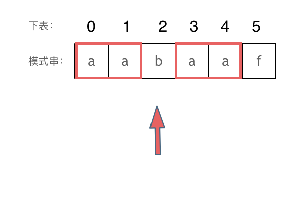

> 打基础时最好不用库函数

# 基础 KMP算法

## 什么是KMP

由这三位学者发明的：Knuth，Morris和Pratt‘

## KMP有什么用

**当出现字符串不匹配时，可以知道一部分之前已经匹配的文本内容，可以利用这些信息避免从头再去做匹配了。**

- next数组：记录已经匹配到的字符串

## 什么是前缀表

- 前缀表（prefix table），在其中表现为next数组
- 作用：**记录了模式串与主串(文本串)不匹配的时候，模式串应该从哪里开始重新匹配**
- 内容：**记录下标i之前（包括i）的字符串中，有多大长度的相同前缀后缀。**

## 最长公共前后缀？

- 前缀是指不包含最后一个字符的所有以第一个字符开头的连续子串。
- 后缀是指不包含第一个字符的所有以最后一个字符结尾的连续子串。
- 用“最长相等前后缀” 更准确一些。

## 为什么一定要用前缀表



- 前缀表具有告诉我们当前位置匹配失败，跳到之前已经匹配过的地方的能力。

##  如何计算前缀表

- 前缀表对应位置数字的含义：**下标i之前（包括i）的字符串中，有多大长度的相同前缀后缀**
- 匹配不上时，看前一位的前缀表数值，从模板串对应位置继续匹配。

## 前缀表与next数组

- next数组就是前缀表
- 有时候把前缀表统一减一（右移一位，初始位置为-1）之后作为next数组

## 时间复杂度分析

- O(n+m)
- 暴力解法O(n×m)

## 具体实现（减一不减一、匹配）

1. 初始化
2. 处理前后缀不相同的情况
3. 处理前后缀相同的情况

具体见实现strStr()

# 344.反转字符串

不要使用reverse

## C++

```c++
class Solution {
public:
    void reverseString(vector<char>& s) {
        for (int i = 0; i < s.size() / 2; i++) {
            swap(s[i], s[s.size() - i - 1]);
        }
    }
};
```

## Python

```python
class Solution:
    def reverseString(self, s: List[str]) -> None:
        left = 0
        right = len(s) - 1
        while left < right:
            s[left], s[right] = s[right], s[left]
            left += 1
            right -= 1
```

# 541. 反转字符串II

> **当需要固定规律一段一段去处理字符串的时候，要想想在在for循环的表达式上做做文章。**

## C++

```c++
class Solution {
public:
    string reverseStr(string s, int k) {
        int i = 0;
        while (i < s.size()) {
            if (i + k < s.size()) {
                reverse(s.begin() + i, s.begin() + i + k);
            } else {
                reverse(s.begin() + i, s.end());
            }
            i += 2 * k;
        }
        return s;
    }
};
```

## Python

- Written in this could be more pythonic.

```python
class Solution:
    def reverseStr(self, s: str, k: int) -> str:
        i = 0
        while i < len(s):
            s = s[:i] + s[i:i+k][::-1] + s[i+k:]
            i += 2 * k
        return s
```

# 剑指Offer 05.替换空格

- 统计空格个数
- 重新分配空间
- 从后往前双指针法遍历，遇到空格替换

## C++

- char[] 和string 的区别：
  - 在C语言中，把一个字符串存入一个数组时，也把结束符 '\0'存入数组，并以此作为该字符串是否结束的标志。
  - 在C++中，提供一个string类，string类会提供 size接口，可以用来判断string类字符串是否结束，就不用'\0'来判断是否结束。
- vector< char > 和 string 的区别：在基本操作上没有区别，但是 string提供更多的字符串处理的相关接口，例如string 重载了+，而vector却没有。想处理字符串，我们**还是会定义一个string类型**。

`s.resize(slen + count * 2);  // 重新分配空间`

```c++
class Solution {
public:
    string replaceSpace(string s) {
        int count = 0; // 统计空格个数
        int slen = s.size(); // 字符串原始长度
        for (char c : s) {
            if (c == ' ') {
                count++;
            }
        }
        s.resize(slen + count * 2);  // 重新分配空间
        for (int i = s.size() - 1, j = slen - 1; i > j; i--,j--) {
            if (s[j] == ' ') {
                s[i] = '0';
                s[--i] = '2';
                s[--i] = '%';
            } else {
                s[i] = s[j];
            }
        }
        return s;
    }
};
```

## Python

1. 掉包侠一行代码

```python
class Solution:
    def replaceSpace(self, s: str) -> str:
        return '%20'.join(s.split(' '))
```

2. 和C++类似操作

```python
class Solution:
    def replaceSpace(self, s: str) -> str:
        count = s.count(' ')
        res = list(s)
        res.extend(' ' * count * 2)
        slow = len(s) - 1
        fast = len(res) - 1
        while slow >= 0:
            if s[slow] != ' ':
                res[fast] = s[slow]
                fast -= 1
                slow -= 1
            else:
                res[fast - 2 : fast + 1] = '%20'
                fast -= 3
                slow -= 1
        return ''.join(res) 
```

# 151.翻转字符串里的单词

> 综合考察字符串操作的好题。

- 提高难度：**不要使用辅助空间，空间复杂度要求为O(1)。**
- 不要直接split成列表再倒序join，没有意义。

思路：

- 移除多余空格
- 将整个字符串反转
- 将每个单词反转

## C++

```c++
class Solution {
public:
    void reverseString(string& s, int start, int end) {
        for (int i = start, j = end; i < j; i++, j--) {
            swap(s[i], s[j]);
        }
    }

    string reverseWords(string s) {
        int slow = 0;  // 去除空格
        for (int i = 0; i < s.size(); i++) {
            if (s[i] != ' ') {
                if (slow != 0) s[slow++] = ' ';
                while (s[i] != ' ' && i < s.size()) {
                    s[slow++] = s[i++];
                }
            }
        }
        s.resize(slow);

        reverseString(s, 0, s.size() - 1);
        int start = 0;
        for (int i = 0; i <= s.size(); i++) {
            if (s[i] == ' ' || i == s.size()) {
                reverseString(s, start, i - 1);
                start = i + 1;
            }
        }
        return s;
    }
};
```

## Python

```python
# 掉包侠
class Solution:
    def reverseWords(self, s: str) -> str:
        return ' '.join(s.split()[::-1])
# C++类似方法
class Solution:
    def reverseWords(self, s: str) -> str:
        s = list(s)
        slow = 0
        i = 0
        while i < len(s):
            if s[i] != ' ':
                if slow != 0:
                    s[slow] = ' '
                    slow += 1
                while i < len(s) and s[i] != ' ':
                    s[slow] = s[i]
                    slow += 1
                    i += 1
            else:
                i += 1
        s = s[:slow]
        
        s = s[::-1]
        start = 0
        for i in range(len(s) + 1):
            if i == len(s) or s[i] == ' ':
                s = s[:start] + s[start:i][::-1] + s[i:]
                start = i + 1
        return ''.join(s)
```

# 剑指Offer58-II.左旋转字符串

只在本串上操作：

1. 反转区间为前n的子串
2. 反转区间为n到末尾的子串
3. 反转整个字符串

## C++

```c++
class Solution {
public:
    string reverseLeftWords(string s, int n) {
        reverse(s.begin(), s.begin() + n);
        reverse(s.begin() + n, s.end());
        reverse(s.begin(), s.end());
        return s;
    }
};
```

## Python

```python
class Solution:
    def reverseLeftWords(self, s: str, n: int) -> str:
        return s[n:] + s[0:n] # 一行解决
        s = s[:n][::-1] + s[n:]
        s = s[:n]+ s[n:][::-1]
        s = s[::-1]
        return s
```

# 28*. 实现 strStr()

> KMP算法：**当出现字符串不匹配时，可以记录一部分之前已经匹配的文本内容，利用这些信息避免从头再去做匹配。**

- 使用的是前缀表-1的next，若需要不-1的，给前缀末尾下标j统一+1即可（判断条件相应修改）

## C++

```c++
class Solution {
public:
    void getNext(int* next, string s) {
        int j = -1;
        next[0] = j;
        for (int i = 1; i < s.size(); i++) { // 遍历s填充next
            while (j >= 0 && s[j + 1] != s[i]) {
                j = next[j];  // 回溯相同子串继续匹配
            }
            if (s[j + 1] == s[i]) {
                j++;
            }
            next[i] = j;
        }
    }
    int strStr(string haystack, string needle) {
        if (needle.size() == 0) {  // 特殊情况
            return 0;
        }
        int next[needle.size()];
        getNext(next, needle);
        int j = -1;
        for (int i = 0; i < haystack.size(); i++) {
            while (j >= 0 && haystack[i] != needle[j + 1]) {
                j = next[j];
            }
            if (haystack[i] == needle[j + 1]) {
                j++;
            }
            if (j == needle.size() - 1) {
                return i - j;
            }
        }
        return -1;
    }
};
```

## Python

```python
class Solution:
    def strStr(self, haystack: str, needle: str) -> int:
        def getNext(s):
            next = [0] * len(s)
            j = -1
            next[0] = j
            for i in range(1, len(s)):
                while j >= 0 and s[i] != s[j + 1]:
                    j = next[j]
                if s[i] == s[j + 1]:
                    j += 1
                next[i] = j
            return next

        if len(needle) == 0:
            return 0
        next = getNext(needle)
        j = -1
        for i in range(len(haystack)):
            while j >= 0 and haystack[i] != needle[j + 1]:
                j = next[j]
            if haystack[i] == needle[j + 1]:
                j += 1
            if j == len(needle) - 1:
                return i - j
        return -1
```

# 459.重复的子字符串


思路：

1. 移动匹配

   - 两个字符串s拼接起来，掐头去尾

   - 如果在新字符串终仍然能找到s，说明一定是重复子串构成的

   - 可以调库，也可以使用kmp解决

2. kmp
   - 在由重复子串组成的字符串中，最长相等前后缀不包含的子串就是最小重复子串
   - 获取next数组
   - 判断`s.size() % (s.size() - (next[s.size() - 1] + 1)) == 0`是否成立
   - 注意同时满足`next[s.size() - 1] != -1`

## C++

```c++
class Solution {
public:
    bool repeatedSubstringPattern(string s) {
        string t = s + s;  // 自己拼接
        t.erase(t.begin());  // 掐头去尾
        t.erase(t.end() - 1);
        if (t.find(s) != s.npos) {
            return true;
        } else {
            return false;
        }
    }
};
```

```c++
class Solution {
public:
    void getNext(int* next, string s) {
        int j = -1;
        next[0] = j;
        for (int i = 1; i < s.size(); i++) { // 遍历s填充next
            while (j >= 0 && s[j + 1] != s[i]) {
                j = next[j];  // 回溯相同子串继续匹配
            }
            if (s[j + 1] == s[i]) {
                j++;
            }
            next[i] = j;
        }
    }
    bool repeatedSubstringPattern(string s) {
        if (s.size() == 0) {  // 特殊情况
            return false;
        }
        int next[s.size()];
        getNext(next, s);
        if (next[s.size() - 1] != -1 && s.size() % (s.size() - (next[s.size() - 1] + 1)) == 0) {
            return true;
        } else {
            return false;
        }
    }
};
```

## Python

```python
class Solution:
    def repeatedSubstringPattern(self, s: str) -> bool:
        t = s + s
        t = t[1:-1]
        if t.find(s) != -1:
            return True
        else:
            return False
```

```python
class Solution:
    def repeatedSubstringPattern(self, s: str) -> bool:
        def getNext(s):
            next = [0] * len(s)
            j = -1
            next[0] = j
            for i in range(1, len(s)):
                while j >= 0 and s[i] != s[j + 1]:
                    j = next[j]
                if s[i] == s[j + 1]:
                    j += 1
                next[i] = j
            return next
        if len(s) == 0:
            return False
        next = getNext(s)
        if next[-1] != -1 and len(s) % (len(s) - (next[-1] + 1)) == 0:
            return True
        return False
```

