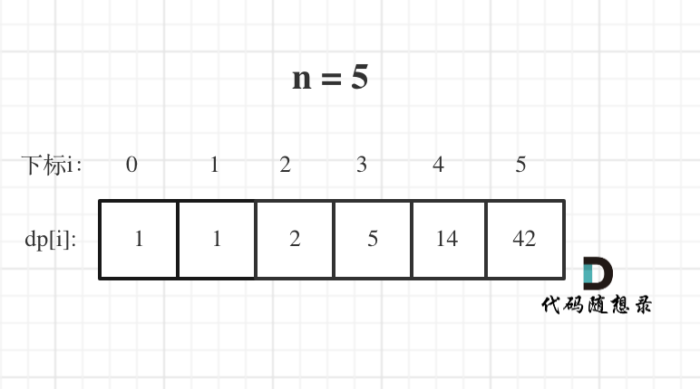

# 理论基础

> Dynamic Programming，简称DP

什么是动态规划？

- 每一个状态一定是**由上一个状态推导出来的**
  - 这一点就区分于贪心，贪心没有状态推导，而是从局部直接选最优的

- 贪心解决不了动态规划的问题

**解题步骤**：（五部曲）

1. 确定dp数组（dp table）以及下标的含义
2. 确定递推公式
3. dp数组如何初始化
4. 确定遍历顺序
5. 举例推导dp数组

如何debug？

- 写代码之前一定要把状态转移在dp数组的上具体情况模拟一遍
- **找问题的最好方式就是把dp数组打印出来，看看究竟是不是按照自己思路推导的**
  - 和推导一样：递归公式、初始化或者遍历顺序有问题
  - 和推导不一样：代码实现细节有问题

# 509. 斐波那契数

## 动态规划

五部曲：

1. dp数组含义：第i个数的斐波那契数值是dp[i]
2. 递推公式：dp[i] = dp[i - 1] + dp[i - 2]
3. 初始化：dp[0] = 0; dp[1] = 1;
4. 遍历顺序：从前往后
5. 举例推导：0, 1, 1, 2, 3, 5, 8, 13, 21, 34, 55...

```c++
class Solution {
public:
    int fib(int n) {
        if (n <= 1) return n;
        vector<int> dp(2, 0);
        dp[1] = 1;
        for (int i = 2; i <= n; i++) {
            int sum = dp[0] + dp[1];
            dp[0] = dp[1];
            dp[1] = sum;
        }
        return dp[1];
    }
};
```

```python
class Solution:
    def fib(self, n: int) -> int:
        if n <= 0: return n
        dp = [0, 1]
        for _ in range(2, n + 1):
            sum = dp[0] + dp[1]
            dp[0] = dp[1]
            dp[1] = sum
        return dp[1]
```

- 时间复杂度：O(n)
- 空间复杂度：O(1)

## 递归

```c++
class Solution {
public:
    int fib(int n) {
        if (n <= 1) return n;
        return fib(n - 1) + fib(n - 2);
    }
};
```

```python
class Solution:
    def fib(self, n: int) -> int:
        if n <= 1: return n
        return self.fib(n - 1) + self.fib(n - 2)
```

- 时间复杂度：O(2^n)

- 空间复杂度：O(n)

# 70. 爬楼梯

五部曲：

1. dp数组含义：爬到第i层楼梯，有dp[i]种方法
2. 递推公式：dp[i] = dp[i - 1] + dp[i - 2]
3. 初始化：dp[1] = 1，dp[2] = 2（题目没要求0的情况，可以默认设置dp[0] = 1，dp[1] = 1）
4. 遍历顺序：从前向后
5. 举例：x, 1, 2, 3, 5, 8, 13, 21...——其实就是斐波那契

```c++
class Solution {
public:
    int climbStairs(int n) {
        if (n <= 2) return n;
        vector<int> dp(n + 1);
        dp[1] = 1;
        dp[2] = 2;
        for (int i = 3; i <= n; i++) {
            dp[i] = dp[i - 1] + dp[i - 2];
        }
        return dp[n];
    }
};
```

省空间版：

```c++
class Solution {
public:
    int climbStairs(int n) {
        if (n <= 2) return n;
        vector<int> dp(3);
        dp[0] = 1;
        dp[1] = 2;
        for (int i = 3; i <= n; i++) {
            int sum = dp[0] + dp[1];
            dp[0] = dp[1];
            dp[1] = sum;
        }
        return dp[1];
    }
};
```

```python
class Solution:
    def climbStairs(self, n: int) -> int:
        if n <= 2: return n
        dp = [1, 2]
        for _ in range(3, n + 1):
            sum = dp[0] + dp[1]
            dp[0] = dp[1]
            dp[1] = sum
        return dp[1]
```

## 拓展

一步可以爬m个台阶，一共n级，有多少种方法？

```c++
class Solution {
public:
    int climbStairs(int n) {
        vector<int> dp(n + 1, 0);
        dp[0] = 1;
        for (int i = 1; i <= n; i++) {
            for (int j = 1; j <= m; j++) { // 把m换成2，就可以AC爬楼梯这道题
                if (i - j >= 0) dp[i] += dp[i - j];
            }
        }
        return dp[n];
    }
};
```

# 746. 使用最小花费爬楼梯

1. dp数组含义：到达第i台阶所花费的最少体力为dp[i]
2. 递推公式：dp[i] = min(dp[i - 1] + cost[i - 1], dp[i - 2] + cost[i - 2]);
3. 初始化：dp[0] = 0，dp[1] = 0;
4. 遍历顺序：从前往后
5. 举例推导：

**用dp数组的话，要比cost数组大1（楼顶）**


```c++
class Solution {
public:
    int minCostClimbingStairs(vector<int>& cost) {
        int dp[2] = {0, 0};
        for (int i = 2; i <= cost.size(); i++) {
            int dpi = min(dp[0] + cost[i - 2], dp[1] + cost[i - 1]);
            dp[0] = dp[1];
            dp[1] = dpi;
        }
        return dp[1];
    }
};
```

```python
class Solution:
    def minCostClimbingStairs(self, cost: List[int]) -> int:
        dp = [0, 0]
        for i in range(2, len(cost) + 1):
            dpi = min(dp[0] + cost[i - 2], dp[1] + cost[i - 1])
            dp[0] = dp[1]
            dp[1] = dpi
        return dp[1]
```

# 62.不同路径

## 深度优先搜索x

```c++
class Solution {
private:
    int dfs(int i, int j, int m, int n) {
        if (i > m || j > n) return 0; // 越界了
        if (i == m && j == n) return 1; // 找到一种方法，相当于找到了叶子节点
        return dfs(i + 1, j, m, n) + dfs(i, j + 1, m, n);
    }
public:
    int uniquePaths(int m, int n) {
        return dfs(1, 1, m, n);
    }
};
```

要遍历整个二叉树，这棵树的深度m+n-1，时间复杂度为$O(2^{(m + n - 1)} - 1)$，直接超时

## 动态规划

1. dp含义：dp\[i]\[j]表示从（0 ，0）出发，到(i, j) 有dp\[i]\[j]条不同的路径。
2. 递推公式：`dp[i][j] =  dp[i - 1][j] + dp[i][j - 1]`
3. 初始化：`dp[i][0]`和`dp[0][j]`都是1
4. 遍历顺序：从左到右一层一层遍历就可以——左到右、上到下
5. 手动推导


```c++
class Solution {
public:
    int uniquePaths(int m, int n) {
        vector<vector<int>> dp(m, vector<int>(n, 1));  // 上左边缘初始化为1
        for (int i = 1; i < m; i++) {
            for (int j = 1; j < n; j++) {
                dp[i][j] = dp[i - 1][j] + dp[i][j - 1];
            }
        }
        return dp[m - 1][n - 1];
    }
};
```

省空间版：

```c++
class Solution {
public:
    int uniquePaths(int m, int n) {
        vector<int> dp(n, 1);  // 上边缘初始化为1
        for (int i = 1; i < m; i++) {
            for (int j = 1; j < n; j++) {
                dp[j] = dp[j] + dp[j - 1];
            }
        }
        return dp[n - 1];
    }
};
```

```python
class Solution:
    def uniquePaths(self, m: int, n: int) -> int:
        dp = [1] * n
        for _ in range(1, m):
            for j in range(1, n):
                dp[j] = dp[j - 1] + dp[j]
        return dp[n - 1]
```

- 时间复杂度：O(m × n)
- 空间复杂度：O(n)

## 数论方法*

- 可以转化为，给你m + n - 2个不同的数，随便取m - 1个数，有几种取法
- 转变为求组和问题
- **要防止int相乘溢出**

```c++
class Solution {
public:
    int uniquePaths(int m, int n) {
        long long numerator = 1; // 分子
        int denominator = m - 1; // 分母
        int count = m - 1;
        int t = m + n - 2;
        while (count--) {
            numerator *= (t--);
            while (denominator != 0 && numerator % denominator == 0) {
                numerator /= denominator;
                denominator--;
            }
        }
        return numerator;
    }
};
```

```python
class Solution:
    def uniquePaths(self, m: int, n: int) -> int:
        numerator = 1
        denominator = m - 1
        count = m - 1
        t = m + n - 2
        while count:
            numerator *= t
            t -= 1
            while denominator != 0 and numerator % denominator == 0:
                numerator /= denominator
                denominator -= 1
            count -= 1
        return int(numerator)
```

- 时间复杂度：O(m)
- 空间复杂度：O(1)

# 63. 不同路径 II

> 有障碍的话，其实就是标记对应的dp table（dp数组）保持初始值(0)就可以了。

1. dp数组定义：表示从（0 ，0）出发，到(i, j) 有dp[i][j]条不同的路径。
2. 递推公式：`dp[i][j] =  dp[i - 1][j] + dp[i][j - 1]`
   - (i, j)如果就是障碍的话应该就保持初始状态（初始状态为0）
3. 初始化：`dp[i][0]`、`dp[0][j]`一定为1，**障碍之后（包括障碍）都是0**
4. 遍历顺序：左到右上到下
5. 举例推导：略

一定要记得**特殊情况的处理**！

直接给出省空间版：

```c++
class Solution {
public:
    int uniquePathsWithObstacles(vector<vector<int>>& obstacleGrid) {
        if (obstacleGrid[0][0] == 1)  // 特殊情况
            return 0;
        vector<int> dp(obstacleGrid[0].size(), 0);
        for (int i = 0; i < dp.size() && obstacleGrid[0][i] != 1; i++) {
            dp[i] = 1;
        }
        for (int i = 1; i < obstacleGrid.size(); i++) {
            for (int j = 0; j < dp.size(); j++) {
                if (obstacleGrid[i][j] == 1) {
                    dp[j] = 0;
                } else if (j != 0) {  // 不处理第一个
                    dp[j] = dp[j] + dp[j - 1];
                }
            }
        }
        return dp.back();
    }
};
```

```python
class Solution:
    def uniquePathsWithObstacles(self, obstacleGrid: List[List[int]]) -> int:
        if obstacleGrid[0][0] == 1: return 0
        dp = [0] * len(obstacleGrid[0])
        for i in range(len(obstacleGrid[0])):
            if obstacleGrid[0][i] == 0:
                dp[i] = 1
            else:
                break
        for i in range(1, len(obstacleGrid)):
            for j in range(len(obstacleGrid[0])):
                if obstacleGrid[i][j] == 1:
                    dp[j] = 0
                elif j != 0:
                    dp[j] = dp[j] + dp[j - 1]
        return dp[-1]

```

# 343. 整数拆分

## 动态规划

1. dp数组：分拆数字i，可以得到的最大乘积为dp[i]
2. 递推公式：dp[i] = max(dp[i], max((i - j) * j, dp[i - j] * j)) = max({dp[i], (i - j) * j, dp[i - j] * j});——拆成两个和拆成多个相比较，最后取最大的，所以有dp[i]。
3. 初始化：dp[2] = 1——不需要初始化dp[0]、dp[1]
4. 遍历顺序：从前往后。 j 遍历，只需要遍历到 n/2 就可以，后面就没有必要遍历了，一定不是最大值
5. 举例推导：


```c++
class Solution {
public:
    int integerBreak(int n) {
        vector<int> dp(n + 1);
        dp[2] = 1;
        for (int i = 3; i <= n; i++) {
            for (int j = 1; j <= i / 2; j++) {
                dp[i] = max(dp[i], max((i - j) * j, dp[i - j] * j));
            }
        }
        return dp[n];
    }
};
```

```python
class Solution:
    def integerBreak(self, n: int) -> int:
        dp = [0] * (n + 1)
        dp[2] = 1
        for i in range(3, n + 1):
            for j in range(1, i // 2 + 1):  # python range左闭右开，记得+1
                dp[i] = max(dp[i], (i - j) * j, dp[i - j] * j)
        return dp[n]
```

## 贪心

- 每次拆成n个3，如果剩下是4，则保留4，然后相乘

```c++
class Solution {
public:
    int integerBreak(int n) {
        if (n == 2) return 1;
        if (n == 3) return 2;
        if (n == 4) return 4;
        int res = 1;
        while (n > 4) {
            res *= 3;
            n -= 3;
        }
        res *= n;
        return res;
    }
};
```

```python
class Solution:
    def integerBreak(self, n: int) -> int:
        if n == 2: return 1
        if n == 3: return 2
        if n == 4: return 4
        res = 1
        while n > 4:
            res *= 3
            n -= 3
        res *= n
        return res
```

# 96.不同的二叉搜索树

1. dp数组：i个节点组成的二叉搜索树的个数为dp[i]
2. 递推公式：从1到i遍历j——dp[i] += dp[j - 1] * dp[i - j];
3. 初始化：dp[0] = 1
4. 遍历顺序：从前往后、每次迭代从1到i
5. 举例：



```c++
class Solution {
public:
    int numTrees(int n) {
        vector<int> dp(n + 1);
        dp[0] = 1;  // 初始化
        for (int i = 1; i <= n; i++) {
            for (int j = 1; j <= i; j++) {
                dp[i] += dp[i-j] * dp[j - 1];
            }
        }
        return dp[n];
    }
};
```

```python
class Solution:
    def numTrees(self, n: int) -> int:
        dp = [0] * (n + 1)
        dp[0] = 1
        for i in range(1, n + 1):
            for j in range(1, i + 1):
                dp[i] += dp[j - 1] * dp[i - j]
        return dp[n]
```

