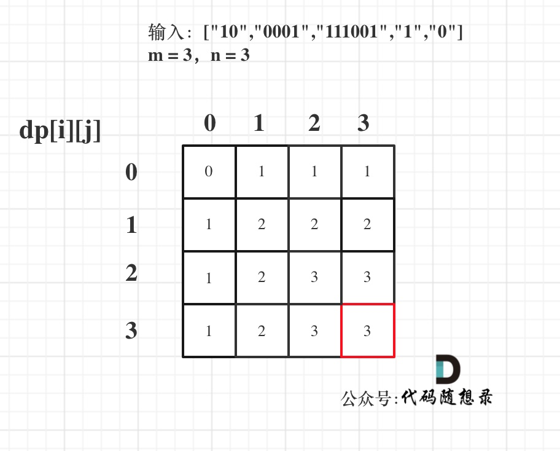

# 0-1背包

## 基础知识

定义：有n件物品和一个最多能背重量为w 的背包。第i件物品的重量是weight[i]，得到的价值是value[i] 。**每件物品只能用一次**，求解将哪些物品装入背包里物品价值总和最大。

——暴力的解法是指数级别的时间复杂度。进而才需要动态规划的解法来进行优化

### 二维dp数组

- dp数组：dp\[i]\[j] 表示从下标为[0-i]的物品里任意取，放进容量为j的背包，价值总和最大是多少。
- 递推公式：
  - 总量能放下：`dp[i][j] = max(dp[i - 1][j], dp[i - 1][j - weight[i]] + value[i]);`
  - 总量放不下：`dp[i][j] = dp[i - 1][j]`
- 初始化：
  - `dp[i][0] = 0`
  - ` j < weight[0]`时，`dp[0][j] = 0`
  - ` j > weight[0]`时，`dp[0][j] = value[0]`
- 遍历顺序：两种方法（从左往右、从上往下即可）
  - 先遍历物品，再遍历背包——这个顺序更好理解（按层）
  - 先遍历背包，再遍历物品——（按列）

- 举例：略

```c++
void test_2_wei_bag_problem1() {
    vector<int> weight = {1, 3, 4};
    vector<int> value = {15, 20, 30};
    int bagweight = 4;

    // 二维数组
    vector<vector<int>> dp(weight.size(), vector<int>(bagweight + 1, 0));

    // 初始化
    for (int j = weight[0]; j <= bagweight; j++) {
        dp[0][j] = value[0];
    }

    // weight数组的大小 就是物品个数
    for(int i = 1; i < weight.size(); i++) { // 遍历物品
        for(int j = 0; j <= bagweight; j++) { // 遍历背包容量
            if (j < weight[i]) dp[i][j] = dp[i - 1][j];
            else dp[i][j] = max(dp[i - 1][j], dp[i - 1][j - weight[i]] + value[i]);

        }
    }

    cout << dp[weight.size() - 1][bagweight] << endl;
}

int main() {
    test_2_wei_bag_problem1();
}
```

```python
def test_2_wei_bag_problem1(bag_size, weight, value) -> int: 
	rows, cols = len(weight), bag_size + 1
	dp = [[0 for _ in range(cols)] for _ in range(rows)]
    
	# 初始化dp数组. 
	for i in range(rows): 
		dp[i][0] = 0
	first_item_weight, first_item_value = weight[0], value[0]
	for j in range(1, cols): 	
		if first_item_weight <= j: 
			dp[0][j] = first_item_value

	# 更新dp数组: 先遍历物品, 再遍历背包. 
	for i in range(1, len(weight)): 
		cur_weight, cur_val = weight[i], value[i]
		for j in range(1, cols): 
			if cur_weight > j: # 说明背包装不下当前物品. 
				dp[i][j] = dp[i - 1][j] # 所以不装当前物品. 
			else: 
				# 定义dp数组: dp[i][j] 前i个物品里，放进容量为j的背包，价值总和最大是多少。
				dp[i][j] = max(dp[i - 1][j], dp[i - 1][j - cur_weight]+ cur_val)

	print(dp)


if __name__ == "__main__": 
	bag_size = 4
	weight = [1, 3, 4]
	value = [15, 20, 30]
	test_2_wei_bag_problem1(bag_size, weight, value)
```

### 滚动数组

- 利用状态压缩，**把dp[i - 1]那一层拷贝到dp[i]上**，递推公式变为：`dp[i][j] = max(dp[i][j], dp[i][j - weight[i]] + value[i]);`

五部曲：

1. dp数组：dp[j]表示：容量为j的背包，所背的物品价值可以最大为dp[j]
2. 递推公式：遍历所有物品i
   - 物品重量大于背包总重：`dp[j] = dp[j];(即continue，或者直接从j等于当前物品重量处遍历)`
   - 物品重量小于背包总重：`dp[j] = max(dp[j], dp[j - weight[i]] + value[i]);`

3. 初始化：dp[0] = 0；如果题目给的价值都是正整数那么非0下标都初始化为0就可以了。
4. 遍历顺序：
   - 先遍历物品再遍历背包
   - 背包是从大到小遍历：**倒序遍历保证物品i只被放入一次**（正序遍历由于要使用dp[j - weight[i]]，而前序计算它的时候可能已经放了这个物品，造成重复放入）
   - **不可以先遍历背包容量嵌套遍历物品**：每个dp[j]就只会放入一个物品（最后一个遍历的物品）

5. 举例：略

```c++
void test_1_wei_bag_problem() {
    vector<int> weight = {1, 3, 4};
    vector<int> value = {15, 20, 30};
    int bagWeight = 4;

    // 初始化
    vector<int> dp(bagWeight + 1, 0);
    for(int i = 0; i < weight.size(); i++) { // 遍历物品
        for(int j = bagWeight; j >= weight[i]; j--) { // 遍历背包容量
            dp[j] = max(dp[j], dp[j - weight[i]] + value[i]);
        }
    }
    cout << dp[bagWeight] << endl;
}

int main() {
    test_1_wei_bag_problem();
}
```

```python
def test_1_wei_bag_problem():
    weight = [1, 3, 4]
    value = [15, 20, 30]
    bag_weight = 4
    # 初始化: 全为0
    dp = [0] * (bag_weight + 1)

    # 先遍历物品, 再遍历背包容量
    for i in range(len(weight)):
        for j in range(bag_weight, weight[i] - 1, -1):
            # 递归公式
            dp[j] = max(dp[j], dp[j - weight[i]] + value[i])

    print(dp)

test_1_wei_bag_problem()
```

## 416. 分割等和子集

- 背包的体积为sum / 2
- 背包要放入的商品（集合里的元素）重量为 元素的数值，价值也为元素的数值
- 背包如果正好装满，说明找到了总和为 sum / 2 的子集。
- 背包中每一个元素是不可重复放入。

五部曲：

1. dp数组：dp[j]表示 背包总容量（所能装的总重量）是j，放进物品后，背的最大重量为dp[j]
   - 当 dp[target] == target 的时候，背包就装满了。

2. 递推公式：dp[j] = max(dp[j], dp[j - nums[i]] + nums[i]);
3. 初始化：
   - dp[0] = 0
   - 其他的初始值也为0，因为都是正整数

4. 遍历顺序：
   - 先遍历物品
   - 再反向遍历背包容量

5. 举例：


```c++
class Solution {
public:
    bool canPartition(vector<int>& nums) {
        int sum = 0;
        for (int i = 0; i < nums.size(); i++) {
            sum += nums[i];
        }
        if (sum % 2) return false;  // 和为奇数肯定不行
        int target = sum / 2;
        vector<int> dp(target + 1, 0);  // dp数组
        for (int i = 0; i < nums.size(); i++) {
            for (int j = target; j >= nums[i]; j--) {
                dp[j] = max(dp[j], dp[j - nums[i]] + nums[i]);
            }
        }
        if (dp[target] == target) return true;
        return false;
    }
};
```

```python
class Solution:
    def canPartition(self, nums: List[int]) -> bool:
        sumNum = sum(nums)
        if sumNum % 2: return False
        target = sumNum // 2
        dp = [0] * (target + 1)
        for i in range(len(nums)):
            for j in range(target, nums[i] - 1, -1):
                dp[j] = max(dp[j], dp[j - nums[i]] + nums[i])
        if dp[target] == target: return True
        return False
```

## 1049*. 最后一块石头的重量 II

- 尽量让石头分成重量相同的两堆，相撞之后剩下的石头最小

为什么呢？

- 两个石子相撞，大的对总结果是增加作用（+），小的是减少作用（-）
- 合并后的石子也加入其中，整体是对大和小石子的互换——转化为为石子添加正负号的问题
- 要想最终结果最小，就要把石子尽可能地按重量等分——转化为上一题
- 进而使用0-1背包问题求解——价值和重量相等

五部曲

1. dp[i]含义：dp[j]表示容量为j的背包，最多可以背最大重量为dp[j]
2. 递推公式：dp[j] = max(dp[j], dp[j - stones[i]] + stones[i]);
3. 初始化：同上，初始化为0
4. 遍历顺序：外层遍历物品、内层反向遍历背包容量
5. 举例（略）

```c++
class Solution {
public:
    int lastStoneWeightII(vector<int>& stones) {
        int sum = 0;
        for (int stone : stones) {
            sum += stone;
        }
        int target = sum / 2;
        vector<int> dp(target + 1, 0);
        for (int i = 0; i < stones.size(); i++) {
            for (int j = target; j >= stones[i]; j--) {
                dp[j] = max(dp[j], dp[j - stones[i]] + stones[i]);
            }
        }
        return sum - dp[target] - dp[target];
    }
};
```

```python
class Solution:
    def lastStoneWeightII(self, stones: List[int]) -> int:
        sumStones = sum(stones)
        target = sumStones // 2
        dp = [0] * (target + 1)
        for i in range(len(stones)):
            for j in range(target, stones[i] - 1, -1):
                dp[j] = max(dp[j], dp[j - stones[i]] + stones[i])
        return sumStones - dp[target] - dp[target]
```

——上一题相当于是求背包是否正好装满，而本题是求背包最多能装多少

## 494**. 目标和

- left组合 + right组合 = sum
- left组合 - right组合 = target
- 推导出：**left = (target + sum)/2**

- target是固定的，sum是固定的，left就可以求出来。

——此时问题就是在集合nums中找出和为left的组合

- **回溯法会超时**：可以使用res二维数组+path一维数组记录所有可能，找和等于left的组合，暴搜

- 0-1背包法：**装满容量为x的背包，有几种方法**
  - 本身target + sum为奇数，找不到，直接返回0
  - |target| > sum，也找不到，直接返回0

五部曲：

1. dp数组：dp[j] 表示：填满j（包括j）这么大容积的包，**有dp[j]种方法**
2. 递推公式：**`dp[j] += dp[j - nums[i]]`求组合类问题的公式，都是类似这种**
3. 初始化：**dp[0] = 1（循环的开始）**，其他下标对应的数值初始化为0
4. 遍历顺序：nums放在外循环，target在内循环，且内循环倒序
5. 举例：略

```c++
class Solution {
public:
    int findTargetSumWays(vector<int>& nums, int target) {
        int sum = 0;
        for (int i = 0; i < nums.size(); i++) {
            sum += nums[i];
        }
        if (abs(target) > sum) return 0;
        if ((target + sum) % 2) return 0;
        int bagSize = (target + sum) / 2;
        vector<int> dp(bagSize + 1, 0);
        dp[0] = 1;  // 初始化
        for (int i = 0; i < nums.size(); i++) {
            for (int j = bagSize; j >= nums[i]; j--) {
                dp[j] += dp[j - nums[i]];
            }
        }
        return dp[bagSize];
    }
};
```

```python
class Solution:
    def findTargetSumWays(self, nums: List[int], target: int) -> int:
        sumNum = sum(nums)
        if abs(target) > sumNum: return 0
        if (target + sumNum) % 2: return 0
        bagSize = (target + sumNum) // 2
        dp = [0] * (bagSize + 1)
        dp[0] = 1
        for i in range(len(nums)):
            for j in range(bagSize, nums[i] - 1, -1):
                dp[j] += dp[j - nums[i]]
        return dp[bagSize]
```

## 474*.一和零

- **本题中strs 数组里的元素就是物品，每个物品都是一个**

- **而m 和 n相当于是一个背包，两个维度的背包**。

五部曲：

1. dp数组：最多有i个0和j个1的strs的最大子集的大小为`dp[i][j]`。
2. 递推公式：`dp[i][j] = max(dp[i][j], dp[i - zeroNum][j - oneNum] + 1);`
3. 初始化：全部为0即可
4. 遍历顺序：外层for循环遍历物品，内层for循环遍历背包容量且从后向前遍历
   - 物品就是strs里的字符串，背包容量就是题目描述中的m和n

5. 举例：




## 总结

- 纯 0 - 1 背包(opens new window) 是求 给定背包容量 装满背包 的最大价值是多少。

- 分割等和子集(opens new window) 是求 给定背包容量，能不能装满这个背包。

- 最后一块石头的重量 II(opens new window) 是求 给定背包容量，尽可能装，最多能装多少

- 目标和(opens new window) 是求 给定背包容量，装满背包有多少种方法。
- 一和零是求 给定背包容量，装满背包最多有多少个物品。