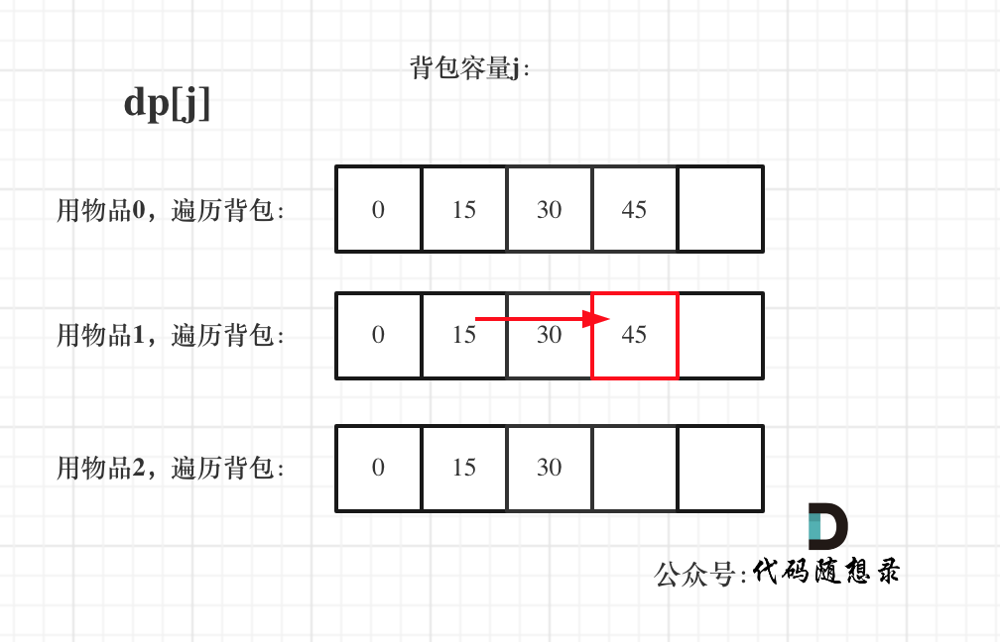
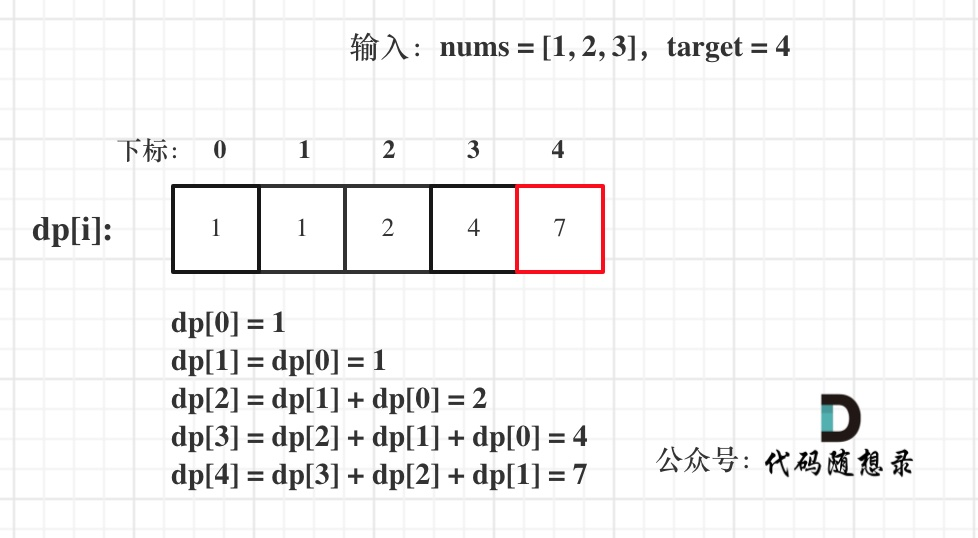

# 0-1背包

## 基础知识

定义：有n件物品和一个最多能背重量为w 的背包。第i件物品的重量是weight[i]，得到的价值是value[i] 。**每件物品只能用一次**，求解将哪些物品装入背包里物品价值总和最大。

——暴力的解法是指数级别的时间复杂度。进而才需要动态规划的解法来进行优化

### 二维dp数组

- dp数组：dp\[i]\[j] 表示从下标为[0-i]的物品里任意取，放进容量为j的背包，价值总和最大是多少。
- 递推公式：
  - 总量能放下：`dp[i][j] = max(dp[i - 1][j], dp[i - 1][j - weight[i]] + value[i]);`
  - 总量放不下：`dp[i][j] = dp[i - 1][j]`
- 初始化：
  - `dp[i][0] = 0`
  - ` j < weight[0]`时，`dp[0][j] = 0`
  - ` j > weight[0]`时，`dp[0][j] = value[0]`
- 遍历顺序：两种方法（从左往右、从上往下即可）
  - 先遍历物品，再遍历背包——这个顺序更好理解（按层）
  - 先遍历背包，再遍历物品——（按列）

- 举例：略

```c++
void test_2_wei_bag_problem1() {
    vector<int> weight = {1, 3, 4};
    vector<int> value = {15, 20, 30};
    int bagweight = 4;

    // 二维数组
    vector<vector<int>> dp(weight.size(), vector<int>(bagweight + 1, 0));

    // 初始化
    for (int j = weight[0]; j <= bagweight; j++) {
        dp[0][j] = value[0];
    }

    // weight数组的大小 就是物品个数
    for(int i = 1; i < weight.size(); i++) { // 遍历物品
        for(int j = 0; j <= bagweight; j++) { // 遍历背包容量
            if (j < weight[i]) dp[i][j] = dp[i - 1][j];
            else dp[i][j] = max(dp[i - 1][j], dp[i - 1][j - weight[i]] + value[i]);

        }
    }

    cout << dp[weight.size() - 1][bagweight] << endl;
}

int main() {
    test_2_wei_bag_problem1();
}
```

```python
def test_2_wei_bag_problem1(bag_size, weight, value) -> int: 
	rows, cols = len(weight), bag_size + 1
	dp = [[0 for _ in range(cols)] for _ in range(rows)]
    
	# 初始化dp数组. 
	for i in range(rows): 
		dp[i][0] = 0
	first_item_weight, first_item_value = weight[0], value[0]
	for j in range(1, cols): 	
		if first_item_weight <= j: 
			dp[0][j] = first_item_value

	# 更新dp数组: 先遍历物品, 再遍历背包. 
	for i in range(1, len(weight)): 
		cur_weight, cur_val = weight[i], value[i]
		for j in range(1, cols): 
			if cur_weight > j: # 说明背包装不下当前物品. 
				dp[i][j] = dp[i - 1][j] # 所以不装当前物品. 
			else: 
				# 定义dp数组: dp[i][j] 前i个物品里，放进容量为j的背包，价值总和最大是多少。
				dp[i][j] = max(dp[i - 1][j], dp[i - 1][j - cur_weight]+ cur_val)

	print(dp)


if __name__ == "__main__": 
	bag_size = 4
	weight = [1, 3, 4]
	value = [15, 20, 30]
	test_2_wei_bag_problem1(bag_size, weight, value)
```

### 滚动数组

- 利用状态压缩，**把dp[i - 1]那一层拷贝到dp[i]上**，递推公式变为：`dp[i][j] = max(dp[i][j], dp[i][j - weight[i]] + value[i]);`

五部曲：

1. dp数组：dp[j]表示：容量为j的背包，所背的物品价值可以最大为dp[j]
2. 递推公式：遍历所有物品i
   - 物品重量大于背包总重：`dp[j] = dp[j];(即continue，或者直接从j等于当前物品重量处遍历)`
   - 物品重量小于背包总重：`dp[j] = max(dp[j], dp[j - weight[i]] + value[i]);`

3. 初始化：dp[0] = 0；如果题目给的价值都是正整数那么非0下标都初始化为0就可以了。
4. 遍历顺序：
   - 先遍历物品再遍历背包
   - 背包是从大到小遍历：**倒序遍历保证物品i只被放入一次**（正序遍历由于要使用dp[j - weight[i]]，而前序计算它的时候可能已经放了这个物品，造成重复放入）
   - **不可以先遍历背包容量嵌套遍历物品**：每个dp[j]就只会放入一个物品（最后一个遍历的物品）

5. 举例：略

```c++
void test_1_wei_bag_problem() {
    vector<int> weight = {1, 3, 4};
    vector<int> value = {15, 20, 30};
    int bagWeight = 4;

    // 初始化
    vector<int> dp(bagWeight + 1, 0);
    for(int i = 0; i < weight.size(); i++) { // 遍历物品
        for(int j = bagWeight; j >= weight[i]; j--) { // 遍历背包容量
            dp[j] = max(dp[j], dp[j - weight[i]] + value[i]);
        }
    }
    cout << dp[bagWeight] << endl;
}

int main() {
    test_1_wei_bag_problem();
}
```

```python
def test_1_wei_bag_problem():
    weight = [1, 3, 4]
    value = [15, 20, 30]
    bag_weight = 4
    # 初始化: 全为0
    dp = [0] * (bag_weight + 1)

    # 先遍历物品, 再遍历背包容量
    for i in range(len(weight)):
        for j in range(bag_weight, weight[i] - 1, -1):
            # 递归公式
            dp[j] = max(dp[j], dp[j - weight[i]] + value[i])

    print(dp)

test_1_wei_bag_problem()
```

## 416. 分割等和子集

- 背包的体积为sum / 2
- 背包要放入的商品（集合里的元素）重量为 元素的数值，价值也为元素的数值
- 背包如果正好装满，说明找到了总和为 sum / 2 的子集。
- 背包中每一个元素是不可重复放入。

五部曲：

1. dp数组：dp[j]表示 背包总容量（所能装的总重量）是j，放进物品后，背的最大重量为dp[j]
   - 当 dp[target] == target 的时候，背包就装满了。

2. 递推公式：dp[j] = max(dp[j], dp[j - nums[i]] + nums[i]);
3. 初始化：
   - dp[0] = 0
   - 其他的初始值也为0，因为都是正整数

4. 遍历顺序：
   - 先遍历物品
   - 再反向遍历背包容量

5. 举例：


```c++
class Solution {
public:
    bool canPartition(vector<int>& nums) {
        int sum = 0;
        for (int i = 0; i < nums.size(); i++) {
            sum += nums[i];
        }
        if (sum % 2) return false;  // 和为奇数肯定不行
        int target = sum / 2;
        vector<int> dp(target + 1, 0);  // dp数组
        for (int i = 0; i < nums.size(); i++) {
            for (int j = target; j >= nums[i]; j--) {
                dp[j] = max(dp[j], dp[j - nums[i]] + nums[i]);
            }
        }
        if (dp[target] == target) return true;
        return false;
    }
};
```

```python
class Solution:
    def canPartition(self, nums: List[int]) -> bool:
        sumNum = sum(nums)
        if sumNum % 2: return False
        target = sumNum // 2
        dp = [0] * (target + 1)
        for i in range(len(nums)):
            for j in range(target, nums[i] - 1, -1):
                dp[j] = max(dp[j], dp[j - nums[i]] + nums[i])
        if dp[target] == target: return True
        return False
```

## 1049*. 最后一块石头的重量 II

- 尽量让石头分成重量相同的两堆，相撞之后剩下的石头最小

为什么呢？

- 两个石子相撞，大的对总结果是增加作用（+），小的是减少作用（-）
- 合并后的石子也加入其中，整体是对大和小石子的互换——转化为为石子添加正负号的问题
- 要想最终结果最小，就要把石子尽可能地按重量等分——转化为上一题
- 进而使用0-1背包问题求解——价值和重量相等

五部曲

1. dp[i]含义：dp[j]表示容量为j的背包，最多可以背最大重量为dp[j]
2. 递推公式：dp[j] = max(dp[j], dp[j - stones[i]] + stones[i]);
3. 初始化：同上，初始化为0
4. 遍历顺序：外层遍历物品、内层反向遍历背包容量
5. 举例（略）

```c++
class Solution {
public:
    int lastStoneWeightII(vector<int>& stones) {
        int sum = 0;
        for (int stone : stones) {
            sum += stone;
        }
        int target = sum / 2;
        vector<int> dp(target + 1, 0);
        for (int i = 0; i < stones.size(); i++) {
            for (int j = target; j >= stones[i]; j--) {
                dp[j] = max(dp[j], dp[j - stones[i]] + stones[i]);
            }
        }
        return sum - dp[target] - dp[target];
    }
};
```

```python
class Solution:
    def lastStoneWeightII(self, stones: List[int]) -> int:
        sumStones = sum(stones)
        target = sumStones // 2
        dp = [0] * (target + 1)
        for i in range(len(stones)):
            for j in range(target, stones[i] - 1, -1):
                dp[j] = max(dp[j], dp[j - stones[i]] + stones[i])
        return sumStones - dp[target] - dp[target]
```

——上一题相当于是求背包是否正好装满，而本题是求背包最多能装多少

## 494**. 目标和

- left组合 + right组合 = sum
- left组合 - right组合 = target
- 推导出：**left = (target + sum)/2**

- target是固定的，sum是固定的，left就可以求出来。

——此时问题就是在集合nums中找出和为left的组合

- **回溯法会超时**：可以使用res二维数组+path一维数组记录所有可能，找和等于left的组合，暴搜

- 0-1背包法：**装满容量为x的背包，有几种方法**
  - 本身target + sum为奇数，找不到，直接返回0
  - |target| > sum，也找不到，直接返回0

五部曲：

1. dp数组：dp[j] 表示：填满j（包括j）这么大容积的包，**有dp[j]种方法**
2. 递推公式：**`dp[j] += dp[j - nums[i]]`求组合类问题的公式，都是类似这种**
3. 初始化：**dp[0] = 1（循环的开始）**，其他下标对应的数值初始化为0
4. 遍历顺序：nums放在外循环，target在内循环，且内循环倒序
5. 举例：略

```c++
class Solution {
public:
    int findTargetSumWays(vector<int>& nums, int target) {
        int sum = 0;
        for (int i = 0; i < nums.size(); i++) {
            sum += nums[i];
        }
        if (abs(target) > sum) return 0;
        if ((target + sum) % 2) return 0;
        int bagSize = (target + sum) / 2;
        vector<int> dp(bagSize + 1, 0);
        dp[0] = 1;  // 初始化
        for (int i = 0; i < nums.size(); i++) {
            for (int j = bagSize; j >= nums[i]; j--) {
                dp[j] += dp[j - nums[i]];
            }
        }
        return dp[bagSize];
    }
};
```

```python
class Solution:
    def findTargetSumWays(self, nums: List[int], target: int) -> int:
        sumNum = sum(nums)
        if abs(target) > sumNum: return 0
        if (target + sumNum) % 2: return 0
        bagSize = (target + sumNum) // 2
        dp = [0] * (bagSize + 1)
        dp[0] = 1
        for i in range(len(nums)):
            for j in range(bagSize, nums[i] - 1, -1):
                dp[j] += dp[j - nums[i]]
        return dp[bagSize]
```

## 474*.一和零

- **本题中strs 数组里的元素就是物品，每个物品都是一个**

- **而m 和 n相当于是一个背包，两个维度的背包**。

五部曲：

1. dp数组：最多有i个0和j个1的strs的最大子集的大小为`dp[i][j]`。
2. 递推公式：`dp[i][j] = max(dp[i][j], dp[i - zeroNum][j - oneNum] + 1);`
3. 初始化：全部为0即可
4. 遍历顺序：外层for循环遍历物品，内层for循环遍历背包容量且从后向前遍历
   - 物品就是strs里的字符串，背包容量就是题目描述中的m和n

5. 举例：


```c++
class Solution {
public:
    int findMaxForm(vector<string>& strs, int m, int n) {
        vector<vector<int>> dp(m + 1, vector<int>(n + 1, 0));
        for (string str : strs) {
            int zeroNum = 0, oneNum = 0;  // 统计0和1的出现次数
            for (char c : str) {
                if (c == '0') zeroNum++;
                else oneNum++;
            }
            for (int i = m; i >= zeroNum; i--) {
                for (int j = n; j >= oneNum; j--) {
                    dp[i][j] = max(dp[i][j], dp[i - zeroNum][j - oneNum] + 1);
                }
            }
        }
        return dp[m][n];
    }
};
```

```python
class Solution:
    def findMaxForm(self, strs: List[str], m: int, n: int) -> int:
        dp = [[0] * (n + 1) for _ in range(m + 1)]
        for st in strs:
            ones = st.count('1')
            zeros = st.count('0')
            for i in range(m, zeros - 1, -1):
                for j in range(n, ones - 1, -1):
                    dp[i][j] = max(dp[i][j], dp[i - zeros][j - ones] + 1)
        return dp[m][n]
```

## 总结

- 纯 0 - 1 背包(opens new window) 是求 给定背包容量 装满背包 的最大价值是多少。

- 分割等和子集(opens new window) 是求 给定背包容量，能不能装满这个背包。

- 最后一块石头的重量 II(opens new window) 是求 给定背包容量，尽可能装，最多能装多少

- 目标和(opens new window) 是求 给定背包容量，装满背包有多少种方法。
- 一和零是求 给定背包容量，装满背包最多有多少个物品。

# 完全背包

## 基础知识

> 每件物品都有**无限个**（也就是可以放入背包多次）

- 完全背包的物品是可以添加多次的，所以背包容量要**从小到大**去遍历——正序
- 因为计算dp数组时用的都是计算本物品之后的小于j的dp，只要保证前面的先计算，所以for循环顺序无所谓




- 这里说的顺序仅针对纯完全背包（最大价值），题目稍稍有点变化，就会体现在遍历顺序上

```c++
void test_CompletePack() {
    vector<int> weight = {1, 3, 4};
    vector<int> value = {15, 20, 30};
    int bagWeight = 4;
    vector<int> dp(bagWeight + 1, 0);
    for(int i = 0; i < weight.size(); i++) { // 遍历物品
        for(int j = weight[i]; j <= bagWeight; j++) { // 遍历背包容量
            dp[j] = max(dp[j], dp[j - weight[i]] + value[i]);
        }
    }
    cout << dp[bagWeight] << endl;
}
int main() {
    test_CompletePack();
}
```

```python
def test_complete_pack1():
    weight = [1, 3, 4]
    value = [15, 20, 30]
    bag_weight = 4

    dp = [0]*(bag_weight + 1)

    for i in range(len(weight)):
        for j in range(weight[i], bag_weight + 1):
            dp[j] = max(dp[j], dp[j - weight[i]] + value[i])
    
    print(dp[bag_weight])
```

## 518. 零钱兑换 II

> 求完全背包组合数

1. dp数组：凑成总金额j的货币组合数为dp[j]
2. 递推公式：dp[j] += dp[j - coins[i]];
3. 初始化：dp[0] = 1——递归的基础
4. 遍历顺序：**必须限定**！——先遍历物品、再遍历背包容量
   - 交换遍历顺序求出的是排列数
5. 举例：


- **如果求组合数就是外层for循环遍历物品，内层for遍历背包**。

- **如果求排列数就是外层for遍历背包，内层for循环遍历物品**。

```c++
class Solution {
public:
    int change(int amount, vector<int>& coins) {
        vector<int> dp(amount + 1, 0);
        dp[0] = 1;
        for (int i = 0; i < coins.size(); i++) {
            for (int j = coins[i]; j <= amount; j++) {
                dp[j] += dp[j - coins[i]];
            }
        }
        return dp[amount];
    }
};
```

```python
class Solution:
    def change(self, amount: int, coins: List[int]) -> int:
        dp = [0] * (amount + 1)
        dp[0] = 1
        for i in range(len(coins)):
            for j in  range(coins[i], amount + 1):
                dp[j] += dp[j - coins[i]]
        return dp[amount]
```

## 377. 组合总和 Ⅳ

> 题目叫组合，但是认为顺序不同算两个组合，那就是**求排列**
>
> 求数量的话就不用把所有排列搜索出来

1. dp[i]: 凑成目标正整数为i的排列个数为dp[i]
2. 递推公式：dp[i] += dp[i - nums[j]];
3. 初始化：dp[0] = 1
4. 遍历顺序：**外层for遍历背包，内层for循环遍历物品**——都是正向遍历
5. 举例：



```c++
class Solution {
public:
    int combinationSum4(vector<int>& nums, int target) {
        vector<int> dp(target + 1, 0);
        dp[0] = 1;
        for (int j = 0; j <= target; j++) {
            for(int i = 0; i < nums.size(); i++) {
                // 测试用例中有超过int长度的用例，需要加一个超界判断
                if (j >= nums[i] && dp[j] < INT_MAX - dp[j - nums[i]]) {
                    dp[j] += dp[j - nums[i]];
                }
            }
        }
        return dp[target];
    }
};
```

```python
class Solution:
    def combinationSum4(self, nums: List[int], target: int) -> int:
        dp = [0] * (target + 1)
        dp[0] = 1
        for j in range(target + 1):
            for i in range(len(nums)):
                if j >= nums[i]:
                    dp[j] += dp[j - nums[i]]
        return dp[target]
```

## 70. 爬楼梯

> 可以用直接动态规划来做，也可以把爬的楼梯看作物品，总共要爬的总数看作背包
>
> - 转化为完全背包排列数的问题

1. dp[i]：爬到有i个台阶的楼顶，有dp[i]种方法。
2. 递推公式：dp[i] += dp[i - j]
3. 初始化：dp[0] = 1
4. 遍历顺序：将target放在外循环，将nums放在内循环，从前向后
5. 举例：略

```c++
class Solution {
public:
    int climbStairs(int n) {
        vector<int> dp(n + 1, 0);
        dp[0] = 1;
        for (int j = 1; j <= n; j++) {
            for (int i = 1; i <= 2; i++) {
                if (j >= i) dp[j] += dp[j - i];
            }
        }
        return dp[n];
    }
};
```

```python
class Solution:
    def climbStairs(self, n: int) -> int:
        dp = [0] * (n + 1)
        dp[0] = 1
        for j in range(1, n + 1):
            for i in range(1, 3):
                if j >= i:
                    dp[j] += dp[j - i]
        return dp[-1]
```

## 322. 零钱兑换

> 只求最少硬币数，不涉及排列组合，哪种遍历顺序都可以

1. dp[j]：凑足总额为j所需钱币的最少个数为dp[j]
2. 递推公式：dp[j] =  min(dp[j - coins[i]] + 1, dp[j]);
3. 初始化：dp[0] = 0
   - 其他数值：INT_MAX（保证不会被小初值占领）

4. 遍历顺序：只是求钱币最小个数，没有次序也没有组合
   - 谁先谁后都行、从前往后遍历

5. 举例：


```c++
class Solution {
public:
    int coinChange(vector<int>& coins, int amount) {
        vector<int> dp(amount + 1, INT_MAX);
        dp[0] = 0;
        for (int i = 0; i < coins.size(); i++) {
            for  (int j = coins[i]; j <= amount; j++) {
                if (dp[j - coins[i]] != INT_MAX) {
                    dp[j] = min(dp[j - coins[i]] + 1, dp[j]);
                }
            }
        }
        if (dp[amount] == INT_MAX) return -1;
        return dp[amount];
    }
};
```

```python
class Solution:
    def coinChange(self, coins: List[int], amount: int) -> int:
        dp = [float('inf')] * (amount + 1)
        dp[0] = 0
        for i in range(len(coins)):
            for j in range(coins[i], amount + 1):
                if dp[j - coins[i]] != float('inf'):
                    dp[j] = min(dp[j], dp[j - coins[i]] + 1)
        if dp[-1] == float('inf'): return -1
        return int(dp[-1])
```

## 279.完全平方数

> 完全平方数就是物品（可以无限件使用），凑个正整数n就是背包，问凑满这个背包最少有多少物品

1. dp[j]：和为j的完全平方数的最少数量为dp[j]
2. 递推公式：dp[j] = min(dp[j - i * i] + 1, dp[j]);
3. 初始化：
   - dp[0] = 0
   - 其他非零下标值都是INT_MAX

4. 遍历顺序：都可以，且正序（完全背包）

5. 举例：


```c++
class Solution {
public:
    int numSquares(int n) {
        vector<int> dp(n + 1, INT_MAX);
        dp[0] = 0;
        for (int i = 1; i * i <= n; i++) {
            for (int j = i * i; j <= n; j++) {
                dp[j] = min(dp[j - i * i] + 1, dp[j]);
            }
        }
        return dp[n];
    }
};
```

```python
class Solution:
    def numSquares(self, n: int) -> int:
        dp = [float('inf')] * (n + 1)
        dp[0] = 0
        i = 1
        sqrNum = i * i
        while sqrNum <= n:
            for j in range(sqrNum, n + 1):
                dp[j] = min(dp[j - sqrNum] + 1, dp[j])
            i += 1
            sqrNum = i * i
        return int(dp[-1])
```

## 139*.单词拆分

> 单词就是物品，字符串s就是背包，单词能否组成字符串s，就是问物品能不能把背包装满。
>
> 单词可以重复出现，说明是完全背包

——普通回溯法会超时，使用memory数组保存每次计算的以startIndex起始的计算结果，用于减少重复计算，可以AC

1. dp[i] : 字符串长度为i的话，dp[i]为true，表示可以拆分为一个或多个在字典中出现的单词
2. 递推公式：if([j, i] 这个区间的子串出现在字典里 && dp[j]是true) 那么 dp[i] = true
3. 初始化：dp[0] = true——递推根基
4. 遍历顺序： 先遍历背包，再遍历物品——单词是有顺序的，根源上是求排列
5. 举例：


```c++
// 哈希表法
class Solution {
public:
    bool wordBreak(string s, vector<string>& wordDict) {
        unordered_set<string> wordSet(wordDict.begin(), wordDict.end());
        vector<bool> dp(s.size() + 1, false);
        dp[0] = true;
        for (int i = 1; i <= s.size(); i++) {
            for (int j = 0; j <= i; j++) {
                string word = s.substr(j, i - j);
                if (wordSet.find(word) != wordSet.end() && dp[j]) {
                    dp[i] = true;
                }
            }
        }
        return dp[s.size()];
    }
};
// 迭代寻找
class Solution {
public:
    bool wordBreak(string s, vector<string>& wordDict) {
        vector<bool> dp(s.size() + 1, false);
        dp[0] = true;
        for (int i = 1; i <= s.size(); i++) {
            for (string word : wordDict) {
                if (i >= word.size()) {
                    dp[i] = dp[i] || (dp[i - word.size()] && word == s.substr(i - word.size(), word.size()));
                }
            }
        }
        return dp[s.size()];
    }
};
```

```python
class Solution:
    def wordBreak(self, s: str, wordDict: List[str]) -> bool:
        dp = [False] * (len(s) + 1)
        dp[0] = True
        for i in range(1, len(s) + 1):
            for word in wordDict:
                if i >= len(word):
                    dp[i] = dp[i] or (dp[i - len(word)] and word == s[i - len(word) : i])
        return dp[-1]
```

# 多重背包

> 还没有相关的题

## 描述

有N种物品和一个容量为V 的背包。第i种物品最多有Mi件可用，每件耗费的空间是Ci ，价值是Wi 。求解将哪些物品装入背包可使这些物品的耗费的空间 总和不超过背包容量，且价值总和最大。

——每件物品最多有Mi件可用，把Mi件摊开，其实就是一个01背包问题了

## 解题方法

1. 拆解成0-1背包

```c++
void test_multi_pack() {
    vector<int> weight = {1, 3, 4};
    vector<int> value = {15, 20, 30};
    vector<int> nums = {2, 3, 2};
    int bagWeight = 10;
    for (int i = 0; i < nums.size(); i++) {
        while (nums[i] > 1) { // nums[i]保留到1，把其他物品都展开
            weight.push_back(weight[i]);
            value.push_back(value[i]);
            nums[i]--;
        }
    }

    vector<int> dp(bagWeight + 1, 0);
    for(int i = 0; i < weight.size(); i++) { // 遍历物品
        for(int j = bagWeight; j >= weight[i]; j--) { // 遍历背包容量
            dp[j] = max(dp[j], dp[j - weight[i]] + value[i]);
        }
        for (int j = 0; j <= bagWeight; j++) {
            cout << dp[j] << " ";
        }
        cout << endl;
    }
    cout << dp[bagWeight] << endl;

}
int main() {
    test_multi_pack();
}
```

```python
def test_multi_pack1():
    '''版本一：改变物品数量为01背包格式'''
    weight = [1, 3, 4]
    value = [15, 20, 30]
    nums = [2, 3, 2]
    bag_weight = 10
    for i in range(len(nums)):
        # 将物品展开数量为1
        while nums[i] > 1:
            weight.append(weight[i])
            value.append(value[i])
            nums[i] -= 1
    
    dp = [0]*(bag_weight + 1)
    # 遍历物品
    for i in range(len(weight)):
        # 遍历背包
        for j in range(bag_weight, weight[i] - 1, -1):
            dp[j] = max(dp[j], dp[j - weight[i]] + value[i])
    
    print(" ".join(map(str, dp)))
```

2. 把每种商品遍历的个数放在01背包里面再遍历一遍

```c++
void test_multi_pack() {
    vector<int> weight = {1, 3, 4};
    vector<int> value = {15, 20, 30};
    vector<int> nums = {2, 3, 2};
    int bagWeight = 10;
    vector<int> dp(bagWeight + 1, 0);


    for(int i = 0; i < weight.size(); i++) { // 遍历物品
        for(int j = bagWeight; j >= weight[i]; j--) { // 遍历背包容量
            // 以上为01背包，然后加一个遍历个数
            for (int k = 1; k <= nums[i] && (j - k * weight[i]) >= 0; k++) { // 遍历个数
                dp[j] = max(dp[j], dp[j - k * weight[i]] + k * value[i]);
            }
        }
        // 打印一下dp数组
        for (int j = 0; j <= bagWeight; j++) {
            cout << dp[j] << " ";
        }
        cout << endl;
    }
    cout << dp[bagWeight] << endl;
}
int main() {
    test_multi_pack();
}
```

```python

def test_multi_pack2():
    '''版本：改变遍历个数'''
    weight = [1, 3, 4]
    value = [15, 20, 30]
    nums = [2, 3, 2]
    bag_weight = 10

    dp = [0]*(bag_weight + 1)
    for i in range(len(weight)):
        for j in range(bag_weight, weight[i] - 1, -1):
            # 以上是01背包，加上遍历个数
            for k in range(1, nums[i] + 1):
                if j - k*weight[i] >= 0:
                    dp[j] = max(dp[j], dp[j - k*weight[i]] + k*value[i])

    print(" ".join(map(str, dp)))
```

