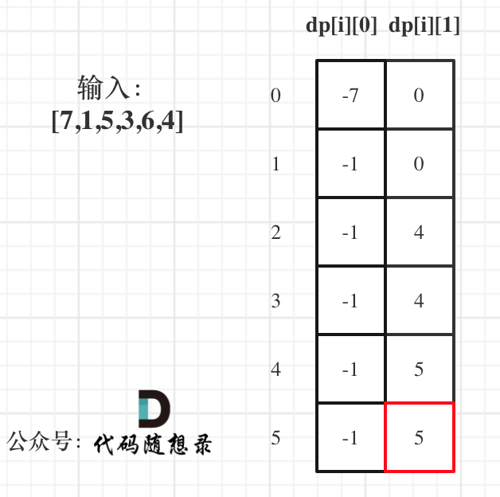
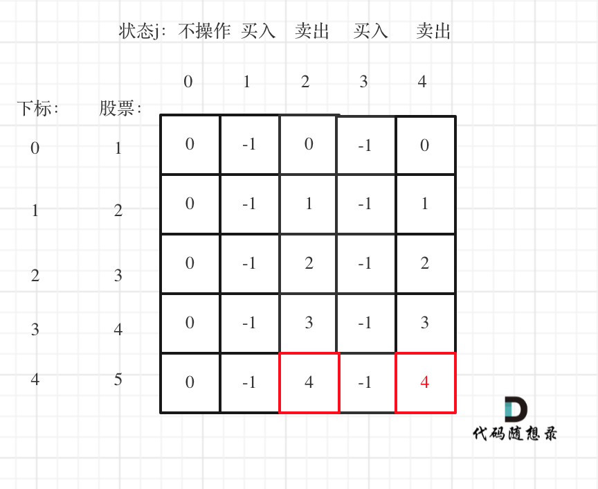

# 打家劫舍问题

## 198.打家劫舍

1. dp[i]：考虑下标i（包括i）以内的房屋，最多可以偷窃的金额为dp[i]。
2. 递推公式：dp[i] = max(dp[i - 2] + nums[i], dp[i - 1]);
3. 初始化：
   - dp[0] = nums[0]
   - dp[1] = max(nums[0], nums[1])

4. 遍历顺序：从前往后
5. 举例：


```c++
class Solution {
public:
    int rob(vector<int>& nums) {
        if (nums.size() == 0) return 0;
        if (nums.size() == 1) return nums[0];
        vector<int> dp(nums.size());
        dp[0] = nums[0];
        dp[1] = max(nums[0], nums[1]);
        for (int i = 2; i < nums.size(); i++) {
            dp[i] = max(dp[i - 2] + nums[i], dp[i - 1]);
        }
        return dp[nums.size() - 1];
    }
};
```

```python
class Solution:
    def rob(self, nums: List[int]) -> int:
        if len(nums) == 0: return 0
        if len(nums) == 1: return nums[0]
        dp = [0] * len(nums)
        dp[0] = nums[0]
        dp[1] = max(nums[0], nums[1])
        for i in range(2, len(nums)):
            dp[i] = max(dp[i - 2] + nums[i], dp[i - 1])
        return dp[-1]
```

## 213.打家劫舍II

- 在上一题的基础上，考虑两种情况即可包含所有的可能：


- 二者取最大值即可

```c++
class Solution {
public:
    int robRange(vector<int>& nums, int start, int end) {
        if (start == end) return nums[start];
        vector<int> dp(nums.size());
        dp[start] = nums[start];
        dp[start + 1] = max(nums[start], nums[start + 1]);
        for (int i = start + 2; i <= end; i++) {
            dp[i] = max(dp[i - 2] + nums[i], dp[i - 1]);
        }
        return dp[end];
    }
    int rob(vector<int>& nums) {
        if (nums.size() == 0) return 0;
        if (nums.size() == 1) return nums[0];
        int res1 = robRange(nums, 0, nums.size() - 2);
        int res2 = robRange(nums, 1, nums.size() - 1);
        return max(res1, res2);
    }
};
```

```python
class Solution:
    def robRange(self, nums, start, end):
        if start == end: return nums[start]
        dp = [0] * len(nums)
        dp[start] = nums[start]
        dp[start + 1] = max(nums[start], nums[start + 1])
        for i in range(start + 2, end + 1):
            dp[i] = max(dp[i - 2] + nums[i], dp[i - 1])
        return dp[end]
    def rob(self, nums: List[int]) -> int:
        if len(nums) == 0: return 0
        if len(nums) == 1: return nums[0]
        res1 = self.robRange(nums, 0, len(nums) - 2)
        res2 = self.robRange(nums, 1, len(nums) - 1)
        return max(res1, res2)
```

## 337*.打家劫舍 III

> 递归回溯+动态规划

### 解法1：单状态

**动规五部曲**：

1. dp[treeNode]：考虑本节点和其所有子孙能获得的最大收益
2. 递推公式：（单层逻辑）
   - 不偷当前节点，则递归返回偷左右节点的最大值和
   - 偷当前节点，则递归返回偷左右各自的左右节点最大值和

3. 初始化：叶子节点值为本身（终止条件）
4. 遍历顺序：依靠孩子算父亲——后序遍历

**递归三部曲**：

1. 函数参数：
   - 输入：当前考虑的根节点
   - 输出：最大收益（int）

2. 终止条件：
   - 遇到空节点，返回0
   - 左右孩子为空，返回本节点的值

3. 单层逻辑：
   - 计算本节点最大收益要靠两个孩子——后序遍历
   - 不偷当前节点，则递归返回偷左右节点的最大值和
   - 偷当前节点，则递归返回偷左右各自的左右节点最大值和

——由于递归存在重复计算（孩子的计算包含了孩子的孩子），可以使用map来记录每个节点对应的最大收益

```c++
class Solution {
public:
    unordered_map<TreeNode*, int> umap;
    int rob(TreeNode* root) {
        if (!root) return 0;
        if (!root->left && !root->right) return root->val;
        if (umap[root]) return umap[root];
        int res1 = root->val;
        if (root->left) res1 += rob(root->left->left) + rob(root->left->right);
        if (root->right) res1 += rob(root->right->left) + rob(root->right->right);
        int res2 = rob(root->left) + rob(root->right);
        umap[root] = max(res1, res2);
        return umap[root];
    }
};
```

- python第122个测试用例会超时

```python
# 超时
class Solution:
    umap = {}
    def rob(self, root: Optional[TreeNode]) -> int:
        if not root: return 0
        if not root.left and not root.right: return root.val
        if root in self.umap.keys(): return self.umap[root]
        #  if self.umap.get(root) is not None:
        res1 = root.val
        if root.left: 
            res1 += self.rob(root.left.left) + self.rob(root.left.right)
        if root.right: 
            res1 += self.rob(root.right.left) + self.rob(root.right.right)
        res2 = self.rob(root.left) + self.rob(root.right)
        return max(res1, res2)
```

### 解法1：双状态

**动规五部曲**：

1. dp[treeNode]长度为2的数组：考虑本节点和其所有子孙

   下标为0记录不偷该节点所得到的的最大金钱，下标为1记录偷该节点所得到的的最大金钱。

2. 递推公式：（单层逻辑）

   - 不偷当前节点，则递归返回偷左右节点的最大值和——dp[0]
   - 偷当前节点，则递归返回偷左右各自的左右节点最大值和——dp[1]

3. 初始化：空节点值为0（终止条件）
4. 遍历顺序：依靠孩子算父亲——后序遍历

**递归三部曲**：

1. 函数参数：
   - 输入：当前考虑的根节点
   - 输出：打劫或不打劫的最大收益（二维`vector<int>`）

2. 终止条件：
   - 遇到空节点，返回[0, 0]

3. 单层逻辑：
   - 计算本节点最大收益要靠两个孩子——后序遍历
   - 分别递归返回左右孩子的结果，
   - dp[0]：不偷当前节点，返回偷左右节点的最大值和
   - dp[1]：偷当前节点，返回偷左右各自的左右节点最大值和

——这种方法可以节约至少一半的递归过程

```c++
class Solution {
public:
    vector<int> robTree(TreeNode* root) {
        if (!root) return vector<int>{0, 0};
        vector<int> left = robTree(root->left);
        vector<int> right = robTree(root->right);
        int res1 = root->val + left[0] + right[0];
        int res2 = max(left[0], left[1]) + max(right[0], right[1]);
        return vector<int>{res2, res1};
    }
    int rob(TreeNode* root) {
        vector<int> res = robTree(root);
        return max(res[0], res[1]);
    }
};
```

```python
class Solution:
    def robTree(self, root: Optional[TreeNode]) -> list:
        if not root: return [0, 0]
        left = self.robTree(root.left)
        right = self.robTree(root.right)
        res1 = root.val + left[0] + right[0]
        res2 = max(left) + max(right)
        return [res2, res1]
    def rob(self, root: Optional[TreeNode]) -> int:
        res = self.robTree(root)
        return max(res)
```

# 股票问题

## 121. 买卖股票的最佳时机

### 贪心

> 取最左最小值，取最右最大值，那么得到的差值就是最大利润

- 局部最优：遇到更小的价格更新最小价格、保留当前价格减去最小价格的最大值
- 全局最优：最后得到的最大值就是最大利润

```c++
class Solution {
public:
    int maxProfit(vector<int>& prices) {
        int lowPrice = INT_MAX;
        int maxIncome = 0;
        for (int i = 0; i < prices.size(); i++) {
            lowPrice = min(lowPrice, prices[i]);
            maxIncome = max(maxIncome, prices[i] - lowPrice);
        }
        return maxIncome;
    }
};
```

```python
class Solution:
    def maxProfit(self, prices: List[int]) -> int:
        lowProce = float('inf')
        maxIncome = 0
        for p in prices:
            lowProce = min(lowProce, p)
            maxIncome = max(maxIncome, p - lowProce)
        return maxIncome
```

### 动态规划

> 通过记录是否持有的最大收益来进行动态规划

1. `dp[i][0]` 表示第i天**持有**股票所得最多现金，`dp[i][1] `表示第i天不持有股票所得最多现金
2. 递推公式：
   - `dp[i][0] = max(dp[i - 1][0], -prices[i]);`
   - `dp[i][1] = max(dp[i - 1][1], prices[i] + dp[i - 1][0]);`

3. 初始化：
   - `dp[0][0] = -prices[0];`
   - `dp[0][1] = 0;`

4. 遍历顺序：从前往后
5. 举例：



——**本题中不持有股票状态所得金钱一定比持有股票状态得到的多**，最后直接返回`dp[len(num) - 1][1]`即可

——数组可以循环使用，只定义一个长度为2 的即可

```c++
class Solution {
public:
    int maxProfit(vector<int>& prices) {
        vector<int> dp(2, 0);
        dp[0] = -prices[0];
        for (int i = 1; i < prices.size(); i++) {
            int dp0 = dp[0], dp1 = dp[1];
            dp[0] = max(dp0, -prices[i]);
            dp[1] = max(dp1, prices[i] + dp0);
        }
        return dp[1];
    }
};
```

```python
class Solution:
    def maxProfit(self, prices: List[int]) -> int:
        dp = [-prices[0], 0]
        for i in range(1, len(prices)):
            dp0, dp1 = dp[0], dp[1]
            dp[0] = max(dp0, -prices[i])
            dp[1] = max(dp1, dp0 + prices[i])
        return dp[1]
```

##  122.买卖股票的最佳时机II

1. `dp[i][0]` 表示第i天**持有**股票所得最多现金，`dp[i][1] `表示第i天不持有股票所得最多现金
2. 递推公式：
   - `dp[i][0] = max(dp[i - 1][0], dp[i - 1][1] - prices[i]);`
   - `dp[i][1] = max(dp[i - 1][1], prices[i] + dp[i - 1][0]);`

3. 初始化：
   - `dp[0][0] = -prices[0];`
   - `dp[0][1] = 0;`

4. 遍历顺序：从前往后
5. 举例：（略）

```c++
class Solution {
public:
    int maxProfit(vector<int>& prices) {
        vector<vector<int>> dp(prices.size(), vector<int>(2, 0));
        dp[0][0] -= prices[0];  // 初始化
        for (int i = 1; i < prices.size(); i++) {
            dp[i][0] = max(dp[i-1][0], dp[i-1][1] - prices[i]);
            dp[i][1] = max(dp[i-1][1], dp[i-1][0] + prices[i]);
        }
        return max(dp[prices.size() - 1][0], dp[prices.size() - 1][1]);
    }
};
```

```python
class Solution:
    def maxProfit(self, prices: List[int]) -> int:
        dp = [[0, 0] for _ in range(len(prices))]
        dp[0][0] -= prices[0]
        for i in range(1, len(prices)):
            dp[i][0] = max(dp[i-1][0], dp[i-1][1] - prices[i])
            dp[i][1] = max(dp[i-1][1], dp[i-1][0] + prices[i])
        return max(dp[len(prices)-1][0], dp[len(prices)-1][1])
```

——也可以和上一题一样写成滚动数组的形式

## 123*.买卖股票的最佳时机III

> 至多买卖两次——可以买卖一次，可以买卖两次，也可以不买卖

1. dp数组：`dp[i][j]`表示第i天状态j(0-4五个状态)所剩最大现金

       0.没有操作 （其实我们也可以不设置这个状态）
       1.第一次持有股票
       2.第一次不持有股票
       3.第二次持有股票
       4.第二次不持有股票

2. 递推公式：
   - `dp[i][1] = max(dp[i-1][0] - prices[i], dp[i - 1][1]);`
   - `dp[i][2] = max(dp[i - 1][1] + prices[i], dp[i - 1][2])`
   - `dp[i][3] = max(dp[i - 1][3], dp[i - 1][2] - prices[i]);`
   - `dp[i][4] = max(dp[i - 1][4], dp[i - 1][3] + prices[i]);`

3. 初始化：
   - `dp[0][0] = 0;`
   - `dp[0][1] = -prices[0];`
   - `dp[0][2] = 0;`
   - `dp[0][3] = -prices[0];`
   - `dp[0][4] = 0;`

4. 遍历顺序：从前向后
5. 举例：



——最终最大利润是`dp[len(prices) - 1][4]`

```c++
class Solution {
public:
    int maxProfit(vector<int>& prices) {
        vector<vector<int>> dp(prices.size(), vector<int>(5, 0));
        dp[0][1] = -prices[0];
        dp[0][3] = -prices[0];
        for (int i = 1; i < prices.size(); i++) {
            dp[i][1] = max(dp[i - 1][1], dp[i - 1][0] - prices[i]);
            dp[i][2] = max(dp[i - 1][2], dp[i - 1][1] + prices[i]);
            dp[i][3] = max(dp[i - 1][3], dp[i - 1][2] - prices[i]);
            dp[i][4] = max(dp[i - 1][4], dp[i - 1][3] + prices[i]);
        }
        return dp[prices.size() - 1][4];
    }
};
```

```python
class Solution:
    def maxProfit(self, prices: List[int]) -> int:
        dp = [[0] * 5 for _ in range(len(prices))]
        dp[0][1] = -prices[0]
        dp[0][3] = -prices[0]
        for i  in range(1, len(prices)):
            dp[i][1] = max(dp[i - 1][1], dp[i - 1][0] - prices[i])
            dp[i][2] = max(dp[i - 1][2], dp[i - 1][1] + prices[i])
            dp[i][3] = max(dp[i - 1][3], dp[i - 1][2] - prices[i])
            dp[i][4] = max(dp[i - 1][4], dp[i - 1][3] + prices[i])
        return dp[-1][-1]
```

省空间版：

可以不用反序，会自动消除叠加——因为相邻两个的prices[i]差额反号

```c++
class Solution {
public:
    int maxProfit(vector<int>& prices) {
        vector<int> dp(5, 0);
        dp[1] = -prices[0];
        dp[3] = -prices[0];
        for (int i = 1; i < prices.size(); i++) {
            dp[4] = max(dp[4], dp[3] + prices[i]);
            dp[3] = max(dp[3], dp[2] - prices[i]);
            dp[2] = max(dp[2], dp[1] + prices[i]);
            dp[1] = max(dp[1], dp[0] - prices[i]);
        }
        return dp[4];
    }
};
```

```python
class Solution:
    def maxProfit(self, prices: List[int]) -> int:
        dp = [0] * 5
        dp[1] = -prices[0]
        dp[3] = -prices[0]
        for i  in range(1, len(prices)):
            dp[1] = max(dp[1], dp[0] - prices[i])
            dp[2] = max(dp[2], dp[1] + prices[i])
            dp[3] = max(dp[3], dp[2] - prices[i])
            dp[4] = max(dp[4], dp[3] + prices[i])
        return dp[-1]
```

## 188*.买卖股票的最佳时机IV

> 上一题进阶版，最多可以买卖k次

1. dp数组：`dp[i][j]`表示第i天状态j(总数为`2*k+1`)所剩最大现金

   ——**除了0以外，偶数就是卖出，奇数就是买入**

   ```
   0.没有操作 （其实我们也可以不设置这个状态）
   1.第一次持有股票
   2.第一次不持有股票
   3.第二次持有股票
   4.第二次不持有股票
   5.……
   ```

2. 递推公式：
   - j为奇数：`dp[i][j] = max(dp[i - 1][j - 1] - prices[i], dp[i - 1][j]);`
   - j为偶数：`dp[i][j] = max(dp[i - 1][j - 1] + prices[i], dp[i - 1][j])`

3. 初始化：
   - `dp[0][0] = 0;`
   - `dp[0][1] = -prices[0];`
   - `dp[0][2] = 0;`
   - `dp[0][3] = -prices[0];`
   - `dp[0][4] = 0;`
   - ……
   - `dp[0][j]`当j为奇数的时候都初始化为 `-prices[0]`

4. 遍历顺序：从前向后
5. 举例：

 

 

```c++
class Solution {
public:
    int maxProfit(int k, vector<int>& prices) {
        if (prices.size() == 0) return 0;  // 特殊情况
        vector<vector<int>> dp(prices.size(), vector<int>(k * 2 + 1, 0));
        for (int i = 1; i < 2 * k; i += 2) {
            dp[0][i] = -prices[0];
        }
        for (int i = 1; i < prices.size(); i++) {
            for (int j = 1; j <= 2 * k; j++) {
                if (j % 2) dp[i][j] = max(dp[i - 1][j], dp[i - 1][j - 1] - prices[i]);
                else dp[i][j] = max(dp[i - 1][j], dp[i - 1][j - 1] + prices[i]);
            }
        }
        return dp[prices.size() - 1][2 * k];
    }
};
```

```python
class Solution:
    def maxProfit(self, k: int, prices: List[int]) -> int:
        if len(prices) == 0: return 0  # 特殊情况
        dp = [[0] * (2 * k + 1) for _ in range(len(prices))]
        for i in range(1, 2 * k, 2):
            dp[0][i] = -prices[0]
        for i in range(1, len(prices)):
            for j in range(1, 2 * k + 1):
                if j % 2:
                    dp[i][j] = max(dp[i - 1][j], dp[i - 1][j - 1] - prices[i])
                else:
                    dp[i][j] = max(dp[i - 1][j], dp[i - 1][j - 1] + prices[i])
        return dp[-1][-1]
```

省空间版：

```c++
class Solution {
public:
    int maxProfit(int k, vector<int>& prices) {
        if (prices.size() == 0) return 0;  // 特殊情况
        vector<int> dp(k * 2 + 1, 0);
        for (int i = 1; i < 2 * k; i += 2) {
            dp[i] = -prices[0];
        }
        for (int i = 1; i < prices.size(); i++) {
            for (int j = 1; j <= 2 * k; j++) {
                if (j % 2) dp[j] = max(dp[j], dp[j - 1] - prices[i]);
                else dp[j] = max(dp[j], dp[j - 1] + prices[i]);
            }
        }
        return dp[2 * k];
    }
};
```

```python
class Solution:
    def maxProfit(self, k: int, prices: List[int]) -> int:
        if len(prices) == 0: return 0  # 特殊情况
        dp = [0] * (2 * k + 1)
        for i in range(1, 2 * k, 2):
            dp[i] = -prices[0]
        for i in range(1, len(prices)):
            for j in range(1, 2 * k + 1):
                if j % 2:
                    dp[j] = max(dp[j], dp[j - 1] - prices[i])
                else:
                    dp[j] = max(dp[j], dp[j - 1] + prices[i])
        return dp[-1]
```

## 309*.最佳买卖股票时机含冷冻期

> 状态比题目2更多

### 四个状态

1. dp数组：`dp[i][j]`，第i天状态为j，所剩的最多现金为`dp[i][j]`。
   - 状态0：持有股票状态（今天买入股票，或者是之前就买入了股票然后没有操作，一直持有）
   - 不持有股票状态，这里就有两种卖出股票状态
     - 状态1：保持卖出股票的状态（两天前就卖出了股票，度过一天冷冻期。或者是前一天就是卖出股票状态，一直没操作）
     - 状态2：今天卖出股票
   - 状态3：今天为冷冻期状态，但冷冻期状态不可持续，只有一天！

2. 递推公式：

   

   - `dp[i][0] = max(dp[i - 1][0], dp[i - 1][3] - prices[i], dp[i - 1][1] - prices[i]);`
   - `dp[i][1] = max(dp[i - 1][1], dp[i - 1][3]);`
   - `dp[i][2] = dp[i - 1][0] + prices[i];`
   - `dp[i][3] = dp[i - 1][2];`

3. 初始化：
   - `dp[0][0] = -prices[0]`
   - 其他都初始化为0

4. 遍历顺序：从前向后
5. 举例：


```c++
class Solution {
public:
    int maxProfit(vector<int>& prices) {
        int len = prices.size();
        if (len == 0) return 0;
        vector<vector<int>> dp(len, vector<int>(4, 0));
        dp[0][0] = -prices[0];
        for (int i = 1; i < len; i++) {
            dp[i][0] = max(dp[i - 1][0], max(dp[i - 1][3] - prices[i], dp[i - 1][1] - prices[i]));
            dp[i][1] = max(dp[i - 1][1], dp[i - 1][3]);
            dp[i][2] = dp[i - 1][0] + prices[i];
            dp[i][3] = dp[i - 1][2];
        }
        return max(dp[len - 1][1], max(dp[len - 1][2], dp[len - 1][3]));
    }
};
```

```python
class Solution:
    def maxProfit(self, prices: List[int]) -> int:
        n = len(prices)
        if n == 0: return 0
        dp = [[0] * 4 for _ in range(n)]
        dp[0][0] = -prices[0]
        for i in range(1, n):
            dp[i][0] = max(dp[i - 1][0], dp[i - 1][1] - prices[i], dp[i - 1][3] - prices[i])
            dp[i][1] = max(dp[i - 1][1], dp[i - 1][3])
            dp[i][2] = dp[i - 1][0] + prices[i]
            dp[i][3] = dp[i - 1][2]
        return max(dp[n - 1][1], dp[n - 1][2], dp[n - 1][3])
```

也可以写成省空间模式——即长度为2×4的二维数组，不断迭代即可。

### 三个状态

1. 状态含义：
   - 状态0：持有股票状态（今天买入股票，或者是之前就买入了股票然后没有操作，一直持有）
   - 状态1：不持有股票状态（能购买）
   - 状态2：不持有股票状态（冷冻期）

2. 递推公式：

```c++
dp[i][0] = max(dp[i - 1][0], dp[i - 1][1] - prices[i]);
dp[i][1] = max(dp[i - 1][1], dp[i - 1][2]);
dp[i][2] = dp[i - 1][0] + prices[i];
```

3. 初始化：`dp[0][0] = -prices[0];`，其他都是0
4. 遍历顺序：从前往后
5. 举例：


```c++
class Solution {
public:
    int maxProfit(vector<int>& prices) {
        int len = prices.size();
        if (len == 0) return 0;
        vector<vector<int>> dp(len, vector<int>(3, 0));
        dp[0][0] = -prices[0];
        for (int i = 1; i < len; i++) {
            dp[i][0] = max(dp[i - 1][0], dp[i - 1][1] - prices[i]);
            dp[i][1] = max(dp[i - 1][1], dp[i - 1][2]);
            dp[i][2] = dp[i - 1][0] + prices[i];
        }
        return max(dp[len - 1][1], dp[len - 1][2]);
    }
};
```

```python
class Solution:
    def maxProfit(self, prices: List[int]) -> int:
        n = len(prices)
        if n == 0: return 0
        dp = [[0] * 3 for _ in range(n)]
        dp[0][0] = -prices[0]
        for i in range(1, n):
            dp[i][0] = max(dp[i - 1][0], dp[i - 1][1] - prices[i])
            dp[i][1] = max(dp[i - 1][1], dp[i - 1][2])
            dp[i][2] = dp[i - 1][0] + prices[i]
        return max(dp[n - 1][1], dp[n - 1][2])
```

## 714.买卖股票的最佳时机含手续费

- 类似于第二题，在计算时减去手续费即可

  ```c++
  dp[i][0] = max(dp[i - 1][0], dp[i - 1][1] - prices[i]);
  dp[i][1] = max(dp[i - 1][1], dp[i - 1][0] + prices[i] - fee);
  ```

```c++
class Solution {
public:
    int maxProfit(vector<int>& prices, int fee) {
        vector<vector<int>> dp(prices.size(), vector<int>(2, 0));
        dp[0][0] -= prices[0];  // 初始化
        for (int i = 1; i < prices.size(); i++) {
            dp[i][0] = max(dp[i-1][0], dp[i-1][1] - prices[i]);
            dp[i][1] = max(dp[i-1][1], dp[i-1][0] + prices[i] - fee);
        }
        return max(dp[prices.size() - 1][0], dp[prices.size() - 1][1]);
    }
};
```

```python
class Solution:
    def maxProfit(self, prices: List[int], fee: int) -> int:
        dp = [[0, 0] for _ in range(len(prices))]
        dp[0][0] -= prices[0]
        for i in range(1, len(prices)):
            dp[i][0] = max(dp[i-1][0], dp[i-1][1] - prices[i])
            dp[i][1] = max(dp[i-1][1], dp[i-1][0] + prices[i] - fee)
        return max(dp[len(prices)-1][0], dp[len(prices)-1][1])
```

