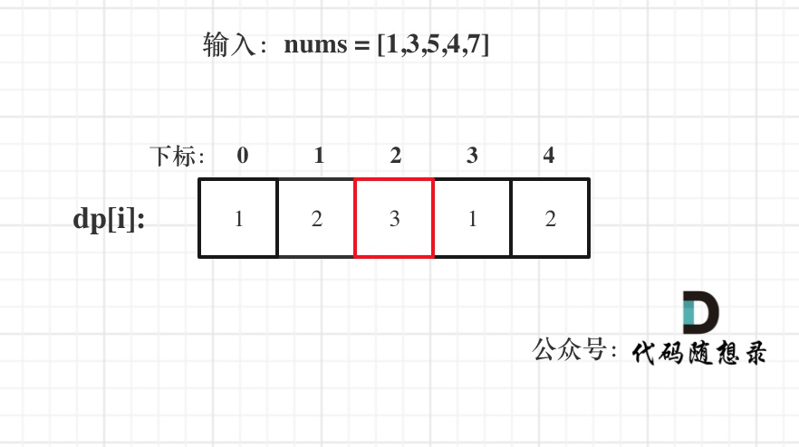
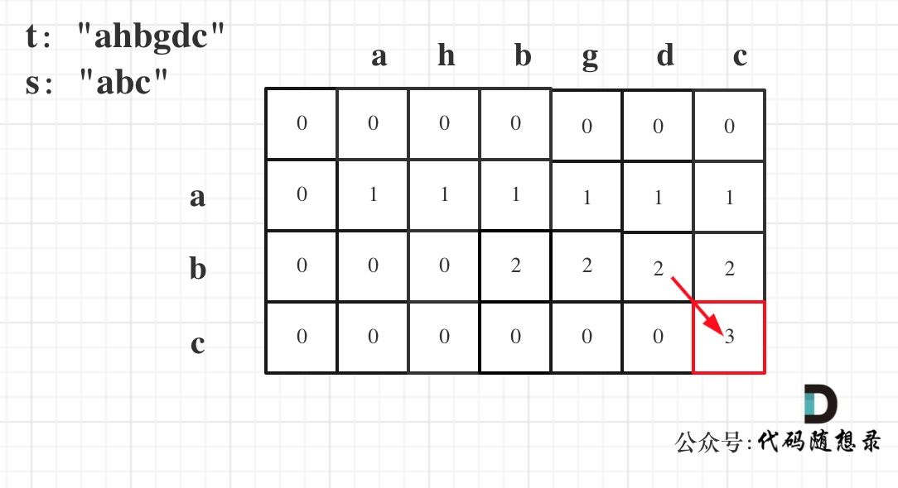

# 子序列（不连续）

## 300*.最长递增子序列

1. dp[i]表示i之前包括i的以nums[i]结尾的最长递增子序列的长度
2. 递推公式：if (nums[i] > nums[j]) dp[i] = max(dp[i], dp[j] + 1);——第i个往前满足条件的的前j个`dp[j] + 1`的最大值
3. 初始化：都是1
4. 遍历顺序：从前到后，外层遍历i，内层遍历j
5. 举例：


```c++
class Solution {
public:
    int lengthOfLIS(vector<int>& nums) {
        if (nums.size() <= 1) return nums.size();
        vector<int> dp(nums.size(), 1);
        int res = 0;
        for (int i = 1; i < nums.size(); i++) {
            for (int j = 0; j < i; j++) {
                if (nums[i] > nums[j]) dp[i] = max(dp[i], dp[j] + 1);
            }
            if (res < dp[i]) res = dp[i];
        }
        return res;
    }
};
```

```python
class Solution:
    def lengthOfLIS(self, nums: List[int]) -> int:
        if len(nums) <= 1: return len(nums)
        dp = [1] * len(nums)
        res = 0
        for i in range(1, len(nums)):
            for j in range(i):
                if nums[i] > nums[j]:
                    dp[i] = max(dp[i], dp[j] + 1)
            res = max(res, dp[i])
        return res
```

## 1143*.最长公共子序列

1. `dp[i][j]`：长度为[0, i - 1]的字符串text1与长度为[0, j - 1]的字符串text2的最长公共子序列为`dp[i][j]`
2. 递推公式：
   - 若text1[i - 1] == text2[j - 1]：`dp[i][j] = dp[i - 1][j - 1] + 1;`
   - 否则：`dp[i][j] = max(dp[i - 1][j], dp[i][j - 1]);`

3. 初始化：统一初始化为0
4. 遍历顺序：从前向后，从上到下
5. 举例：


```c++
class Solution {
public:
    int longestCommonSubsequence(string text1, string text2) {
        vector<vector<int>> dp(text1.size() + 1, vector<int>(text2.size() + 1, 0));
        for (int i = 1; i <= text1.size(); i++) {
            for (int j = 1; j <= text2.size(); j++) {
                if (text1[i - 1] == text2[j - 1]) dp[i][j] = dp[i - 1][j - 1] + 1;
                else dp[i][j] = max(dp[i - 1][j], dp[i][j - 1]);
            }
        }
        return dp[text1.size()][text2.size()];
    }
};
```

```python
class Solution:
    def longestCommonSubsequence(self, text1: str, text2: str) -> int:
        dp = [[0] * (len(text2) + 1) for _ in range(len(text1) + 1)]
        for i in range(len(text1)):
            for j in range(len(text2)):
                if text1[i] == text2[j]:
                    dp[i + 1][j + 1] = dp[i][j] + 1
                else:
                    dp[i + 1][j + 1] = max(dp[i + 1][j], dp[i][j + 1])
        return dp[len(text1)][len(text2)]
```

——也可以改成一维滚动数组，定义一个变量实时记录`dp[i-1][j-1]`即可。

## 1035.不相交的线

> 其实就是最长公共子序列问题，和上一题完全一样

```c++
class Solution {
public:
    int maxUncrossedLines(vector<int>& nums1, vector<int>& nums2) {
        vector<vector<int>> dp(nums1.size() + 1, vector<int>(nums2.size() + 1, 0));
        for (int i = 1; i <= nums1.size(); i++) {
            for (int j = 1; j <= nums2.size(); j++) {
                if (nums1[i - 1] == nums2[j - 1]) dp[i][j] = dp[i - 1][j - 1] + 1;
                else dp[i][j] = max(dp[i - 1][j], dp[i][j - 1]);
            }
        }
        return dp[nums1.size()][nums2.size()];
    }
};
```

```python
class Solution:
    def maxUncrossedLines(self, nums1: List[int], nums2: List[int]) -> int:
        dp = [[0] * (len(nums2) + 1) for _ in range(len(nums1) + 1)]
        for i in range(len(nums1)):
            for j in range(len(nums2)):
                if nums1[i] == nums2[j]:
                    dp[i + 1][j + 1] = dp[i][j] + 1
                else:
                    dp[i + 1][j + 1] = max(dp[i + 1][j], dp[i][j + 1])
        return dp[len(nums1)][len(nums2)]
```

# 子序列（连续）

## 674. 最长连续递增序列

### 动态规划

> **不连续递增子序列的跟前0-i 个状态有关，连续递增的子序列只跟前一个状态有关**

1. dp[i]：以下标i为结尾的连续递增的子序列长度为dp[i]（一定要包含最末尾元素）
2. 递推公式：if (nums[i] > nums[i - 1]) dp[i] = dp[i - 1] + 1; 

3. 初始化：都是1
4. 遍历顺序：从前向后
5. 举例：



——返回dp数组的最大值

```c++
class Solution {
public:
    int findLengthOfLCIS(vector<int>& nums) {
        if (nums.size() == 0) return 0;
        int res = 1;
        vector<int> dp(nums.size(), 1);
        for (int i = 1; i < nums.size(); i++) {
            if (nums[i - 1] < nums[i]) dp[i] = dp[i - 1] + 1;
            if (dp[i] > res) res = dp[i];
        }
        return res;
    }
};
```

```python
class Solution:
    def findLengthOfLCIS(self, nums: List[int]) -> int:
        if len(nums) == 0: return 0
        res = 1
        dp = [1] * len(nums)
        for i in range(1, len(nums)):
            if nums[i] > nums[i - 1]:
                dp[i] = dp[i - 1] + 1
            if res < dp[i]:
                res = dp[i]
        return res
```

### 贪心

> 遇到nums[i] > nums[i - 1]的情况，count就++，否则count为1，记录count的最大值

```c++
class Solution {
public:
    int findLengthOfLCIS(vector<int>& nums) {
        if (nums.size() == 0) return 0;
        int res = 1;
        int count = 1;
        for (int i = 1; i < nums.size(); i++) {
            if (nums[i - 1] < nums[i]) {
                count++;
            } else {
                count = 1;
            }
            if (count > res) res = count;
        }
        return res;
    }
};
```

```python
class Solution:
    def findLengthOfLCIS(self, nums: List[int]) -> int:
        if len(nums) == 0: return 0
        res = 1
        count = 1
        for i in range(1, len(nums)):
            if nums[i] > nums[i - 1]:
                count += 1
            else:
                count = 1
            if res < count:
                res = count
        return res
```

## 718. 最长重复子数组

### 二维dp

1. `dp[i][j] `：以下标i - 1为结尾的A，和以下标j - 1为结尾的B，最长重复子数组长度为`dp[i][j]`
2. 递推公式：当A[i - 1] 和B[j - 1]相等的时候，`dp[i][j] = dp[i - 1][j - 1] + 1;`
3. 初始化：`dp[i][0] `和`dp[0][j]`初始化为0，其余也都初始化为0
4. 遍历顺序：外层for循环遍历A，内层for循环遍历B
5. 举例：


——在遍历的时候顺便把`dp[i][j]`的最大值记录下来

```c++
class Solution {
public:
    int findLength(vector<int>& nums1, vector<int>& nums2) {
        vector<vector<int>> dp(nums1.size() + 1, vector<int>(nums2.size() + 1, 0));
        int res = 0;
        for (int i = 1; i <= nums1.size(); i++) {
            for (int j = 1; j <= nums2.size(); j++) {
                if (nums1[i - 1] == nums2[j - 1]) dp[i][j] = dp[i - 1][j - 1] + 1;
                if (res < dp[i][j]) res = dp[i][j];
            }
        }
        return res;
    }
};
```

```python
class Solution:
    def findLength(self, nums1: List[int], nums2: List[int]) -> int:
        dp = [[0] * (len(nums2) + 1) for _ in range(len(nums1) + 1)]
        res = 0
        for i in range(1, len(nums1) + 1):
            for j in range(1, len(nums2) + 1):
                if nums1[i - 1] == nums2[j - 1]:
                    dp[i][j] = dp[i - 1][j - 1] + 1
                if res < dp[i][j]:
                    res = dp[i][j]
        return res
```

### 滚动数组

> 从后往前遍历避免覆盖即可

```c++
class Solution {
public:
    int findLength(vector<int>& nums1, vector<int>& nums2) {
        vector<int> dp(nums2.size() + 1, 0);
        int res = 0;
        for (int i = 1; i <= nums1.size(); i++) {
            for (int j = nums2.size(); j > 0; j--) {
                if (nums1[i - 1] == nums2[j - 1]) dp[j] = dp[j - 1] + 1;
                else dp[j] = 0;  // 不相等要变回0，否则可能被之前数值干扰！
                if (res < dp[j]) res = dp[j];
            }
        }
        return res;
    }
};
```

```python
class Solution:
    def findLength(self, nums1: List[int], nums2: List[int]) -> int:
        dp = [0] * (len(nums2) + 1)
        res = 0
        for i in range(1, len(nums1) + 1):
            for j in range(len(nums2), 0, -1):
                if nums1[i - 1] == nums2[j - 1]:
                    dp[j] = dp[j - 1] + 1
                else:
                    dp[j] = 0
                if res < dp[j]:
                    res = dp[j]
        return res
```

## 53. 最大子序和

1. dp[i]：包括下标i（**以nums[i]为结尾**）的最大连续子序列和为dp[i]。
2. 递推公式：dp[i] = max(dp[i - 1] + nums[i], nums[i]);
3. 初始化：dp[0] = nums[0]
4. 遍历顺序：从前向后
5. 举例：


——遍历途中记录最大的dp[i]

```c++
class Solution {
public:
    int maxSubArray(vector<int>& nums) {
        if (nums.size() == 0) return 0;  // 特殊情况
        vector<int> dp(nums.size(), 0);
        dp[0] = nums[0];  // 初始条件
        int res = dp[0];
        for (int i = 1; i < nums.size(); i++) {
            dp[i] = max(dp[i - 1] + nums[i], nums[i]);
            if (dp[i] > res) res = dp[i];
        }
        return res;
    }
};
```

```c++
class Solution:
    def maxSubArray(self, nums: List[int]) -> int:
        if len(nums) == 0:
            return 0
        dp = [0] * len(nums)
        dp[0] = nums[0]
        res = dp[0]
        for i in range(1, len(nums)):
            dp[i] = max(dp[i - 1] + nums[i], nums[i])
            if dp[i] > res:
                res = dp[i]
        return res
```

# 编辑距离

## 392.判断子序列

### 双指针

```c++
class Solution {
public:
    bool isSubsequence(string s, string t) {
        int j = 0;
        int sLen = s.size();
        for (int i = 0; i < t.size(); i++) {
            if (j < sLen && t[i] == s[j]) {
                j++;
            }
        }
        return j == sLen;
    }
};
```

```python
class Solution:
    def isSubsequence(self, s: str, t: str) -> bool:
        j = 0
        sLen = len(s)
        for i in range(len(t)):
            if j < sLen and t[i] == s[j]:
                j += 1
        return j == sLen
```

### 动态规划

> 本题解法和1143.最长公共子序列 相似

1. `dp[i][j] `表示以下标i-1为结尾的字符串s，和以下标j-1为结尾的字符串t，相同子序列的长度为`dp[i][j]`
2. 递推公式：
   - `if (s[i - 1] == t[j - 1]) dp[i][j] = dp[i - 1][j - 1] + 1;`
   - `if (s[i - 1] != t[j - 1]) dp[i][j] = dp[i][j - 1];`

3. 初始化：全部初始化为0即可
4. 遍历顺序：从上到下、从左到右
5. 举例：



```c++
class Solution {
public:
    bool isSubsequence(string s, string t) {
        vector<vector<int>> dp(s.size() + 1, vector<int>(t.size() + 1, 0));
        for (int i = 1; i <= s.size(); i++) {
            for (int j = 1; j <= t.size(); j++) {
                if (s[i - 1] == t[j - 1]) {
                    dp[i][j] = dp[i - 1][j - 1] + 1;
                } else {
                    dp[i][j] = dp[i][j - 1];
                }
            }
        }
        return dp[s.size()][t.size()] == s.size();
    }
};
```

```python
class Solution:
    def isSubsequence(self, s: str, t: str) -> bool:
        dp = [[0] * (len(t) + 1) for _ in range(len(s) + 1)]
        for i in range(len(s)):
            for j in range(len(t)):
                if s[i] == t[j]:
                    dp[i + 1][j + 1] = dp[i][j] + 1
                else:
                    dp[i + 1][j + 1] = dp[i + 1][j]
        return dp[len(s)][len(t)] == len(s)
```

## 115*.不同的子序列

> 只有删除操作，不用考虑替换增加

1. `dp[i][j]`：以i-1为结尾的s子序列中出现以j-1为结尾的t的个数为`dp[i][j]`。
2. 递推公式：
   - `if (s[i - 1] == t[j - 1]) dp[i][j] = dp[i - 1][j - 1] + dp[i - 1][j];`
   - `if (s[i - 1] != t[j - 1]) dp[i][j] = dp[i - 1][j];`

3. **初始化**：第0列都是1，其余都是0
4. 遍历顺序：从上到下、从左到右
5. 举例：


- 可能会超界，需要定义大的无符号整型uint64_t

```c++
class Solution {
public:
    int numDistinct(string s, string t) {
        vector<vector<uint64_t>> dp(s.size() + 1, vector<uint64_t>(t.size() + 1));
        dp[0][0] = 1;
        for (int i = 1; i <= s.size(); i++) {
            dp[i][0] = 1;
            for (int j = 1; j <= t.size(); j++) {
                if (s[i - 1] == t[j - 1]) {
                    dp[i][j] = dp[i - 1][j - 1] + dp[i - 1][j];
                } else {
                    dp[i][j] = dp[i - 1][j];
                }
            }
        }
        return dp[s.size()][t.size()];
    }
};
```

```python
class Solution:
    def numDistinct(self, s: str, t: str) -> int:
        dp = [[0] * (len(t) + 1) for _ in range(len(s) + 1)]
        for i in range(len(s)):
            dp[i][0] = 1
        for i in range(len(s)):
            for j in range(len(t)):
                if s[i] == t[j]:
                    dp[i + 1][j + 1] = dp[i][j] + dp[i][j + 1]
                else:
                    dp[i + 1][j + 1] = dp[i][j + 1]
        return dp[len(s)][len(t)]
```

## 583. 两个字符串的删除操作

> 两个数组都可以删了

### 动态规划1

1. `dp[i][j]`：以i-1为结尾的字符串word1，和以j-1位结尾的字符串word2，想要达到相等，所需要删除元素的最少次数

2. 递推公式：

   - `if (word1[i - 1] == word2[j - 1]) dp[i][j] = dp[i - 1][j - 1];`

   - `if (word1[i - 1] == word2[j - 1]) dp[i][j] = min({dp[i - 1][j - 1] + 2, dp[i - 1][j] + 1, dp[i][j - 1] + 1});`

     可简化为：`dp[i][j] = min(dp[i - 1][j] + 1, dp[i][j - 1] + 1);`

3. 初始化：

   - `dp[i][0] = i`
   - `dp[0][j] = j`

4. 遍历顺序：从上到下，从左到右
5. 举例


```c++
class Solution {
public:
    int minDistance(string word1, string word2) {
        vector<vector<int>> dp(word1.size() + 1, vector<int>(word2.size() + 1, 0));
        for (int i = 0; i <= word1.size(); i++) dp[i][0] = i;
        for (int j = 0; j <= word2.size(); j++) dp[0][j] = j;
        for (int i = 1; i <= word1.size(); i++) {
            for (int j = 1; j <= word2.size(); j++) {
                if (word1[i - 1] == word2[j - 1]) {
                    dp[i][j] = dp[i - 1][j - 1];
                } else {
                    dp[i][j] = min(dp[i - 1][j] + 1, dp[i][j - 1] + 1);
                }
            }
        }
        return dp[word1.size()][word2.size()];
    }
};
```

```python
class Solution:
    def minDistance(self, word1: str, word2: str) -> int:
        dp = [[0] * (len(word2) + 1) for _ in range(len(word1) + 1)]
        for i in range(len(word1) + 1): dp[i][0] = i
        for j in range(len(word2) + 1): dp[0][j] = j
        for i in range(len(word1)): 
            for j in range(len(word2)):
                if word1[i] == word2[j]:
                    dp[i + 1][j + 1] = dp[i][j]
                else:
                    dp[i + 1][j + 1] = min(dp[i][j + 1] + 1, dp[i + 1][j] + 1)
        return dp[-1][-1]
```

### 动态规划2

> 只要求出两个字符串的最长公共子序列长度即可，那么除了最长公共子序列之外的字符都是必须删除的
>
> 最后用两个字符串的总长度减去两个最长公共子序列的长度就是删除的最少步数

```c++
class Solution {
public:
    int minDistance(string word1, string word2) {
        vector<vector<int>> dp(word1.size() + 1, vector<int>(word2.size() + 1, 0));
        for (int i = 1; i <= word1.size(); i++) {
            for (int j = 1; j <= word2.size(); j++) {
                if (word1[i - 1] == word2[j - 1]) dp[i][j] = dp[i - 1][j - 1] + 1;
                else dp[i][j] = max(dp[i - 1][j], dp[i][j - 1]);
            }
        }
        return word1.size() + word2.size() - dp[word1.size()][word2.size()] * 2;
    }
};
```

```python
class Solution:
    def minDistance(self, word1: str, word2: str) -> int:
        dp = [[0] * (len(word2) + 1) for _ in range(len(word1) + 1)]
        for i in range(len(word1)):
            for j in range(len(word2)):
                if word1[i] == word2[j]:
                    dp[i + 1][j + 1] = dp[i][j] + 1
                else:
                    dp[i + 1][j + 1] = max(dp[i + 1][j], dp[i][j + 1])
        return len(word1) + len(word2) - dp[-1][-1] * 2
```

## 72**. 编辑距离

1. `dp[i][j]` 表示以下标i-1为结尾的字符串word1，和以下标j-1为结尾的字符串word2，最近编辑距离为`dp[i][j]`

2. 递推公式：

   - `if (word1[i - 1] == word2[j - 1])`：什么都不做 `dp[i][j] = dp[i - 1][j - 1];`

   - `if (word1[i - 1] != word2[j - 1])`：增、删、换

     1. word1删除一个元素：`dp[i][j] = dp[i - 1][j] + 1;`（增和删互为转换，保留一个即可）
     2. word2删除一个元素：`dp[i][j] = dp[i][j - 1] + 1;`
     3. 替换一个元素：`dp[i][j] = dp[i - 1][j - 1] + 1;`（换最后一个即可）

     取三者的最小值

3. 初始化：`dp[i][0] = i; dp[0][j] = j;`
4. 遍历顺序：从左到右从上到下
5. 举例：


```c++
class Solution {
public:
    int minDistance(string word1, string word2) {
        vector<vector<int>> dp(word1.size() + 1, vector<int>(word2.size() + 1, 0));
        for (int i = 0; i <= word1.size(); i++) dp[i][0] = i;
        for (int j = 0; j <= word2.size(); j++) dp[0][j] = j;
        for (int i = 1; i <= word1.size(); i++) {
            for (int j = 1; j <= word2.size(); j++) {
                if (word1[i - 1] == word2[j - 1]) {
                    dp[i][j] = dp[i - 1][j - 1];
                } else {
                    dp[i][j] = min({dp[i - 1][j] + 1, dp[i][j - 1] + 1, dp[i - 1][j - 1] + 1});
                }
            }
        }
        return dp[word1.size()][word2.size()];
    }
};
```

```python
class Solution:
    def minDistance(self, word1: str, word2: str) -> int:
        dp = [[0] * (len(word2) + 1) for _ in range(len(word1) + 1)]
        for i in range(len(word1) + 1): dp[i][0] = i
        for j in range(len(word2) + 1): dp[0][j] = j
        for i in range(len(word1)): 
            for j in range(len(word2)):
                if word1[i] == word2[j]:
                    dp[i + 1][j + 1] = dp[i][j]
                else:
                    dp[i + 1][j + 1] = min(dp[i][j + 1] + 1, dp[i + 1][j] + 1, dp[i][j] + 1)
        return dp[-1][-1]
```

# 回文问题

## 647*. 回文子串

### 动态规划

1. `dp[i][j]`：表示区间范围[i,j] （注意是左闭右闭）的子串是否是回文子串，如果是`dp[i][j]`为true，否则为false。
2. 递推公式：
   - `s[i] != s[j]`：false
   - `s[i] == s[j]`：
     1. 下标i 与 j相同，true
     2. 下标i 与 j相差1，true
     3. 下标i 与 j相差大于1，返回`dp[i + 1][j - 1]`
3. 初始化：全为false
4. **遍历顺序**：**从下到上，从左到右遍历**，或优先遍历列
5. 举例


——最后收集为true的个数即可

```c++
class Solution {
public:
    int countSubstrings(string s) {
        vector<vector<bool>> dp(s.size(), vector<bool>(s.size(), false));
        int res = 0;
        for (int i = s.size() - 1; i >= 0; i--) {
            for (int j = i; j < s.size(); j++) {
                if (s[i] == s[j]) {
                    if (j - i <= 1) {
                        dp[i][j] = true;
                        res++;
                    } else if (dp[i + 1][j - 1]) {
                        dp[i][j] = true;
                        res++;
                    }
                }
            }
        }
        return res;
    }
};
```

```python
class Solution:
    def countSubstrings(self, s: str) -> int:
        dp = [[False] * len(s) for _ in range(len(s))]
        res = 0
        for i in range(len(s) - 1, -1, -1):
            for j in range(i, len(s)):
                if s[i] == s[j]:
                    if j - i <= 1:
                        dp[i][j] = True
                        res += 1
                    elif dp[i + 1][j - 1]:
                        dp[i][j] = True
                        res += 1
        return res
```

### 双指针

- 从中间往两边扩，直到两端不相等返回
- 遍历中心为1和为2的情况

```c++
class Solution {
public:
    int extend(string& s, int i, int j, int n) {
        int res = 0;
        while (i >= 0 && j < n && s[i] == s[j]) {
            i--;
            j++;
            res++;
        }
        return res;
    }
    int countSubstrings(string s) {
        int res = 0;
        for (int i = 0; i < s.size(); i++) {
            res += extend(s, i, i, s.size());
            res += extend(s, i, i + 1, s.size());
        }
        return res;
    }
};
```

```python
class Solution:
    def countSubstrings(self, s: str) -> int:
        def extend(i, j, n):
            res = 0
            while i >= 0 and j < n and s[i] == s[j]:
                i -= 1
                j += 1
                res += 1
            return res
        res = 0
        for i in range(len(s)):
            res += extend(i, i, len(s))
            res += extend(i, i + 1, len(s))
        return res
```

## 516*.最长回文子序列

> 回文子串是连续的，**回文子序列不是连续的**

1. `dp[i][j]`：字符串s在[i, j]范围内最长的回文子序列的长度为`dp[i][j]`
2. 递推公式：
   - `s[i] == s[j]`：`dp[i][j] = dp[i + 1][j - 1] + 2;`
   - `s[i] != s[j]`：`dp[i][j] = max(dp[i + 1][j], dp[i][j - 1]);`
3. 初始化：`i == j dp[i][j] = 1`，其他情况都等于0
4. 遍历顺序：**从下到上**，从左到右
5. 举例


——最终返回`dp[0][s.size() - 1];`

```c++
class Solution {
public:
    int longestPalindromeSubseq(string s) {
        vector<vector<int>> dp(s.size(), vector<int>(s.size(), 0));
        for (int i = 0; i < s.size(); i++) dp[i][i] = 1;
        for (int i = s.size() - 1; i >= 0; i--) {
            for (int j = i + 1; j < s.size(); j++) {
                if (s[i] == s[j]) {
                    dp[i][j] = dp[i + 1][j - 1] + 2;
                } else {
                    dp[i][j] = max(dp[i + 1][j], dp[i][j - 1]);
                }
            }
        }
        return dp[0][s.size() - 1];
    }
};
```

```python
class Solution:
    def longestPalindromeSubseq(self, s: str) -> int:
        dp = [[0] * len(s) for _ in range(len(s))]
        for i in range(len(s)):
            dp[i][i] = 1
        for i in range(len(s) - 1, -1, -1):
            for j in range(i + 1, len(s)):
                if s[i] == s[j]:
                    dp[i][j] = dp[i + 1][j - 1] + 2
                else:
                    dp[i][j] = max(dp[i + 1][j], dp[i][j - 1])
        return dp[0][-1]
```

