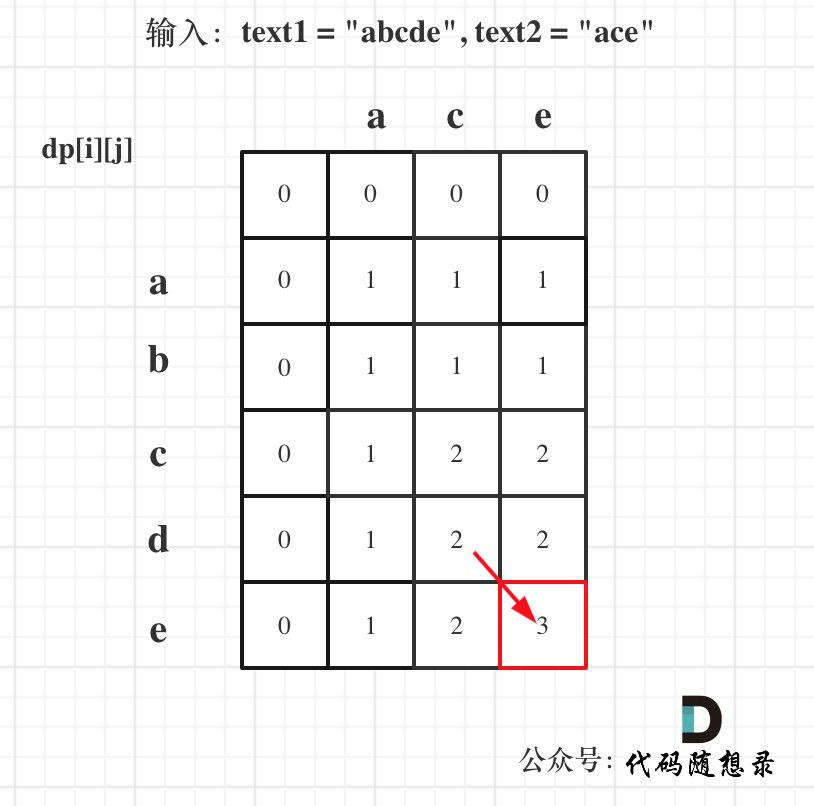
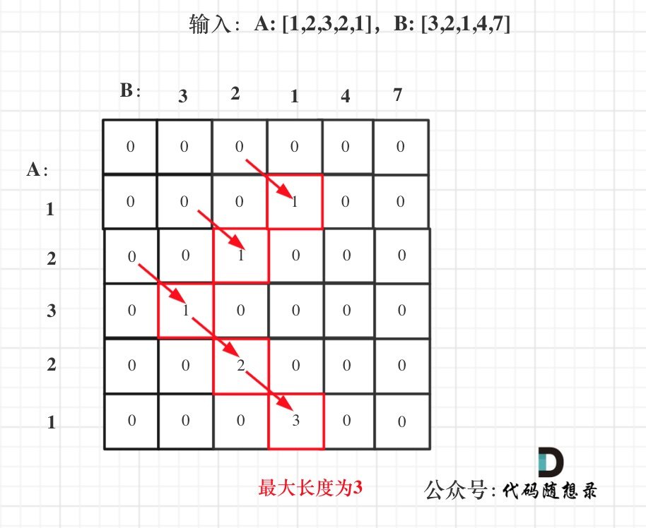

# 子序列（不连续）

## 300*.最长递增子序列

1. dp[i]表示i之前包括i的以nums[i]结尾的最长递增子序列的长度
2. 递推公式：if (nums[i] > nums[j]) dp[i] = max(dp[i], dp[j] + 1);——第i个往前满足条件的的前j个`dp[j] + 1`的最大值
3. 初始化：都是1
4. 遍历顺序：从前到后，外层遍历i，内层遍历j
5. 举例：


```c++
class Solution {
public:
    int lengthOfLIS(vector<int>& nums) {
        if (nums.size() <= 1) return nums.size();
        vector<int> dp(nums.size(), 1);
        int res = 0;
        for (int i = 1; i < nums.size(); i++) {
            for (int j = 0; j < i; j++) {
                if (nums[i] > nums[j]) dp[i] = max(dp[i], dp[j] + 1);
            }
            if (res < dp[i]) res = dp[i];
        }
        return res;
    }
};
```

```python
class Solution:
    def lengthOfLIS(self, nums: List[int]) -> int:
        if len(nums) <= 1: return len(nums)
        dp = [1] * len(nums)
        res = 0
        for i in range(1, len(nums)):
            for j in range(i):
                if nums[i] > nums[j]:
                    dp[i] = max(dp[i], dp[j] + 1)
            res = max(res, dp[i])
        return res
```

## 1143*.最长公共子序列

1. `dp[i][j]`：长度为[0, i - 1]的字符串text1与长度为[0, j - 1]的字符串text2的最长公共子序列为`dp[i][j]`
2. 递推公式：
   - 若text1[i - 1] == text2[j - 1]：`dp[i][j] = dp[i - 1][j - 1] + 1;`
   - 否则：`dp[i][j] = max(dp[i - 1][j], dp[i][j - 1]);`

3. 初始化：统一初始化为0
4. 遍历顺序：从前向后，从上到下
5. 举例：



```c++
class Solution {
public:
    int longestCommonSubsequence(string text1, string text2) {
        vector<vector<int>> dp(text1.size() + 1, vector<int>(text2.size() + 1, 0));
        for (int i = 1; i <= text1.size(); i++) {
            for (int j = 1; j <= text2.size(); j++) {
                if (text1[i - 1] == text2[j - 1]) dp[i][j] = dp[i - 1][j - 1] + 1;
                else dp[i][j] = max(dp[i - 1][j], dp[i][j - 1]);
            }
        }
        return dp[text1.size()][text2.size()];
    }
};
```

```python
class Solution:
    def longestCommonSubsequence(self, text1: str, text2: str) -> int:
        dp = [[0] * (len(text2) + 1) for _ in range(len(text1) + 1)]
        for i in range(len(text1)):
            for j in range(len(text2)):
                if text1[i] == text2[j]:
                    dp[i + 1][j + 1] = dp[i][j] + 1
                else:
                    dp[i + 1][j + 1] = max(dp[i + 1][j], dp[i][j + 1])
        return dp[len(text1)][len(text2)]
```

——也可以改成一维滚动数组，定义一个变量实时记录`dp[i-1][j-1]`即可。

## 1035.不相交的线

> 其实就是最长公共子序列问题，和上一题完全一样

```c++
class Solution {
public:
    int maxUncrossedLines(vector<int>& nums1, vector<int>& nums2) {
        vector<vector<int>> dp(nums1.size() + 1, vector<int>(nums2.size() + 1, 0));
        for (int i = 1; i <= nums1.size(); i++) {
            for (int j = 1; j <= nums2.size(); j++) {
                if (nums1[i - 1] == nums2[j - 1]) dp[i][j] = dp[i - 1][j - 1] + 1;
                else dp[i][j] = max(dp[i - 1][j], dp[i][j - 1]);
            }
        }
        return dp[nums1.size()][nums2.size()];
    }
};
```

```python
class Solution:
    def maxUncrossedLines(self, nums1: List[int], nums2: List[int]) -> int:
        dp = [[0] * (len(nums2) + 1) for _ in range(len(nums1) + 1)]
        for i in range(len(nums1)):
            for j in range(len(nums2)):
                if nums1[i] == nums2[j]:
                    dp[i + 1][j + 1] = dp[i][j] + 1
                else:
                    dp[i + 1][j + 1] = max(dp[i + 1][j], dp[i][j + 1])
        return dp[len(nums1)][len(nums2)]
```

# 子序列（连续）

## 674. 最长连续递增序列

### 动态规划

> **不连续递增子序列的跟前0-i 个状态有关，连续递增的子序列只跟前一个状态有关**

1. dp[i]：以下标i为结尾的连续递增的子序列长度为dp[i]（一定要包含最末尾元素）
2. 递推公式：if (nums[i] > nums[i - 1]) dp[i] = dp[i - 1] + 1; 

3. 初始化：都是1
4. 遍历顺序：从前向后
5. 举例：


——返回dp数组的最大值

```c++
class Solution {
public:
    int findLengthOfLCIS(vector<int>& nums) {
        if (nums.size() == 0) return 0;
        int res = 1;
        vector<int> dp(nums.size(), 1);
        for (int i = 1; i < nums.size(); i++) {
            if (nums[i - 1] < nums[i]) dp[i] = dp[i - 1] + 1;
            if (dp[i] > res) res = dp[i];
        }
        return res;
    }
};
```

```python
class Solution:
    def findLengthOfLCIS(self, nums: List[int]) -> int:
        if len(nums) == 0: return 0
        res = 1
        dp = [1] * len(nums)
        for i in range(1, len(nums)):
            if nums[i] > nums[i - 1]:
                dp[i] = dp[i - 1] + 1
            if res < dp[i]:
                res = dp[i]
        return res
```

### 贪心

> 遇到nums[i] > nums[i - 1]的情况，count就++，否则count为1，记录count的最大值

```c++
class Solution {
public:
    int findLengthOfLCIS(vector<int>& nums) {
        if (nums.size() == 0) return 0;
        int res = 1;
        int count = 1;
        for (int i = 1; i < nums.size(); i++) {
            if (nums[i - 1] < nums[i]) {
                count++;
            } else {
                count = 1;
            }
            if (count > res) res = count;
        }
        return res;
    }
};
```

```python
class Solution:
    def findLengthOfLCIS(self, nums: List[int]) -> int:
        if len(nums) == 0: return 0
        res = 1
        count = 1
        for i in range(1, len(nums)):
            if nums[i] > nums[i - 1]:
                count += 1
            else:
                count = 1
            if res < count:
                res = count
        return res
```

## 718. 最长重复子数组

### 二维dp

1. `dp[i][j] `：以下标i - 1为结尾的A，和以下标j - 1为结尾的B，最长重复子数组长度为`dp[i][j]`
2. 递推公式：当A[i - 1] 和B[j - 1]相等的时候，`dp[i][j] = dp[i - 1][j - 1] + 1;`
3. 初始化：`dp[i][0] `和`dp[0][j]`初始化为0，其余也都初始化为0
4. 遍历顺序：外层for循环遍历A，内层for循环遍历B
5. 举例：



——在遍历的时候顺便把`dp[i][j]`的最大值记录下来

```c++
class Solution {
public:
    int findLength(vector<int>& nums1, vector<int>& nums2) {
        vector<vector<int>> dp(nums1.size() + 1, vector<int>(nums2.size() + 1, 0));
        int res = 0;
        for (int i = 1; i <= nums1.size(); i++) {
            for (int j = 1; j <= nums2.size(); j++) {
                if (nums1[i - 1] == nums2[j - 1]) dp[i][j] = dp[i - 1][j - 1] + 1;
                if (res < dp[i][j]) res = dp[i][j];
            }
        }
        return res;
    }
};
```

```python
class Solution:
    def findLength(self, nums1: List[int], nums2: List[int]) -> int:
        dp = [[0] * (len(nums2) + 1) for _ in range(len(nums1) + 1)]
        res = 0
        for i in range(1, len(nums1) + 1):
            for j in range(1, len(nums2) + 1):
                if nums1[i - 1] == nums2[j - 1]:
                    dp[i][j] = dp[i - 1][j - 1] + 1
                if res < dp[i][j]:
                    res = dp[i][j]
        return res
```

### 滚动数组

> 从后往前遍历避免覆盖即可

```c++
class Solution {
public:
    int findLength(vector<int>& nums1, vector<int>& nums2) {
        vector<int> dp(nums2.size() + 1, 0);
        int res = 0;
        for (int i = 1; i <= nums1.size(); i++) {
            for (int j = nums2.size(); j > 0; j--) {
                if (nums1[i - 1] == nums2[j - 1]) dp[j] = dp[j - 1] + 1;
                else dp[j] = 0;  // 不相等要变回0，否则可能被之前数值干扰！
                if (res < dp[j]) res = dp[j];
            }
        }
        return res;
    }
};
```

```python
class Solution:
    def findLength(self, nums1: List[int], nums2: List[int]) -> int:
        dp = [0] * (len(nums2) + 1)
        res = 0
        for i in range(1, len(nums1) + 1):
            for j in range(len(nums2), 0, -1):
                if nums1[i - 1] == nums2[j - 1]:
                    dp[j] = dp[j - 1] + 1
                else:
                    dp[j] = 0
                if res < dp[j]:
                    res = dp[j]
        return res
```

## 53. 最大子序和

1. dp[i]：包括下标i（**以nums[i]为结尾**）的最大连续子序列和为dp[i]。
2. 递推公式：dp[i] = max(dp[i - 1] + nums[i], nums[i]);
3. 初始化：dp[0] = nums[0]
4. 遍历顺序：从前向后
5. 举例：


——遍历途中记录最大的dp[i]

```c++
class Solution {
public:
    int maxSubArray(vector<int>& nums) {
        if (nums.size() == 0) return 0;  // 特殊情况
        vector<int> dp(nums.size(), 0);
        dp[0] = nums[0];  // 初始条件
        int res = dp[0];
        for (int i = 1; i < nums.size(); i++) {
            dp[i] = max(dp[i - 1] + nums[i], nums[i]);
            if (dp[i] > res) res = dp[i];
        }
        return res;
    }
};
```

```c++
class Solution:
    def maxSubArray(self, nums: List[int]) -> int:
        if len(nums) == 0:
            return 0
        dp = [0] * len(nums)
        dp[0] = nums[0]
        res = dp[0]
        for i in range(1, len(nums)):
            dp[i] = max(dp[i - 1] + nums[i], nums[i])
            if dp[i] > res:
                res = dp[i]
        return res
```

