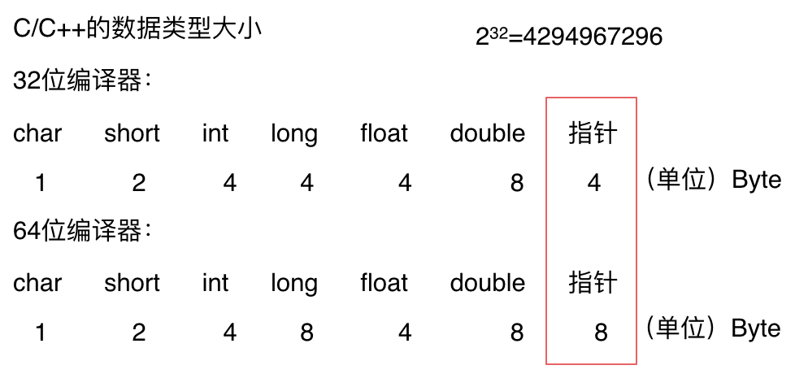

# 时间复杂度

> 是一个函数，定性描述该算法的运行时间

操作单元数量便用函数f(n)来表示，算法执行时间的增长率和$f(n)$的增长率相同，这称作为算法的渐近时间复杂度，记作$O(f(n))$

## 大O

> 用来表示上界，算法的最坏情况运行时间的上界

业内O代表一般情况，而不是严格的上界。但是要时刻注意数据用例。

O(1)常数阶 < O(logn)对数阶 < O(n)线性阶 < O(n^2)平方阶 < O(n^3)立方阶 < O(2^n)指数阶

- 数据规模很大时，复杂度常常忽略常数项。
- 常用化简法：去加法常数项、去常数系数、保留最高项。

O(logn)中log可以是10底也可以是2底

## 超时问题

> 一般OJ超时时间会定为1秒

O(nlogn)1s处理的数据规模比O(n)一般少一个量级，可以自己做实验测试

## 递归算法时间复杂度

> 复杂度=调用递归次数*每次递归复杂度

有可复用的递归一定要复用，否则最终复杂度还是不会降低。

# 空间复杂度

> 运行过程中占用内存空间大小的量度

$S(n)=O(f(n)$——可以对程序运行中需要多少**内存**有个预先估计，不是可执行文件本身的大小！

- 空间不变：O(1)
- 随n线性增长：O(n)
- O(logn)一般在递归时出现

## 递归算法空间复杂度

> 递归算法的空间复杂度 = 每次递归的空间复杂度 \* 递归深度

- 看语言在传递函数参数的时，是拷贝整个数值还是拷贝地址。拷贝整个数值的话空间复杂度*n

## 代码内存消耗

### 不同语言内存管理

- C++自己管理
- Java依赖JVM，需要了解其管理机制
- Python依赖私有堆空间，不用自己管理但是占内存

### C++

- 运行时消耗的内存主要看可变部分：**堆栈**
- **堆区间数据是需要程序员自己回收**，所以也就是造成内存泄漏的发源地

### 计算内存占用

### 内存对齐

原因：

1. 不是所有的硬件平台都能访问任意内存地址上的任意数据，为了同一个程序可以在多平台运行需要对齐
2. 经过内存对齐后，CPU访问内存的速度大大提升

内存对齐**也会影响到程序的内存占用**，需要考虑。