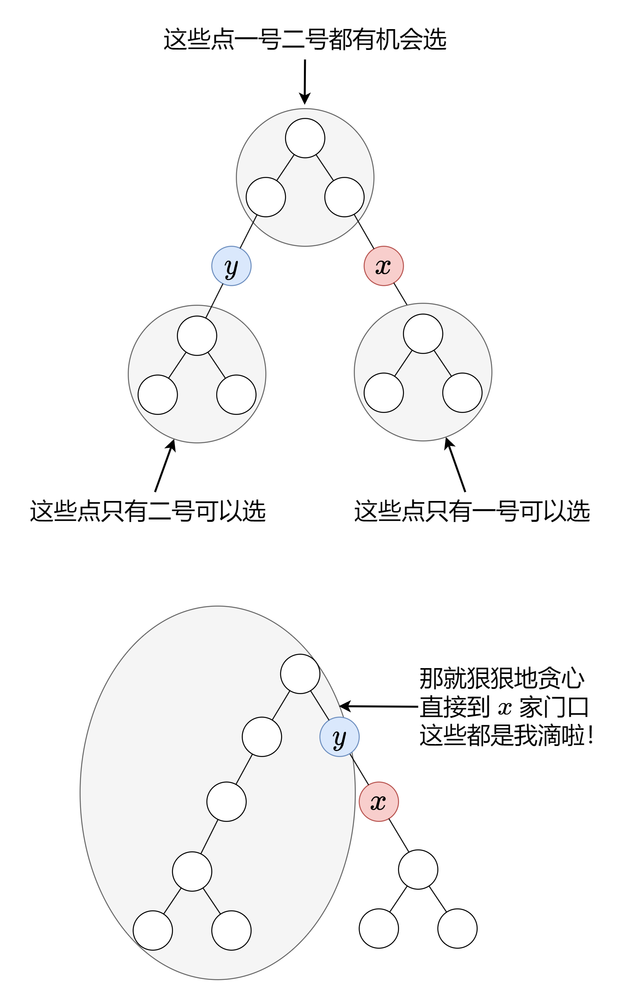

# 2319.判断矩阵是否是一个 X 矩阵

> 2023.01.31 模拟题

如果一个正方形矩阵满足下述 **全部** 条件，则称之为一个 **X 矩阵** ：

1. 矩阵对角线上的所有元素都 **不是 0**
2. 矩阵中所有其他元素都是 **0**

给你一个大小为 `n x n` 的二维整数数组 `grid` ，表示一个正方形矩阵。如果 `grid` 是一个 **X 矩阵** ，返回 `true` ；否则，返回 `false` 。

```c++
class Solution {
public:
    bool checkXMatrix(vector<vector<int>>& grid) {
        for (int i = 0; i < grid.size(); i++) {
            for (int j = 0; j < grid.size(); j++) {
                if (i == j || i + j == grid.size() - 1) {
                    if (!grid[i][j]) return false;
                } else {
                    if (grid[i][j]) return false;
                }
            }
        }
        return true;
    }
};
```

```python
class Solution:
    def checkXMatrix(self, grid: List[List[int]]) -> bool:
        for i in range(len(grid)):
            for j in range(len(grid)):
                if i == j or i + j == len(grid) - 1:
                    if not grid[i][j]: return False
                else:
                    if grid[i][j]: return False
        return True
```

# 2325. 解密消息

> 2023.02.01 哈希表（数组效率更高）

给你字符串 `key` 和 `message` ，分别表示一个加密密钥和一段加密消息。解密 `message` 的步骤如下：

1. 使用 `key` 中 26 个英文小写字母第一次出现的顺序作为替换表中的字母 **顺序** 。
2. 将替换表与普通英文字母表对齐，形成对照表。
3. 按照对照表 **替换** `message` 中的每个字母。
4. 空格 `' '` 保持不变。

- 例如，`key = "happy boy"`（实际的加密密钥会包含字母表中每个字母 **至少一次**），据此，可以得到部分对照表（`'h' -> 'a'`、`'a' -> 'b'`、`'p' -> 'c'`、`'y' -> 'd'`、`'b' -> 'e'`、`'o' -> 'f'`）。

返回解密后的消息。

- `26 <= key.length <= 2000`
- `key` 由小写英文字母及 `' '` 组成
- `key` 包含英文字母表中每个字符（`'a'` 到 `'z'`）**至少一次**
- `1 <= message.length <= 2000`
- `message` 由小写英文字母和 `' '` 组成

——使用字符数组存储映射关系，效率更高

```c++
class Solution {
public:
    string decodeMessage(string key, string message) {
        char dict[26]{};  // 对照表
        int index = 0;
        for (char c : key) {
            if (c == ' ') continue;
            if (!dict[c - 'a']) dict[c - 'a'] = 'a' + index++;
        }
        for (char& c : message) {
            if (c == ' ') continue;
            c = dict[c - 'a'];
        }
        return message;
    }
};
```

```python
class Solution:
    def decodeMessage(self, key: str, message: str) -> str:
        dic = {' ': ' '}
        index = 0
        for c in key:
            if c not in dic:
                dic[c] = ascii_lowercase[index]
                index += 1
        return ''.join(dic[c] for c in message)
```

# 1129*.颜色交替的最短路径

> 2022.02.02 图论BFS

在一个有向图中，节点分别标记为 `0, 1, ..., n-1`。图中每条边为红色或者蓝色，且存在自环或平行边。

`red_edges` 中的每一个 `[i, j]` 对表示从节点 `i` 到节点 `j` 的红色有向边。类似地，`blue_edges` 中的每一个 `[i, j]` 对表示从节点 `i` 到节点 `j` 的蓝色有向边。

返回长度为 `n` 的数组 `answer`，其中 `answer[X]` 是从节点 `0` 到节点 `X` 的红色边和蓝色边交替出现的最短路径的长度。如果不存在这样的路径，那么 `answer[x] = -1`。

```c++
class Solution {
public:
    vector<int> shortestAlternatingPaths(int n, vector<vector<int>>& redEdges, vector<vector<int>>& blueEdges) {
        vector<vector<int>> red(n);  // 红色路径，长度为n，resEdge[i] = j表示从i点到j点有一条
        vector<vector<int>> blue(n);  // 蓝色路径， 这两个其实是当map的，使用数组节省空间
        for (vector<int> e : redEdges) {  // 填充映射数组
            red[e[0]].push_back(e[1]);
        }
        for (vector<int> e : blueEdges) {
            blue[e[0]].push_back(e[1]);
        }
        queue<pair<int, int>> que;  // 用于BFS的队列，第一个元素是节点标号，第二个元素0，1分别表示红和蓝
        que.emplace(0, 0);
        que.emplace(0, 1);
        vector<vector<bool>> vis(n, vector<bool>(2, false));  // 记录节点是否被红色or蓝色路径遍历过
        vector<int> ans(n, -1);  // 结果数组，默认全是-1
        int depth = 0;  // 当前遍历深度（最短路径长度）
        while (!que.empty()) {
            int layerNum = que.size();  // 当前遍历层的大小
            while (layerNum) {
                int node = que.front().first;
                int color = que.front().second;
                que.pop();
                if (ans[node] == -1) ans[node] = depth;  // 更新答案
                vis[node][color] = true;  // 本节点找到了答案
                color ^= 1;  // 使用按位异或取反
                if (color) {
                    for (int dest : blue[node]) {
                        if (!vis[dest][1]) que.emplace(dest, 1);
                    }
                } else {
                    for (int dest : red[node]) {
                        if (!vis[dest][0]) que.emplace(dest, 0);
                    }
                }
                layerNum--;  // 计数变量
            }
            depth++;  // 遍历完一层，层数+1
        }
        return ans;
    }
};
```

```python
from collections import *
class Solution:
    def shortestAlternatingPaths(self, n: int, redEdges: List[List[int]], blueEdges: List[List[int]]) -> List[int]:
        red = [[] for _ in range(n)]
        blue = [[] for _ in range(n)]
        for e in redEdges:
            red[e[0]].append(e[1])
        for e in blueEdges:
            blue[e[0]].append(e[1])
        que = deque([(0, 0), (0, 1)])
        vis = [[False, False] for _ in range(n)]
        ans = [-1] * n
        depth = 0
        while que:
            layerNum = len(que)
            while layerNum:
                src, color = que.popleft()
                if ans[src] == -1:
                    ans[src] = depth
                vis[src][color] = True
                color ^= 1
                if color:
                    for dest in blue[src]:
                        if not vis[dest][1]:
                            que.append((dest, 1))
                else:
                    for dest in red[src]:
                        if not vis[dest][0]:
                            que.append((dest, 0))
                layerNum -= 1
            depth += 1
        return ans
```

# 1145*. 二叉树着色游戏

> 2022.02.03 二叉树 贪心 dfs

有两位极客玩家参与了一场「二叉树着色」的游戏。游戏中，给出二叉树的根节点 `root`，树上总共有 `n` 个节点，且 `n` 为奇数，其中每个节点上的值从 `1` 到 `n` 各不相同。

最开始时：

- 「一号」玩家从 `[1, n]` 中取一个值 `x`（`1 <= x <= n`）；
- 「二号」玩家也从 `[1, n]` 中取一个值 `y`（`1 <= y <= n`）且 `y != x`。

「一号」玩家给值为 `x` 的节点染上红色，而「二号」玩家给值为 `y` 的节点染上蓝色。

之后两位玩家轮流进行操作，「一号」玩家先手。每一回合，玩家选择一个被他染过色的节点，将所选节点一个 **未着色** 的邻节点（即左右子节点、或父节点）进行染色（「一号」玩家染红色，「二号」玩家染蓝色）。

如果（且仅在此种情况下）当前玩家无法找到这样的节点来染色时，其回合就会被跳过。

若两个玩家都没有可以染色的节点时，游戏结束。着色节点最多的那位玩家获得胜利 ✌️。

现在，假设你是「二号」玩家，根据所给出的输入，假如存在一个 `y` 值可以确保你赢得这场游戏，则返回 `true` ；若无法获胜，就请返回 `false` 。

---

[题解](https://leetcode.cn/problems/binary-tree-coloring-game/solutions/2089813/mei-you-si-lu-yi-zhang-tu-miao-dong-pyth-btav/?orderBy=most_votes)：

以 xxx 为根，它的三个邻居（左儿子、右儿子和父节点）就对应着三棵子树：

- 左子树
- 右子树
- 父节点子树

哪棵子树最大，二号玩家就选哪棵。



```c++
class Solution {
public:
    int leftNum, rightNum, xval;
    int dfs(TreeNode* root) {
        if (!root) return 0;
        int left = dfs(root->left);
        int right = dfs(root->right);
        if (root->val == xval) {
            leftNum = left;
            rightNum = right;
        }
        return left + right + 1;
    }
    bool btreeGameWinningMove(TreeNode* root, int n, int x) {
        xval = x;
        dfs(root);
        return max({leftNum, rightNum, n - leftNum - rightNum - 1}) * 2 > n;
    }
};
```

```python
class Solution:
    def btreeGameWinningMove(self, root: Optional[TreeNode], n: int, x: int) -> bool:
        leftNum, rightNum = 0, 0

        def dfs(root):
            nonlocal leftNum, rightNum
            if not root:
                return 0
            left = dfs(root.left)
            right = dfs(root.right)
            if root.val == x:
                leftNum = left
                rightNum = right
            return left + right + 1
        
        dfs(root)
        return max(leftNum, rightNum, n - leftNum - rightNum - 1) * 2 > n
```

