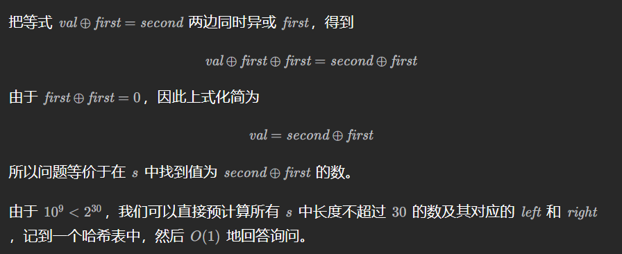

# 第 97 场双周赛

## 2553. 分割数组中数字的数位

> 模拟

给你一个正整数数组 `nums` ，请你返回一个数组 `answer` ，你需要将 `nums` 中每个整数进行数位分割后，按照 `nums` 中出现的 **相同顺序** 放入答案数组中。

对一个整数进行数位分割，指的是将整数各个数位按原本出现的顺序排列成数组。

- 比方说，整数 `10921` ，分割它的各个数位得到 `[1,0,9,2,1]` 。

---

- 使用递归从高到低遍历

```c++
class Solution {
public:
    void addNum(int num, vector<int>& ans) {
        int i = num / 10;
        if (i) {
            addNum(i, ans);
        }
        ans.push_back(num % 10);
    }
    vector<int> separateDigits(vector<int>& nums) {
        vector<int> ans;
        for(int i = 0; i < nums.size(); i++) {
            int num = nums[i];
            addNum(num, ans);
        }
        return ans;
    }
};
```

```python
class Solution:
    def separateDigits(self, nums: List[int]) -> List[int]:
        def addNum(num, ans):
            i = num // 10
            if i:
                addNum(i, ans)
            ans.append(num % 10)

        ans = []
        for num in nums:
            addNum(num, ans)
        return ans
# 一行
class Solution:
    def separateDigits(self, nums: List[int]) -> List[int]:
        return [int(a) for a in''.join( str(num)for num in nums)]
```

## 2554. 从一个范围内选择最多整数 I

> 贪心

给你一个整数数组 `banned` 和两个整数 `n` 和 `maxSum` 。你需要按照以下规则选择一些整数：

- 被选择整数的范围是 `[1, n]` 。
- 每个整数 **至多** 选择 **一次** 。
- 被选择整数不能在数组 `banned` 中。
- 被选择整数的和不超过 `maxSum` 。

请你返回按照上述规则 **最多** 可以选择的整数数目。

---

- 我的方法：给banned排序后双指针——注意banned可能有重复元素

```c++
class Solution {
public:
    int maxCount(vector<int>& banned, int n, int maxSum) {
        sort(banned.begin(), banned.end());
        int index = 0;  // banned下标
        int res = 0;
        int sumNum = 0;
        for (int i = 1; i <= n; i++) {
            if (index < banned.size() && i == banned[index]) {
                while (index < banned.size() && i == banned[index]) index++;
                continue;
            }
            sumNum += i;
            if (sumNum > maxSum) {
                return res;
            }
            res++;
        }
        return res;
    }
};
```

- 使用哈希表

```python
class Solution:
    def maxCount(self, banned: List[int], n: int, maxSum: int) -> int:
        ans = 0
        s = set(banned)
        for i in range(1, n + 1):
            if i > maxSum:
                break
            if i not in s:
                maxSum -= i
                ans += 1
        return ans
```

## 2555*. 两个线段获得的最多奖品

> 同向双指针 DP 贪心

在 **X轴** 上有一些奖品。给你一个整数数组 `prizePositions` ，它按照 **非递减** 顺序排列，其中 `prizePositions[i]` 是第 `i` 件奖品的位置。数轴上一个位置可能会有多件奖品。再给你一个整数 `k` 。

你可以选择两个端点为整数的线段。每个线段的长度都必须是 `k` 。你可以获得位置在任一线段上的所有奖品（包括线段的两个端点）。注意，两个线段可能会有相交。

- 比方说 `k = 2` ，你可以选择线段 `[1, 3]` 和 `[2, 4]` ，你可以获得满足 `1 <= prizePositions[i] <= 3` 或者 `2 <= prizePositions[i] <= 4` 的所有奖品 i 。

请你返回在选择两个最优线段的前提下，可以获得的 **最多** 奖品数目。

---

- 两个区间一定是不重叠的
- 用一个数组 pre[right+1] 记录线段右端点不超过 prizePositions[right]时最多可以覆盖多少个奖品。

- pre[0]=0，pre[right+1]=max(pre[right],right−left+1)
- 遍历中最多可以覆盖的奖牌数为：right−left+1+pre[left]

```c++
class Solution {
public:
    int maximizeWin(vector<int>& prizePositions, int k) {
        int left = 0, n = prizePositions.size(), res = 0;
        vector<int> dp(n + 1, 0);  // dp[n + 1]表示right <= n时最多可以覆盖的奖品数目
        for (int right = 0; right < n; right++) {
            while (prizePositions[left] < prizePositions[right] - k) left++;
            res = max(res, right - left + 1 + dp[left]);
            dp[right + 1] = max(dp[right], right - left + 1);
        }
        return res;
    }
};
```

```python
class Solution:
    def maximizeWin(self, prizePositions: List[int], k: int) -> int:
        res = 0
        left = 0
        n = len(prizePositions)
        dp = [0] * (n + 1)
        for right in range(n):
            while prizePositions[left] < prizePositions[right] - k:
                left += 1
            dp[right + 1] = max(dp[right], right - left + 1)
            res = max(res, right - left + 1 + dp[left])
        return res
```

## 2556*. 二进制矩阵中翻转最多一次使路径不连通

> 两次dfs

给你一个下标从 **0** 开始的 `m x n` **二进制** 矩阵 `grid` 。你可以从一个格子 `(row, col)` 移动到格子 `(row + 1, col)` 或者 `(row, col + 1)` ，前提是前往的格子值为 `1` 。如果从 `(0, 0)` 到 `(m - 1, n - 1)` 没有任何路径，我们称该矩阵是 **不连通** 的。

你可以翻转 **最多一个** 格子的值（也可以不翻转）。你 **不能翻转** 格子 `(0, 0)` 和 `(m - 1, n - 1)` 。

如果可以使矩阵不连通，请你返回 `true` ，否则返回 `false` 。

**注意** ，翻转一个格子的值，可以使它的值从 `0` 变 `1` ，或从 `1` 变 `0` 。

---

- 两次dfs，第一次遍历走上轮廓或下轮廓，把路径上的1都变成0
- 第二次再看有没有通路，要还有就返回false

```c++
class Solution {
public:
    int m, n;
    bool dfs(vector<vector<int>>& grid, int x, int y) {
        if (x == m - 1 && y == n - 1) return true;
        grid[x][y] = 0;
        return x < m - 1 && grid[x + 1][y] && dfs(grid, x + 1, y) ||
               y < n - 1 && grid[x][y + 1] && dfs(grid, x, y + 1);
    }
    bool isPossibleToCutPath(vector<vector<int>>& grid) {
        m = grid.size();
        n = grid[0].size();
        return !dfs(grid, 0, 0) || !dfs(grid, 0, 0);
    }
};
```

```python
class Solution:
    def isPossibleToCutPath(self, grid: List[List[int]]) -> bool:
        m = len(grid)
        n = len(grid[0])

        def dfs(x, y):
            if x == m - 1 and y == n - 1:
                return True
            grid[x][y] = 0
            return y < n - 1 and grid[x][y + 1] and dfs(x, y + 1) or \
                   x < m - 1 and grid[x + 1][y] and dfs(x + 1, y)
        
        return not dfs(0, 0) or not dfs(0, 0)
```

# 第 332 场周赛

## 2562. 找出数组的串联值

> 模拟

给你一个下标从 **0** 开始的整数数组 `nums` 。

现定义两个数字的 **串联** 是由这两个数值串联起来形成的新数字。

- 例如，`15` 和 `49` 的串联是 `1549` 。

`nums` 的 **串联值** 最初等于 `0` 。执行下述操作直到 `nums` 变为空：

- 如果 `nums` 中存在不止一个数字，分别选中 `nums` 中的第一个元素和最后一个元素，将二者串联得到的值加到 `nums` 的 **串联值** 上，然后从 `nums` 中删除第一个和最后一个元素。
- 如果仅存在一个元素，则将该元素的值加到 `nums` 的串联值上，然后删除这个元素。

返回执行完所有操作后 `nums` 的串联值。

---

```c++
class Solution {
public:
    long long findTheArrayConcVal(vector<int>& nums) {
        long long res = 0;
        int size = nums.size();
        for (int i = 0; i < size / 2; i++) {
            int last = nums[size - i - 1];
            int first = nums[i];
            while (last) {
                first *= 10;
                last /= 10;
            }
            res += first+ nums[size - i - 1];
        }
        if (size % 2) res += nums[size / 2];
        return res;
    }
};
```

```python
class Solution:
    def findTheArrayConcVal(self, nums: List[int]) -> int:
        res = 0
        size = len(nums)
        for i in range(size // 2):
            last = nums[size - i - 1]
            first = nums[i]
            while last > 0:
                first *= 10
                last //= 10
            res += first + nums[size - i - 1]
        if size % 2:
            res += nums[size // 2]
        return res
```

## 2563*. 统计公平数对的数目

> 排序+双指针（慢）/二分查找（快）

给你一个下标从 **0** 开始、长度为 `n` 的整数数组 `nums` ，和两个整数 `lower` 和 `upper` ，返回 **公平数对的数目** 。

如果 `(i, j)` 数对满足以下情况，则认为它是一个 **公平数对** ：

- `0 <= i < j < n`，且
- `lower <= nums[i] + nums[j] <= upper`

---

- 先给数组排序
- 再遍历元素，找它和它后面的剩余数组组合
- 二分法查找剩余数组范围，叠加到总个数中

```c++
class Solution {
public:
    int binarySearch(vector<int>& nums, int lower, int upper, int left, int right) {
        if (left > right) return 0;
        int l = left, r = right;
        while (l < r) {
            int mid = l + (r - l) / 2;
            if (nums[mid] < lower) l = mid + 1;
            else r = mid;
        }
        int low = l;
        l = left, r = right;
        while (l < r) {
            int mid = l + (r - l) / 2;
            if (nums[mid] > upper) r = mid;
            else l = mid + 1;
        }
        if (nums[l] > upper) l--;
        return l - low + 1;
    }
    long long countFairPairs(vector<int>& nums, int lower, int upper) {
        sort(nums.begin(), nums.end());  // 先给数组排序O(nlogn)
        long long res = 0;
        
        int size = nums.size();
        for (int i = 0; i < size; i++) {
            int left = i + 1, right = size - 1;
            if (left < size && nums[i] + nums[left] <= upper && nums[i] + nums[right] >= lower) {
                res += binarySearch(nums, lower - nums[i], upper - nums[i], left, right);
            }
        }
        
        return res;
    }
};
```

- 调库

```c++
class Solution {
public:
    long long countFairPairs(vector<int>& nums, int lower, int upper) {
        sort(nums.begin(), nums.end());  // 先给数组排序O(nlogn)
        long long res = 0;
        
        int size = nums.size();
        for (int i = 0; i < size; i++) {
            auto r = upper_bound(nums.begin(), nums.begin() + i, upper - nums[i]);
            auto l = lower_bound(nums.begin(), nums.begin() + i, lower - nums[i]);
            res += r - l;
        }
        
        return res;
    }
};
```

```python
class Solution:
    def countFairPairs(self, nums: List[int], lower: int, upper: int) -> int:
        res = 0
        nums.sort()
        for i in range(len(nums)):
            r = bisect_right(nums, upper - nums[i], 0, i)
            l = bisect_left(nums, lower - nums[i], 0, i)
            res += r - l
        return res
```

## 2564*. 子字符串异或查询

给你一个 **二进制字符串** `s` 和一个整数数组 `queries` ，其中 `queries[i] = [firsti, secondi]` 。

对于第 `i` 个查询，找到 `s` 的 **最短子字符串** ，它对应的 **十进制**值 `val` 与 `firsti` **按位异或** 得到 `secondi` ，换言之，`val ^ firsti == secondi` 。

第 `i` 个查询的答案是子字符串 `[lefti, righti]` 的两个端点（下标从 **0** 开始），如果不存在这样的子字符串，则答案为 `[-1, -1]` 。如果有多个答案，请你选择 `lefti` 最小的一个。

请你返回一个数组 `ans` ，其中 `ans[i] = [lefti, righti]` 是第 `i` 个查询的答案。

**子字符串** 是一个字符串中一段连续非空的字符序列。

---

预处理 s 中的所有数字



```c++
class Solution {
public:
    vector<vector<int>> substringXorQueries(string s, vector<vector<int>>& queries) {
        unordered_map<int, pair<int, int>> dic;
        if (auto i = s.find('0'); i != string::npos) {  // 注意string的find方法找不到返回不是end()
            dic[0] = {i, i};
        }
        for (int l = 0, n = s.size(); l < n; l++) {  // 遍历填充范围字典
            if (s[l] == '0') continue;
            for (int r = l, x = 0; r < min(l + 30, n); r++) {
                if (s[r] == '0') x = x << 1;
                else x = (x << 1) + 1;
                if (dic.find(x) == dic.end()) dic[x] = {l, r};
            }
        }
        vector<vector<int>> ans;
        for (auto& q : queries) {
            int temp = q[0] ^ q[1];
            if (dic.find(temp) == dic.end()) {
                ans.push_back({-1, -1});
            } else {
                ans.push_back({dic[temp].first, dic[temp].second});
            }
        }
        return ans;
    }
};
```

```python
class Solution:
    def substringXorQueries(self, s: str, queries: List[List[int]]) -> List[List[int]]:
        n, dic = len(s), {}
        if (i := s.find('0')) >= 0:
            dic[0] = (i, i)
        for l, c in enumerate(s):
            if c == '0': continue
            x = 0
            for r in range(l, min(30 + l, n)):
                if s[r] == '0':
                    x = x << 1
                else:
                    x = (x << 1) + 1
                if x not in dic:
                    dic[x] = (l, r)
        NOT_FOUND = (-1, -1)
        return [dic.get(x ^ y, NOT_FOUND) for x, y in queries]
```

