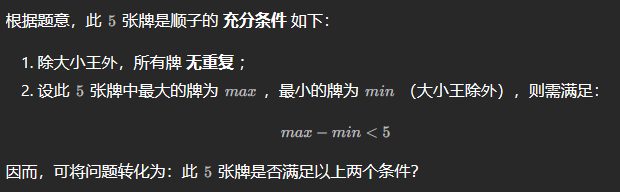

# 第一天 栈与队列（简单）

## 剑指 Offer 09. 用两个栈实现队列

用两个栈实现一个队列。队列的声明如下，请实现它的两个函数 `appendTail` 和 `deleteHead` ，分别完成在队列尾部插入整数和在队列头部删除整数的功能。(若队列中没有元素，`deleteHead` 操作返回 -1 )

---

```c++
class CQueue {
public:
    stack<int> stIn;
    stack<int> stOut;
    CQueue() {

    }
    
    void appendTail(int value) {
        stIn.push(value);
    }
    
    int deleteHead() {
        if (stIn.empty() && stOut.empty()) return -1;
        if (stOut.empty()) {
            while(!stIn.empty()) {
                stOut.push(stIn.top());
                stIn.pop();
            }
        }
        int res = stOut.top();
        stOut.pop();
        return res;
    }
};
```

```python
class CQueue:

    def __init__(self):
        self.stIn = []
        self.stOut = []

    def appendTail(self, value: int) -> None:
        self.stIn.append(value)

    def deleteHead(self) -> int:
        if not self.stIn and not self.stOut:
            return -1
        if not self.stOut:
            while self.stIn:
                self.stOut.append(self.stIn.pop())
        return self.stOut.pop()
```

## 剑指 Offer 30. 包含min函数的栈

定义栈的数据结构，请在该类型中实现一个能够得到栈的最小元素的 min 函数在该栈中，调用 min、push 及 pop 的时间复杂度都是 O(1)。

---

辅助栈 B ： 栈 B 中存储栈 A 中所有 非严格降序 的元素，则栈 A 中的最小元素始终对应栈 B 的栈顶元素，即 min() 函数只需返回栈 B 的栈顶元素即可。

```c++
class MinStack {
public:
    /** initialize your data structure here. */
    stack<int> A;
    stack<int> B;

    MinStack() {

    }
    
    void push(int x) {
        A.push(x);
        if (B.empty() || x <= B.top()) B.push(x);
    }
    
    void pop() {
        if (A.top() == B.top()) B.pop();
        A.pop();
    }
    
    int top() {
        return A.top();
    }
    
    int min() {
        return B.top();
    }
};
```

```python
class MinStack:

    def __init__(self):
        """
        initialize your data structure here.
        """
        self.A = []
        self.B = []

    def push(self, x: int) -> None:
        self.A.append(x)
        if not self.B or self.B[-1] >= x:
            self.B.append(x)

    def pop(self) -> None:
        if self.A[-1] == self.B[-1]:
            self.B.pop()
        self.A.pop()

    def top(self) -> int:
        return self.A[-1]

    def min(self) -> int:
        return self.B[-1]
```

# 第 2 天 链表（简单）

## 剑指 Offer 06. 从尾到头打印链表

输入一个链表的头节点，从尾到头反过来返回每个节点的值（用数组返回）。

---

1. 使用递归回溯来反向
2. 先放到栈，再pop
3. 调reverse库
4. 改变链表结构

```c++
class Solution {
public:
    vector<int> res;
    void traversal(ListNode* root) {
        if (!root) return;
        traversal(root->next);
        res.push_back(root->val);
    }
    vector<int> reversePrint(ListNode* head) {
        traversal(head);
        return res;
    }
};
```

```python
class Solution:
    def reversePrint(self, head: ListNode) -> List[int]:
        def traversal(root):
            if not root: return
            traversal(root.next)
            res.append(root.val)
            
        res = []
        traversal(head)
        return res
```

## 剑指 Offer 24. 反转链表

定义一个函数，输入一个链表的头节点，反转该链表并输出反转后链表的头节点。

---

```c++
class Solution {
public:
    ListNode* reverseList(ListNode* head) {
        ListNode* pre = nullptr, *cur = head;
        while (cur) {
            ListNode* next = cur->next;
            cur->next = pre;
            pre = cur;
            cur = next;
        }
        return pre;
    }
};
```

```python
class Solution:
    def reverseList(self, head: ListNode) -> ListNode:
        pre = None
        cur = head
        while cur:
            next = cur.next
            cur.next = pre
            pre = cur
            cur = next
        return pre
```

## 剑指 Offer 35*. 复杂链表的复制

请实现 `copyRandomList` 函数，复制一个复杂链表。在复杂链表中，每个节点除了有一个 `next` 指针指向下一个节点，还有一个 `random` 指针指向链表中的任意节点或者 `null`。

---

- *深拷贝*
- **本题难点：** 在复制链表的过程中构建新链表各节点的 `random` 引用指向。

### 哈希表

- （原：新）映射

```c++
class Solution {
public:
    Node* copyRandomList(Node* head) {
        if (!head) return nullptr;
        unordered_map<Node*, Node*> map;
        Node* cur = head;
        while (cur) {
            map[cur] = new Node(cur->val);
            cur = cur->next;
        }
        cur = head;
        while (cur) {
            map[cur]->next = map[cur->next];
            map[cur]->random = map[cur->random];
            cur = cur->next;
        }
        return map[head];
    }
};
```

```python
class Solution:
    def copyRandomList(self, head: 'Node') -> 'Node':
        if not head: return None
        dic = {}
        cur = head
        while cur:
            dic[cur] = Node(cur.val)
            cur = cur.next
        cur = head
        while cur:
            dic[cur].next = dic.get(cur.next)
            dic[cur].random = dic.get(cur.random)
            cur = cur.next
        return dic[head]
```

### 拼接 + 拆分

```c++
class Solution {
public:
    Node* copyRandomList(Node* head) {
        if (!head) return nullptr;
        Node* cur = head;
        while (cur) {  // 构建串数组
            Node* tmp = new Node(cur->val);
            tmp->next = cur->next;
            cur->next = tmp;
            cur = tmp->next;
        }
        cur = head;
        while (cur) {  // 填充random
            if (cur->random) cur->next->random = cur->random->next;
            cur = cur->next->next;
        }
        cur = head->next;
        Node* pre = head, *res = head->next;
        while (cur->next) {
            pre->next = pre->next->next;
            cur->next = cur->next->next;
            pre = pre->next;
            cur = cur->next;
        }
        pre->next = nullptr;
        return res;
    }
};
```

```python
class Solution:
    def copyRandomList(self, head: 'Node') -> 'Node':
        if not head: return None
        cur = head
        while cur:
            tmp = Node(cur.val)
            tmp.next = cur.next
            cur.next = tmp
            cur = tmp.next
        cur = head
        while cur:
            if cur.random:
                cur.next.random = cur.random.next
            cur = cur.next.next
        cur = head.next
        res = cur
        pre = head
        while cur.next:
            pre.next = pre.next.next
            cur.next = cur.next.next
            pre = pre.next
            cur = cur.next
        pre.next = None
        return res
```

# 第 3 天 字符串（简单）

## 剑指 Offer 05. 替换空格

请实现一个函数，把字符串 `s` 中的每个空格替换成"%20"。

---

- 先统计空格个数，给字符串扩容：加2×空格数
- 双指针法从后往前，遇到空格就换成%20

```c++
class Solution {
public:
    string replaceSpace(string s) {
        int count = 0; // 统计空格个数
        int slen = s.size(); // 字符串原始长度
        for (char c : s) {
            if (c == ' ') {
                count++;
            }
        }
        s.resize(slen + count * 2);  // 重新分配空间
        for (int i = s.size() - 1, j = slen - 1; i > j; i--,j--) {
            if (s[j] == ' ') {
                s[i] = '0';
                s[--i] = '2';
                s[--i] = '%';
            } else {
                s[i] = s[j];
            }
        }
        return s;
    }
};
```

```python
class Solution:
    def replaceSpace(self, s: str) -> str:
        count = s.count(' ')
        res = list(s)
        res.extend(' ' * count * 2)
        slow = len(s) - 1
        fast = len(res) - 1
        while slow >= 0:
            if s[slow] != ' ':
                res[fast] = s[slow]
                fast -= 1
                slow -= 1
            else:
                res[fast - 2 : fast + 1] = '%20'
                fast -= 3
                slow -= 1
        return ''.join(res) 
```

## 剑指 Offer 58 - II. 左旋转字符串

字符串的左旋转操作是把字符串前面的若干个字符转移到字符串的尾部。请定义一个函数实现字符串左旋转操作的功能。比如，输入字符串"abcdefg"和数字2，该函数将返回左旋转两位得到的结果"cdefgab"。

---

1. 三次反转

```c++
class Solution {
public:
    string reverseLeftWords(string s, int n) {
        reverse(s.begin(), s.begin() + n);
        reverse(s.begin() + n, s.end());
        reverse(s.begin(), s.end());
        return s;
    }
};
```

```python
class Solution:
    def reverseLeftWords(self, s: str, n: int) -> str:
        s = s[:n][::-1] + s[n:]
        s = s[:n]+ s[n:][::-1]
        s = s[::-1]
        return s
```

2. 拼接+截取（一行）

```c++
class Solution {
public:
    string reverseLeftWords(string s, int n) {
        return (s + s).substr(n, s.size());
    }
};
```

```python
class Solution:
    def reverseLeftWords(self, s: str, n: int) -> str:
        return (s + s)[n : len(s) + n]
```

# 第 4 天 查找算法（简单）

## 剑指 Offer 03. 数组中重复的数字

找出数组中重复的数字。
 在一个长度为 n 的数组 nums 里的所有数字都在 0～n-1 的范围内。数组中某些数字是重复的，但不知道有几个数字重复了，也不知道每个数字重复了几次。请找出数组中任意一个重复的数字。

---

1. 一个萝卜一个坑：重头扫描数组，遇到下标为i的数字如果不是i的话，（假设为m),那么我们就拿与下标m的数字交换。在交换过程中，如果有重复的数字发生，那么终止返回ture

   ```c++
   class Solution {
   public:
       int findRepeatNumber(vector<int>& nums) {
           for (int i = 0; i < nums.size(); i++) {
               while (nums[i] != i) {
                   if (nums[i] == nums[nums[i]]) return nums[i];
                   int temp = nums[i];
                   nums[i] = nums[temp];
                   nums[temp] = temp;
               }
           }
           return -1;
       }
   };
   ```

   ```python
   class Solution:
       def findRepeatNumber(self, nums: List[int]) -> int:
           for i in range(len(nums)):
               while nums[i] != i:
                   if nums[i] == nums[nums[i]]:
                       return nums[i]
                   temp = nums[i]
                   nums[i] = nums[temp]
                   nums[temp] = temp
           return -1
   ```

2. 哈希表（略）

## 剑指 Offer 53* - I. 在排序数组中查找数字 I

统计一个数字在排序数组中出现的次数。

-- -

- 二分查找（分布查左边界和右边界）

```c++
class Solution {
public:
    int binarySearch(vector<int>& nums, int target) {
        int left = 0;
        int right = nums.size() - 1;
        while (left <= right) {
            int mid = left + (right - left) / 2;
            if (nums[mid] <= target) left = mid + 1;
            else right = mid - 1;
        }
        return left;
    }
    int search(vector<int>& nums, int target) {
        return binarySearch(nums, target) - binarySearch(nums, target - 1);
    }
};
```

```python
class Solution:
    def search(self, nums: List[int], target: int) -> int:
        def binarySearch(target):
            left, right = 0, len(nums) - 1
            while left <= right:
                mid = (left + right) // 2
                if nums[mid] <= target:
                    left = mid + 1
                else:
                    right = mid - 1
            return left
        return binarySearch(target) - binarySearch(target - 1)
```

## 剑指 Offer 53 - II. 0～n-1中缺失的数字

一个长度为n-1的递增排序数组中的所有数字都是唯一的，并且每个数字都在范围0～n-1之内。在范围0～n-1内的n个数字中有且只有一个数字不在该数组中，请找出这个数字。

---

```c++
class Solution {
public:
    int missingNumber(vector<int>& nums) {
        int left = 0;
        int right = nums.size() - 1;
        while (left <= right) {
            int mid = left + (right - left) / 2;
            if (nums[mid] == mid) left = mid + 1;
            else right = mid - 1;
        }
        return left;
    }
};
```

```python
class Solution:
    def missingNumber(self, nums: List[int]) -> int:
        left = 0
        right = len(nums)
        while left < right:
            mid = (left + right) // 2
            if nums[mid] == mid:
                left = mid + 1
            else:
                right = mid
        return left
```

# 第 5 天 查找算法（中等）

## 剑指 Offer 04*. 二维数组中的查找

在一个 n * m 的二维数组中，每一行都按照从左到右 **非递减** 的顺序排序，每一列都按照从上到下 **非递减** 的顺序排序。请完成一个高效的函数，输入这样的一个二维数组和一个整数，判断数组中是否含有该整数。

---

[参考](https://leetcode.cn/problems/er-wei-shu-zu-zhong-de-cha-zhao-lcof/solutions/95306/mian-shi-ti-04-er-wei-shu-zu-zhong-de-cha-zhao-zuo/?orderBy=most_votes)


- 必须从左下角，因为万一matrix为空，matrix[0]是不存在的，无法找到j的下标——可以加条件判断

```c++
class Solution {
public:
    bool findNumberIn2DArray(vector<vector<int>>& matrix, int target) {
        int i = matrix.size() - 1, j = 0;
        while (i >= 0 && j < matrix[0].size()) {
            if (matrix[i][j] > target) i--;
            else if (matrix[i][j] < target) j++;
            else return true;
        }
        return false;
    }
};
```

```python
class Solution:
    def findNumberIn2DArray(self, matrix: List[List[int]], target: int) -> bool:
        i = len(matrix) - 1
        j = 0
        while i >= 0 and j < len(matrix[0]):
            if matrix[i][j] > target:
                i -= 1
            elif matrix[i][j] < target:
                j += 1
            else:
                return True
        return False
```

## 剑指 Offer 11*. 旋转数组的最小数字

把一个数组最开始的若干个元素搬到数组的末尾，我们称之为数组的旋转。

给你一个可能存在 **重复** 元素值的数组 `numbers` ，它原来是一个升序排列的数组，并按上述情形进行了一次旋转。请返回旋转数组的**最小元素**。例如，数组 `[3,4,5,1,2]` 为 `[1,2,3,4,5]` 的一次旋转，该数组的最小值为 1。 

注意，数组 `[a[0], a[1], a[2], ..., a[n-1]]` 旋转一次 的结果为数组 `[a[n-1], a[0], a[1], a[2], ..., a[n-2]]` 。

---

- 二分查找，在mid等于right值时，让right自减缩小范围

  ```c++
  class Solution {
  public:
      int minArray(vector<int>& numbers) {
          int left = 0, right = numbers.size() - 1;
          while (left < right) {
              int mid = (left + right) / 2;
              if (numbers[mid] > numbers[right]) left = mid + 1;
              else if (numbers[mid] < numbers[right]) right = mid;
              else right--;
          }
          return numbers[left];
      }
  };
  ```

- 二分查找，在mid等于right值时，使用线性查找

  ```python
  class Solution:
      def minArray(self, numbers: List[int]) -> int:
          left = 0
          right = len(numbers) - 1
          while left < right:
              mid = (left + right) // 2
              if numbers[mid] < numbers[right]:
                  right = mid
              elif numbers[mid] > numbers[right]:
                  left = mid + 1
              else:
                  return min(numbers[left:right])
          return numbers[left]
  ```

## 剑指 Offer 50. 第一个只出现一次的字符

在字符串 s 中找出第一个只出现一次的字符。如果没有，返回一个单空格。 s 只包含小写字母。

---

1. 无序哈希表（数组）+两次遍历字符串

   ```c++
   class Solution {
   public:
       char firstUniqChar(string s) {
           vector<int> dic(26, 0);
           for (int i = 0; i < s.size(); i++) {
               dic[s[i] - 'a']++;
           }
           for (char& c : s) {
               if (dic[c - 'a'] == 1) return c;
           }
           return ' ';
       }
   };
   ```

2. 有序哈希表+一次遍历字符串+一次遍历哈希表

   ——Python 3.6 后，默认字典就是有序的

   ```python
   class Solution:
       def firstUniqChar(self, s: str) -> str:
           dic = {}
           for c in s:
               dic[c] = c not in dic
           for k, v in dic.items():
               if v: return k
           return ' '
   ```

# 第 6 天 搜索与回溯算法（简单）

## 剑指 Offer 32 - I. 从上到下打印二叉树

从上到下打印出二叉树的每个节点，同一层的节点按照从左到右的顺序打印。

---

层序遍历

```c++
class Solution {
public:
    vector<int> levelOrder(TreeNode* root) {
        vector<int> res;
        if (!root) return res;
        queue<TreeNode*> que;
        que.push(root);
        while (!que.empty()) {
            int size = que.size();
            for (int i = 0; i < size; i++) {
                TreeNode* node = que.front();
                que.pop();
                res.push_back(node->val);
                if (node->left) que.push(node->left);
                if (node->right) que.push(node->right);
            }
        }
        return res;
    }
};
```

```python
class Solution:
    def levelOrder(self, root: TreeNode) -> List[int]:
        res = []
        if not root: return res

        from collections import deque
        que = deque([root])
        while que:
            size = len(que)
            for _ in range(size):
                node = que.popleft()
                res.append(node.val)
                if node.left:
                    que.append(node.left)
                if node.right:
                    que.append(node.right)
        return res
```

## 剑指 Offer 32 - II. 从上到下打印二叉树 II

从上到下按层打印二叉树，同一层的节点按从左到右的顺序打印，每一层打印到一行。

---

和上一题基本相同

```c++
class Solution {
public:
    vector<vector<int>> levelOrder(TreeNode* root) {
        vector<vector<int>> res;
        if (!root) return res;
        queue<TreeNode*> que;
        que.push(root);
        while (!que.empty()) {
            int size = que.size();
            vector<int> temp;
            for (int i = 0; i < size; i++) {
                TreeNode* node = que.front();
                que.pop();
                temp.push_back(node->val);
                if (node->left) que.push(node->left);
                if (node->right) que.push(node->right);
            }
            res.push_back(temp);
        }
        return res;
    }
};
```

```python
class Solution:
    def levelOrder(self, root: TreeNode) -> List[List[int]]:
        res = []
        if not root: return res

        from collections import deque
        que = deque([root])
        while que:
            size = len(que)
            temp = []
            for _ in range(size):
                node = que.popleft()
                temp.append(node.val)
                if node.left:
                    que.append(node.left)
                if node.right:
                    que.append(node.right)
            res.append(temp)
        return res
```

## 剑指 Offer 32 - III. 从上到下打印二叉树 III

请实现一个函数按照之字形顺序打印二叉树，即第一行按照从左到右的顺序打印，第二层按照从右到左的顺序打印，第三行再按照从左到右的顺序打印，其他行以此类推。

---

设置双端队列，判断奇偶层，奇数层正向添加，偶数层逆向添加

```c++
class Solution {
public:
    vector<vector<int>> levelOrder(TreeNode* root) {
        vector<vector<int>> res;
        if (!root) return res;
        queue<TreeNode*> que;
        que.push(root);
        while (!que.empty()) {
            int size = que.size();
            deque<int> temp;
            for (int i = 0; i < size; i++) {
                TreeNode* node = que.front();
                que.pop();
                if (res.size() % 2) {
                    temp.push_front(node->val);
                } else {
                    temp.push_back(node->val);
                }
                if (node->left) que.push(node->left);
                if (node->right) que.push(node->right);
            }
            res.push_back(vector<int>(temp.begin(), temp.end()));
        }
        return res;
    }
};
```

```python
class Solution:
    def levelOrder(self, root: TreeNode) -> List[List[int]]:
        res = []
        if not root: return res

        from collections import deque
        que = deque([root])
        while que:
            size = len(que)
            temp = deque()
            for _ in range(size):
                node = que.popleft()
                if len(res) % 2:
                    temp.appendleft(node.val)
                else:
                    temp.append(node.val)
                if node.left:
                    que.append(node.left)
                if node.right:
                    que.append(node.right)
            res.append(list(temp))
        return res
```

# 第 7 天 搜索与回溯算法（简单）

## 剑指 Offer 26*. 树的子结构

输入两棵二叉树A和B，判断B是不是A的子结构。(约定空树不是任意一个树的子结构)

B是A的子结构， 即 A中有出现和B相同的结构和节点值。

---

先序遍历：注意 根节点子结构 和 包含子结构 的不同

- 根节点子结构：从根节点开始，A包含B（根节点必须相同或B为空）
- 包含子结构：本题要求的，即根节点不一定相同，可以在左右子树中找到B的结构

```c++
class Solution {
public:
    bool rootSubStructure(TreeNode* A, TreeNode* B) {
        if (!B) return true;
        if (!A || A->val != B->val) return false;
        return rootSubStructure(A->left, B->left) && rootSubStructure(A->right, B->right);
    }
    bool isSubStructure(TreeNode* A, TreeNode* B) {
        if (!A || !B) return false;  // 特殊情况
        return rootSubStructure(A, B) || isSubStructure(A->left, B) || isSubStructure(A->right, B);
    }
};
```

```python
class Solution:
    def rootSub(self, A: TreeNode, B: TreeNode) -> bool:
        if not B:
            return True
        if not A or A.val != B.val:
            return False
        return self.rootSub(A.left, B.left) and self.rootSub(A.right, B.right)
    def isSubStructure(self, A: TreeNode, B: TreeNode) -> bool:
        if not A or not B:
            return False
        return self.rootSub(A, B) or self.isSubStructure(A.left, B) or self.isSubStructure(A.right, B)
```

## 剑指 Offer 27. 二叉树的镜像

请完成一个函数，输入一个二叉树，该函数输出它的镜像。

---

- 后序遍历，交换左右节点即可

```c++
class Solution {
public:
    TreeNode* mirrorTree(TreeNode* root) {
        if (!root) return root;
        mirrorTree(root->left);
        mirrorTree(root->right);
        swap(root->left, root->right);
        return root;
    }
};
```

```python
class Solution:
    def mirrorTree(self, root: TreeNode) -> TreeNode:
        if not root:
            return root
        self.mirrorTree(root.left)
        self.mirrorTree(root.right)
        root.left, root.right = root.right, root.left
        return root
```

## 剑指 Offer 28. 对称的二叉树

请实现一个函数，用来判断一棵二叉树是不是对称的。如果一棵二叉树和它的镜像一样，那么它是对称的。

---

- 递归后序

```c++
class Solution {
public:
    bool compare(TreeNode* left, TreeNode* right) {
        if (!left && !right) return true;
        if (!left || !right) return false;
        return left->val == right->val && compare(left->left, right->right) && compare(left->right, right->left);
    }
    bool isSymmetric(TreeNode* root) {
        return compare(root, root);
    }
};
```

```python
class Solution:
    def isSymmetric(self, root: TreeNode) -> bool:
        def compare(p, q):
            if not p and not q:
                return True
            if not p or not q:
                return False
            return p.val == q.val and compare(p.left, q.right) and compare(p.right, q.left)
        return compare(root, root)
```

# 第 8 天 动态规划（简单）

## 剑指 Offer 10- I. 斐波那契数列

写一个函数，输入 `n` ，求斐波那契（Fibonacci）数列的第 `n` 项（即 `F(N)`）。斐波那契数列的定义如下：

```
F(0) = 0,   F(1) = 1
F(N) = F(N - 1) + F(N - 2), 其中 N > 1.
```

斐波那契数列由 0 和 1 开始，之后的斐波那契数就是由之前的两数相加而得出。

答案需要取模 1e9+7（1000000007），如计算初始结果为：1000000008，请返回 1。

---

```c++
class Solution {
public:
    const int MOD = 1e9 + 7;
    int fib(int n) {
        if (n <= 1) return n;
        int dp[2];
        dp[0] = 0;
        dp[1] = 1;
        for (int i = 2; i < n + 1; i++) {
            int sum = (dp[0] + dp[1]) % MOD;
            dp[0] = dp[1];
            dp[1] = sum;
        }
        return dp[1];
    }
};
```

```python
class Solution:
    def fib(self, n: int) -> int:
        if n <= 1: return n
        MOD = 10 ** 9 + 7
        dp = [0, 1]
        for i in range(2, n + 1):
            sumNum = (dp[0] + dp[1]) % MOD
            dp[0] = dp[1]
            dp[1] = sumNum
        return dp[1]
```

## 剑指 Offer 10- II. 青蛙跳台阶问题

一只青蛙一次可以跳上1级台阶，也可以跳上2级台阶。求该青蛙跳上一个 `n` 级的台阶总共有多少种跳法。

答案需要取模 1e9+7（1000000007），如计算初始结果为：1000000008，请返回 1。

---

- dp[i] = dp[i - 1] + dp[i - 2]
- 初始条件：dp[1] = 1, dp[2] = 2
- 规定dp[0] = 1

```c++
class Solution {
public:
    const int MOD = 1e9 + 7;
    int numWays(int n) {
        if (n <= 1) return 1;
        vector<int> dp(n + 1, 0);
        dp[1] = 1;
        dp[2] = 2;
        for (int i = 3; i <= n; i++) {
            dp[i] = (dp[i - 1] + dp[i - 2]) % MOD;
        }
        return dp[n];
    }
};
```

```python
class Solution:
    def numWays(self, n: int) -> int:
        MOD = 10 ** 9 + 7
        if n <= 1: return 1
        dp = [0] * (n + 1)
        dp[1] = 1
        dp[2] = 2
        for i in range(3, n + 1):
            dp[i] = (dp[i - 1] + dp[i - 2]) % MOD
        return dp[n]
```

## 剑指 Offer 63. 股票的最大利润

假设把某股票的价格按照时间先后顺序存储在数组中，请问买卖该股票一次可能获得的最大利润是多少？

---

```c++
class Solution {
public:
    int maxProfit(vector<int>& prices) {
        int n = prices.size();
        if (n == 0) return 0;
        vector<vector<int>> dp(n, vector<int>(2, 0));
        dp[0][0] = -prices[0];
        for (int i = 1; i < n; i++) {
            dp[i][0] = max(dp[i - 1][0], -prices[i]);
            dp[i][1] = max(dp[i - 1][1], dp[i - 1][0] + prices[i]);
        }
        return dp[n - 1][1];
    }
};
```

```python
class Solution:
    def maxProfit(self, prices: List[int]) -> int:
        n = len(prices)
        if n == 0: return 0
        dp = [[0, 0] for _ in range(n)]
        dp[0][0] = -prices[0]
        for i in range(1, n):
            dp[i][0] = max(dp[i - 1][0], - prices[i])
            dp[i][1] = max(dp[i - 1][1], dp[i - 1][0] + prices[i])
        return dp[-1][1]
```

# 第 9 天 动态规划（中等）

## 剑指 Offer 42. 连续子数组的最大和

输入一个整型数组，数组中的一个或连续多个整数组成一个子数组。求所有子数组的和的最大值。

要求时间复杂度为O(n)。

---

- dp[i]表示下标为i的数字之前（包括自己）的最大子数组和值
- dp[i - 1] + nums[i] < nums[i]时：dp[i] = nums[i]；否则：dp[i] = dp[i - 1] + nums[i]
- 初始值：dp[0] = nums[0]
- 从前往后遍历，记录产生的最大值

```c++
class Solution {
public:
    int maxSubArray(vector<int>& nums) {
        vector<int> dp(nums.size(), 0);
        dp[0] = nums[0];
        int maxNum = dp[0];
        for (int i = 1; i < nums.size(); i++) {
            if (dp[i - 1] + nums[i] < nums[i]) dp[i] = nums[i];
            else dp[i] = dp[i - 1] + nums[i];
            maxNum = max(maxNum, dp[i]);
        }
        return maxNum;
    }
};
```

```python
class Solution:
    def maxSubArray(self, nums: List[int]) -> int:
        dp = [0] * (len(nums))
        dp[0] = nums[0]
        res = dp[0]
        for i in range(1, len(nums)):
            dp[i] = max(dp[i - 1] + nums[i], nums[i])
            res = max(res, dp[i])
        return res
```

## 剑指 Offer 47. 礼物的最大价值

在一个 m*n 的棋盘的每一格都放有一个礼物，每个礼物都有一定的价值（价值大于 0）。你可以从棋盘的左上角开始拿格子里的礼物，并每次向右或者向下移动一格、直到到达棋盘的右下角。给定一个棋盘及其上面的礼物的价值，请计算你最多能拿到多少价值的礼物？

---

- `dp[i][j]`表示对应位置能获得的最大收益
- `dp[i][j] = max(dp[i - 1][j], dp[i][j - 1]) + grid[i][j]`
- 初始化：`dp[0][0] = grid[0][0]`，最上行和最左列都是对应值累加
- 从左到右、从上到下遍历

——可以缩减空间，只保留行，加一行最左侧为0填补边界条件

```c++
class Solution {
public:
    int maxValue(vector<vector<int>>& grid) {
        int m = grid.size();
        if (m == 0) return 0;
        int n = grid[0].size();
        if (n == 0) return 0;
        vector<int> dp(n + 1, 0);
        for (int i = 0; i < m; i++) {
            for (int j = 0; j < n; j++) {
                dp[j + 1] = max(dp[j], dp[j + 1]) + grid[i][j];
            }
        }
        return dp[n];
    }
};
```

```python
class Solution:
    def maxValue(self, grid: List[List[int]]) -> int:
        m = len(grid)
        if m == 0: return 0
        n = len(grid[0])
        if n == 0: return 0
        dp = [0] * (n + 1)
        for i in range(m):
            for j in range(n):
                dp[j + 1] = max(dp[j], dp[j + 1]) + grid[i][j]
        return dp[n]
```

# 第 10 天 动态规划（中等）

## 剑指 Offer 46. 把数字翻译成字符串

给定一个数字，我们按照如下规则把它翻译为字符串：0 翻译成 “a” ，1 翻译成 “b”，……，11 翻译成 “l”，……，25 翻译成 “z”。一个数字可能有多个翻译。请编程实现一个函数，用来计算一个数字有多少种不同的翻译方法。

---

```c++
class Solution {
public:
    int translateNum(int num) {
        string nums = to_string(num);
        int n = nums.size();
        if (nums.size() <= 1) return n;
        vector<int> dp(n, 0);
        dp[0] = 1;
        int subnum = stoi(nums.substr(0, 2));
        dp[1] = (subnum > 9 && subnum < 26) ? 2 : 1;
        for (int i = 2; i < n; i++) {
            subnum = stoi(nums.substr(i - 1, 2));
            if (subnum > 9 && subnum < 26) {
                dp[i] = dp[i - 1] + dp[i - 2];
            } else {
                dp[i] = dp[i - 1];
            }
        }
        return dp[n - 1];
    }
};
// 省空间版
class Solution {
public:
    int translateNum(int num) {
        int a = 1, b = 1;
        int c;
        int temp, x, y = num % 10;
        while (num) {
            num /= 10;
            x = num % 10;
            temp = 10 * x + y;
            c = (9 < temp && temp < 26) ? a + b : a;
            b = a;
            a = c;
            y = x;
        }
        return a;
    }
};
```

```python
class Solution:
    def translateNum(self, num: int) -> int:
        a, b = 1, 1
        y = num % 10
        while num:
            num //= 10
            x = num % 10
            temp = 10 * x + y
            c = (a + b) if 9 < temp < 26 else a
            a, b = c, a
            y = x
        return a
```

## 剑指 Offer 48. 最长不含重复字符的子字符串

```c++
class Solution {
public:
    int lengthOfLongestSubstring(string s) {
        if (s.size() == 0) return 0;
        int lastPos, dp = 0;
        int res = 0;
        unordered_map<char, int> pos;
        for (int i = 0; i < s.size(); i++) {
            if (pos.find(s[i]) != pos.end()) lastPos = pos[s[i]];
            else lastPos = -1;
            pos[s[i]] = i;
            dp = i - lastPos > dp ? dp + 1 : i - lastPos;
            res = max(res, dp);
        }
        return res;
    }
};
```

```python
class Solution:
    def lengthOfLongestSubstring(self, s: str) -> int:
        if len(s) == 0: return 0
        dp, res = 1, 1
        pos = {s[0]:0}
        for i in range(1, len(s)):
            if s[i] in pos:
                last = pos[s[i]]
            else:
                last = -1
            pos[s[i]] = i
            dp = dp + 1 if i - last > dp else i - last
            res = max(dp, res)
        return res
```

# 第 11 天 双指针（简单）

## 剑指 Offer 18. 删除链表的节点

给定单向链表的头指针和一个要删除的节点的值，定义一个函数删除该节点。

返回删除后的链表的头节点。

**注意：**此题对比原题有改动

---

```c++
class Solution {
public:
    ListNode* deleteNode(ListNode* head, int val) {
        ListNode* dummyHead = new ListNode(0); // 设置一个虚拟头结点
        dummyHead->next = head;
        ListNode* now = dummyHead;
        while (now->next) {
            if (now->next->val == val) {
                now->next = now->next->next;
            } else now = now->next;
        }
        return dummyHead->next;
    }
};
```

```python
class Solution:
    def deleteNode(self, head: ListNode, val: int) -> ListNode:
        dummyHead = ListNode(next = head)
        cur = dummyHead
        while cur.next:
            if cur.next.val == val:
                cur.next = cur.next.next
            else:
                cur = cur.next
        return dummyHead.next
```

## 剑指 Offer 22. 链表中倒数第k个节点

输入一个链表，输出该链表中倒数第k个节点。为了符合大多数人的习惯，本题从1开始计数，即链表的尾节点是倒数第1个节点。

例如，一个链表有 `6` 个节点，从头节点开始，它们的值依次是 `1、2、3、4、5、6`。这个链表的倒数第 `3` 个节点是值为 `4` 的节点。

---

```c++
class Solution {
public:
    ListNode* getKthFromEnd(ListNode* head, int k) {
        ListNode* dummyHead = new ListNode(0);
        dummyHead->next = head;
        ListNode* fast = dummyHead, *slow = dummyHead;
        while (k && fast) {
            fast = fast->next;
            k--;
        }
        while (fast) {
            fast = fast->next;
            slow = slow->next;
        }
        return slow;
    }
};
```

```python
class Solution:
    def getKthFromEnd(self, head: ListNode, k: int) -> ListNode:
        dummyHead = ListNode(next = head)
        fast = dummyHead
        slow = fast
        while k:
            fast = fast.next
            k -= 1
        while fast:
            slow = slow.next
            fast = fast.next
        return slow
```

# 第 12 天 双指针（简单）

## 剑指 Offer 25. 合并两个排序的链表

输入两个递增排序的链表，合并这两个链表并使新链表中的节点仍然是递增排序的。

---

```c++
class Solution {
public:
    ListNode* mergeTwoLists(ListNode* l1, ListNode* l2) {
        ListNode* res = new ListNode(0);
        ListNode* head = res;
        while (l1 && l2) {
            if (l1->val <= l2->val) {
                head->next = l1;
                l1 = l1->next;
            } else {
                head->next = l2;
                l2 = l2->next;
            }
            head = head->next;
        }
        if (l1) head->next = l1;
        else if (l2) head->next = l2;  // 后面剩下的
        return res->next;
    }
};
```

```python
class Solution:
    def mergeTwoLists(self, l1: ListNode, l2: ListNode) -> ListNode:
        cur = dummy = ListNode(0)
        while l1 and l2:
            if l1.val <= l2.val:
                cur.next = l1
                l1 = l1.next
            else:
                cur.next = l2
                l2 = l2.next
            cur = cur.next
        if l1:
            cur.next = l1
        else:
            cur.next = l2
        return dummy.next
```

## 剑指 Offer 52. 两个链表的第一个公共节点

输入两个链表，找出它们的第一个公共节点。

---

```c++
class Solution {
public:
    ListNode *getIntersectionNode(ListNode *headA, ListNode *headB) {
        ListNode* curA = headA;
        ListNode* curB = headB;
        while (curA != curB) {
            if (curA) {
                curA = curA->next;
            } else {
                curA = headB;
            }
            if (curB) {
                curB = curB->next;
            } else {
                curB = headA;
            }
        }
        return curA;
    }
};
```

```python
class Solution:
    def getIntersectionNode(self, headA: ListNode, headB: ListNode) -> ListNode:
        curA, curB = headA, headB
        while curA != curB:
            if curA:
                curA = curA.next
            else:
                curA = headB
            if curB:
                curB = curB.next
            else:
                curB = headA
        return curA
```

# 第 13 天 双指针（简单）

## 剑指 Offer 21. 调整数组顺序使奇数位于偶数前面

输入一个整数数组，实现一个函数来调整该数组中数字的顺序，使得所有奇数在数组的前半部分，所有偶数在数组的后半部分。

---

对向双指针

```c++
class Solution {
public:
    vector<int> exchange(vector<int>& nums) {
        int left = 0, right = nums.size() - 1;
        while (left < right) {
            while (left < right && nums[left] % 2 == 1) left++;
            while (left < right && nums[right] % 2 == 0) right--;
            swap(nums[left], nums[right]);
        }
        return nums;
    }
};
```

同向双指针

```python
class Solution:
    def exchange(self, nums: List[int]) -> List[int]:
        slow, fast = 0, 0
        while fast < len(nums):
            if nums[fast] % 2:
                nums[slow], nums[fast] = nums[fast], nums[slow]
                slow += 1
            fast += 1
        return nums
```

## 剑指 Offer 57. 和为s的两个数字

输入一个递增排序的数组和一个数字s，在数组中查找两个数，使得它们的和正好是s。如果有多对数字的和等于s，则输出任意一对即可。

---

```c++
class Solution {
public:
    vector<int> twoSum(vector<int>& nums, int target) {
        int fast = nums.size() - 1, slow = 0;
        while (slow < fast) {
            if (nums[fast] + nums[slow] < target) slow++;
            else if (nums[fast] + nums[slow] > target) fast--;
            else return {nums[slow], nums[fast]};
        }
        return {0, 0};
    }
};
```

```python
class Solution:
    def twoSum(self, nums: List[int], target: int) -> List[int]:
        l, r = 0, len(nums) - 1
        while l < r:
            if nums[l] + nums[r] < target:
                l += 1
            elif nums[l] + nums[r] > target:
                r -= 1
            else:
                return [nums[l], nums[r]]
        return [0, 0]
```

## 剑指 Offer 58 - I. 翻转单词顺序

输入一个英文句子，翻转句子中单词的顺序，但单词内字符的顺序不变。为简单起见，标点符号和普通字母一样处理。例如输入字符串"I am a student. "，则输出"student. a am I"。

---

```c++
class Solution {
public:
    void reverseString(string& s, int start, int end) {
        for (int i = start, j = end; i < j; i++, j--) {
            swap(s[i], s[j]);
        }
    }

    string reverseWords(string s) {
        int slow = 0;  // 去除空格
        for (int i = 0; i < s.size(); i++) {
            if (s[i] != ' ') {
                if (slow != 0) s[slow++] = ' ';
                while (s[i] != ' ' && i < s.size()) {
                    s[slow++] = s[i++];
                }
            }
        }
        s.resize(slow);

        reverseString(s, 0, s.size() - 1);
        int start = 0;
        for (int i = 0; i <= s.size(); i++) {
            if (s[i] == ' ' || i == s.size()) {
                reverseString(s, start, i - 1);
                start = i + 1;
            }
        }
        return s;
    }
};
```

```python
# 掉包侠
class Solution:
    def reverseWords(self, s: str) -> str:
        return ' '.join(s.split()[::-1])
# C++类似方法
class Solution:
    def reverseWords(self, s: str) -> str:
        s = list(s)
        slow = 0
        i = 0
        while i < len(s):
            if s[i] != ' ':
                if slow != 0:
                    s[slow] = ' '
                    slow += 1
                while i < len(s) and s[i] != ' ':
                    s[slow] = s[i]
                    slow += 1
                    i += 1
            else:
                i += 1
        s = s[:slow]
        
        s = s[::-1]
        start = 0
        for i in range(len(s) + 1):
            if i == len(s) or s[i] == ' ':
                s = s[:start] + s[start:i][::-1] + s[i:]
                start = i + 1
        return ''.join(s)
```

# 第 14 天 搜索与回溯算法（中等）

## 剑指 Offer 12. 矩阵中的路径

给定一个 `m x n` 二维字符网格 `board` 和一个字符串单词 `word` 。如果 `word` 存在于网格中，返回 `true` ；否则，返回 `false` 。

单词必须按照字母顺序，通过相邻的单元格内的字母构成，其中“相邻”单元格是那些水平相邻或垂直相邻的单元格。同一个单元格内的字母不允许被重复使用。

 

例如，在下面的 3×4 的矩阵中包含单词 "ABCCED"（单词中的字母已标出）。


---

```c++
class Solution {
public:
    int m, n;
    bool exist(vector<vector<char>>& board, string word) {
        m = board.size(), n = board[0].size();
        for (int i = 0; i < m; i++) {
            for (int j = 0; j < n; j++) {
                if (dfs(board, word, i, j, 0)) return true;
            }
        }
        return false;
    }
    bool dfs(vector<vector<char>>& board, string& word, int i, int j, int k) {
        if (i >= m || i < 0 || j >= n || j < 0 || board[i][j] != word[k]) return false;
        if (k == word.size() - 1) return true;  // 终止条件
        board[i][j] = '\0';
        bool ans = dfs(board, word, i + 1, j ,k + 1) || dfs(board, word, i - 1, j ,k + 1) ||
                   dfs(board, word, i, j + 1 ,k + 1) || dfs(board, word, i, j - 1 ,k + 1);
        board[i][j] = word[k];  // 回溯
        return ans;
    }
};
```

```python
class Solution:
    def exist(self, board: List[List[str]], word: str) -> bool:
        m, n = len(board), len(board[0])
        def dfs(i, j, k):
            if i < 0 or i >= m or j < 0 or j >= n or board[i][j] != word[k]:
                return False
            if k == len(word) - 1:
                return True
            board[i][j] = ''
            ans = dfs(i + 1, j, k + 1) or dfs(i - 1, j, k + 1) or\
                  dfs(i, j + 1, k + 1) or dfs(i, j - 1, k + 1)
            board[i][j] = word[k]
            return ans
        
        for i in range(m):
            for j in range(n):
                if dfs(i, j, 0):
                    return True
        return False
```

## 面试题13*. 机器人的运动范围

地上有一个m行n列的方格，从坐标 `[0,0]` 到坐标 `[m-1,n-1]` 。一个机器人从坐标 `[0, 0] `的格子开始移动，它每次可以向左、右、上、下移动一格（不能移动到方格外），也不能进入行坐标和列坐标的数位之和大于k的格子。例如，当k为18时，机器人能够进入方格 [35, 37] ，因为3+5+3+7=18。但它不能进入方格 [35, 38]，因为3+5+3+8=19。请问该机器人能够到达多少个格子？

---

```c++
class Solution {
public:
    int row, col;
    int movingCount(int m, int n, int k) {
        row = m, col = n;
        vector<vector<bool>> visited(m, vector<bool>(n, 0));
        return dfs(0, 0, k, visited);
    }
    int dfs(int i, int j, int k, vector<vector<bool>>& visited) {
        if (i >= row || j >= col || visited[i][j]) return 0;
        int sum = i / 10 + i % 10 + j / 10 + j % 10;
        if (sum > k) return 0;
        visited[i][j] = true;
        return 1 + dfs(i + 1, j, k, visited) + dfs(i, j + 1, k, visited);
    }
};
```

```python
class Solution:
    def movingCount(self, m: int, n: int, k: int) -> int:
        visited = [[False] * n for _ in range(m)]
        def dfs(i, j, k):
            if i >= m or j >= n or visited[i][j]:
                return 0
            sumNum = i // 10 + i % 10 + j // 10 + j % 10
            if sumNum > k: return 0
            visited[i][j] = True
            return 1 + dfs(i + 1, j, k) + dfs(i, j + 1, k)
        return dfs(0, 0, k)
```

# 第 15 天 搜索与回溯算法（中等）

## 剑指 Offer 34. 二叉树中和为某一值的路径

给你二叉树的根节点 `root` 和一个整数目标和 `targetSum` ，找出所有 **从根节点到叶子节点** 路径总和等于给定目标和的路径。

**叶子节点** 是指没有子节点的节点。

---

```c++
class Solution {
public:
    vector<vector<int>> res;
    vector<int> path;
    vector<vector<int>> pathSum(TreeNode* root, int target) {
        backtracking(root, target);
        return res;
    }
    void backtracking(TreeNode* root, int target) {
        if (!root) return ;
        path.push_back(root->val);
        if (!root->left && !root->right && root->val == target) res.push_back(path);
        if (root->left) {
            backtracking(root->left, target - root->val);
            path.pop_back();  // 回溯
        }
        if (root->right) {
            backtracking(root->right, target - root->val);
            path.pop_back();  // 回溯
        }
    }
};
```

```python
class Solution:
    def pathSum(self, root: TreeNode, target: int) -> List[List[int]]:
        res = []
        path = []

        def dfs(root, targetSum):
            if not root: return
            path.append(root.val)
            if not root.left and not root.right and targetSum == root.val:
                res.append(path[:])
            if root.left:
                dfs(root.left, targetSum - root.val)
                path.pop()
            if root.right:
                dfs(root.right, targetSum - root.val)
                path.pop()
        
        dfs(root, target)
        return res
```

## 剑指 Offer 36*. 二叉搜索树与双向链表

输入一棵二叉搜索树，将该二叉搜索树转换成一个排序的循环双向链表。要求不能创建任何新的节点，只能调整树中节点指针的指向。

---

```c++
class Solution {
private:
    Node* head, *pre;
    void backstracking(Node* root) {
        if (!root) return ;
        backstracking(root->left);
        if (!pre) {
            head = root;
            pre = root;
        } else {
            pre->right = root;
            root->left = pre;
            pre = root;
        }
        backstracking(root->right);
    }
public:
    Node* treeToDoublyList(Node* root) {
        if (!root) return nullptr;
        backstracking(root);
        head->left = pre;
        pre->right = head;
        return head;
    }
};
```

```python
class Solution:
    def treeToDoublyList(self, root: 'Node') -> 'Node':
        head, pre = None, None
        def backstracking(root):
            nonlocal head, pre
            if not root: return
            backstracking(root.left)
            if not pre:
                pre = root
                head = root
            else:
                pre.right = root
                root.left = pre
                pre = root
            backstracking(root.right)

        if not root: return None
        backstracking(root)
        head.left = pre
        pre.right = head
        return head
```

## 剑指 Offer 54. 二叉搜索树的第k大节点

给定一棵二叉搜索树，请找出其中第 `k` 大的节点的值。

---

```c++
class Solution {
public:
    int res, kn;
    void backstracking(TreeNode* root) {
        if (!root) return ;
        backstracking(root->right);
        if (kn == 0) return ;
        if (kn == 1) {
            res = root->val;
        }
        kn--;
        backstracking(root->left);
    }
    int kthLargest(TreeNode* root, int k) {
        kn = k;
        backstracking(root);
        return res;
    }
};
```

```python
class Solution:
    def kthLargest(self, root: TreeNode, k: int) -> int:
        def backstracking(root):
            nonlocal res, k
            if not root: return
            backstracking(root.right)
            k -= 1
            if k == 0:
                res = root.val
                return
            backstracking(root.left)
        res = 0
        backstracking(root)
        return res
```

# 第 16 天 排序（简单）

## 面试题45*. 把数组排成最小的数

输入一个非负整数数组，把数组里所有数字拼接起来排成一个数，打印能拼接出的所有数字中最小的一个。

---

### 自己编写排序

```c++
class Solution {
public:
    string minNumber(vector<int>& nums) {
        vector<string> strs;
        string res;
        for (int i : nums) {
            strs.push_back(to_string(i));
        }
        quickSort(strs, 0, strs.size() - 1);
        for (string& s : strs) {
            res.append(s);
        }
        return res;
    }
    void quickSort(vector<string>& strs, int l, int r) {
        if (l >= r) return ;
        int i = l, j = r;
        while (i < j) {
            while (strs[j] + strs[l] >= strs[l] + strs[j] && i < j) j--;
            while (strs[i] + strs[l] <= strs[l] + strs[i] && i < j) i++;
            swap(strs[i], strs[j]);
        }
        swap(strs[i], strs[l]);
        quickSort(strs, l, i - 1);
        quickSort(strs, i + 1, r);
    }
};
```

### 调库

```python
class Solution:
    def minNumber(self, nums: List[int]) -> str:
        def rule(x, y) -> int:
            a, b = x + y, y + x
            if a > b: return 1
            elif a < b: return -1
            else: return 0

        strs = [str(i) for i in nums]
        strs.sort(key = functools.cmp_to_key(rule))
        return ''.join(strs)
```

## 面试题61. 扑克牌中的顺子

从**若干副扑克牌**中随机抽 `5` 张牌，判断是不是一个顺子，即这5张牌是不是连续的。2～10为数字本身，A为1，J为11，Q为12，K为13，而大、小王为 0 ，可以看成任意数字。A 不能视为 14。

---



### 哈希表

```c++
class Solution {
public:
    bool isStraight(vector<int>& nums) {
        int s[14];
        memset(s,0,sizeof(int) * 14);
        int mi = 14, ma = 0;
        for (int i : nums) {
            if (i == 0) continue;
            ma = max(ma, i);
            mi = min(mi, i);
            if (s[i]) return false;
            s[i] = 1;
        }
        return ma - mi < 5;
    }
};
```

```python
class Solution:
    def isStraight(self, nums: List[int]) -> bool:
        s = [0] * 14
        mi, ma = 14, 0
        for i in nums:
            if i == 0: continue
            mi = min(mi, i)
            ma = max(ma, i)
            if (s[i]): return False
            s[i] = 1
        return ma - mi < 5
```

### 排序

```c++
class Solution {
public:
    bool isStraight(vector<int>& nums) {
        int joker = 0;
        sort(nums.begin(), nums.end());
        for (int i = 0; i < 4; i++) {
            if (nums[i] == 0) joker++;
            else if (nums[i] == nums[i + 1]) return false;
        }
        return nums[4] - nums[joker] < 5;
    }
};
```

```python
class Solution:
    def isStraight(self, nums: List[int]) -> bool:
        joker = 0
        nums.sort()
        for i in range(4):
            if nums[i] == 0:
                joker += 1
            elif nums[i] == nums[i + 1]:
                return False
        return nums[4] - nums[joker] < 5
```

# 第 17 天 排序（中等）

## 剑指 Offer 40*. 最小的k个数

输入整数数组 `arr` ，找出其中最小的 `k` 个数。例如，输入4、5、1、6、2、7、3、8这8个数字，则最小的4个数字是1、2、3、4。

---

### 类快排

- 有前k个最小（分界值刚好为k下标直接返回即可）

```c++
class Solution {
public:
    vector<int> getLeastNumbers(vector<int>& arr, int k) {
        if (k >= arr.size()) return arr;
        return quickSort(arr, k, 0, arr.size() - 1);
    }
    vector<int> quickSort(vector<int>& arr, int k, int l, int r) {
        int i = l, j = r;
        while (i < j) {
            while (i < j && arr[j] >= arr[l]) j--;
            while (i < j && arr[i] <= arr[l]) i++;
            swap(arr[i], arr[j]);
        }
        swap(arr[i], arr[l]);
        if (i < k) return quickSort(arr, k, i + 1, r);
        if (i > k) return quickSort(arr, k, l, i - 1);
        vector<int> res;
        res.assign(arr.begin(), arr.begin() + k);
        return res;
    }
};
```

```python
class Solution:
    def getLeastNumbers(self, arr: List[int], k: int) -> List[int]:
        if k >= len(arr): return arr
        def quickSort(l, r):
            i, j = l, r
            while i < j:
                while i < j and arr[j] >= arr[l]: j -= 1
                while i < j and arr[i] <= arr[l]: i += 1
                arr[i], arr[j] = arr[j], arr[i]
            arr[i], arr[l] = arr[l], arr[i]
            if i < k:
                return quickSort(i + 1, r)
            if i > k:
                return quickSort(l, i - 1)
            return arr[:k]
        return quickSort(0, len(arr) - 1)
```

### 堆方法

- 插入大小为k的大根堆，剩下的如果小于堆顶，pop堆顶再push这个值

```c++
class Solution {
public:
    vector<int> getLeastNumbers(vector<int>& arr, int k) {
        vector<int> res(k, 0);
        if (k == 0) return res;  // 特殊情况
        priority_queue<int> que;
        for (int i = 0; i < k; i++) {
            que.push(arr[i]);
        }
        for (int i = k; i < arr.size(); i++) {
            if (arr[i] < que.top()) {
                que.pop();
                que.push(arr[i]);
            }
        }
        for (int i = 0; i < k; i++) {
            res[i] = que.top();
            que.pop();
        }
        return res;
    }
};
```

```python
class Solution:
    def getLeastNumbers(self, arr: List[int], k: int) -> List[int]:
        if k == 0:
            return list()

        hp = [-x for x in arr[:k]]
        heapq.heapify(hp)
        for i in range(k, len(arr)):
            if -hp[0] > arr[i]:
                heapq.heappop(hp)
                heapq.heappush(hp, -arr[i])
        ans = [-x for x in hp]
        return ans
```

——python只有小根堆，所以需要取反后再操作

## 剑指 Offer 41*. 数据流中的中位数

如何得到一个数据流中的中位数？如果从数据流中读出奇数个数值，那么中位数就是所有数值排序之后位于中间的数值。如果从数据流中读出偶数个数值，那么中位数就是所有数值排序之后中间两个数的平均值。

例如，

[2,3,4] 的中位数是 3

[2,3] 的中位数是 (2 + 3) / 2 = 2.5

设计一个支持以下两种操作的数据结构：

- void addNum(int num) - 从数据流中添加一个整数到数据结构中。
- double findMedian() - 返回目前所有元素的中位数。

---

### 堆方法

```c++
class MedianFinder {
public:
    priority_queue<int, vector<int>, less<int>> queMin;
    priority_queue<int, vector<int>, greater<int>> queMax;

    MedianFinder() {

    }
    
    void addNum(int num) {
        if (queMin.empty() || num < queMin.top()) {
            queMin.push(num);
            if (queMin.size() > queMax.size() + 1) {
                queMax.push(queMin.top());
                queMin.pop();
            }
        } else {
            queMax.push(num);
            if (queMin.size() < queMax.size()) {
                queMin.push(queMax.top());
                queMax.pop();
            }
        }

    }
    
    double findMedian() {
        if (queMin.size() > queMax.size()) return queMin.top();
        return (queMax.top() + queMin.top()) / 2.0;
    }
};

```

### 有序集合 +双指针

```python
from sortedcontainers import SortedList

class MedianFinder:

    def __init__(self):
        self.nums = SortedList()
        self.left = self.right = None
        self.left_value = self.right_value = None

    def addNum(self, num: int) -> None:
        nums_ = self.nums

        n = len(nums_)
        nums_.add(num)

        if n == 0:
            self.left = self.right = 0
        else:
            # 模拟双指针，当 num 小于 self.left 或 self.right 指向的元素时，num 的加入会导致对应指针向右移动一个位置
            if num < self.left_value:
                self.left += 1
            if num < self.right_value:
                self.right += 1

            if n & 1:
                if num < self.left_value:
                    self.left -= 1
                else:
                    self.right += 1
            else:
                if self.left_value < num < self.right_value:
                    self.left += 1
                    self.right -= 1
                elif num >= self.right_value:
                    self.left += 1
                else:
                    self.right -= 1
                    self.left = self.right
        
        self.left_value = nums_[self.left]
        self.right_value = nums_[self.right]

    def findMedian(self) -> float:
        return (self.left_value + self.right_value) / 2
```

# 第 18 天 搜索与回溯算法（中等）

## 剑指 Offer 55 - I. 二叉树的深度

输入一棵二叉树的根节点，求该树的深度。从根节点到叶节点依次经过的节点（含根、叶节点）形成树的一条路径，最长路径的长度为树的深度。

例如：

给定二叉树 `[3,9,20,null,null,15,7]`，

```
    3
   / \
  9  20
    /  \
   15   7
```

返回它的最大深度 3 。

---

### 递归

```c++
class Solution {
public:
    int maxDepth(TreeNode* root) {
        if (!root) return 0;
        return 1 + max(maxDepth(root->left), maxDepth(root->right));
    }
};
```

### 迭代

```python
class Solution:
    def maxDepth(self, root: Optional[TreeNode]) -> int:
        from collections import deque
        que = deque([])
        if root:
            que.append(root)
        depth = 0
        while que:
            size = len(que)
            for i in range(size):
                node = que.popleft()
                if node.left:
                    que.append(node.left)
                if node.right:
                    que.append(node.right)
            depth += 1
        return depth
```

## 剑指 Offer 55 - II. 平衡二叉树

输入一棵二叉树的根节点，判断该树是不是平衡二叉树。如果某二叉树中任意节点的左右子树的深度相差不超过1，那么它就是一棵平衡二叉树。

---

```c++
class Solution {
public:
    bool isBalanced(TreeNode* root) {
        return getHeight(root) == -1 ? false : true;
    }
    int getHeight(TreeNode* root) {
        if (!root) return 0;
        int leftH = getHeight(root->left);
        int rightH = getHeight(root->right);
        if (leftH == -1 || rightH == -1) return -1;
        return abs(leftH - rightH) > 1 ? -1 : 1 + max(leftH, rightH);
    }
};
```

```python
class Solution:
    def isBalanced(self, root: TreeNode) -> bool:
        def getHeight(root: TreeNode) -> int:
            if not root:
                return 0
            leftH = getHeight(root.left)
            rightH = getHeight(root.right)
            if leftH == -1 or rightH == -1:
                return -1
            return -1 if abs(leftH - rightH) > 1 else 1 + max(leftH, rightH)
        return False if getHeight(root) == -1 else True
```

# 第 19 天 搜索与回溯算法（中等）

## 剑指 Offer 64. 求1+2+…+n

求 `1+2+...+n` ，要求不能使用乘除法、for、while、if、else、switch、case等关键字及条件判断语句（A?B:C）。

---

### 与操作的性质实现判断

```c++
class Solution {
public:
    int sumNums(int n) {
        n && (n += sumNums(n - 1));
        return n;
    }
};
```

```python
class Solution:
    def sumNums(self, n: int) -> int:
        n and (n := n + self.sumNums(n - 1))
        return n
```

### 天秀方法

```c++
class Solution {
public:
    int sumNums(int n) {
        return sizeof(bool[n] [n + 1]) >> 1;
    }
};
```

## 剑指 Offer 68 - I. 二叉搜索树的最近公共祖先

给定一个二叉搜索树, 找到该树中两个指定节点的最近公共祖先。

[百度百科](https://baike.baidu.com/item/最近公共祖先/8918834?fr=aladdin)中最近公共祖先的定义为：“对于有根树 T 的两个结点 p、q，最近公共祖先表示为一个结点 x，满足 x 是 p、q 的祖先且 x 的深度尽可能大（**一个节点也可以是它自己的祖先**）。”

例如，给定如下二叉搜索树: root = [6,2,8,0,4,7,9,null,null,3,5]


---

```c++
class Solution {
public:
    TreeNode* lowestCommonAncestor(TreeNode* root, TreeNode* p, TreeNode* q) {
        if (!root) return root;
        if (root->val > p->val && root->val > q->val) return lowestCommonAncestor(root->left, p, q);
        else if (root->val < p->val && root->val < q->val) return lowestCommonAncestor(root->right, p, q);
        else return root;
    }
};
```

```python
class Solution:
    def lowestCommonAncestor(self, root: 'TreeNode', p: 'TreeNode', q: 'TreeNode') -> 'TreeNode':
        while root:
            if root.val > p.val and root.val > q.val:
                return self.lowestCommonAncestor(root.left, p, q)
            elif root.val < p.val and root.val < q.val:
                return self.lowestCommonAncestor(root.right, p, q)
            else:
                return root
        return root
```

## 剑指 Offer 68 - II. 二叉树的最近公共祖先

给定一个二叉树, 找到该树中两个指定节点的最近公共祖先。

[百度百科](https://baike.baidu.com/item/最近公共祖先/8918834?fr=aladdin)中最近公共祖先的定义为：“对于有根树 T 的两个结点 p、q，最近公共祖先表示为一个结点 x，满足 x 是 p、q 的祖先且 x 的深度尽可能大（**一个节点也可以是它自己的祖先**）。”

例如，给定如下二叉树: root = [3,5,1,6,2,0,8,null,null,7,4]


---

### 递归

```c++
/**
 * Definition for a binary tree node.
 * struct TreeNode {
 *     int val;
 *     TreeNode *left;
 *     TreeNode *right;
 *     TreeNode(int x) : val(x), left(NULL), right(NULL) {}
 * };
 */
class Solution {
public:
    TreeNode* lowestCommonAncestor(TreeNode* root, TreeNode* p, TreeNode* q) {
        if (!root || root->val == p->val || root->val == q->val) return root;
        TreeNode* left = lowestCommonAncestor(root->left, p, q);
        TreeNode* right = lowestCommonAncestor(root->right, p, q);
        if (!left) return right;
        if (!right) return left;
        return root;
    }
};
```

```python
# Definition for a binary tree node.
# class TreeNode:
#     def __init__(self, x):
#         self.val = x
#         self.left = None
#         self.right = None

class Solution:
    def lowestCommonAncestor(self, root: TreeNode, p: TreeNode, q: TreeNode) -> TreeNode:
        if not root or root == p or root == q: return root
        left = self.lowestCommonAncestor(root.left, p, q)
        right = self.lowestCommonAncestor(root.right, p, q)
        if not left: return right
        if not right: return left
        return root
```

### dfs记录公共路径

```c++
/**
 * Definition for a binary tree node.
 * struct TreeNode {
 *     int val;
 *     TreeNode *left;
 *     TreeNode *right;
 *     TreeNode(int x) : val(x), left(NULL), right(NULL) {}
 * };
 */
class Solution {
public:
    vector<TreeNode*> st1, st2;
    bool dfs(TreeNode* root, TreeNode* tar, vector<TreeNode*>& st) {
        if (!root) return false;
        st.push_back(root);
        if (root->val == tar->val) return true;
        if (dfs(root->left, tar, st) || dfs(root->right, tar, st)) return true;
        st.pop_back();
        return false;
    }
    TreeNode* lowestCommonAncestor(TreeNode* root, TreeNode* p, TreeNode* q) {
        dfs(root, p, st1);
        dfs(root, q, st2);
        int i = 0;
        TreeNode* res;
        while (i < st1.size() && i < st2.size() && st1[i] == st2[i]) {
            res = st1[i];
            i++;
        }
        return res;
    }
};
```

