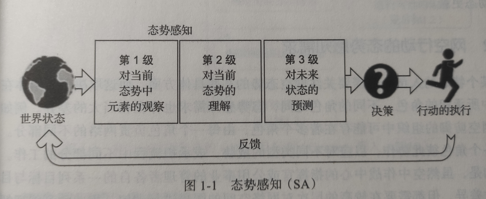
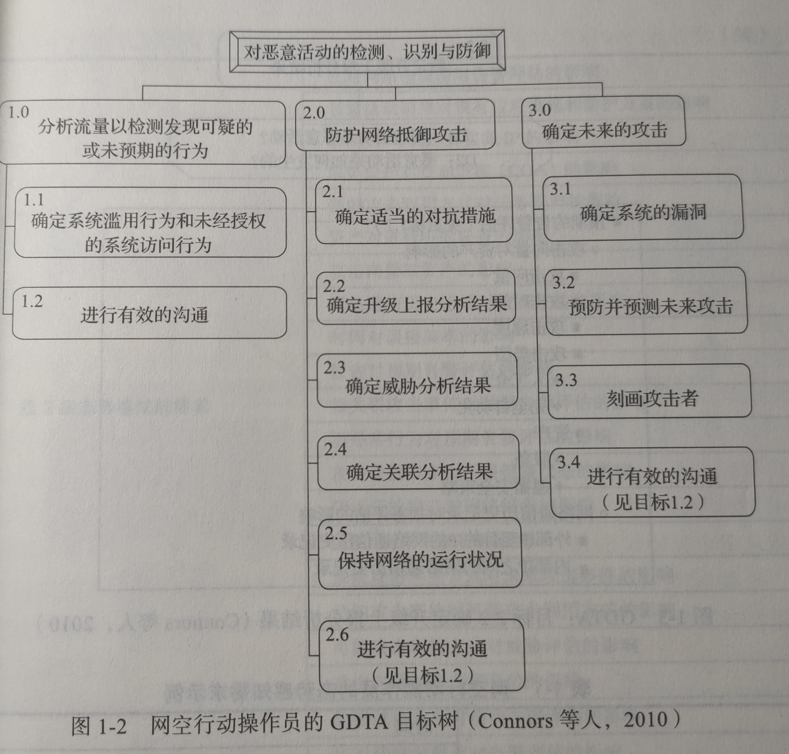
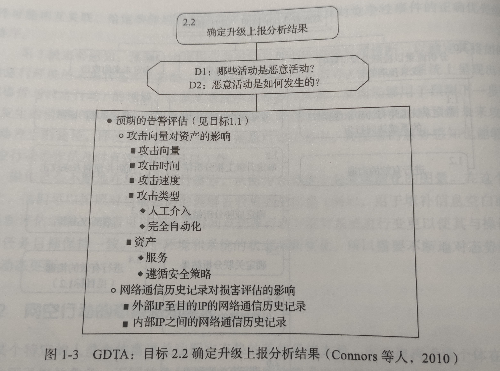
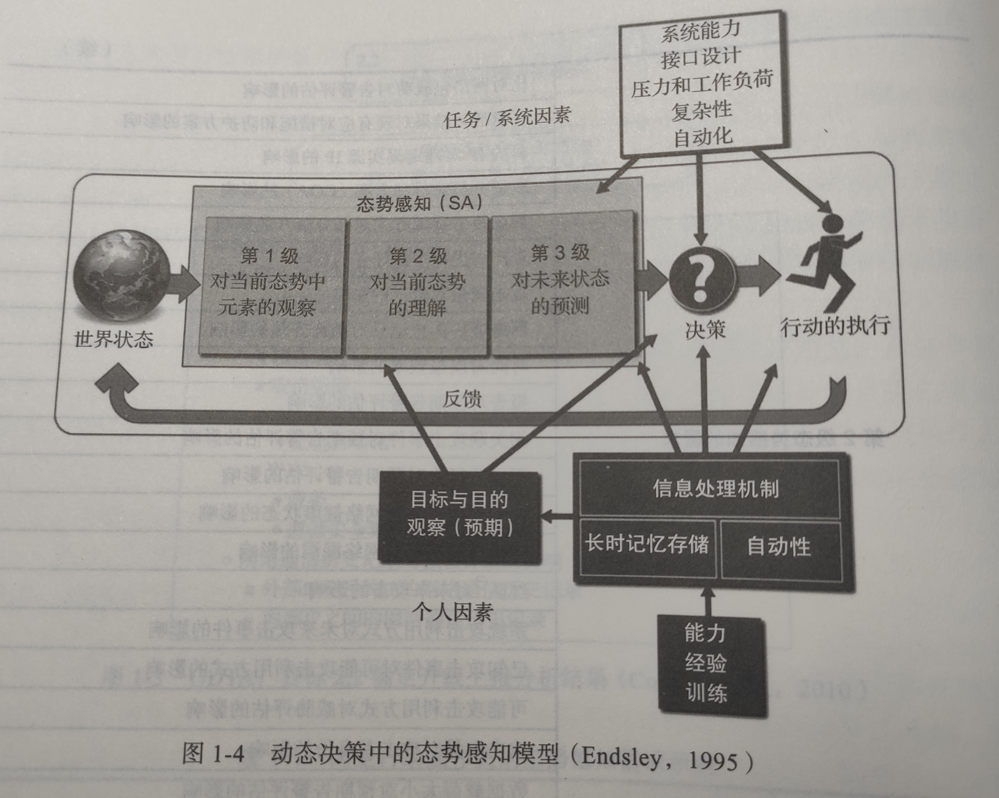
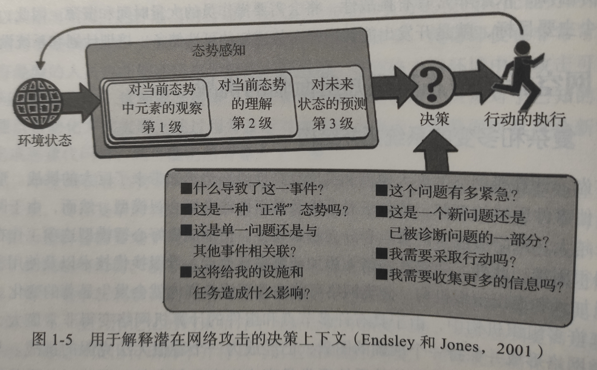
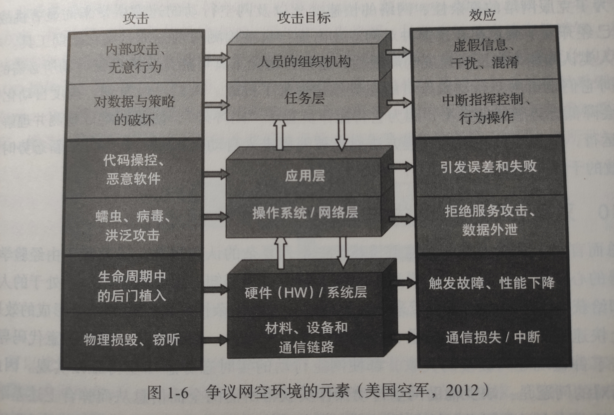
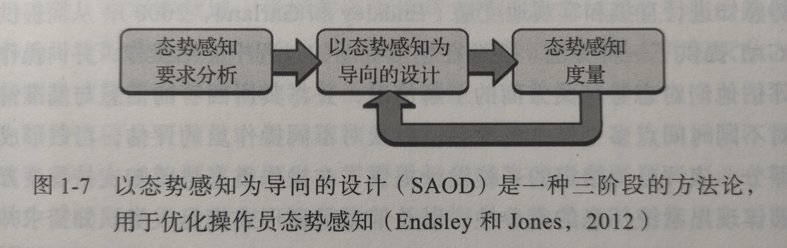

# 引言

**背景**：军事、政府和商业界更多地应用网络技术，给敌人利用漏洞进行攻击利用提供了可乘之机。

**特点**：

- 攻击者业余到高度组织化的都有
- 攻击来自内部和外部
- 手段多样，甚至可以绕过或利用防御系统

对操作员的**要求**：

1. 首先实现并维持一定程度的态势感知
2. 做到对不断演化威胁的识别、理解和预见
3. 采取行动抵御并展开报复

存在的**困难**：

- 怎样将技术与人类认知能力融合
- 海量数据规模超过人类认知极限，导致难以处置
- 新的攻击手段被不断开发出来

怎样**聚焦发展方向**：

1. 充分**理解需求**：理解破坏的效果、理解情境需要的信息、理解操作员要做的决策
2. 清晰**定义内容**：定义获得感知的过程、构建支撑系统的理论基础。

# 网空态势感知

## 定义

**态势感知**：在一定时间和空间内**观察**环境中的元素，**理解**它们的意义并**预测**不久将来的状态。

- 第一级：观察——感官检测（显示、信号）
  - 各类系统节点、当前协议、被攻击节点、历史活动记录、受影响系统IP等
- 第二级：理解——弄清楚事件意义和显著性
  - 特点节点易受攻击程度、攻击行为特征、攻击关联、事件对当前任务影响、优先级排序

- 第三级：预测——前向时间推断、心智模型、个题理解
  - 预测恶意活动影响、预测未来攻击途径

需要实时对态势感知作出动态更新：获取最新信息+对系统执行操作

## 需求

- 取决于个体担任的角色，依据分工不同而有所不同，但都需要进行总体把控。
- 传统的分析方法是目标导向任务分析（GDTA）。为每个角色在三个阶段分别：
  - 确定高阶目标结构
  - 列出需要的主要决策
  - 描述对支持决策所出现的需求

——可以确定要给分析员提供什么信息、确定需要整合哪些信息

详细需求见原书表1-1

## 认知机制

人类收集、理解信息最终形成态势感知的过程：

- 影响人们获得和维持态势感知的程度的因素

  - 外因：环境的关键特征

    - 系统提供信息能力
    - 系统界面设计
    - 系统复杂性
    - 系统自动化程度
    - 压力和工作负荷

  - 内因：短时感官记忆、观察力、工作记忆、长时记忆机制

    - 以“前注意”方式对环境元素进行并行处理，检测出涌现特性——有限的**注意力**是最大限制

    - **工作记忆**和**长时记忆**引导观察——经验丰富（工作记忆多）有助于更快的识别

      **长时记忆**：

      - 心智模型：系统组件和如何相互作用的认知——不增加工作记忆负荷的前提下提供高层次感知
      - 图式模型：系统状态的原型类别（抽象出的类别特性）——瞬时的模式匹配

      **专业知识**起着重要作用——系统呈现的信息要足以支持操作员将当前情况与心智模型和图式进行匹配

    - 操作员**目标**也很重要——引导对环境的哪些部分进行关注

      需要*交替采用目标驱动和数据驱动*：

      - 数据驱动效率低
      - 目标驱动可能遗漏关键信息

——态势感知是动态过程，受到认知机制影响。在复杂环境中形成准确感知仍具有挑战性。

——主要目标就是开发出能增强态势感知的可选储备、培训计划和系统设计。

# 面临的挑战

1. 复杂多变的拓扑结构

   特点：规模庞大、结构复杂、变化快。

   - 网络状态很难保持一个准确的图景
   - 细微变更带来的影响难以理解预测
   - 超过人们的心智模型处理能力

2. 快速变化的技术

   - 难以保持对系统拓扑结构的准确理解
   - 变革带来的新能力对系统漏洞和系统行为产生深刻影响
   - 需要不断更新迭代心智模型

3. 高信噪比

   - 异常经常发生：故障、更新、遗忘密码……
   - 用户习惯性忽视异常
   - 嘈杂背景掩盖真实攻击特征

4. 定时炸弹和潜伏攻击
   - 攻击发生和效果显现存在时间间隔
   - 长期潜伏的恶意代码在特定时间或特定条件下被触发
5. 快速演化的多面威胁
   - 攻击者可以利用非常广泛的潜在攻击向量——指数级增长

6. 事件发展的速度
   - 观察-调整-决策-行动（OODA）循环难以应对一秒以内发生的快速攻击
   - 无法实时响应、只能做到取证分析、事后评估
7. 非整合的工具
   - 缺少一套完整工具、只能依赖各种工具，工作量大
8. 数据过载和含义欠载
   - 数据量太大人工难以分析
   - 理解预测方面的信息缺少支撑
9. 自动化导致的态势感知损失
   - 将操作员排除在外，降低了感知水平，难以理解运行状态并更新事件库
10. 总结：
    - 缺少辅助网空行动操作员获得所需全面信息的整合工具
    - 缺少对数据进行转化从而理解事件影响的机制
    - 缺少支撑积极网络防御的工具

# 研发需求

> 必须从反应式取证响应变为实时、积极的和预防性的网空对抗行动模式

## 网络空间通用作战态势图

> > COP

以态势感知为导向的设计过程（SAOD）

1. **要求分析**阶段：**GDTA**（目标导向的任务分析）过程来确定特定角色的目标
   - 不再局限于任务步骤或过程
   - 聚焦于操作员的认知需求
   - 广泛应用于各个领域
2. **态势感知设计**阶段：
   1. 每个界面都包含高水平态势信息
   2. 高度可视化、便于进行理解与预测
   3. 保持全局大图景，也提供理解态势所需细节
   4. 将用户注意力引导至关键信息
   5. 直接支撑多任务处理
   6. 其他：整合复杂与不确定性、有效利用报警系统、分布式团队共享

3. **有效性评估**阶段：
   - 态势感知、工作负荷、性能和可用性的度量
   - 用来评估操作员态势感知水平和系统的有效性
   - 示例：**SAGAT**一种态势感知全局评估技术

## 动态变化大规模复杂网络可视化

- 最好是能展示网络的动态变化
- 不仅要解决抽象可视化问题，也要解决显示类型问题，满足不同需求
- 例如评估某一恶意行动对资产影响——**目前还没有很好的方案**

## 对决策者的支持

- 需要把网空态势作为决策者目标里的一环考虑
- 需要提供通用作战态势图

## 协同人员与自主系统结合团队

> > 快速和大量都超过了人类处理能力，必须使用自动化工具

- 自动化工具会使人类脱离闭环外：因为使用自动化系统会降低警惕性、界面不利于理解、不理解系统状态模式和对自动化工具不信任等
- 自动化仅能在面对已知问题时才能工作，未知攻击来临时还是需要人类
- 支持人员与自动化系统有效组队的协同设计原则：
  1. 为各层次自动化机制提供灵活的受监督自主能力
  2. 通过机制透明度对自主行动与未来预测提供支持
  3. 人类操作员保持在闭环以内运作
  4. 进行信息整合以提供必须的理解与预测支持
  5. 保证系统的可理解性：系统模式最小化、系统状态显著

——自动系统和操作员高度共享，使得两者目标和任务保持一致

## 组件代码的检验和确认

- 要建立新的检验与确认方法以保证对自主系统的信任
- 是为自主网空行动提供置信度的必由之路

## 积极控制

- 需要能预防已知未知攻击的能力
- 需要对攻击者进行画像以制定防御策略
- 需要能评估攻击和对抗措施对任务行动的影响

# 小结

> 网络空间战争可能会改变战争的形貌。

- 态势感知三个层级：观察、理解、预测，输出直接馈送至决策行动循环中
- 某个人员的任务取决于他在防御行动中的角色
- 传统解决方案：GDTA
  - 确定高阶目标结构
  - 列出需要的主要决策
  - 描述对支持决策所出现的需求
- 制约当前态势感知的因素：
  1. 复杂多变的拓扑结构
  2. 快速变化的技术
  3. ……
- 最直接的网空行动需求：创建有效的通用作战态势图（COP）
  - 根据不同操作员的位置而定制
  - 需要更好的可视化方案
  - 支持人们了解系统状态、预测潜在攻击
  - 平衡人类与自主系统，建立共享的高水平态势感知