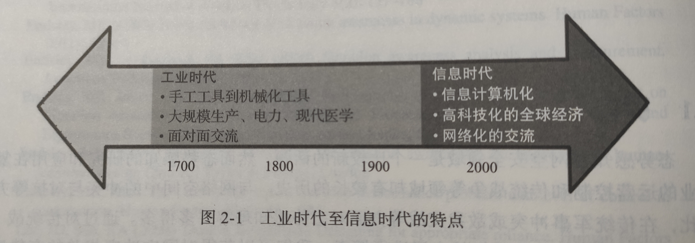
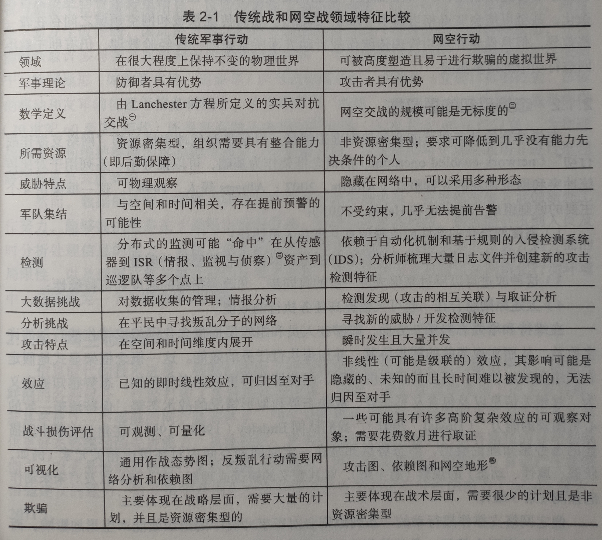
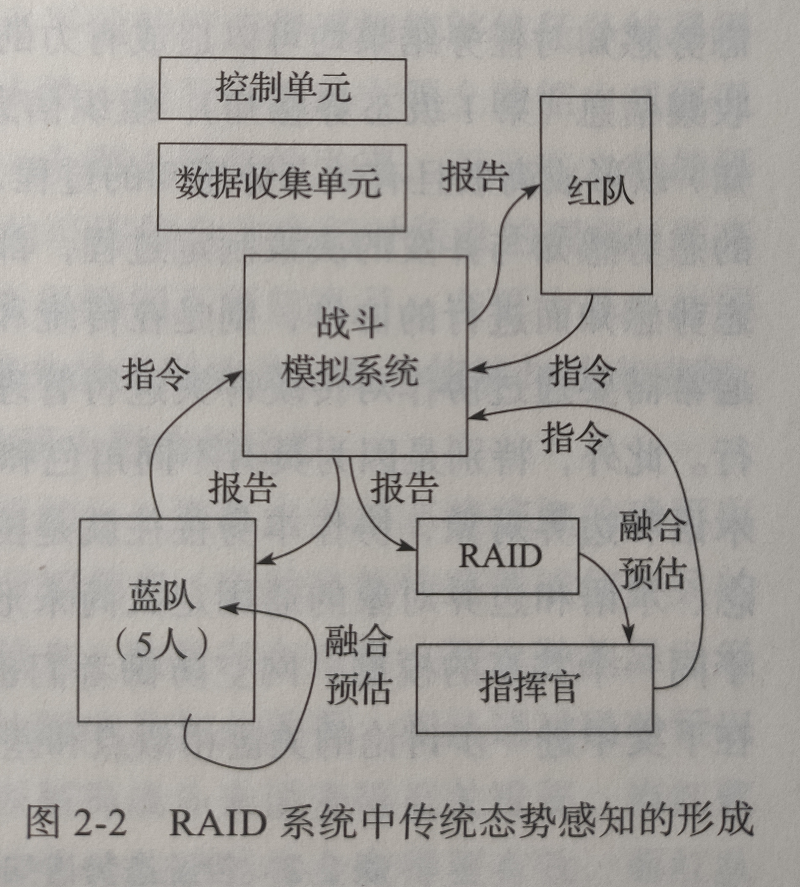
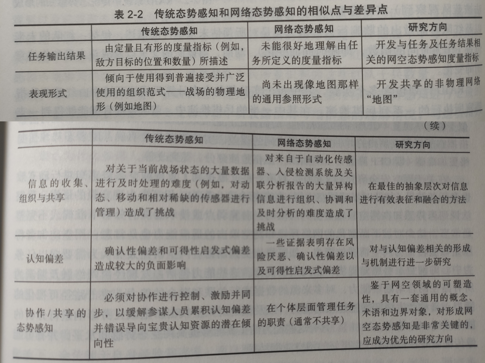

# 引言

> 态势感知在复杂企业运营和传统战争领域历史较长

1. 讨论传统冲突中态势感知本质

2. 回顾对传统态势感知（KSA）的认识

3. 将其与网空态势感知（CSA）做对比

- 相似点——挑战和机遇是类似的，都会对任务完成效果产生较大影响、都存在认知偏差
- 不同点——传统态势感知依赖广泛使用的表现形式（战场物理地形图），网空领域还没有这种形式

## 从传统战场过渡到虚拟战场

> - 20世纪面对面互动形式的工业时代冲突变为信息时代的冲突
> - 当前既包含传统战场也包含虚拟战场
> - 将来将越来越强调虚拟战场

- 网络化组织形式：协作者数量无限、可利用信息无限
- 战争越来越多地发生在虚拟空间中不同网络之间

传统军事行动和网空行动特点：

1. **威胁领域差异显著**：
   - 物理世界直接观察、增强观察可以看到威胁
   - 网络世界具有高度可塑性且容易进行欺骗
2. **优势互换**：
   - 传统军事行动防守者更占优势
   - 网空领域攻击者更占优势
     1. 匿名性
     2. 针对性攻击
     3. 攻击利用
     4. 人性弱点
     5. 取证难度

——虽然有很大差异，但仍有可借鉴之处

## 态势感知重要性

“网络支撑作战行动”概念框架：

1. 高度网络化的部队应改善信息共享和人员协作
2. 共享与协作可以改进信息质量和共享态势感知质量
3. 可以反过来促进进一步自同步，改善指挥速度和可持续性
4. 上述原则组合可以进一步提高任务执行效能

——信息化程度越高，越能获得更好的态势感知

**局限性**：这些序列中任何一环出问题都有可能成为瓶颈，制约整体效能。

## 传统态势感知

- 物理传感器+人体感官+远距离情报监视平台
- 敌我双方都可以获取相同信息
- 为物理战场建立**准确的模拟模型**是一个关键
- 信息的获取与理解存在折中关系：
  - 一定的数据帮助认识形式分析状态
  - 过量数据压垮处理者——人类信息理解的局限性

## 网空态势感知

- 互联网的出现打破了地理边界
- 我们要建立网空防御体系、支撑网空任务并提供态势感知能力
  - 发现漏洞路径自动勘察、多源数据关联融合、攻击路径可视化、自动生成方案、影响分析……

# 传统态势感知研究示例

> 两个对传统态势感知进行量化描述的案例——传统领域特有挑战

## DARPA的MDC2计划

> 美国国防高级研究计划局（DARPA）：多单源徒步作战指挥控制
>
> 目的：对高度信息化分布式轻型装甲部队进行作战指挥

- 以深入了解敌人信息取代了厚装甲——能否克服认知挑战？
- 开发了人机系统原型：自动融合所有数据到共享态势图、帮助士兵收集评估情报的工具等
- 进行了战斗模拟：对战局进行等比例刻画、对态势进行定量描述

## RAID计划

> 也是DARPA：实时敌方情报和决策制定
>
> 目标：开发自动预估敌人态势并预测近期行动的工具

聚焦于特定场景：红蓝城市战术战斗，红队攻蓝队防

- 蓝队指挥人员借助信息融合系统**整合信息**
- 依据信息得出红队**当前态势评估**+**意图**、和对所预估**未来事件的描述**
- 对照试验：参谋人员vs自动化系统

> 上述两个计划的效果将在下一节与网空态势感知进行比较

# 相似点与巨大差异

