# 习题部分解答

## 第一章

### 复习题

#### R1

没有区别，都是端系统。

#### R9

调制解调器30-50kbps，HFC30M下行、2M上行，DSL24M下行、2.5M上行，FTTH20M

#### R11

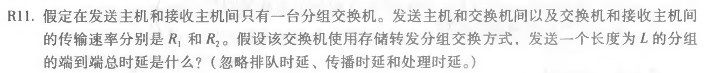
$$
t=L/R_1+L/R_2
$$
#### R12

电路交换优点：为端到端预留资源保持带宽。FDM需要设备进行载波生成、频率搬移，更复杂去。

#### R13

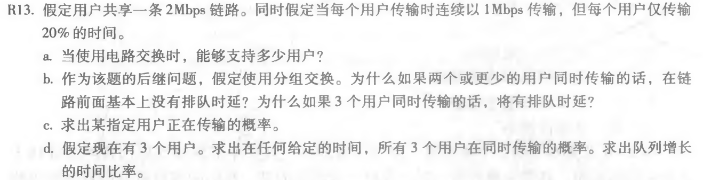

a. 
$$
N=R/R'=2M/1M
$$
b. 三个以上超过负载，就会等待。

c. 
$$
P=20\%
$$
d. 
$$
P^3=0.2^3=0.008
$$
#### R18

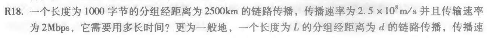

$$
t_{prop}=d/s=10ms
$$
传播速率和传输速率的区别。

#### R19

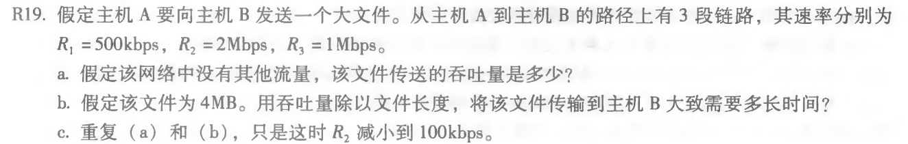

a. 最小值500k

b. 4M/500k=64s **注意：k=1000，K=1024，1B=8b**

c. 100k，4M/100k=320s

#### R23

应用层：实现应用 

传输层：多路复用可靠性、拥塞控制 

网络层：端到端通信、路由转发 

数据链路层：相邻两点传输 

物理层：物理介质上传输加载还原数字信号。

#### R25

路由器：网络层、链路层、物理层；链路层交换机：链路+物理；主机：所有五个层次。

### 习题

#### P2

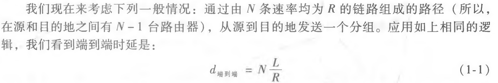
$$
t=NL/R+L/R(P-1)=(N+P-1)L/R
$$
#### P3

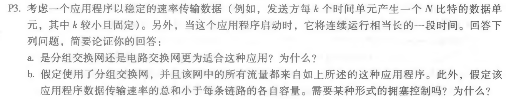

a. 线路交换更合适，因为产生传输比较稳定，用线路交换可以有性能保证。

b. 不用，直接就可以实现传输。

#### P6

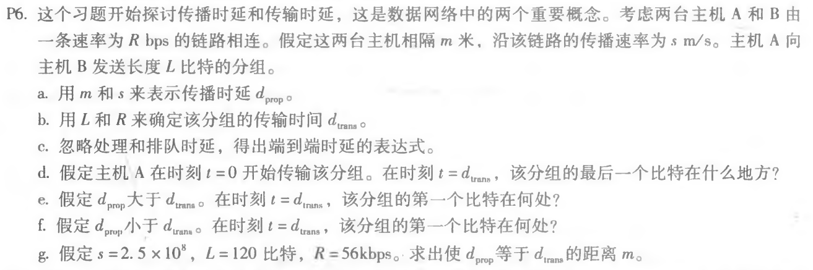

a. 
$$
d_{prop}=m/s
$$
b. 
$$
d_{trans}=L/R
$$
c. 
$$
t = m/s+L/R
$$
d. 刚刚离开发送方

e. 在路上

f. 已经到接收方了

g. 
$$
m/s=L/R \quad m=Ls/R=536m
$$
#### P14

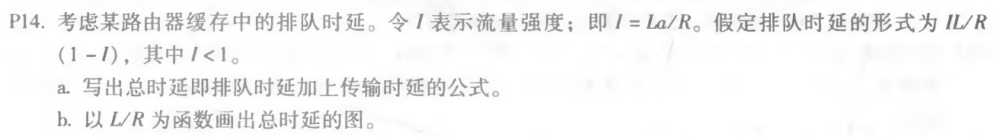

a. 
$$
t=L/R(传输)+I/(1-I)*L/R(排队)=1/(1-I)*L/R
$$
b. 转换一下，令L/R=x
$$
t=x/(1-ax)
$$
x越接近1，t越接近无穷大

#### P22

丢包概率p，不丢概率1-p，n跳不丢概率：
$$
P_s=(1-p)^n
$$
一次成功概率$P_s$，两次$(1-P_s)P_s$，n次$(1-P_s)^{n-1}P_s$，算加权平均求极限。
$$
N=\sum_{i=1}^\infty i(1-P_s)^{i-1}P_s=1/P_s
$$
最终算得
$$
N'=N-1=1/P_s-1
$$
#### P25

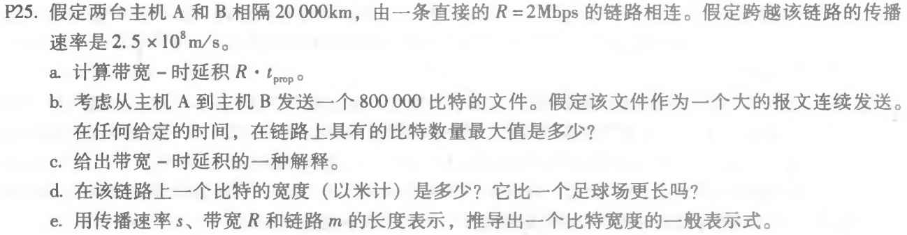

a. 
$$
Rd/s=1.6\times10^5bit
$$
b. 最大值就是上面的这个值。

c. 在链路上的单向传输数据量（链路容量是它的两倍）

d. 
$$
t=1/R=5\times 10^{-7}s\\
t\times s=125m
$$
e.
$$
s/R
$$
#### P27

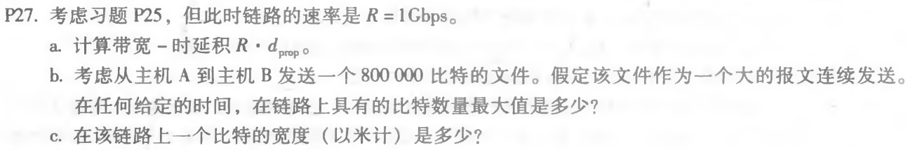

a. $8\times 10^7 bit$

b. $F=8\times 10^5bit$只占1%

#### P31

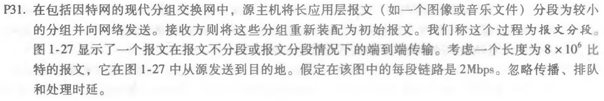

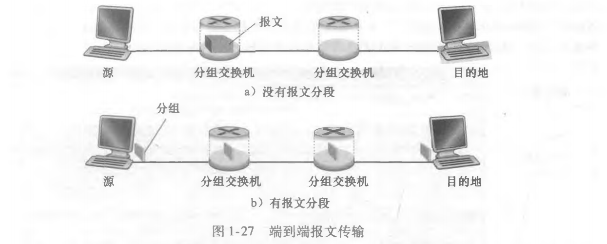

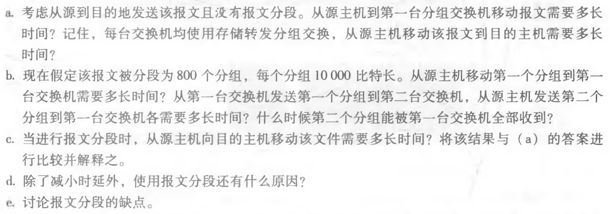

分组交换比报文交换效率要高。

a. $C/R=4s$ $4\times 3=12s$

b.c.d. $L/R=5ms$ 15ms第一个分组到达

$15+(800-1)\times 5 = 4.1s$

更大限度利用传输资源。

## 第二章

### 常见难题

#### P10

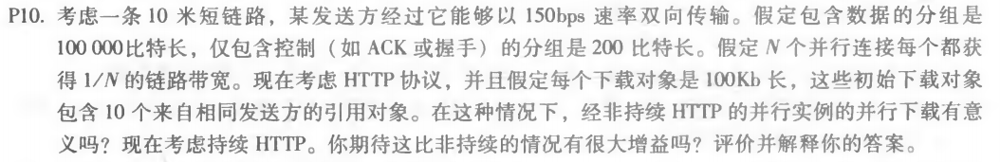

每次连接先3次握手各自200bit，最后传输内容100kbit，都占用1/10带宽

R=150bps L=100kbit L'=200bit

a. 非持久、并行10个

t1=200/150 t2=100k/150

ti=3*t1+t2=3\*200/150+100k/150

tii = 3\*t1'+t2'=3\*200/150/10+100k/150/10

t=ti+tii=7377s 最终T=t+8tp（传播延迟忽略）

b. 持久

t1=200/150 t2=100k/150

t = 2t1+t1+t2+10(t1+t2)+24tp=7351+24tp

没有太大差别，因为资源太少了。

#### P22

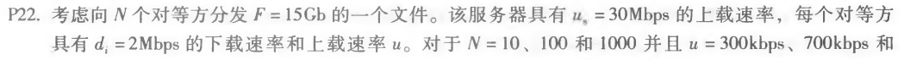

F=15Gb 服务器上载Us=30Mbps 客户端下载di=2Mbps，N=10、100、1000下客户端上载300k、700k、2Mbps

- C/S模式

$$
D_{c/s}=max\{NF/Us,F/d_{min}\}
$$

带入不同的N，N小的时候，瓶颈在客户端，N很大的情况下非常慢，瓶颈在服务器，NF/us很大，等待时间线性增加。

|  N   |  10  |  100  |  1000  |
| :--: | :--: | :---: | :----: |
| 300k | 7680 | 51200 | 512000 |
| 700k | 7680 | 51200 | 512000 |
|  2M  | 7680 | 51200 | 512000 |

- P2P模式

$$
D_{P2P}=max\{NF/Us,\ F/d_{min},\ NF/(Us+\sum _{i=1} ^N u_i)\}
$$

|  N   |  10  |  100  |  1000   |
| :--: | :--: | :---: | :-----: |
| 300k | 7680 | 25600 |  46454  |
| 700k | 7680 | 15300 | 21041.4 |
|  2M  | 7680 | 7680  |  7680   |

N小的时候，受限于客户端，所以仍然是7680。P在起作用，随着各个peer节点上载能力的增加，下载时间减少很明显，在2M时增加N时间也不会变。

### 习题

#### P9

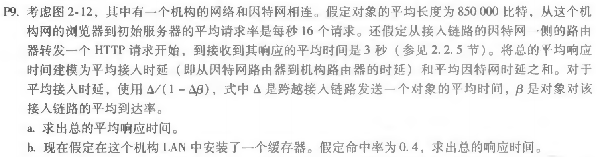

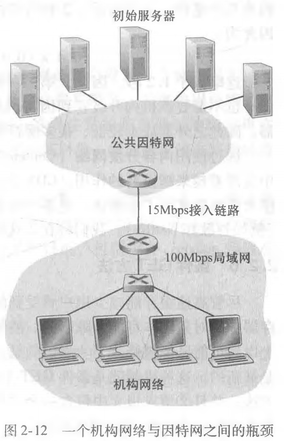

L=850kbit R=15Mbps 16个/秒 响应平均时间3秒，hit=0.4，内网平均传播延迟t'=10ms

- 没有缓存

$$
t_\Delta = L/R=850kb/15Mbps=0.0567s \\
流量强度I=\alpha L/R=16*850k/15Mbps=0.907\\
t_{access}=1/(1-I) * L/R=0.57s \\
t=t_{lan}+t_{access}+t_{inter}=3.57s
$$

- 有缓存

$$
hit=0.4\\
miss=1-hit=0.6\\
流量强度I=0.6\alpha L/R=0.6*16*850k/15Mbps=0.544\\
t_{access}=1/(1-I) * L/R=0.124s \\
t'=t_{lan}+t_{access}+t_{inter}=3.124s\\
t=0.6t'+0.4t''=1.874s
$$

平均速度更快、远程服务器压力更小

#### P23

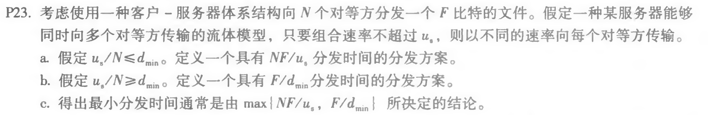

Us dn N F dmin=min{di}

- a. Us/N≤dmin 服务器是瓶颈——下载时间NF/Us

  服务器向每个客户端提供的带宽都是Us/N即可满足

- b. Us/N≥dmin 客户端是瓶颈——下载时间F/dmin

  服务器向每个客户端分配的带宽都是dmin，总共Ndmin（服务器没有全部出力）

- c. 两种情况都有，去最大值——最差的情况，即为最小分发时间

#### P24

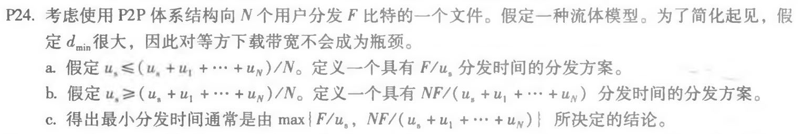

忽略F/dmin

- a. Us ≤ (us+u1+...+uN)/N 服务器是瓶颈——下载时间F/Us

  按比例把Us、F按照上载能力u1，u2……非等间隔进行划分，节点把自己收到的数据均分到所有其他节点，带宽和服务器提供给它的相同即可满足——可以推出每个节点上载能力完全可以满足

- b. Us ≥ (us+u1+...+uN)/N 客户端是瓶颈——下载时间NF/ (us+u1+...+uN)

  服务器把文件非等间隔分成N+1份，向客户端提供的服务带宽为ui/N-1，发送对应的第i块和N+1块 Ri=ui/N-1，RN+1=(Us-U/N-1)/N——刚好服务器带宽占满了Us。每个客户端以ui/N-1向其他节点发送第i块。

- c. 两种情况都有，取最大值——最差的情况，即为最小分发时间

## 第三章

### 复习题

#### R3

