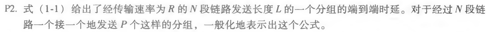

# 习题部分解答

## 第一章

### 复习题

#### R1

没有区别，都是端系统。

#### R9

调制解调器30-50kbps，HFC30M下行、2M上行，DSL24M下行、2.5M上行，FTTH20M

#### R11

$$
t=L/R_1+L/R_2
$$
#### R12

电路交换优点：为端到端预留资源保持带宽。FDM需要设备进行载波生成、频率搬移，更复杂去。

#### R13

a. 
$$
N=R/R'=2M/1M
$$
b. 三个以上超过负载，就会等待。

c. 
$$
P=20\%
$$
d. 
$$
P^3=0.2^3=0.008
$$
#### R18

$$
t_{prop}=d/s=10ms
$$
传播速率和传输速率的区别。

#### R19

a. 最小值500k

b. 4M/500k=64s **注意：k=1000，K=1024，1B=8b**

c. 100k，4M/100k=320s

#### R23

应用层：实现应用 

传输层：多路复用可靠性、拥塞控制 

网络层：端到端通信、路由转发 

数据链路层：相邻两点传输 

物理层：物理介质上传输加载还原数字信号。

#### R25

路由器：网络层、链路层、物理层；链路层交换机：链路+物理；主机：所有五个层次。

### 习题

#### P2

$$
t=NL/R+L/R(P-1)=(N+P-1)L/R
$$
#### P3

a. 线路交换更合适，因为产生传输比较稳定，用线路交换可以有性能保证。

b. 不用，直接就可以实现传输。

#### P6

a. 
$$
d_{prop}=m/s
$$
b. 
$$
d_{trans}=L/R
$$
c. 
$$
t = m/s+L/R
$$
d. 刚刚离开发送方

e. 在路上

f. 已经到接收方了

g. 
$$
m/s=L/R \quad m=Ls/R=536m
$$
#### P14

a. 
$$
t=L/R(传输)+I/(1-I)*L/R(排队)=1/(1-I)*L/R
$$
b. 转换一下，令L/R=x
$$
t=x/(1-ax)
$$
x越接近1，t越接近无穷大

#### P22

丢包概率p，不丢概率1-p，n跳不丢概率：
$$
P_s=(1-p)^n
$$
一次成功概率$P_s$，两次$(1-P_s)P_s$，n次$(1-P_s)^{n-1}P_s$，算加权平均求极限。
$$
N=\sum_{i=1}^\infty i(1-P_s)^{i-1}P_s=1/P_s
$$
最终算得
$$
N'=N-1=1/P_s-1
$$
#### P25

a. 
$$
Rd/s=1.6\times10^5bit
$$
b. 最大值就是上面的这个值。

c. 在链路上的单向传输数据量（链路容量是它的两倍）

d. 
$$
t=1/R=5\times 10^{-7}s\\
t\times s=125m
$$
e.
$$
s/R
$$
#### P27

a. $8\times 10^7 bit$

b. $F=8\times 10^5bit$只占1%

#### P31

分组交换比报文交换效率要高。

a. $C/R=4s$ $4\times 3=12s$

b.c.d. $L/R=5ms$ 15ms第一个分组到达

$15+(800-1)\times 5 = 4.1s$

更大限度利用传输资源。

## 第二章

### 复习题

#### P1

- a. 错，四个请求
- b. 对，同一个服务器下
- c. 错，非持续TCP连接只能传输一个请求和一个响应报文
- d. 错，服务器产生并发送该响应报文的日期和时间
- e. 错，有可能有空的——条件式请求，对象在服务器端未改变，头部代码304，此时报文体是空的

#### R6

### 常见难题

#### P10

每次连接先3次握手各自200bit，最后传输内容100kbit，都占用1/10带宽

R=150bps L=100kbit L'=200bit

a. 非持久、并行10个

t1=200/150 t2=100k/150

ti=3*t1+t2=3\*200/150+100k/150

tii = 3\*t1'+t2'=3\*200/150/10+100k/150/10

t=ti+tii=7377s 最终T=t+8tp（传播延迟忽略）

b. 持久

t1=200/150 t2=100k/150

t = 2t1+t1+t2+10(t1+t2)+24tp=7351+24tp

没有太大差别，因为资源太少了。

#### P22

F=15Gb 服务器上载Us=30Mbps 客户端下载di=2Mbps，N=10、100、1000下客户端上载300k、700k、2Mbps

- C/S模式

$$
D_{c/s}=max\{NF/Us,F/d_{min}\}
$$

带入不同的N，N小的时候，瓶颈在客户端，N很大的情况下非常慢，瓶颈在服务器，NF/us很大，等待时间线性增加。

|  N   |  10  |  100  |  1000  |
| :--: | :--: | :---: | :----: |
| 300k | 7680 | 51200 | 512000 |
| 700k | 7680 | 51200 | 512000 |
|  2M  | 7680 | 51200 | 512000 |

- P2P模式

$$
D_{P2P}=max\{NF/Us,\ F/d_{min},\ NF/(Us+\sum _{i=1} ^N u_i)\}
$$

|  N   |  10  |  100  |  1000   |
| :--: | :--: | :---: | :-----: |
| 300k | 7680 | 25600 |  46454  |
| 700k | 7680 | 15300 | 21041.4 |
|  2M  | 7680 | 7680  |  7680   |

N小的时候，受限于客户端，所以仍然是7680。P在起作用，随着各个peer节点上载能力的增加，下载时间减少很明显，在2M时增加N时间也不会变。

### 习题

#### P9

L=850kbit R=15Mbps 16个/秒 响应平均时间3秒，hit=0.4，内网平均传播延迟t'=10ms

- 没有缓存

$$
t_\Delta = L/R=850kb/15Mbps=0.0567s \\
流量强度I=\alpha L/R=16*850k/15Mbps=0.907\\
t_{access}=1/(1-I) * L/R=0.57s \\
t=t_{lan}+t_{access}+t_{inter}=3.57s
$$

- 有缓存

$$
hit=0.4\\
miss=1-hit=0.6\\
流量强度I=0.6\alpha L/R=0.6*16*850k/15Mbps=0.544\\
t_{access}=1/(1-I) * L/R=0.124s \\
t'=t_{lan}+t_{access}+t_{inter}=3.124s\\
t=0.6t'+0.4t''=1.874s
$$

平均速度更快、远程服务器压力更小

#### P23

Us dn N F dmin=min{di}

- a. Us/N≤dmin 服务器是瓶颈——下载时间NF/Us

  服务器向每个客户端提供的带宽都是Us/N即可满足

- b. Us/N≥dmin 客户端是瓶颈——下载时间F/dmin

  服务器向每个客户端分配的带宽都是dmin，总共Ndmin（服务器没有全部出力）

- c. 两种情况都有，去最大值——最差的情况，即为最小分发时间

#### P24

忽略F/dmin

- a. Us ≤ (us+u1+...+uN)/N 服务器是瓶颈——下载时间F/Us

  按比例把Us、F按照上载能力u1，u2……非等间隔进行划分，节点把自己收到的数据均分到所有其他节点，带宽和服务器提供给它的相同即可满足——可以推出每个节点上载能力完全可以满足

- b. Us ≥ (us+u1+...+uN)/N 客户端是瓶颈——下载时间NF/ (us+u1+...+uN)

  服务器把文件非等间隔分成N+1份，向客户端提供的服务带宽为ui/N-1，发送对应的第i块和N+1块 Ri=ui/N-1，RN+1=(Us-U/N-1)/N——刚好服务器带宽占满了Us。每个客户端以ui/N-1向其他节点发送第i块。

- c. 两种情况都有，取最大值——最差的情况，即为最小分发时间

## 第三章

### 复习题

#### R3

源端口y，目的端口x

#### R7

会被描述成相同的套接字，UDP socket只绑定自己的端口+IP。socket API里面有receive from字段可以判断不同的源IP、源端口。

#### R9

区分新旧、在接收方进行排序

#### R10

PDU发送过程中可能丢掉，启动超时重发进程

#### R14

- a. 没有数据捎带也要发送确认，错
- b. 会变化，根据上层应用层是否取完而变化，错
- c. 不会超过空闲buffer，更不会超过整个buffer，对
- d. 序号为m+TCP报文中字节数，确认是以字节为单位的，错
- e. TCP段头有一个receive window，对
- f. 指数移动加权平均，以前的值可能小于1秒，不一定大于等于，也可能小于1秒，错
- g. 不一定能收到，可能是ACK 38，错

#### R15

- a. 110-90=20
- b. ACK 90 TCP累计确认

#### R17

TCP公平性，每一个R/2.大致的公平性，往返延迟少，抢到的带宽多，和UDP没有可比性。

#### R18

当前拥塞窗口的一半ssth=cwnd/2 cwnd=ssth+3（三个冗余ACK）ssth=cwnd/2 cwnd=1（超时）

### 习题

#### P1

Telnet服务器使用的端口是23

- a. 源x，目的23
- b. 源y，目的23
- c. 源23，目的x
- d. 源23，目的y
- e. 可以，用不同IP区分即可
- f. 不可以，IP相同时必须用端口号区分

#### P3

简版checksum计算

求和、进位回滚，再取反码。

接收方加和与校验位相加直接判断是否全1——更快更方便

1bit可以，2bit不行

#### P8

——状态机，多了超时重传机制

超时所带来的重复问题已经被2.2序号机制搞定，参照2.2即可

#### P15

传播延迟15ms

Ttrans=L/R=1500*8/10^9=12us

假设处理时间为0

效率=nTtrans/(Ttrans+30ms)>0.9 ——n=**2251**

#### P23

GBN n ——2^n - 1

SR n —— 2^(n-1)

使用反证法证明

#### P24

- a. 对，接收方ACK滞留了，超时重发，确认到达之后发送窗口前移，又收到旧的ACK
- b. 对，接收方ACK滞留了，超时重发，确认到达之后发送窗口前移，又收到旧的ACK
- c. 对，退化成了停止等待协议（比特交替协议）
- d. 对，退化成了停止等待协议（比特交替协议）

#### P27

- a. 序列号207，源端口302，目的端口80
- b. 确认号207，源端口80，目的端口302
- c. 确认号127，在请求127及以后的报文
- d. 画图即可

#### P32

EstimatedRTT=(1-α)·EstimatedRTT+α·SampleRTT

DEV=β|SRTT-ERTT|+(1-β)DEV

RTO=ERTT+4DEV

- a. 迭代计算即可
- b. 算出迭代公式ERTT=x(1-x)\^0SRTT1+x(1-x)\^1SRTT2+x(1-x)\^2SRTT3+...+(1-x)\^(n-1)SRTTn
- c. 最后一项忽略，求极限

#### P40

- a. 慢启动：1-6，23-26
- b. 拥塞避免：6-15，16-22
- c. 3个冗余ACK，cwnd降到一半+3
- d. 超时，cwnd降为1
- e. 32MSS
- f. 42的一半，21MSS
- g. 29的一半，14MSS（下取整）
- h. 累加算一下，什么时候把70号放进去——第七轮
- i. 窗口本来为8，ssthreh=4，cwnd=4+3=7
- j. 窗口本来是42，ssthreh=21，cwnd=1（Tahoe3个冗余ACK以后也慢启动），19-16=3：1、2、4——cwnd=4
- k. 17：1；18：2；19：4；20：8；21：16；22：21（不能大于21）——再线性增加，加起来发送了52个分组

#### P45

- a. 窗口按照锯齿形增长，吞吐量=3/4 * W/RTT

  按照每次+1线性增加计算，得到总共预计发送的分组数N为分母，丢失率用1除以它

- b. 用丢失率算窗口，忽略窗口的一次项，反推出窗口
  $$
  W= \sqrt{8/3}/\sqrt L
  $$
  

代入吞吐量公式，得到速率公式

#### P53

根据上一题得到的吞吐量和丢失率对应公式

L=2.14×10\^-12——此时丢失极大可能是出错造成的，丢失是由拥塞造成的假设不成立了：不使用与高吞吐的情况、也不适合于无线通信的场景。我们的拥塞控制机制需要相应地改变。

## 第四章

### 复习题

#### R2

#### R3

#### R10

1. 内存
2. 总线
3. 互联网络 fabric——并行转发

#### R11

- 输入：进入很快交换结构交换慢，队列满了就会丢失。（头端阻塞）
- 输出：交换机构的到达速度比传输速率快，队列满了也会丢失。

——交换速度n倍于输入限速消除分组消失。

#### R17

IP数据报内有个字段upper layer，决定了交给上层的协议实体类型。

#### R30

- 版本号-版本号
- 服务类型-流量类型
- 数据报长度-载荷长度
- 协议-下一个首部（next head）
- TTL-跳限制（hop limmit）

#### R33

传统方式只匹配目的IP，最长字段匹配，动作只有转发。

SDN方式匹配字段很多，动作也很多：组播、单播、泛洪、block、修改……

### 习题

#### P5

- a. 
  - 11100000 00 —— 0
  - 11100000 01000000 —— 1
  - 11100000 —— 2
  - 11100001 0 —— 2
  - 其他 —— 3

- b. 3、2、3

#### P6

00000000-00111111 —— 0——64

01000000-01011111 —— 1——32

01100000-01111111 —— 2——32

10000000-10111111 —— 2——64

11000000-11111111 —— 3——64

0：64；1：32；2：64+32=96；3：64

#### P10

- 11100000 00 (224.0/10)—— 0
- 11100000 01000000 (224.64/16)—— 1
- 11100000 (224/8)—— 2
- 11100001 0 (225.0/9)—— 2
- 其他 —— 3

#### P14

MTU=700B：最大传输单元；分组大小=2400B

头部20字节：分成20和2380；

每次传输20+680，20+680……

2380/680=4

标识号422，偏移分别为0、85、170、255（**8字节-64bit为单位**），标志分别为1、1、1、0

#### P15

MTU=1500B，总大小5MB=5×10^6B

**IP头部20B、TCP头部20B**，后面1460B

N=5×10^6B/1460向上取整3425

若MB按2^20算，3592

#### P16

- a. 192.168.1.1、192.168.1.2、192.168.1.3，路由器192.168.1.4

- NAT转换表为

  

## 第五章

### 复习题

#### R1

路由算法在每个路由器中运行，受限于每个路由器的资源和能力。

每个路由器都作为一个整体独立地工作，既有数据平面也有控制平面。——垂直集成

#### R4

LS：全局、集中式、一次性计算

DV：局部、分布式、迭代收敛

#### R7

- AS内不关心策略只关心性能，自治区之间要进行控制（政策性、经济型）

- AS内不用考虑规模，AS间要考虑
- AS内要考虑性能，AS间不考虑

#### R8

错误，在自治区内进行泛洪——LS算法，所有节点都要获得链路状态信息

### 习题

#### P3

搞清楚源节点是什么（x），给出源节点到所有节点的最短路径，生成最小生成树。

#### P5

给定z节点判断其距离矢量的变化

#### P7

- a. Dx(w)=2，Dx(y)=5，Dx(u)=7
- b. c(x,w)增到6以上，c(x,y)减到1以下
- c. c(x,w)增到6及以下，c(x,y)减到1及以上

#### P14

- a. eBGP
- b. iBGP
- c. eBGP
- d. iBGP

#### P15

- a. I1，因为I1距离1c更近
- b. I2，都需要两大跳（AS-PATH相同），而距离最近的网关1b（NEXT-HOP），I2更近
- c. I1，经过1c需要两大跳而1b需要三大跳

## 第六章

### 复习题

#### R2

不是多余的，IP协议不是可靠的。逐跳可靠不等于整个链路可靠，IP数据报可能会被丢弃。同时不同的IP数据报经过不同的路径，其延迟可能不同，到达接收方可能会乱序。

#### R6

i=5，窗口=2^5=32——概率1/32

t=K*512位时 R=10Mbps，位时=1/R，代入求得延时=204.8us

#### R11

查询时事先不知道IP和mac的对应关系，应答以后就知道了源mac和源IP。——注意仅涉及同一子网。

#### R12

不可以：全球任何一个网卡有唯一一个mac地址

映射表定期保存、删除

### 习题

#### 补充

#### P2

  行列综合即可判断哪一位出错

 同一行两列出错，可以判断两列有错，但无法定位

 对偶出错，无法检测、无法定位

#### P8

- a. 

$$
e(P)=NP(1-P)^{N-1}\\
e(P)'=N(1-P)^{N-1}-NP(1-P)^{N-2}=NP(1-P)^{N-2}(1-P-P(N-1))=0\\
P^*=1/N\ \ 代入
$$

- b.

$$
P^*=1/N\ \ 代入\\
lim _{n → ∞}e(P^*)=1/e
$$

#### P15

- a. 不用经过路由器，在一个子网内部，源：E IP 端口；目的：F IP 端口。

- b. 不会，因为不在一个子网，查询连接路由器R1的mac地址。源：E IP 端口；目的：B IP R1端口.

- c. S1收到会向所有其他端口转发广播，R1不会转发——ARP广播不跨子网

  响应时向A发送单播即可，因为请求里面携带了A的mac地址。

  S1会进行全端口转发——它的作用就是全端口转发，在一个碰撞域内

#### P17

#### P21

IP始终是源：A；目标：F

mac地址：

- a. 源：A；目标：R2
- b. 源：R2；目标：R1
- c. 源：R1；目标：F

#### P26

核心思想：交换表自学习不断累积——软状态关系，可以定期删除增加

#### R16

两两相连，各自出一个端口，连完以后就都在一块了，总共（N-1）*2

#### P31

路由器的MAC帧，根据路由选择协议对其中的IP数据报进行转发……

#### P28

物理上一个、逻辑上两个：一个mac两个IP

每次发IP数据报都要封装为以太网帧，发送到上层路由器解封装后查路由表，再封装成以太网帧下发到对应VLAN

——VLAN把同一交换机的不同端口捆绑为不同的虚拟局域网。

## 第八章

### 复习题

#### R1

可能，密文取一块就是机密但不完整，未加密的完整报文就是完整而不机密。通常公开密钥下完整性和源端可认证性捆绑。

#### R3

#### R13

计算更快、保证反向计算困难

#### R14

CA**私钥**对**证书散列**（报文摘要）进行加密

#### R16

防止重放攻击

### 习题

#### P8

- a. n=5\*11=55 z=4\*10=40
- b. e=3，e<n，且与z没有公因数
- c. d=27
- d. m=8，m\^e=512，密文c=m\^e mod n = 17

#### P17

先用自己的私钥解出对称式密钥Ks，解出明文m和数字签名，明文m算报文摘要，通过发送方公钥解报文摘要，一样的话就说明通过了机密性校验、完整性校验和身份校验。