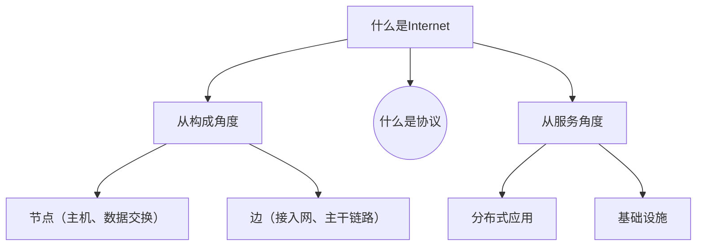
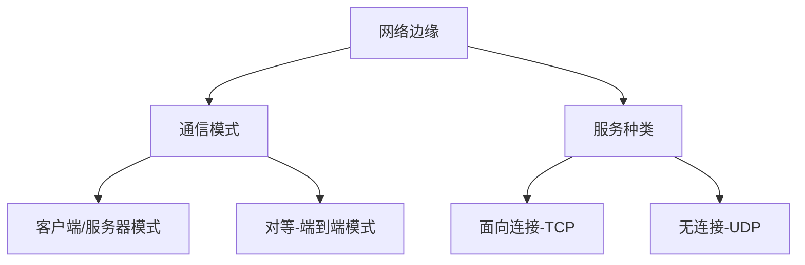
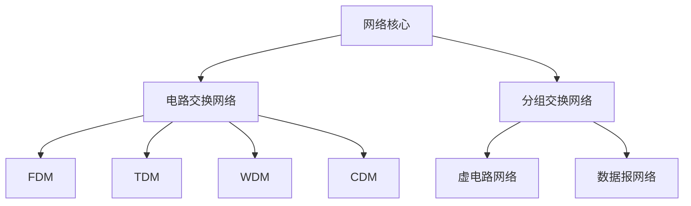

# 第一章 概论

目的：了解**概念术语**、基础工作原理（概念基础）

**这一章最重要，特别详细地学习！**

- 什么是Internet ?
- 什么是协议? 
-  网络边缘
-  接入网、物理媒体
-  网络核心：分组交换、线路交换
-  Internet/ISP 结构
- 性能：丢包、延时、吞吐量
- 协议层次、服务模型
- 历史

## 1.1 什么是Internet

### 什么是网络：具体构成的角度

节点和边构成，和大小形状无关。

计算机网络：

- **节点**：1. **主机节点**（终端服务器）■；2. **数据交换节点**（路由器交换机中继器负载均衡）⚪。

- **边**：链路 1. 接入网链路-主机接数据交换；2. 主干链路-数据交换节点之间

- **协议**：各种规则制定的标准，可以相互配合进行工作。

Internet：互联网-网络的网络； Intranet：企业内网； 

- 互联计算设备：主机/端系统（end system/host）；各种应用程序
- 通信链路：link-网线/光纤；各种支持的协议——重要指标：带宽bps
- 分组交换设备：转发分组-路由器交换机（switch）

  互联网标准：RFC、IETF

### 什么是协议

协议：**对等层实体在通讯过程中应当遵循的规则集合**

- 对等层实体（网卡、相同协议、相同服务层等等）-peer

- 包括报文（PDU）**格式**、**次序**和**动作**。语法规范、时序、操作。

### 什么是网络：从服务角度

- 分布式**应用**（应用层以上的主机、网络服务进程）
- 向应用提供通信服务的**基础设施**（应用层以下的实体）：面向连接/无连接

## 1.2 网络边缘

### 网络结构（总）

- 网络边缘：主机、应用程序（客户端和服务器） ——提供服务**应用**
- 网络核心： 互连着的路由器、网络的网络 ——数据交换（分布式系统）**基础设施**
- 接入网、物理媒体：有线或者无线通信链路 ——边缘接入核心**基础设施**

### 通信模式

**网络边缘——运行的应用程序**

1. client/service **客户端/服务器模式**：服务器主，客户端从。请求服务器硬件、计算、数据资源。客户端主动，服务器被动。服务器一直运行，客户端有需要去请求。——主，从模式。可扩展性差，请求载荷增加性能断崖式下降。
2. peer-peer **对等模式**：每个节点即时客户端又时服务器，数据存储是分布式的，通信也是分布式的。——文件分发系统，可扩展性强。

### 面向连接服务

目标：在端系统之间传输数据——**通信之前握手打招呼**，存储栈、协议栈、资源栈做好准备。**连接建立状态**。

与有连接服务的区别：

- 通信状态在端系统之中维护，网络不知道。——面向连接的服务

- 通信状态在经过的各个节点都知道。——有连接的服务

典型-**TCP 服务**：

1. **可靠、保序**：不出错、不重复、不丢失、不乱序。——靠协议自己的努力：缓存、编号、确认、重传（占用时间空间资源）
2. **流量控制**：协调处理数据速度不同的两个设备协同工作。
3. **拥塞控制**：路径堵了以后主动降低速度。

### 无连接服务

目标：在端系统之间传输数据——**通信前不打招呼，直接连接**。

典型-**UDP服务**：

1. 无连接
2. 不可靠数据传输 
3. 无流量控制
4. 无拥塞控制

UDP：实时多媒体应用、速度型应用。流媒体、远程会议、 DNS、 Internet电话

TCP：HTTP (Web), FTP (文件传 送), Telnet (远程登录),  SMTP (email)。

## 1.3 网络核心

问题：怎么实现？电路交换（预留专有线-跑腿服务）、分组交换（存储转发-发快递）

### 电路（线路）交换

通过**信令**系统分配一条**独享**的线路。端到端的资源被分配给从源端 到目标端的呼叫 “**call**”。——电话线路网络

——**性能有保障**，但是会有**资源浪费**。

通过复用的方法把线路资源进行分配：**时分多路TDM、频分多路FDM、波分多路WDM、码分多路CDM**。——划分为资源片（带宽等）

练习题：计算每个资源片的速率，计算传递时间，加上建立连接时间。有时候计算对方收到的时间的话，需要加上信号传播的时间-传播延迟（物理距离/信号速度）。

对于计算机来说好多时候请求是**突发**的，对带宽的需求不均匀。对建立连接的**实时性**要求高，所以不适合使用这种方式。

### 分组交换

分组存储转发方式：

- 每一条通信时不再分成资源片piece，使用全部带宽。
- 主机之间传输的数据被分为一个个的**组packet**。
- **存储-转发**：避免大数据传输占用带宽成为独享。
  1. 收到整个packet才转发。
  2. 延迟比线路交换大。（坏处）
  3. **按需使用**，共享性。（好处）
  4. 存在排队机制，不使用的时候不占用网络资源。

举例：

  速率为R bps的链路 ，一个长度为L bits 的分组 的存储转发延时： L/R 。计算需要几次存储、转发，乘这个系数。

  注意：*计算时不要把发送和接收都算进去*，发的同时就在收。

排队延迟和丢失：

  如果到达速率>链路的输出速率时，分组要排队，**缓存队列用完的话会被抛弃**。

网络核心的关键功能：转发（局部）、路由（全局）。

- **转发**：查路由表决定往哪传。

- **路由**：根据当前状态计算维护路由表。

统计多路复用：其实**也是划分时间片，但是划分不均匀**，模式不是固定的。

### 二者对比

同样的网络资源，分组交换允许更多用户使用网络！——支持同时使用的用户数更多，可以用计算的方式证明。是*9而不是10的原因是不能完全占满，流量强度100%的时候没有任何裕量会挂*。

分组交换是“突发数据的胜利者”

- 适合突发式数据传输，资源共享、不用呼叫。
- 过度使用会造成网络拥塞：分组延时和丢失。需要拥塞控制。
- 提供类似电路交换的服务：仍未解决。

### 分组交换分类

根据网络层是否建立连接分为两种：

1. **数据报**网络：数据报携带目标主机**完整地址**。（寄信）——不同分组路由可以改变，可能会失序。
2. **虚电路**网络：需要进行握手，每个分组携带**虚电路号**。——建立以后路径保持不变，查询虚电路号存储转发即可。*虚电路连接体现在中间所有经过的所有节点上。*

## 1.4 接入网和物理媒体