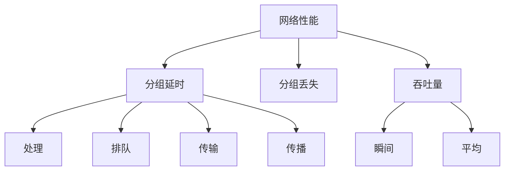
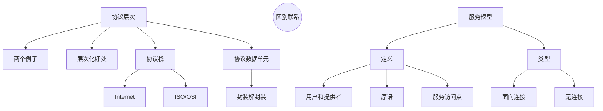

# 第一章 概论

目的：了解**概念术语**、基础工作原理（概念基础）

**这一章最重要，特别详细地学习！**

- 什么是Internet ?
- 什么是协议? 
-  网络边缘
-  接入网、物理媒体
-  网络核心：分组交换、线路交换
-  Internet/ISP 结构
- 性能：丢包、延时、吞吐量
- 协议层次、服务模型
- 历史

## 1.1 什么是Internet

### 什么是网络：具体构成的角度

节点和边构成，和大小形状无关。

计算机网络：

- **节点**：1. **主机节点**（终端服务器）■；2. **数据交换节点**（路由器交换机中继器负载均衡）⚪。

- **边**：链路 1. 接入网链路-主机接数据交换；2. 主干链路-数据交换节点之间

- **协议**：各种规则制定的标准，可以相互配合进行工作。

Internet：互联网-网络的网络； Intranet：企业内网； 

- 互联计算设备：主机/端系统（end system/host）；各种应用程序
- 通信链路：link-网线/光纤；各种支持的协议——重要指标：带宽bps
- 分组交换设备：转发分组-路由器交换机（switch）

  互联网标准：RFC、IETF

### 什么是协议

协议：**对等层实体在通讯过程中应当遵循的规则集合**

- 对等层实体（网卡、相同协议、相同服务层等等）-peer

- 包括报文（PDU）**格式**、**次序**和**动作**。语法规范、时序、操作。

### 什么是网络：从服务角度

- 分布式**应用**（应用层以上的主机、网络服务进程）
- 向应用提供通信服务的**基础设施**（应用层以下的实体）：面向连接/无连接

## 1.2 网络边缘

### 网络结构（总）

- 网络边缘：主机、应用程序（客户端和服务器） ——提供服务**应用**
- 网络核心： 互连着的路由器、网络的网络 ——数据交换（分布式系统）**基础设施**
- 接入网、物理媒体：有线或者无线通信链路 ——边缘接入核心**基础设施**

### 通信模式

**网络边缘——运行的应用程序**

1. client/service **客户端/服务器模式**：服务器主，客户端从。请求服务器硬件、计算、数据资源。客户端主动，服务器被动。服务器一直运行，客户端有需要去请求。——主，从模式。可扩展性差，请求载荷增加性能断崖式下降。
2. peer-peer **对等模式**：每个节点即时客户端又时服务器，数据存储是分布式的，通信也是分布式的。——文件分发系统，可扩展性强。

### 面向连接服务

目标：在端系统之间传输数据——**通信之前握手打招呼**，存储栈、协议栈、资源栈做好准备。**连接建立状态**。

与有连接服务的区别：

- 通信状态在端系统之中维护，网络不知道。——面向连接的服务

- 通信状态在经过的各个节点都知道。——有连接的服务

典型-**TCP 服务**：

1. **可靠、保序**：不出错、不重复、不丢失、不乱序。——靠协议自己的努力：缓存、编号、确认、重传（占用时间空间资源）
2. **流量控制**：协调处理数据速度不同的两个设备协同工作。
3. **拥塞控制**：路径堵了以后主动降低速度。

### 无连接服务

目标：在端系统之间传输数据——**通信前不打招呼，直接连接**。

典型-**UDP服务**：

1. 无连接
2. 不可靠数据传输 
3. 无流量控制
4. 无拥塞控制

UDP：实时多媒体应用、速度型应用。流媒体、远程会议、 DNS、 Internet电话

TCP：HTTP (Web), FTP (文件传 送), Telnet (远程登录),  SMTP (email)。

## 1.3 网络核心

问题：怎么实现？电路交换（预留专有线-跑腿服务）、分组交换（存储转发-发快递）

### 电路（线路）交换

通过**信令**系统分配一条**独享**的线路。端到端的资源被分配给从源端 到目标端的呼叫 “**call**”。——电话线路网络

——**性能有保障**，但是会有**资源浪费**。

通过复用的方法把线路资源进行分配：**时分多路TDM、频分多路FDM、波分多路WDM、码分多路CDM**。——划分为资源片（带宽等）

练习题：计算每个资源片的速率，计算传递时间，加上建立连接时间。有时候计算对方收到的时间的话，需要加上信号传播的时间-传播延迟（物理距离/信号速度）。

对于计算机来说好多时候请求是**突发**的，对带宽的需求不均匀。对建立连接的**实时性**要求高，所以不适合使用这种方式。

### 分组交换

分组存储转发方式：

- 每一条通信时不再分成资源片piece，使用全部带宽。
- 主机之间传输的数据被分为一个个的**组packet**。
- **存储-转发**：避免大数据传输占用带宽成为独享。
  1. 收到整个packet才转发。
  2. 延迟比线路交换大。（坏处）
  3. **按需使用**，共享性。（好处）
  4. 存在排队机制，不使用的时候不占用网络资源。

举例：

  速率为R bps的链路 ，一个长度为L bits 的分组 的存储转发延时： L/R 。计算需要几次存储、转发，乘这个系数。

  注意：*计算时不要把发送和接收都算进去*，发的同时就在收。

排队延迟和丢失：

  如果到达速率>链路的输出速率时，分组要排队，**缓存队列用完的话会被抛弃**。

网络核心的关键功能：转发（局部）、路由（全局）。

- **转发**：查路由表决定往哪传。

- **路由**：根据当前状态计算维护路由表。

统计多路复用：其实**也是划分时间片，但是划分不均匀**，模式不是固定的。

### 二者对比

同样的网络资源，分组交换允许更多用户使用网络！——支持同时使用的用户数更多，可以用计算的方式证明。是*9而不是10的原因是不能完全占满，流量强度100%的时候没有任何裕量会挂*。

分组交换是“突发数据的胜利者”

- 适合突发式数据传输，资源共享、不用呼叫。
- 过度使用会造成网络拥塞：分组延时和丢失。需要拥塞控制。
- 提供类似电路交换的服务：仍未解决。

### 分组交换分类

根据网络层是否建立连接分为两种：

1. **数据报**网络：数据报携带目标主机**完整地址**。（寄信）——不同分组路由可以改变，可能会失序。
2. **虚电路**网络：需要进行握手，每个分组携带**虚电路号**。——建立以后路径保持不变，查询虚电路号存储转发即可。*虚电路连接体现在中间所有经过的所有节点上。*

## 1.4 接入网和物理媒体

### 接入网

把**边缘设备接入网络核心的网络**（将端系统和边缘路由器连接）：住宅接入网络、单位接入网络；无线接入网络（局域、广域）。

重要指标：带宽bps（bits per  second每秒多少位）、共享/专用。

### 住宅接入

**住宅接入-电话公司**：直接利用**电话线网络拨号上网**，“**猫**”**modem**/调制解调器，4kHz，调频调幅调相综合调制。带宽很窄，56Kbps及以下，无法同时打电话和上网。

**digital subscriber line (DSL)-电话公司**：上下行不对称-ADSL。0-4K语音通话，4K以上一块上行一块下行，在各自的频段进行调制解调。可以边打电话边上网，使用ADSL猫。上行1Mbps下行10Mbps。每个用户一个**专用线路**到CO（central  office）。

**线缆网络-电视公司**：有线电视公司同轴电缆（单向只支持下行），进行双向改造支持上行，某些带宽用于传统电视，一部分上行一部分下行。——共享服务。

特点：

1. **上游光纤，下游同轴电缆**。——hybrid fiber coax（混合光纤同轴）。
2. **非对称**: 最高30Mbps的下行传输速率, 2 Mbps 上行传输速率。
3. 各用户**共享**到线缆头端的接入网络：线缆和光纤网络将个家庭用户接入到 ISP 路由器。

**电缆模式-电网公司**：power modem，我国用的很少。

**当今常见接入模式**：**无线路由设备**-路由器、防火墙、网络地址转换、IP分配功能。然后通过连接猫接入运营商，带着WiFi设备一起，支持有线无线接入。具备**路由功能、局部交换功能、无线接入功能**。

### 企业接入

通过AP、无线接入点整合所有设备接入交换机端口，通过交换机级联，连接公司路由器接入互联网。(Ethernet-以太网)

### 无线接入

各无线端系统共享无线接入网络：

1. WLAN：建筑物内部
2. 无线广域 4G 5G：由电信运营商提供

### 物理媒体

发送接收节点之间**传递bit的介质**（光纤、电缆、开放空间传电磁波）

分类：

1. **导引型媒体**：有形的介质，信号沿着固体媒介被导引。
2. **非导引型媒体**：开放的空间传输电磁波或者光信号。

导引型媒体主要包括：

1. 双绞线 (TP) ：两根绝缘铜导线拧合。
2. 同轴电缆： 两根同轴的铜导线。
3. 光纤和光缆：玻璃纤维中传播光脉冲。（在光纤中全反射-单模、多模）

非导引型媒体链路包括：

1. 地面微波
2. LAN
3. wide-area
4. 卫星

环境影响：反射  吸收 干扰，随着距离平方反比，高速衰减。

## 1.5 Internet结构和ISP

从**演化的角度**来看另一种划分方式：一个运营商的网络叫做**一个ISP网络**。教育网、电信网、银行服务网……通过路由器联系在一起——**网络的网络**。

端系统通过接入**ISPs** (Internet Service Providers)连接到互联网。

发展和演化是通过经济的和国家的政策来驱动的

全互联的话需要$O(N_2)$连接，**代价特别大**，**不可扩展**。

### 演化过程

方法：将每个接入ISP都**连接到全局ISP**。通过全球ISP经过上行下行可以连接起来——**有利可图**。

1. 竞争：全局ISP是可行的业务，那会有竞争者，有利可图，一定会有**竞争**。

2. 合作：通过ISP之间的**合作**可以完成业务的扩展，肯定会有互联，**对等互联**的结算关系。——**IXP-互联网交换点**（骨干流量通过此交换点）。

3. 业务细分：将局部ISPs连接到全局ISPs。
4. ICP-Internet Content Providers：互联网内容服务商（提供上层业务-聊天、搜索、购物等等），可能会在全球各地部署自己的机房，构建自己的网络，一般部署在离ISP比较近的地方。——ISP费用太高成本大。

### 主要结构

**——松散的层次结构**，互联是任意的，不稳定可以及时更换链路。

1. 中心第一层ISP：分布广、节点有限、带宽很大。直接与**其他第一层ISP**相连；与**大量的第二层ISP**和其他客户网络相连。——**Tier1**

   POP：point-of-presence不对等关系-上下级，低级ISP提供POP接入高级ISP从而接入互联网。

2. 第二层ISP: 更小些的 (通常是区域性的) ISP。与一个或多个第一层ISPs，也可能与其他第二层ISP。——**Tier2**

3. 第三层ISP与其他本地ISP：local ISP，接入终端。——**local**

一个分组在跨国传输的时候要经过许多网络。

内容提供商ICP可能会部署自己的网络,连接自己的在各地的DC（数据中心）。连接若干local ISP和各级（包括一层）ISP，提供更快的服务。

### 连接方式

1. POP: 高层ISP面向客户网络的接入点，涉及费用结算。
2. 对等接入：2个ISP对等互接，不涉及费用结算。
3. IXP：多个对等ISP互联互通之处，通常不涉及费用结算。
4. ICP自己部署专用网络，同时和各级ISP连接。

## 1.6 分组延时、丢失和吞吐量

丢失和延时是怎样发生的：分组到达链路的速率**超过了链路输出的能力**，排队等待需要时间，传播需要时间、排队队伍太长被丢弃。

### 分组延时

分类：（一个hop花费的所有时间-一跳的时间）

1. 节点处理延时：检错、查路由表……
2. 排队延时：输出链路上等待传输的时间。
3. 传输延时：将分组发送到链路上的时间= L/R。
4. 传播延时：d/s 物理长度/速度。

用车队作类比：

1. 过收费站：传输延时。
2. 在路上跑：传播延时。

**信道容量**：广域网打出去数据在路上，容量大；局域网还没发完对方就收到了，信道容量小。

**节点延时**：$d_{nodal}=d_{proc}+d_{queue}+d_{trans}+d_{prop}$

排队延时取决于**流量强度**：

R=链路带宽 (bps)  L=分组长度 (bits)  a=分组到达队列的平均速率。
$$
I=\frac{La}{R}​
$$
流量强度越接近1，排队延时越接近无穷大（分组会丢失）。

**延时和路由**：测试往返时延-RTT(Round-Trip Time)

基于ICMP(Internet Control Message Protocol)协议。IP包的头里面有很多载荷信息，包括**TTL**（生存时间），过一个节点TTL减一，减到0的时候把它抛掉，并且通知源主机。测试的时候把TTL设置为1，到第一个节点的时候被删除获得通知，收获往返延时。怎么知道到达目标主机？目标端口没有应用进程，目标主机发送“目标端口不可达”报文，得到发送到目标主机的往返延时。

举例，gaia.cs.umass.edu to www.eurecom.fr。发送三次测试，返回每一挑的往返时延。7到8时延极具增加，应该是因为非常远，跨国跨大洋，延时陡增。到第17以后，探针丢失，路由器不响应。

### 分组丢失

1. 链路的队列缓冲区**容量有限**。
2. 当分组到达一个**满**的队列时，该分组将会丢失。
3. 丢失的分组可能会被前一个节点或源端系统重传，或**根本不重传**。——线路可靠，上节点重传；线路不可靠，源主机重传。以太网就不可靠，链路层可靠。

### 吞吐量

分类：瞬间-某一时间点的速率、平均-长时间的平均值

瓶颈链路：**端到端路径上，限制端到端吞吐的链路**。最细的部分——木桶效应。

仅有两个设备在通信时，端到端平均吞吐：$min\{R1，R2,…,Rn\}$

多个设备同时使用时，端到端吞吐：$min(Rc ,Rs ,R/10)$，每段都取决于当时同时使用的连接数量。

## 1.7 协议层次及服务模型

互联网是一个异常复杂的大系统：人类历史上最大的人造系统之一。需要使用模块化、分层方式来设计实现。

### 协议层次

示例：航线系统、异地哲学家的相互交流（说不同语言）：秘书-传递、翻译-转换、哲学家-应用层。

每层实现**一个或一组功能**，非常明确。层之间交换PUD（协议数据单元）。

服务是功能的子集，利用自己的功能为上层提供服务。对等层实体通过**协议**交换信息（通过接口访问下层服务）。

实现协议要通过下层服务，协议的目的是和对等层交换信息更好地为上层服务。越往上功能越高级，越往下功能越具体。本层能向上层提供的服务**包括了**下面所有层能提供的**所有服务**加自己所**增加的新的服务**。

### 服务和服务访问点

**服务Service**：低层实体向上层实体提供它们之间的**通信的能力**。

实体分为两类：服务**用户**（上层）、服务**提供者**（下层）。提供者向用户提供服务，提供服务的位置是访问点。

**服务访问点 SAP** (Services Access Point) ：上层使用下层服务的层间接口点。用于区分上层用户。IP/端口……

提供服务的形式：**原语(primitive)**，如socket API的各种函数，抽象成原语，是服务真正实现的形式。

### 服务的类型

面向连接的服务和无连接的服务（前面讲过）

面向连接：要进行握手做好准备。建立连接，通信，拆除连接。如TCP、虚电路，传大型数据。

无连接：寄信、UDP。

### 服务和协议

区别：服务是**垂直**的关系、协议是**水平**关系。

联系：本层协议的实现要靠下层提供的服务来实现，本层实体通过协议为上层提供更高级的服务。

### 数据单元(DU)

**SDU**：服务数据单元（上层要传的数据） ICI：接口控制信息 IDU：SDU+ICI 接口数据单元

**PDU**：协议数据单元（本层之间要传的数据）SDU+本层控制信息。注意IDU通过接口以后舍掉ICI。

如果SDU特别大，可能会把它拆开分别加上本层头部封装成PDU；如果SDU很小也可以多个合并成一个PDU。

**一对一、一对多、多对一**几类情况。$PDU=head+body$

不同层PDU名字不同：应用报文、报文段、分组/IP数据报、帧……

**讨论：分层的好处**

每个功能独立实现、便于采用新的技术、便于交流和讨论。

**层次化**解决复杂问题：把任务拆分为不同层次解决、便于引入新技术。缺点效率低。

### Internet 协议栈

1. 物理层：把数字数据**转换**为物理信号，在线路上传送**bit**，接收发来的物理信号转为数字信号。
2. 链路层：**相邻两点**之间传输以**帧**为单位的数据。*PPP, 802.11(wifi), Ethernet*。
3. 网络层：传输以**分组**为单位的源主机到目的主机**端到端**的传输。（转发、路由）*IP*
4. 传输层：作**进程到进程**的区分，把不可靠**变为可靠**。以**报文段**为单位。*TCP, UDP*
5. 应用层：实现各种各样的网络服务。*FTP, SMTP, HTTP,DNS*

### ISO/OSI 参考模型

和TCP/IP架构模型的区别：多了**表示层、会话层**。表示转换、会话管理。

互联网协议栈如果需要的话由应用层自己实现。

### 封装和解封装

“直接通信”是抽象的，并不是真正直接传过去的，通过底层才能实现。

交换机只涉及链路层、物理层（两层）。路由器涉及网络层、链路层、物理层（三层）。

封装：层层加头部信息；解封装：层次去掉头部信息还原原始PDU。

### 各层次的协议数据单元

- 应用层：报文(message)
- 传输层：报文段(segment)：TCP段，UDP数据报
- 网络层：分组(packet)/数据报（如果无连接方式：数据报datagram） 
- 数据链路层：帧(frame)
- 物理层：位(bit)

## 1.8 历史