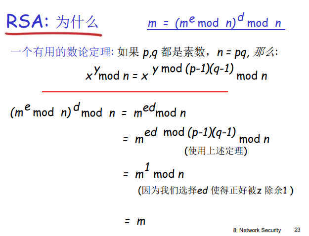

# 第八章 网络安全

- 是什么？网络安全原理——私密性、认证、报文完整性、密钥分发
- 怎么实现？安全实践——防火墙、各层次安全性

## 8.1 什么是网络安全？

**什么是网络安全**？——保证网络安全是完全的

1. **机密性**：加密解密，其他人不知道发的是什么
2. **可认证性**：确认对方身份
3. **报文完整性**：传输过程中没有改变
4. **访问控制和服务的可用性**：服务对于用户可接入、可用-availability

经典模型：

- Bob, Alice (lovers!) 需要安全的通信
- Trudy (intruder) 可以**截获，删除和增加**报文——窃听、插入、伪装、劫持、拒绝服务

——对等方包括：真人、交易、银行、DNS服务器间、路由器之间（各层）

## 8.2 加密原理

**术语**：

- plaintext明文
- key密钥
- ciphertext密文

**分类**：对称密钥密码学、公开（非对称）密钥密码学——根据加密解密密钥是否一样。

### 对称密钥加密学

——共享一个对称式的密钥（映射关系）

示例：**替换密码**：将一个事情换成另外一个事情

- 没有计算机之前是可以的，26！种可能计算机可以很快破解。
- 可以使用启发式信息进行搜索——字频词频

问题：**密钥分发**（如何达成一致）

**对称密钥加密算法**：

1.  **DES**（标准）

- 美国加密标准
- 56位key，64bit成组加密
- 不太安全，可以暴力破解
- 更安全：**3重加密**、**分组成串技术**：当前明文+之前密文异或后加密

DES操作方法：初始替换（乱秩）、16轮使用56位中的不同key进行加密运算、最终替换（乱秩）

2. **AES**

- 加密强度可选：key位数可以不同，128bit成组，128、192、256bit key
- 使用1秒钟破解 DES, 需要花149万亿年破解AES

3. **块密码**（成组加密）

- 64bit分为8个8bit，分别采用不同的映射关系，再打乱，可以多轮循环

4. **密码块链**

- 避免了明文相同密文也相同的情况，加入历史密文
- 当前明文+之前密文异或后加密
- 打破64bit64bit映射关系，增加破解难度

### 公开密钥密码学

——对称式加密第一次如何达成一致？

分成公钥和私钥，公钥包含在证书内部，把公钥分发给对方，发送方使用公钥加密，接收方通过私钥进行解密即可。

**公开密钥加密算法**：

——公钥加密的可以使用私钥还原、通过公钥无法推出私钥

**经典算法：RSA**

1. **选择**密钥
   1. 选择2个很大的质数 p, q
   2. n = pq, z = (p-1)(q-1)
   3. 找一个和z互素（互质）的数e
   4. 选择 d 使得ed-1 正好能够被z整除——ed mod z = 1
   5. 公钥(n,e). 私钥 (n,d)。得到**两个数对**

2. **加密,解密**
   0. 得到 (n,e) 和 (n,d)
   1. 加密：c = m^e mod n
   2. 解密：m = c^d mod n

——加密解密算法运行过程是一样的、加密代价很大-对称加密1000倍、破解很难

3. **为什么**？数论中的某个定理

另一个重要特性：用于数字签名（先用私钥再用公钥）

**破解密钥**两种方式：

1. 加密算法已知，求密钥
2. 加密算法和密钥均不知道

不同**攻击方式**：

- 唯密文攻击：硬算
- 已知明文攻击：部分明文和密文的对应关系
- 选择明文攻击：有相同的加密方法

## 8.3 认证

——表明自己的身份，双方是等价的

1. ap1.0直接表明身份？——不行，可以被伪造
2. ap2.0根据IP地址？——不行，可以伪造地址
3. ap3.0传送密码？——不行，记录并回放（重放攻击）playback attack
   - ap3.1加密自己的密码？——不行，加密密码也可以重放

4. ap4.0对称加密，双方都有对称式key，发送nonce-R挑战，返回加密之后的R
5. ap5.0公开密钥加密，发送方使用私钥加密，接收方使用公钥解密，认证对方的身份。

**ap5.0安全漏洞：中间攻击**

bob拿到了Trudy的公钥——根本原因

1. 怎样拿到对方的公钥
2. 怎样验证对方的身份

——遗留问题：密钥分发、可靠地获得其他实体真实的公钥

## 8.4 报文完整性

**数字签名**：可验证性（接收），不可伪造性（发送），不可抵赖性（第三方）——谁签署、签署了什么

怎么签？——用自己的私钥对需要签名的报文进行加密，对方使用公钥进行解密

存在的问题：太长，计算代价比较大——报文摘要

**报文摘要**：对m使用散列函数H，获得固定长度的报文摘要 H(m).

散列函数——多对一映射、固定长度、正向计算容易反向计算困难。

某些报文生成算法也有问题：很容易找到另一个报文和原报文有同样的报文摘要

**散列函数算法**：MD5-128bit；SHA-1-160bit；SHA-256-256bit。

## 8.5 密钥分发和证书

**可信赖中介**——对称KDC，非对称CA

- 对称密钥分发：trusted key distribution center (KDC)
- 公共密钥可信：certification authority (CA)

和KDC和CA建立的可信连接都是带外的（默认已经建立的）

**KDC**：KDC服务器生成A、B通信用的对称式keyR1，使用各自的key加密，同时给A发被keyB加密过的A，R1对，A和B通信时B能够用此密钥解密，由此A、B进行可靠通信。

**CA**：CA用自己的私钥签署B和B公钥的捆绑关系——**证书**。A用CA的公钥解密出这个对应关系，获得B的可靠公钥。

**证书**：串号、证书拥有者信息，包括算法和密钥值本身、证书发行者 信息、有效日期、颁发者签名

根证书：自己给自己签发的证书，是未被签名的公钥证书或自签名的证书。操作系统中自带、自己下载等等。

**信任树**：信任了根，通过根CA颁发其他实体证书，逐步形成一个树状结构。

## 8.6 各个层次的安全性

### 应用层：安全电子邮件

**机密性**：用对方公钥加密，代价很大

——生成对称式密钥加密报文，把对称式key通过公钥发送给对方。

**可认证性和报文完整性**：发送方使用私钥加密报文摘要，接收方通过公钥解密报文摘要并做对比

三者结合：加密的报文摘要放到报文内，再用对称式加密，再用对方公钥加密对称密钥

一个有名的标准（例子）：PGP

### 传输层：SSL

——Secure sockets layer，SSL实际上是在应用层实现的

在TCP和应用层之间加入的一层，安全套接字层

常见：https

三个阶段：

1. 握手：连接、通过CA签署的证书认证身份、传输密钥
2. 密钥导出：采用共享的MS产生4个keys
3. 数据传输：使用对称密钥进行加密

### 网络层：IPsec

——传输层下、网络层上。主要有

- 认证头部 (**AH**)协议：不提供私密性
- 封装安全载荷 encapsulation security  payload (**ESP**) 协议：三种安全性都有

都要建立**安全关联SA**：是单向的，类似于网络层面的握手。由三元组确定：安全协议 (AH or ESP)、源 IP地址、 32-bit连接ID

1. AH：在IP头部和数据之间插入自己的头部

   AH 头部包括：

   - 连接ID
   - 认证数据
   - 数据类型：TCP, UDP, ICMP

2. ESP 协议：在IP头部和数据之间插入自己的头部，尾部插入ESP尾部和可认证尾部——还包括了私密性

### 链路层：WEP

——每一个链路层分组都要被加密

输入向量+对称式配置好的key 得到需要的key 和要传输内容做异或得到密文。

无线主机之间传输加密的分组。

## 8.7 访问控制：防火墙