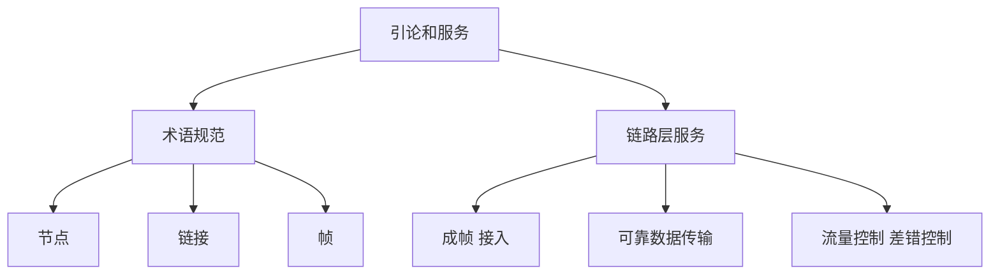
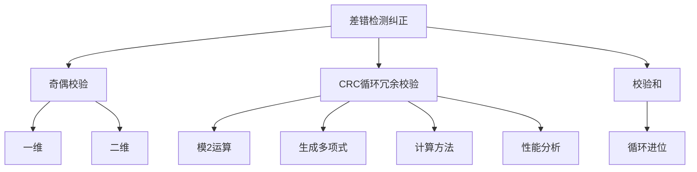
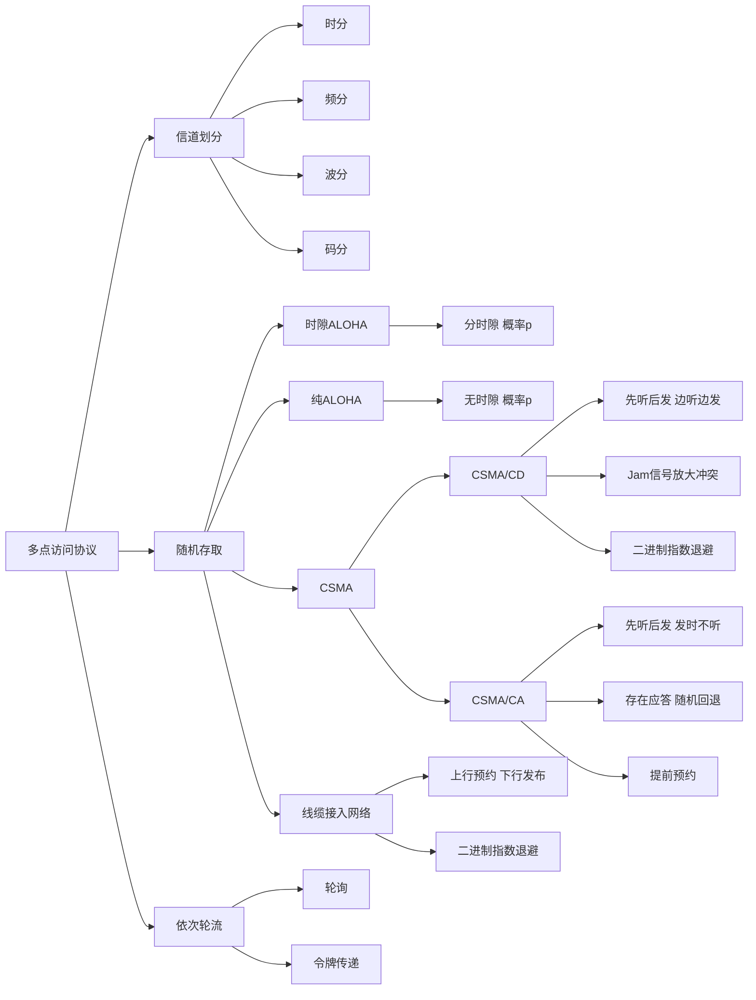
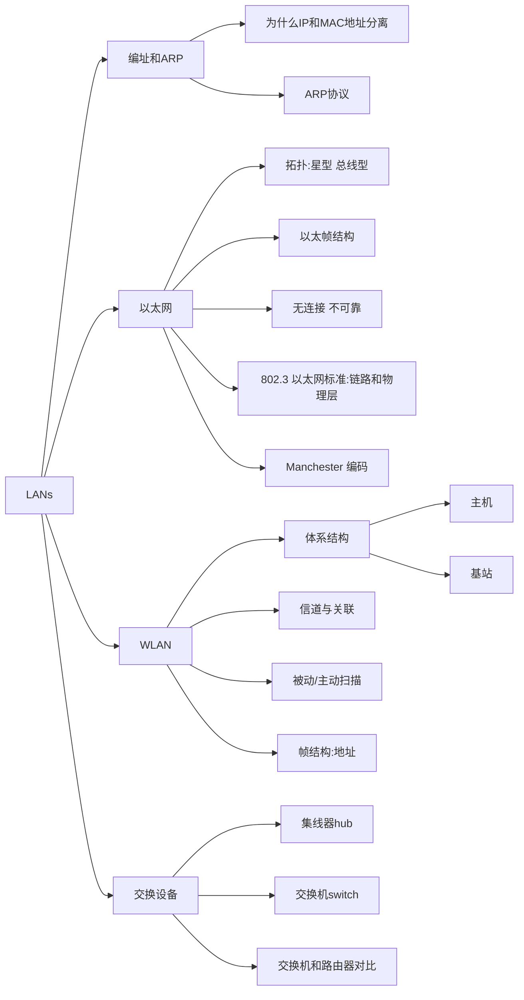
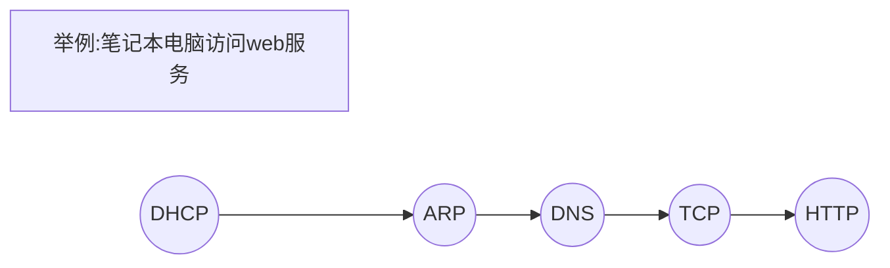

# 第六章 链路层和局域网

——广域网也有链路层，但是相对来说比较简单，所以重点放在局域网

——由一个节点如何到达另外一个相邻节点：点到点传输

目标：

- 原理：检错和纠错、共享广播信道（多点接入）、链路层寻址、LAN、可靠数据传输（Rdt、流量控制-讲过了）
- 实现：PPP、802.3、802.11

网络节点的连接方式：

- 点到点连接：广域网（物理限制、带宽延迟大-碰撞损失极大）——不用考虑寻址、访问控制
- 多点连接（共享介质、交换机AP）：局域网——多点访问控制（MAC）、寻址

## 6.1 引论和服务

**术语规范**：

1. 节点nodes：主机和路由器
2. 链路links：连接个相邻节点通信信道（有线无线）
3. 帧frame：链路层的PDU

——数据链路层负责从一个节点通过链路将（帧中的）数据报发送到相邻的物理节点

**上下文**：（类比与一个人乘坐不同的交通工具）

- 数据报（分组）在不同的链路上以不同的链路协议传送
- 不同的链路协议提供不同的服务

**链路层服务**：

- 成帧、链路接入：打包、获得信道使用权——使用“MAC”（物理）地址来标示源和目的
- 相邻两点间完成可靠数据传输：有些有，有些没有（本身可靠就不用、本身不可靠就必须进行差错控制）
- 流量控制、错误检测、差错纠正、半双工和全双工

**在哪里实现**？

——每台主机上的**网卡**（网络适配器、网络接口卡、NIC）：链路层+物理层。硬件、软件和固件的综合体

**适配器通信**：同时可以发可以接

- 发送方：封装、差错控制、发出去
- 接收方：监听、接收、检错、解封装

## 6.2 差错检测和纠正

EDC——差错控制编码，存在残存错误；D——被保护的数据内容

**校验方法**

- **奇偶校验**：一维、二维（可以定位出错位置）：对偶情况也可能检测不到。

- **校验和**：1的补码和，循环相加

- **CRC**（循环冗余校验）：

**CRC**：

1. **模2运算**——加法不进位、减法不借位（其实就是**按位异或**）
2. 位串的两种表示—— $x^3+x^1+1=1011$
3. **生成多项式**G——r次方的一个多项式表示一个比特序列：r+1位
4. 生成r位冗余位，使得**数据位+冗余位刚好能被生成多项式整除**。

$D·2^r\ XOR\ R = nG$ 两边再异或R，等价于：$D.2^r = nG\ XOR\ R $ 。——两边同除G，得到的余数就是 R

**计算R**：D左移R位除以生成多项式得到余数（不足R位补0）即为EDC，接收方判断能否整除即可。

**CRC性能分析**：（理论分析不要求掌握）

- 能够检查出所有的1bit错误
- 能够检查出所有的双bits的错误
- 能够检查出所有长度 =r或者<r 位的错误
- 长度为 r+1的突发错误，检查不出的概率是：$1/2^{r-1}$
- 长度大于r+1的突发错误，检查不出的概率：$1/2^{r}$

## 6.3 多点访问协议

### 概述

两种类型链路：点对点、多点连接

多路访问协议存在的问题：2个或更多站点同时传送: **冲突（collision）**

介质访问控制协议：MAC-算法角度（MAP-协议角度）

- 分布式算法-决定节点什么时候可以发送
- 共享控制的通信必须用借助信道本身传输

**理想**MAC协议**特性**：

1. 一个节点占用所有带宽
2. M个节点占用R/M带宽
3. 完全分布式，没有统一协调节点
4. 简单易行

**分类**：

1. 信道划分：分路复用
2. 随机访问：允许冲突，可以解决冲突
3. 依次轮流：有中心节点控制、令牌

### 信道划分MAC协议

略（通信知识）

1. TDMA：时分多路
2. FDMA：频分多路
3. CDMA：码分多路——第三代移动通信技术（过时了）

### 随机存取协议

- 有数据要发送时，全部带宽发送
- 多节点同时传输，冲突检测恢复
- 随机MAC协议：
  1. 时隙ALOHA
  2. ALOHA
  3. CSMA：**CSMA/CD**, **CSMA/CA** 重点！——载波侦听、多路访问

1. **时隙ALOHA**

   每个时隙可发送一帧，每个节点都可以检测到是否产生了冲突，每一个随后的时隙以概率p重传帧直到成功。延迟没有上限，无法保证最长时间。

   **优点**：简单、全速率传播、完全分布式

   **缺点**：存在空闲时隙、冲突浪费时隙、检测冲突时间小于完全发完时间、需要同步

   **效率分析**：一个节点成功传输概率是$p(1-p)^{N-1}$，任何一个节点的成功概率是$Np(1-p)^{N-1}$。求导求极值，f(p*)=37.5%——信道利用率37%

2. **纯ALOHA**

   有帧马上传输，碰撞就不发，其他和时隙ALOHA一样

   **效率分析**：任何一个节点的成功概率是$Np(1-p)^{2(N-1)}$，f(p*)=17.5%——信道利用率17%，更差了。

3. **CSMA**(载波侦听多路访问)——发之前听一听有没有人在发

   ——冲突仍然有可能发生，两个节点可能侦听不到正在进行的传输（信道延迟造成的**延迟**）。延迟越大，冲突发生的概率越大。

#### CSMA/CD(冲突检测)

——事前侦听，边说边听（**先听后发，边听边发**）

- 冲突发生时则传输终止，减少对信道的浪费
- 有线局域网中容易实现，通过检测信号强度判断是否冲突

**以太网CSMA/CD算法**：

1. 将数据报生**成帧**
2. **侦听信道CS**——闲，直接发；忙，等待闲再发
3. 发送过程中不断**检测冲突CD**——没有冲突，成功；有冲突，停止之后重发
4. 检测到冲突后，发送一个**Jam信号**。**强化冲突**：让所有站点都知道冲突，所有监测到冲突节点都发送。
5. 放弃，适配器进入指数退避状态——**二进制指数退避算法**，窗口每次加倍，碰撞概率减半，等待时间变大。在第m次失败后，适配器随机选择一个$\{0，1，2，...， 2^{m-1}\}$中K，等待K*512位时，然后转到步骤2。对载荷自适应，载荷越大，碰撞概率高，动态加倍等待时间，取一个可用的平均等待时间，**动态分布式自适应算法**。

- 高负载：重传窗口时间大，减少冲突，但等待时间长 

- 低负载：使得各站点等待时间少，但冲突概率大

$$
efficiency=\frac 1 {1+5t_{prop}/t_{trans}}
$$

比ALOHA更好的**性能**，而且**简单，廉价，分布式**

#### 无线局域网 CSMA/CA（冲突避免）

WLAN两种模式：**有基础设施**、自组织，我们探讨前一种模式

基础设施：AP（access point 接入点-基站）、无线链路、（移动主机节点-非基础设施）

——无限介质有衰减、干扰、噪声，无法使用原来的冲突检测方式。

此情景下的冲突：2+ 站点（AP或者站点）在同一个时刻发送。

**802.11协议CSMA/CA算法**：

- 发送前**侦听**信道（CSMA）

- **不做冲突检测**，因为收到自己的电磁波信号远大于对方冲突信号。
  - 且冲突也可能成功，不冲突也不一定成功。
  - 例子：存在隐藏站点，暴露在两个传播范围的终端冲突也可以成功。

- 发送方：
  1. 侦听信道持续一段时间**空闲，直接发**。确认帧的等待空闲要比数据帧小（确认帧优先级高）
  2. 侦听信道**忙，随机选一个值**，**信道空闲时每次减一**，到0时发送帧，等待ACK。没收到ACK继续重复2。

- 接收方：
  - 如果帧正确，则在**SIFS后发送ACK**

为什么空闲还要等？——避免前一个发完以后**所有要发送的设备同时发，造成冲突**，减小信道利用率（**事前避免**）

——无法完全避免冲突：相互隐藏、非常近的随机值

发送方“**预约**”信道（可选项）

1. 发送方发送RTS（预约帧）
2. BS（AP）发送CTS广播，告诉其他所有设备信道被预约

#### 线缆接入网络

——特殊的random方式（下发存在集中控制，上行随机预约）

- 每个用户通过cable modem接入网络
- 分为上行、下行，分多个信道，由CMTS管理
- **下行**(广播)信道,FDM，互联网占一个（**不存在竞争**，用户根据地址接收），其余是广播、电视
- **上行**信道,FDM，进一步TDM分成**微时隙**：一部分是**竞争式（预约）**、一部分是**分配式**。
- 上行预约、下行发布预约结果，没预约上的话重新预约即可（类似于抢票）。或者之间分配好用就行。
- 预约产生碰撞，都无法使用，通过下行反映，二进制指数退避方法处理。

### 轮流MAC协议

**对比信道划分、随机存取**：信道划分低负载时利用率低，随机存取高负载时利用率低（反复碰撞）

——Taking Turns 低负载也很好，高负载也很好，但是太复杂很少使用。有**集中式、分布式**两种。

1. **轮询**：主节点邀请从节点依次传送

   问题：

   - 单点故障问题
   - 轮询消耗带宽
   - 等待轮询消耗时间

2. **令牌传递**：控制令牌( token)循环从一个节点到下一个节点传递，有数据就把令牌变成数据帧，接收方收到后再发出去（可能发给多个设备），最终回到发送方——令牌报文：特殊的帧；分类：令牌环、令牌总线。

   问题：

   - 令牌消耗带宽
   - 令牌循环延迟
   - 单点故障——令牌丢了，复杂点生成令牌方式

## 6.4 LANs

### 编址和ARP协议

**MAC 地址和ARP**

——编址，IPv4 32位（40多亿个），按照子网来分层路由；**MAC地址48位，在网络内部区分不同的节点**。

——ARP协议，把IP地址转换成对应发送设备MAC地址，在物理网络内部找到对应设备进行转发。网络层一条对应可能有链路层的多条。使得帧可以穿过各个网段。

为什么**网络地址和mac地址分离**

1. IP地址和MAC地址的**作用不同**：IP地址分层、MAC地址是一个平面
2. **分离的好处**：网卡坏了可以之间换网卡，IP地址不变；支持网络层其他协议：IPX等
3. **捆绑的问题**：生产网卡时不知道用在哪个网段，无法设置；每次都要重载地址且仅支持一种协议；下层会影响到上层的转发操作。

**LAN 地址和ARP**

- 每个设备都有一个唯一地址
- 48位全1表示广播地址：FF-FF-FF-FF-FF-FF
- IEEE管理和分配，厂商购买不同的号码段
- MAC：身份证号；IP：通讯地址号
- MAC平面地址 ➜ 支持移动；IP地址有层次 ➜ 不能移动（高级计算机网络设计移动相关）

**ARP: Address Resolution Protocol**

——已知IP地址，如何获得MAC地址？

- 每个IP节点维护一个ARP表：< IP address; MAC address;  TTL>
- 不在ARP表中，发送查询包：FF-FF-FF-FF-FF-FF
- 目标主机收到返回自己的IP和MAC，存入ARP表
- 一般设置20分钟，即插即用，无需网络管理员的干预（透明）

举例：**路由到其他LAN**：分组传输过程中，源IP目标IP都不变，源MAC目标MAC每次都会改变。

### 以太网

——98%以上占有率最主流、使用最广、廉价、简单、带宽很宽。

主机-网卡-收发器电缆-收发器-同轴电缆（两端匹配终结器-防止回声）——任何主机都可以往同轴电缆注入信号。

**物理拓扑**

1. **总线型**：连载一个长线上——可靠性差
2. **星型**：一个端口收，所有端口发（hub 或者 switch）——逻辑上还是总线型，
   - hub（集线器）级联的所有设备同在一个**碰撞域**内。
   - switch（交换机）可以同时发多个——解决了CSMA-CD高负载时的可靠性问题。

**以太帧结构**

- **前导码**：7B 10101010 + 1B 10101011，**同步时钟频率**
- **目标**MAC地址、**源**MAC地址：6字节48bit
- **类型**：上层网络层协议
- **载荷**部分
- **CRC**：一边发一边生成在接收方校验

**无连接、不可靠的服务**

- 无连接：不握手
- 不可靠：不确认（无ACK、NAK）-本身出错率很低
- 二进制退避的CSMA/CD

**802.3 以太网标准：链路和物理层**

- 帧格式一样，物理层标准和介质不同、速率不同
- 100BASE指基带传输，蓝色代表同轴电缆、红色代表光纤

**以太网CSMA/CD**：（上一节讲过了）

- 先听后发（载波侦听）、边听边发、冲突随机等待重发
- 强化冲突Jam信号
- 二进制指数退避算法
- 无时隙
- 碰撞窗口最大1024，10Mbps最坏50ms
- 效率问题计算：低负载很好、高负载也很好（交换机引入的好处）

**10BaseT and 100BaseT**

- 数字代表几bps
- Base代表基带传输
- T代表双绞线-横截面积小减少串扰
- 节点连接到HUB上，在一个碰撞域
- 节点和HUB间的最大距离是100 m

Hubs：集线器——无缓存、同一碰撞域、一收多发

---

> 往下就开始讲物理层了

**Manchester 编码**

- 使用跳变方向代表不同的0，1——向下跳变代表1，向上跳变代表0
- 可以很容易地把时钟和bit序列一起传输
- 10Mbps链路使用20M带宽——占用更大的带宽，效率50%
- 100BaseT **4b5b编码**，取16种跳变组合，保证至少4个bit有跳变，4bit用5bit来表示，100M成为125M，增加不多。
- 千兆以太网，使用**8b10b编码**。有共享模式-CSMA/CD、交换模式-直连点对点链路，很少发生冲突，效率很高

### 802.11 WLAN

**IEEE 802.11 Wireless LAN**：a、**b**、g、n——都采用CSMA/CA、都有基站模式和自组织网络模式。MAC和帧格式相同、物理层信道和速率不同。

**体系结构**

- 无线主机与基站通信：**base station接入access point**
- 基础设施模式下的基本服务集Basic Service Set  (BSS)包括：
  1. 无线**主机**
  2. 接入点(AP): **基站**

- 自组织模式下只有无线主机

**信道与关联**

- 802.11b信道分为11个相互不 同的但是部分重叠的频段

  **每次选择11个中的一个**——邻居AP之间可能干扰

- 主机通信之前和AP建立**associate**

  - 扫描信道：主动、被动
  - 选择关联AP
  - 认证：口令、RADIUS等
  - DHCP动态配置IP地址和子网掩码

**被动/主动扫描**

- 主动：（1）H1广播探测请求帧（2）AP发送响应（3）H1向AP发送请求关联帧（4）AP向H1发送响应关联帧
- 被动：（1）AP发送信标帧（2）H1发送请求帧（3）AP发送响应关联帧

**802.11 帧：地址**

1. 主机或者AP的MAC地址：**接收方**
2. **发送**该帧的主机或者AP的MAC地址
3. AP连接的**路由器接口**的MAC地址
4. 只在**自组织模式中使用**

——其余：帧控制（协议控制、帧类型等等）、预约传输时间的持续期、帧序号、载荷、校验等

子网中运行802.11，往上可能是802.3（快、带宽大）

### 网络交换设备switches

**Hub：集线器**：物理星型、逻辑总线型，同一个碰撞域（一个网段）内，不可以接不同速率以太网，不可以同时发送，可以级联。——盒中总线

**交换机**：存储转发，可以决定往哪个端口发（每一个端口可以认为是一个网段）。并发的主机可以很多、可以级联、即插即用（透明）。也需要排队，每个端口也是进行CSMA/CD进行控制。

- 多路同时传输：主机有一个专用和直接到交换机的连接（没有冲突、碰撞）
- 转发表：MAC地址-端口号-时间戳
- 自学习转发表：根据从不同端口收到的帧的源MAC直接建立联系，不知道的话进行泛洪，向所有端口转发即可进行传送。
- 过滤／转发：进入端口设备MAC记录、匹配目标MAC——出入端口相同，不转；出入端口不同，转发；没找到目标MAC，泛洪。
- 交换机级联：效率更高，而hub级联会使得效率降低。发送过后，路径被学习，下一次直接单播转发即可。

网络连接：通过各级交换机连接，再接网关路由器，接入ISP接入互联网。

**交换机和路由器对比**：

- 层次不同：链路层、网络层
- 都有转发表：交换表-生成树算法、路由表-路由选择算法——是否即插即用、效率不同

### VLANS

——虚拟局域网（略）

- 把一些MAC地址对应的设备放到一个虚拟局域网内
- 在交换机处做一些设置即可完成功能——多个虚拟交换机

## 6.5 链路虚拟化：MPLS

——多协议标记交换，按照标签交换分组

本科略讲，不考

- 基于标签的转发表
- 基于虚电路表

## 6.6 数据中心网络

——和一般局域网需求不一样、特性也不一样

数据中心（DC）服务器和存储设备之间存在**高带宽、高可靠、低延迟**的连接。

- 负载均衡器：对外不可见
- 复杂的交换阵列：增加冗余度-可靠性、吞吐量

## 6.7 a day in the life  of web request

——按时间轴来讲web浏览器怎么和web服务器打交道：**综述**

在校园启动一台笔记本电脑，访问一个网站。

1. DHCP动态获取IP地址
   - 用户电脑使用DHCP 请求被封装在UDP中，封装在IP, 封装在 802.3 以太网帧中
   - FFFFFFFFFFFF广播
   - 以太网帧中解封装IP分组，解封装UDP，解封装DHCP
   - DHCP服务器发送ACK：IP、DNS、网关、掩码
   - 封装应答帧，LAN转发到用户电脑
   - 用户接收，ACK应答

2. ARP
   - DNS查询被创建，封装在UDP段中，封装在IP数据报中，封装在以太网的帧中. 将帧传递给路由器
   - 用户电脑ARP查询广播，路由器ARP应答，给出对应端口MAC地址
   - 客户端获得MAC地址用于发送DNS请求

3. DNS
   - 包含DNS的IP数据报到达第一跳路由器
   - 路由（路由表被RIP，OSPF，IS-IS 和/或BGP协议创建）到DNS服务器
   - DNS服务器解封装
   - 回复给客户端对应url的IP

4. TCP连接建立
   - web浏览器调用TCP socket
   - 三次握手：SYN段、SYNACK段
   - 建立TCP连接
5. HTTP请求、应答
   - 发送HTTP请求到TCP socket
   - 打包到IP数据报中，路由到web服务器
   - web服务器发送HTTP应答
   - 携带应答HTTP的IP数据报最终路由到客户端，经过端口发送给web浏览器。

## 总结

对于LAN中，不碰撞=成功的条件是：一个帧在以太网中持续时间≥2τ（最长往返延迟），冲突检测机制可以确保发送成功。——发送时检测到冲突最长时间为2τ。

- 检错纠错：CRC
- 多路访问：MAC
- 链路层编址：ARP协议
- 实现协议：WLAN——802.11；LAN——以太网

其他协议：PPP协议——point to point protocol。点到点连接常用协议。