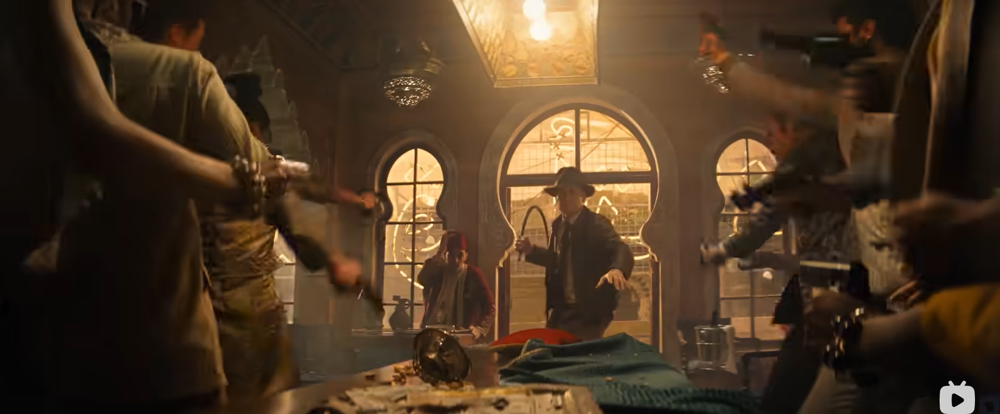
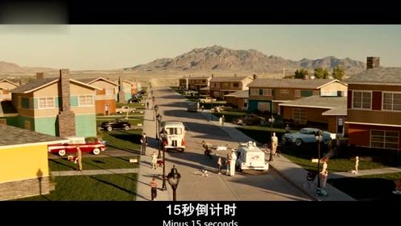
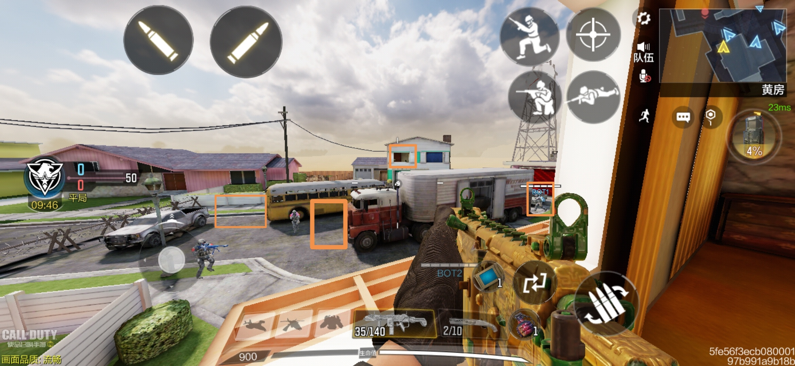
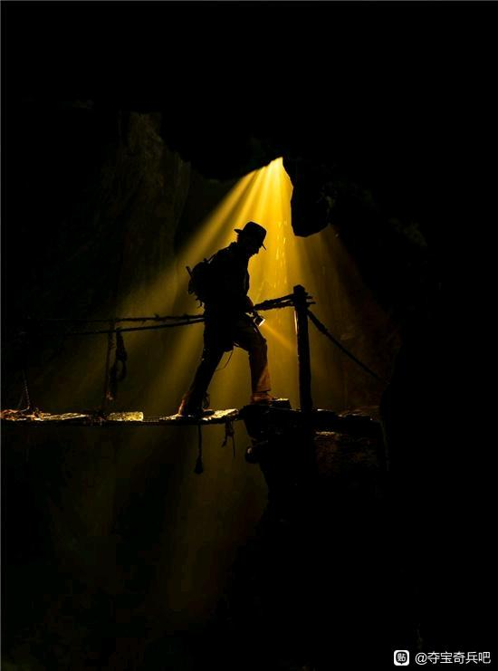

# 永远的印第安纳琼斯

> 他拿出鞭子恫吓在场的人们，而下一秒所有人都拿起了手枪指着他。40多年前，他也是这样一枪干掉了那个耀武扬威冲他挥刀的敌人，创造了“大人，时代变了”的经典名场面。而如今，对冒险电影，对夺宝奇兵，对琼斯博士，时代真的变了……
>
> 
>
> 

第一次接触到夺宝奇兵系列的电影，是在高考完的暑假。没有了课业的压力，又赶上刚刚拥有自己的电脑，我开始观看各种各样的影片：《回到未来》三部曲、《终结者》系列、《楚门的世界》等等，一来这些上世纪八九十年代的影片多数免费，二来当时刚看完大刘的《三体》，正痴迷各种各样的科幻小说电影。

第一次认识主角琼斯的扮演者哈里森福特，是在赛博朋克系列鼻祖《银翼杀手》。进而接触到《星球大战》系列，又顺藤摸瓜找到了和科幻有所区别的本系列电影。对这个演员印象深刻的原因主要是他在气质上很像我高中时的下铺舍友（他不承认，至少我这么认为），那眉宇间的英气和敢拼敢闯的劲头都特别像。

这系列电影的影响有多大呢？40年来，无数影视、游戏、甚至综艺向它的致敬数不胜数。举几个我所知道的例子，著名美剧《生活大爆炸》中谢尔顿最喜欢的电影就是《夺宝奇兵》第一部，也是艾米吐槽“有没有主角都不影响剧情发展”的名场面所在；前几年熊出没系列大电影取名为《夺宝熊兵》想来也是借助本系列电影的热度来推广；使命召唤手游中有一个地图叫做“核弹小镇1950”，就是致敬了2008年上映的本系列第四部中琼斯博士冰箱躲核弹的小镇；我关注的旅行博主“冒险雷探长”标志性的牛仔帽想必也是致敬琼斯博士的装扮。

高中时的我，正痴迷于“探险游戏”，和同学流连于学校的各个角落，以期望发现什么惊天大秘密。这部电影恰好满足了我对于探险的期待，为我展现出一副充满神力、魔力与科幻色彩的世界。跟着琼斯博士一点点揭开某个巨大秘密的冰山一角的欲望，刺激着我一口气追完了四部，甚至有种相见恨晚的感觉。

紧张刺激的追逐戏，时不时迸出的搞笑桥段，还有偶然出现的猎奇画面（第二部的黑暗料理和虫子盛宴等），无不深深吸引着我。而当我了解到第一部的拍摄时间居然是1981年时，不由得被深深震撼，以那个年代的电影工业水平，完成如此细致的画面塑造，确实能看出其中的诚意。

在步入大学后的许多夜晚，都会再重温一遍里面的精彩镜头，给人一种百看不厌的感觉。而在去年年底传出第五部续作要上线的时候，我是真的开心。听说哈里森老爷子八十岁还坚持演出，就凭这一点也值得我去影院支持一波了。后来终于等到了电影定档，当时还兴奋地转发了预告片给别人看，但似乎周边的朋友都不是很感兴趣。

昨天终于完成了中期答辩，我赶快买了最近一场的电影票。在买票时我发现这部影片的排片是真少，偌大的西安市竟然只有个位数的影院有放。从上映到现在过去了10天，热度实在是不高，甚至前期宣发都很少。我去的这家影院也只有下午一点多这一场，去看的人也寥寥无几。听说电影在北美也反响平平，大部分人都不再喜欢这种传统的冒险电影。

影院里加上我一共七人，两对母子，看样子两位妈妈也是系列的粉丝，想要带孩子来感受一下自己当年喜欢的影片。还有两个一起的小哥，看起来年纪比我大一些，听他们聊天说“这是哈里森福特老爷子最后一部《夺宝奇兵》了”，不由得感慨良多。

影片整体下来对我来说观感很好，至少能称得上是系列中的达标水平，虽然导演不再是斯皮尔伯格，但能看出新导演对前作的尊重和致敬。尤其是前20分钟用CG技术复原的年轻的琼斯博士，仿佛让人一下又回到了巅峰的第三部。后面的情节虽然也有不合理之处，但整体不影响观感，至少对于我这个“新粉丝”来说，是很棒的续作了。

不得不说，看到预告片中印第安纳琼斯拿出鞭子恫吓在场的人们，而下一秒所有人都拿起了手枪指着他，我不由得唏嘘。40多年前，他也是这样一枪干掉了那个耀武扬威冲他挥刀的敌人，创造了“大人，时代变了”的经典名场面。而如今，对冒险电影，对夺宝奇兵，对琼斯博士，时代真的变了。那套探险寻宝的叙事不再适合如今的观众，甚至我们的审美早已经历了多次转变，连前几年火的超级英雄电影也不再叫座。这部电影的情怀远大于商业价值，在2023年的今天闪回80年代，领略只属于那个年代光芒的余晖。也许在那个平行世界中，琼斯博士身上还发生过更加离奇惊险的冒险故事，只可惜我们这些观众很难再领略了。

