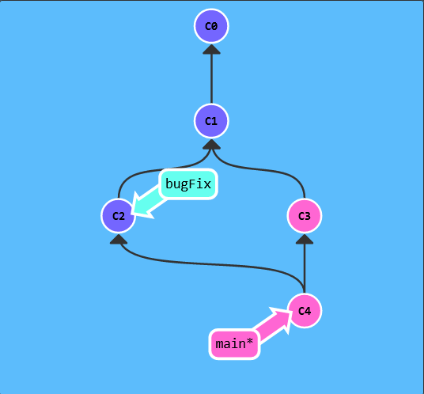
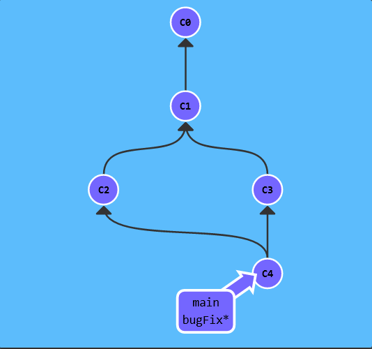
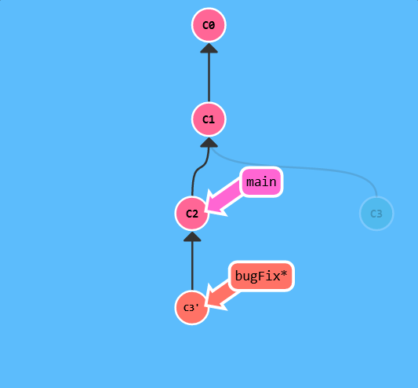

# Git Commit

## 教学

Git 仓库中的提交记录保存的是你的**目录下所有文件的快照**，就像是把整个目录复制，然后再粘贴一样，但比复制粘贴优雅许多！

Git 希望提交记录尽可能地轻量，因此在你每次进行提交时，它并不会盲目地复制整个目录。条件允许的情况下，它会将当前版本与仓库中的上一个版本进行对比，并把所有的**差异打包到一起**作为一个提交记录。

Git 还**保存了提交的历史记录**。这也是为什么大多数提交记录的上面都有父节点的原因 —— 我们会在图示中用箭头来表示这种关系。对于项目组的成员来说，维护提交历史对大家都有好处。

关于提交记录太深入的东西咱们就不再继续探讨了，现在你可以把提交记录看作是项目的快照。提交记录非常轻量，可以**快速地在这些提交记录之间切换**！

## 演示

使用 `git commit` 创建一条新的提交记录，把当前节点作为父节点，新生成的子节点放到后面。

## 练习

> 创建两个提交

- 提交两次即可

```shell
git commit
git commit
```

# Git Branch

## 教学

 Git 的分支也非常轻量。它们只是简单地指向某个提交纪录 —— 仅此而已。所以许多 Git 爱好者传颂：

> 早建分支！多用分支！

这是因为即使创建再多的分支也**不会造成储存或内存上的开销**，并且按逻辑分解工作到不同的分支要比维护那些特别臃肿的分支简单多了。

在将分支和提交记录结合起来后，我们会看到两者如何协作。现在只要记住使用分支其实就相当于在说：“我想**基于这个提交以及它所有的父提交进行新的工作**。”

## 演示

1. 使用 `git branch newImage` 创建一个新分支
2. 使用 `git commit` 创建一条新的提交记录
   - main分支前进了，newImage分支没动，这是因为当前还在main（后面有星号）

3. 切换到新分支 `git checkout <name>` ，再进行提交
   - Git 2.23 版本中，引入了一个名为 `git switch` 的新命令，最终会取代 `git checkout`，因为 `checkout` 作为单个命令有点超载（它承载了很多独立的功能）。
   - 创建的同时切换：`git checkout -b <your-branch-name>`

## 练习

> 创建一个名为 `bugFix` 的新分支，然后切换过去。

```shell
git branch bugFix
git checkout bugFix
// git switch bugFix
```

或：

```shell
git chechout -b bugFix
```

# Git Merge

## 教学

> 新建一个分支，在其上开发某个新功能，开发完成后再合并回主线。——方法1

在 Git 中合并两个分支时会产生一个特殊的提交记录，它有两个父节点。翻译成自然语言相当于：“我要把这两个父节点本身及它们所有的祖先都包含进来。”

## 演示

> 要把 `bugFix` 合并到 `main` 里（当前在main分支）

- `git merge bugFix`：`main` 现在指向了一个拥有两个父节点的提交记录
  - 从 `main` 开始沿着箭头向上看，在到达起点的路上会经过所有的提交记录。这意味着 `main` 包含了对代码库的所有修改。



> 再把 `main` 分支合并到 `bugFix`

- `git checkout bugFix; git merge main`：把 `bugFix` 移动到 `main` 所指向的那个提交记录



## 练习

> - 创建新分支 `bugFix`
>
> - 用 `git checkout bugFix` 命令切换到该分支
>
> - 提交一次
>
> - 用 `git checkout main` 切换回 `main`
>
> - 再提交一次
>
> - 用 `git merge` 把 `bugFix` 合并到 `main`

```shell
git branch bugFix
git checkout bugFix
git commit
git checkout main
git commit
git merge bugFix
```

# Git Rebase

## 教学

> 新建一个分支，在其上开发某个新功能，开发完成后再合并回主线。——方法2

- 取出一系列的提交记录，“复制”它们，然后在另外一个地方逐个的放下去。

- 优势就是可以创造更线性的提交历史，如果只允许使用 Rebase 的话，代码库的提交历史将会变得异常清晰。

## 演示

> 把 bugFix 分支里的工作直接移到 main 分支上。移动以后会使得两个分支的功能看起来像是按顺序开发，但实际上它们是并行开发的。

- `git rebase main`，bugFix 分支上的工作在 main 的最顶端，同时我们也得到了一个更线性的提交序列。
  - 提交记录 C3 依然存在（树上那个半透明的节点），而 C3' 是我们 Rebase 到 main 分支上的 C3 的副本。



- 再切换到main分支运行`git rebase bugFix`，此时两个分支处在同一顶点上，**不会有分叉记录**

## 练习

> - 新建并切换到 `bugFix` 分支
> - 提交一次
> - 切换回 main 分支再提交一次
> - 再次切换到 bugFix 分支，rebase 到 main 上

```shell
git checkout -b bugFix
git commit
git checkout main
git commit
git checkout bugFix
git rebase main
```

