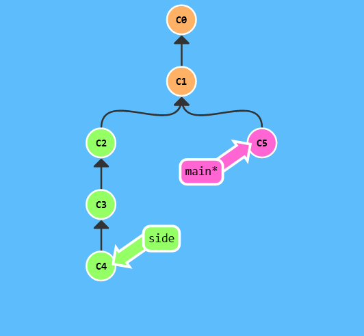
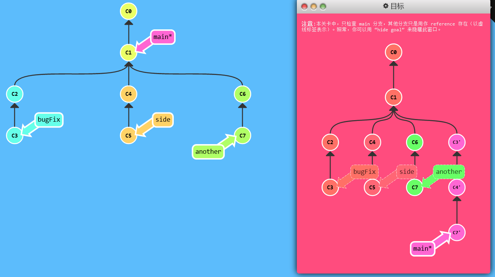
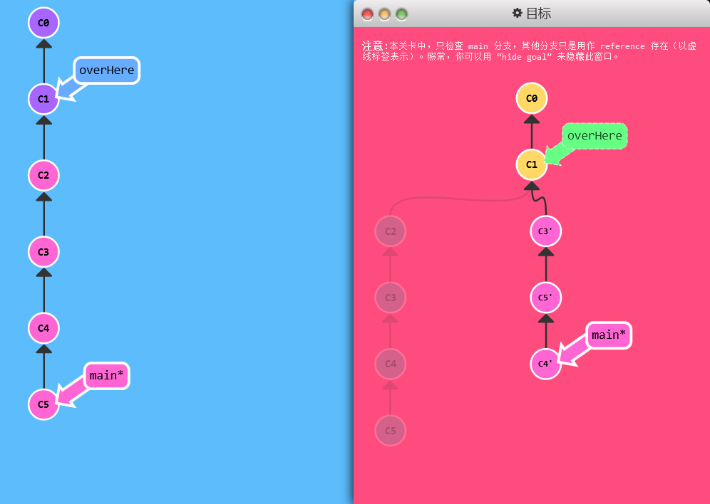
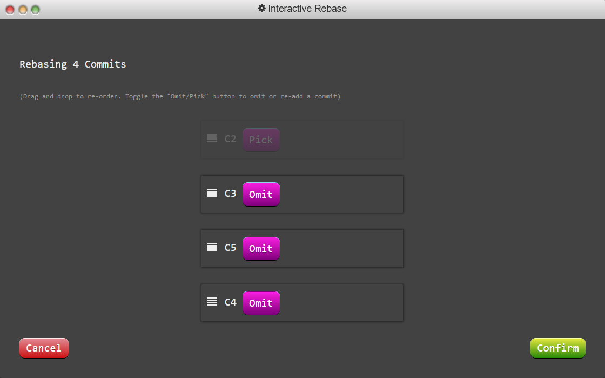

> 整理提交记录——把某个提交放到指定位置

# Git Cherry-pick

## 教学

- `git cherry-pick <提交号>...`：将一些提交复制到当前所在的位置（`HEAD`）下面

## 演示



- ` git cherry-pick C2 C4 `：把这两个提交复制到当前HEAD的下面，可以跳记录


## 练习

> 将三个分支中的提交记录复制到 main 上

```shell
git cherry-pick C3 C4 C7
```



# 交互式 rebase

> 不清楚你想要的提交记录的哈希值时 ——交互式rebase：从一系列的提交记录中找到想要的记录

## 教学

- 交互式 rebase 指的是使用带参数 `--interactive` 的 rebase 命令, 简写为 `-i`
  - 如果你在命令后增加了这个选项, Git 会打开一个 UI 界面并列出将要被复制到目标分支的备选提交记录，它还会显示每个提交记录的哈希值和提交说明，提交说明有助于你理解这个提交进行了哪些更改。
  - 在实际使用时，所谓的 UI 窗口一般会在文本编辑器 —— 如 Vim —— 中打开一个文件。

- 当 rebase UI界面打开时, 你能做3件事:
  - 调整提交记录的顺序（通过鼠标拖放来完成）
  - 删除你不想要的提交（通过切换 `pick` 的状态来完成，关闭就意味着你不想要这个提交记录）
  - 合并提交，它允许你把多个提交记录合并成一个。（本课程不支持）

## 演示

- ` git rebase -i HEAD~4 `：把当前HEAD指针往上（包括当前）的四个提交提取出来，进行排序、删除等操作，结束后返回想要调整的顺序

## 练习

> 做一次交互式的 rebase，整理成目标窗口中的提交顺序。

```shell
git rebase -i HEAD~4
```



- 打开窗口后拖动成要求状态

