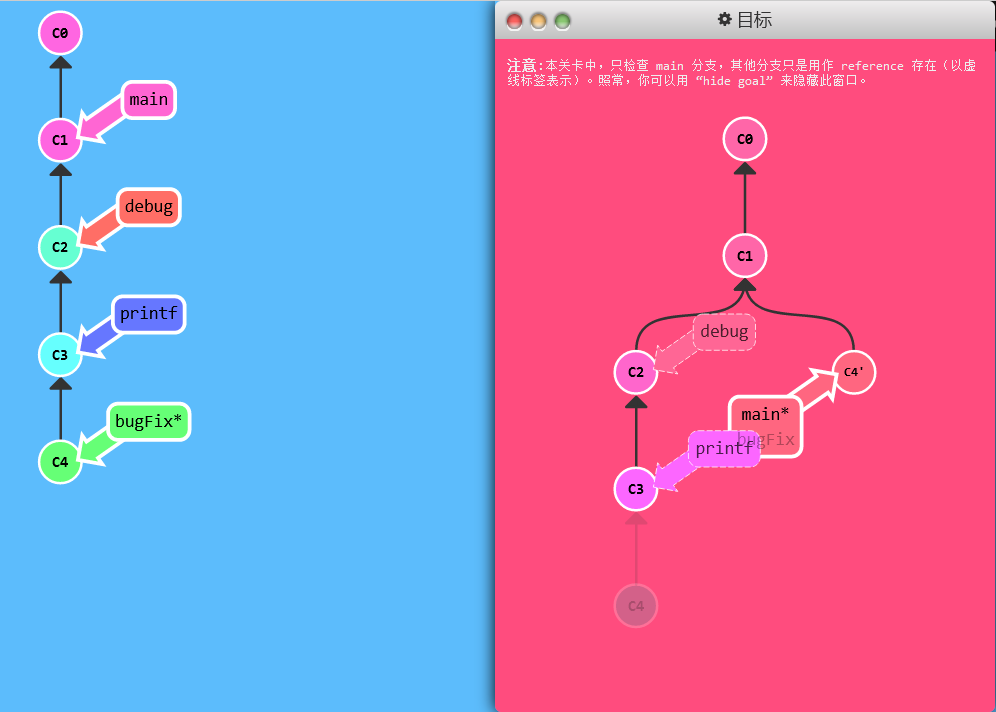
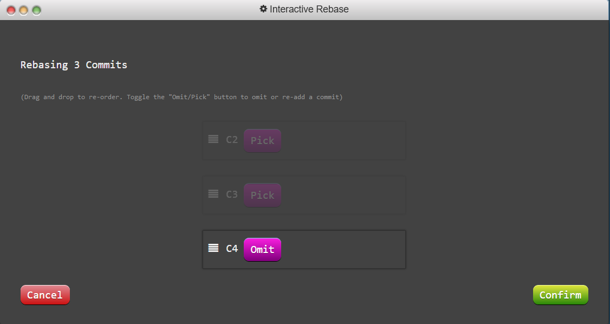
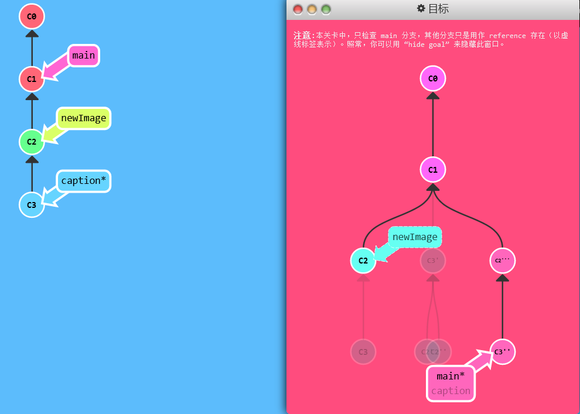
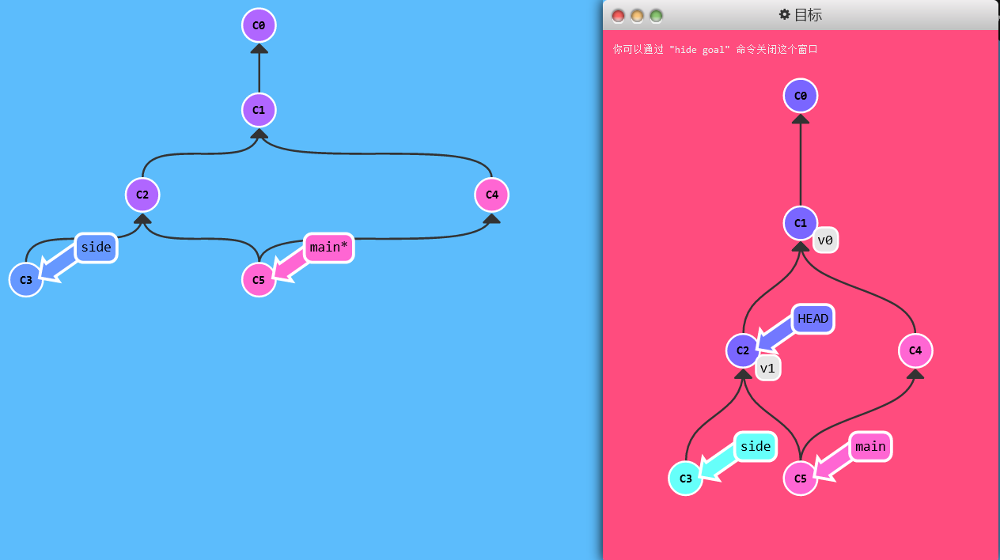
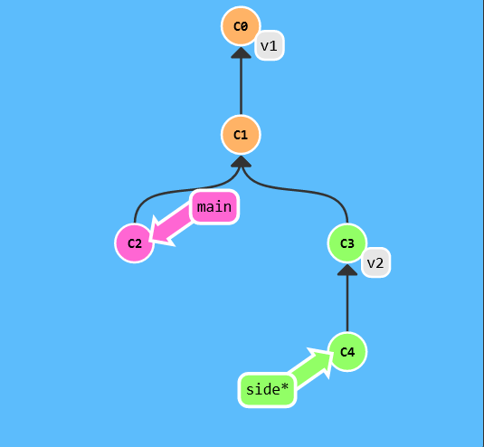
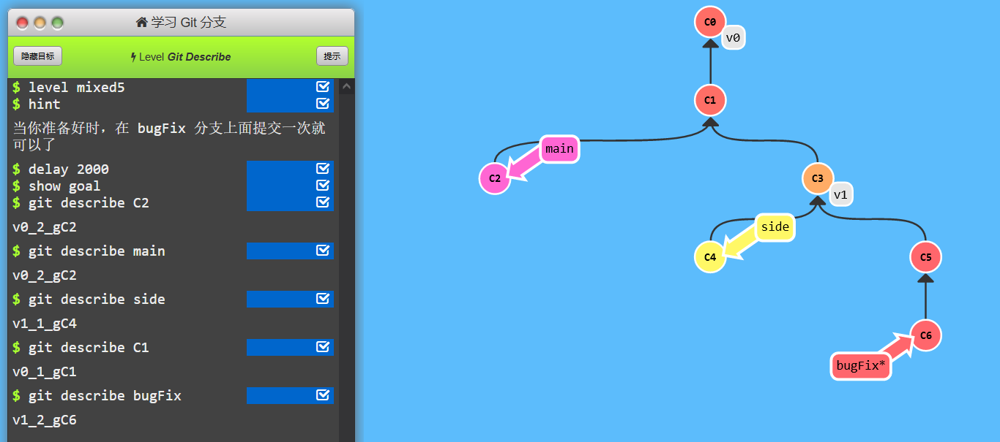

# 只取一个提交记录

> 不保留分支中的某些提交记录（日志打印等调试语句）

## 教学

- 使用`git rebase -i` 或 `git cherry-pick`即可

## 练习

> 确保 `main` 分支能得到 `bugFix` 分支上的相关提交

方法1：

```shell
git checkout main
git cherry-pick C4
```



方法2：

```shell
git rebase -i HEAD~3
```



```shell
git checkout main
git rebase bugFix
```

# 提交的技巧1

> 对某个以前的提交记录进行一些小小的调整

## 教学

一种思路：

- 先用 `git rebase -i` 将提交重新排序，然后把我们想要修改的提交记录挪到最前

- 然后用 `git commit --amend` 来进行一些小修改

- 接着再用 `git rebase -i` 来将他们调回原来的顺序

- 最后我们把 main 移到修改的最前端（用你自己喜欢的方法）

——对于 `'` 的数量上的不同，并不纳入对比范围内

> `git commit --amend` ：对上一次提交有修改，可以修改文件也可以修改说明，不产生新的commit

## 练习

```shell
git rebase -i HEAD~2  # 交换caption分支的C2和C3
git commit --amend  # 重新提交C2
git rebase -i HEAD~2  # 交换caption分支的C3和C2

git branch -f main  # 更新main分支到最新，空白默认为当前HEAD
# 或
git checkout main  # 切换到main分支
git rebase caption  # 更新main分支到最新caption
```



——本关不允许使用cherry-pick，否则的话直接

```shell
git checkout main

# 可以达到main分支要求
git cherry-pick C2 C3

# 达到修改C2提交的要求
git cherry-pick C2
git commit --amend
git cherry-pick C3
```

# 提交的技巧2

> 上一关进行了两次排序，而这有可能造成由 rebase 而导致的冲突

## 演示

- cherry-pick 可以将提交树上任何地方的提交记录取过来追加到 HEAD 上（**只要不是 HEAD 上游的提交就没问题**）

## 练习

> 通过 `--amend` 改变提交记录 `C2`，但你不能用 `rebase -i`

# Git Tags

> - 分支很容易被人为移动，并且当有新的提交时，它也会移动。分支很容易被改变，大部分分支还只是临时的，并且还一直在变。
> - 有没有什么可以*永远*指向某个提交记录的标识？

## 教学

- Git 的 tag 可以（在某种程度上 —— 因为标签可以被删除后重新在另外一个位置创建同名的标签）**永久地将某个特定的提交命名为里程碑**，然后就可以像分支一样引用了。
- 它们并**不会随着新的提交而移动**。你也**不能切换到某个标签上面进行修改提交**，它就像是提交树上的一个锚点，标识了某个特定的位置。——在tag上进行新`git commit --amend`会创建新分支。

## 演示

- `git tag v1 C1`：我们将这个标签命名为 `v1`，并且明确地让它指向提交记录 `C1`，如果你不指定提交记录，Git 会用 `HEAD` 所指向的位置。

## 练习

> 按照目标建立两个标签，然后切换到 `v1` 上面，要注意你**会进到分离 `HEAD` 的状态** —— 这是因为不能直接在`v1` 上面做 commit。

```shell
git tag v0 C1
git tag v1 C2
git checkout v1
```



# Git Describe

> 用来**描述**离你最近的锚点（也就是标签）

## 教学

- 场景：当你用 `git bisect`（一个查找产生 Bug 的提交记录的指令）找到某个提交记录时，或者是当你坐在你那刚刚度假回来的同事的电脑前时， 可能会用到这个命令。
- 语法是：`git describe <ref>` 
  - `<ref>` 可以是任何能被 Git 识别成提交记录的引用，如果你没有指定的话，Git 会以你目前所检出的位置（`HEAD`）

- 输出结果为：`<tag>_<numCommits>_g<hash>`
  - `tag` 表示的是离 `ref` 最近的标签， `numCommits` 是表示这个 `ref` 与 `tag` 相差有多少个提交记录， `hash` 表示的是你所给定的 `ref` 所表示的提交记录哈希值的前几位。
  - 当 `ref` 提交记录上有某个标签时，则只输出标签名称

## 演示

- `git tag v2 C3`打好标记
- `git describe main`输出：`v1_2_gC2`
- `git describe side`输出：`v2_1_gC4`



## 练习

- 随意指定几个位置来查看即可
- 都是**往上找标签**的
- 随意提交就可以过关

