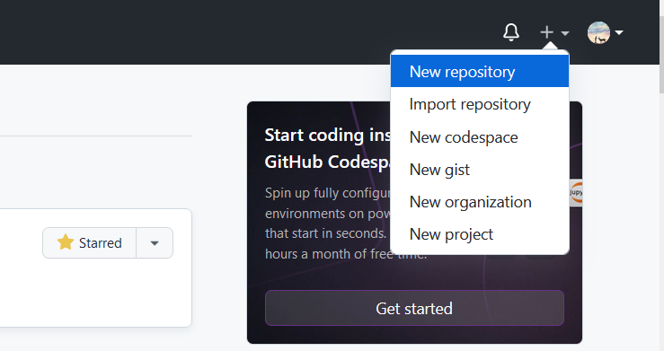
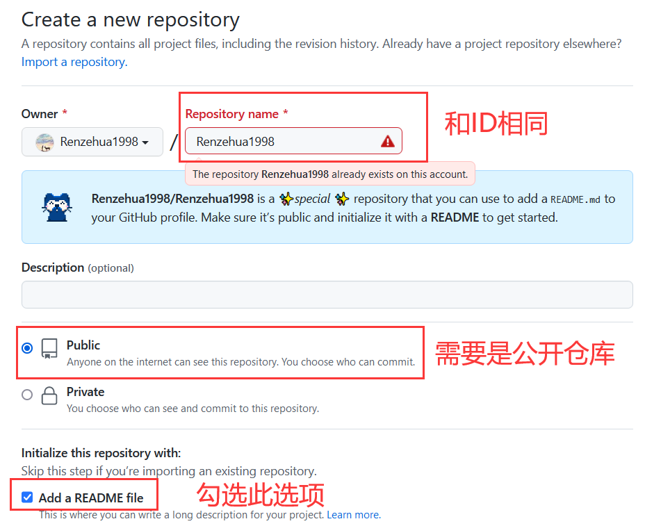
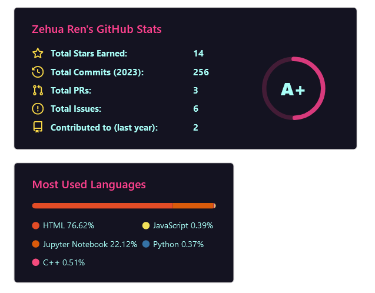
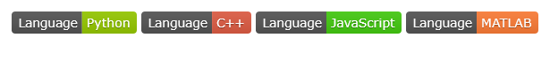
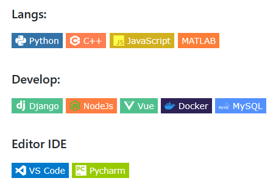
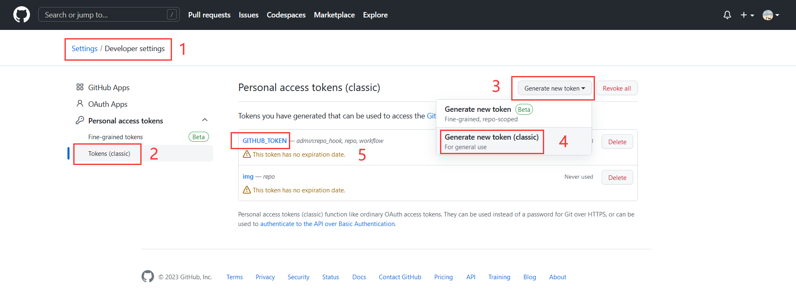
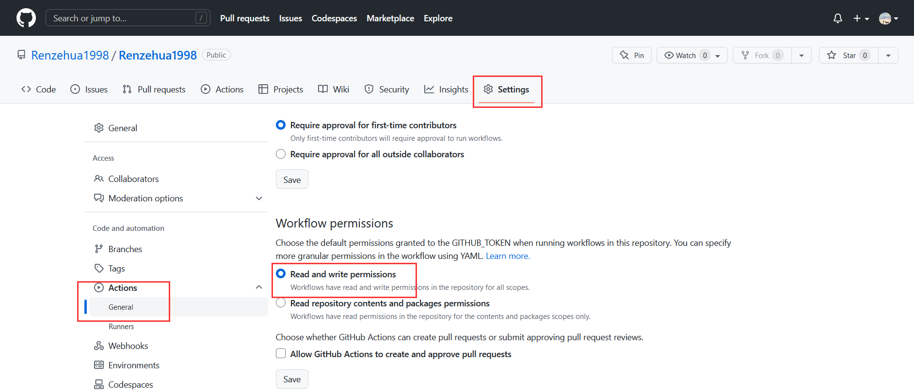
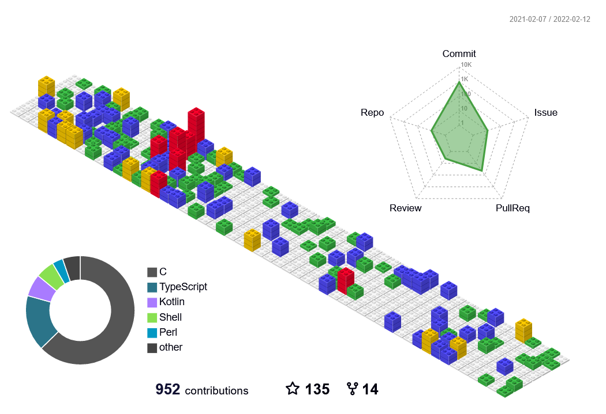

> 我们在逛GitHub的时候常常会看到一些很漂亮的个人主页，包含了使用者在GitHub的活动情况、个人信息以及联系方式等内容。那么我们应该怎样打造应该个性化的GitHub主页呢？就从本文开始吧！

# 准备工作

- 要打造GitHub主页，首先要 <del>有GitHub账号</del> 创建一个和**名称自己ID相同**的仓库
- 注意这个仓库必须为**公开仓库**，并且包含**README文件**。

**步骤**：

1. 新建仓库



2. 配置内容



3. 点击创建即可

# 基础配置

- 修改刚刚生成的README文件，其内容即可展示到你的主页

- 因为markdown文件支持HTML语法，你可以发挥自己的所能设计主页

- 在这里我介绍几个可能为你所用的API

## Emoji

- markdown是支持emoji表情输入的，我们可以在书写个人简介时加入一些表情

  如：Hi there :wave:, I 'm xxx

- emoji表情可以直接粘贴，也可以使用 `:标签名称:` 的格式引入

  上面的挥手表情就是键入 `:wave:` 来引入的

- 要找对应的表情名称，可以访问这个网站：https://www.webfx.com/tools/emoji-cheat-sheet/

  输入要查找的表情，或者选择中意的表情直接粘贴过来

## 状态展示

https://github.com/anuraghazra/github-readme-stats

- 统计你的GitHub活动情况：PR、Star、贡献等等
- 也可以显示你的语言使用情况



- 可选主题有：`dark`, `radical`, `merko`, `gruvbox`, `tokyonight`, `onedark`, `cobalt`, `synthwave`, `highcontrast`, `dracula`
- 引入方式：放到 `` 标签里，在 `src` 属性进行配置即可

```html
<!--状态展示：-->


<!--语言使用统计：-->

```

- 还可以放置你最想展示的仓库，使用方式：

  点击即可跳转到对应仓库

```markdown
[](你仓库的url)
```

## shields.io 徽标

https://shields.io/

- 可以使用此API进行徽标制作，只需要引入对应的url即可

```markdown


<!-- 例如下面的图片会显示一个绿色的label为lLanguage，信息为Python的徽标 -->

```




- 也可以为徽标添加icon，具体可用icon可以到 https://github.com/simple-icons/simple-icons/blob/develop/slugs.md 查询。

```markdown
<!-- 通过style设置徽标样式，通过logo设置icon，通过logoColor设置icon颜色 -->

```




## 行为折线图

https://github.com/Ashutosh00710/github-readme-activity-graph

- 显示最近一个月以来GitHub贡献的折线图

```markdown


```


## 阅读统计

```markdown


<!-- 可以使用img标签使其右对齐 -->

```


## 网站数据卡片

https://github.com/songquanpeng/stats-cards

- 可以显示自己其他网站账号的情况，如CSDN、哔哩哔哩、leetcode、掘金等

```markdown


```

[](https://space.bilibili.com/26575098) [](https://blog.csdn.net/Ricardo1998)

## 动态文字

https://github.com/DenverCoder1/readme-typing-svg

- 产生动态输入文字的效果

```html

```

- 可以添加多条消息，可以更改字体和文字颜色
- **消息中的空格要使用`%20`代替**

# 进阶配置

- 前面基础配置中都是有现成的API，直接按照图片格式引入，把参数加到url里面即可
- 当我们需要一些更酷炫、更个性化的展示内容时，就需要进行动态配置
- 这里主要用到的是 **GitHub Actions** 功能

## 准备工作

1. 添加名为 `GITHUB_TOKEN` 的token



2. 勾选 `admin:repo_hook`、`repo` 和 `workflow` 权限
3. 在和自己用户名同名的仓库里面设置允许Action操作仓库



4. 在仓库下 `.workflow` 文件夹下建立 `.yml` 文件，写好配置即可定时允许更新

## 3D贡献图

https://github.com/yoshi389111/github-profile-3d-contrib

- 在项目里按图片引入（本地图片）

```markdown

```

```yaml
name: GitHub-Profile-3D-Contrib

on:
  schedule: # 02:30 IST == 21:00 UTC
    - cron: "0 21 * * *"
  workflow_dispatch:

jobs:
  build:
    runs-on: ubuntu-latest
    name: generate-github-profile-3d-contrib
    steps:
      - uses: actions/checkout@v2
      - uses: yoshi389111/github-profile-3d-contrib@0.7.0
        env:
          GITHUB_TOKEN: ${{ secrets.GITHUB_TOKEN }}
          USERNAME: ${{ github.repository_owner }}
      - name: Commit & Push
        run: |
          git config user.name github-actions
          git config user.email github-actions@github.com
          git add -A .
          git commit -m "generated"
          git push
```



## 贪吃蛇

https://github.com/Platane/snk

- 放入picture标签可以实现暗黑模式自适应

```html
<picture>
  <source media="(prefers-color-scheme: dark)" srcset="/output/github-snake-dark.svg">
  <source media="(prefers-color-scheme: light)" srcset="/output/github-snake.svg">
  
</picture>
```

```yaml
name: generate animation

on:
  # run automatically every 12 hours
  schedule:
    - cron: "0 */12 * * *" 
  
  # allows to manually run the job at any time
  workflow_dispatch:
  
  # run on every push on the master branch
  push:
    branches:
    - master
    
  

jobs:
  generate:
    runs-on: ubuntu-latest
    timeout-minutes: 10
    
    steps:
      # generates a snake game from a github user (<github_user_name>) contributions graph, output a svg animation at <svg_out_path>
      - name: generate github-contribution-grid-snake.svg
        uses: Platane/snk/svg-only@v2
        with:
          github_user_name: ${{ github.repository_owner }}
          outputs: |
            dist/github-snake.svg
            dist/github-snake-dark.svg?palette=github-dark
      # push the content of <build_dir> to a branch
      # the content will be available at https://usercontent.githubfast.com/raw/<github_user>/<repository>/<target_branch>/<file> , or as github page
      - name: push github-contribution-grid-snake.svg to the output branch
        uses: crazy-max/ghaction-github-pages@v3.1.0
        with:
          target_branch: output
          build_dir: dist
        env:
          GITHUB_TOKEN: ${{ secrets.GITHUB_TOKEN }}
```

