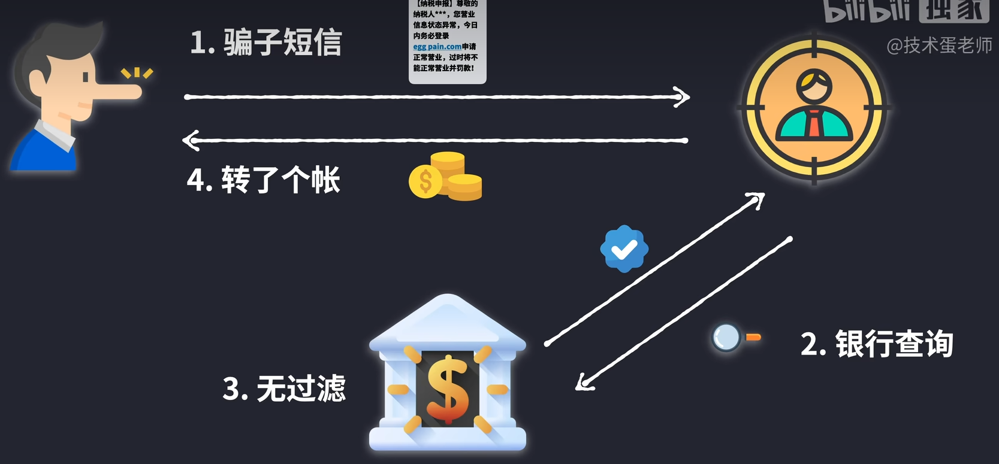
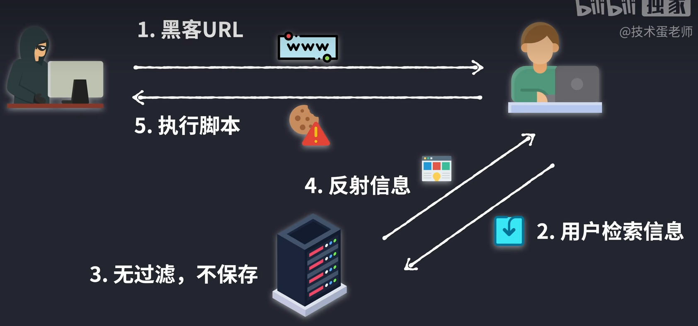
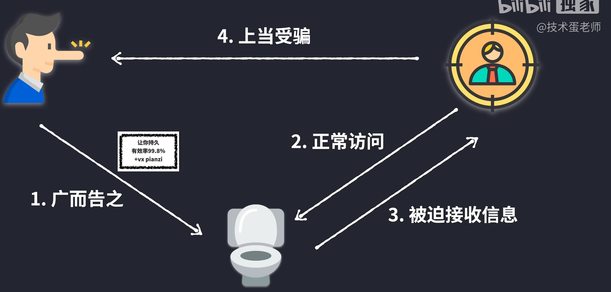
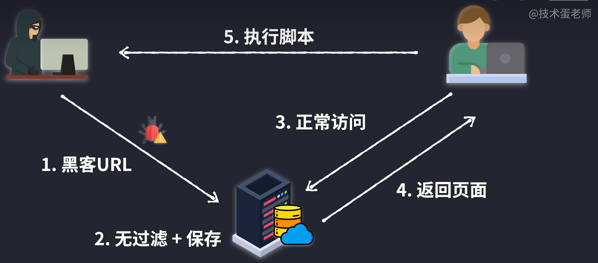
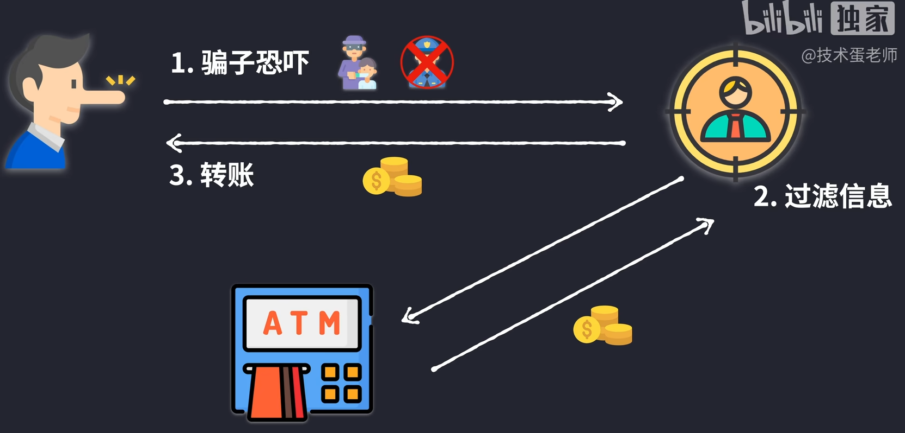
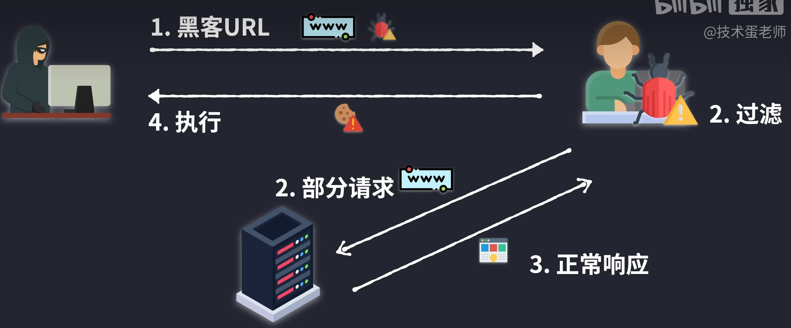

# 原理、类型和实践

> XSS网络攻击 - 原理，类型和实践。蛋老师B站课程：https://www.bilibili.com/video/BV1rg411v7B8

## 反射型

一个**实际例子**：社会工程学。诈骗的时候碰巧遇到需要转账的人。

1. 骗子短信
2. 银行查询
3. 无过滤
4. 转账

对应于网络中的情况：

1. 黑客url
2. 用户检索信息
3. 服务器无过滤、不保存
4. 服务器反射信息
5. 执行脚本

反射型XSS攻击会在url中植入恶意代码。服务器返回内容可能会带url里面输入的部分内容。如果不对url进行过滤，可以植入script标签。使用alert函数测试能否植入，如果可以的话，就说明可以进行进一步操作。

转换成短url即可隐藏真实意图。但要让受害者点击还是需要社会工程学配合。

## 存储型

**实际例子**：小广告

1. 广而告之
2. 正常访问
3. 被迫接受信息
4. 上当受骗

对应于网络中的情况：

1. 黑客植入url（如放入评论）
2. 服务器无过滤+保存
3. 正常访问
4. 返回页面
5. 执行脚本

问题就是，服务器返回恶意代码时，浏览器会自动执行，就算你不点击，也会产生信息泄露或损失。

危害是很大的，用户不知情，用户越多损失越大。

## DOM型

**实际例子**：绑架诈骗

1. 骗子恐吓家长
2. 家长不透露绑架信息
3. 去银行取钱
4. 给骗子转账

对应于网络中的情况

1. 黑客url链接
2. 受害者浏览器过滤恶意代码，执行正常请求
3. 服务器正常相应
4. 收到反馈后本地执行恶意代码

主要实现：

- 示例：url后面的`#`，用来减少请求，本地路由导航。但它后面的内容不会发给服务器。
- 两样条件：页面代码存在可被修改的某种属性（脆弱点），和对应可以执行去修改它的方法（工具）。