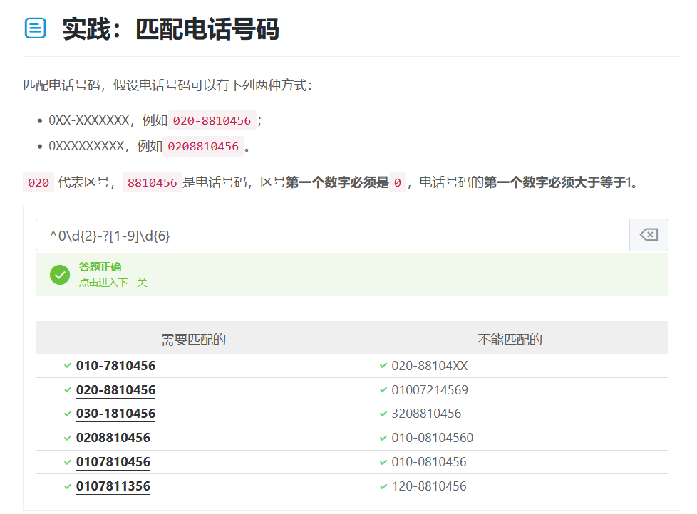
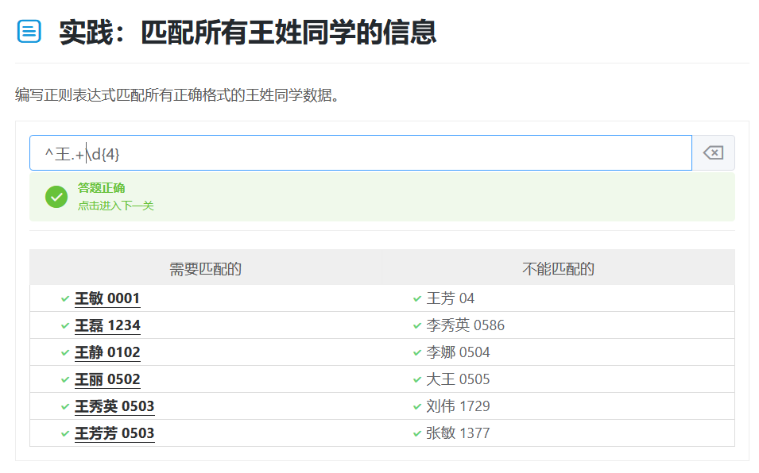
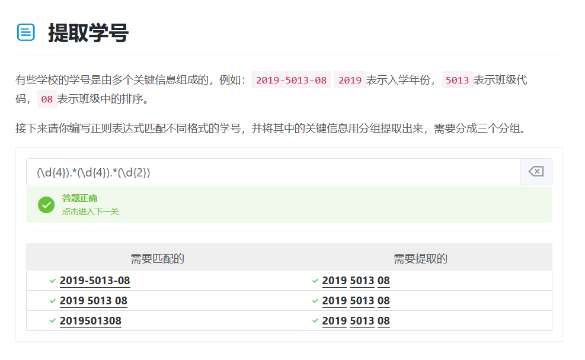
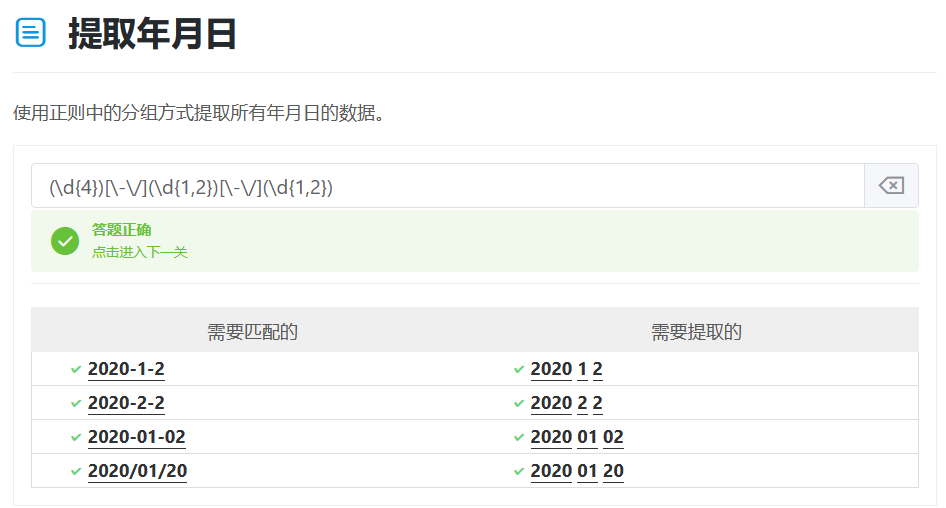
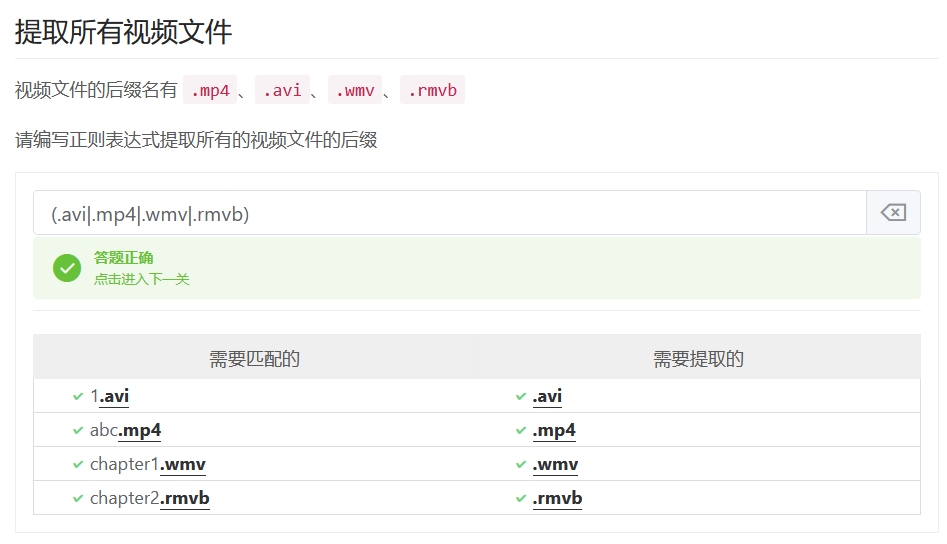
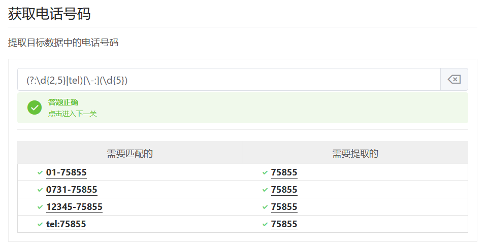
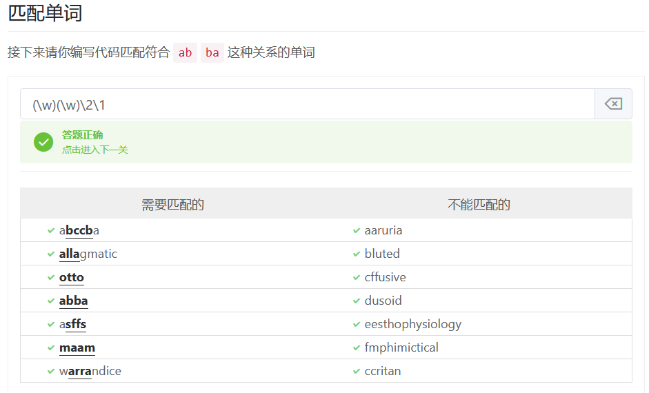
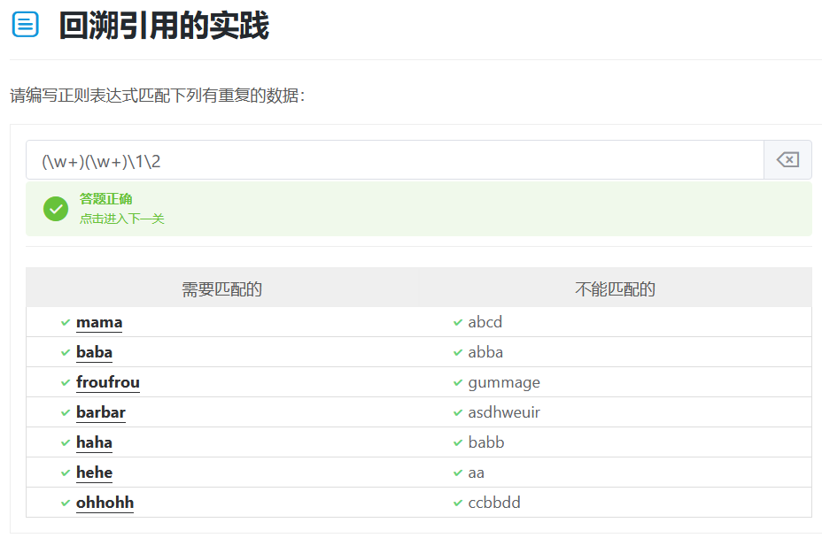
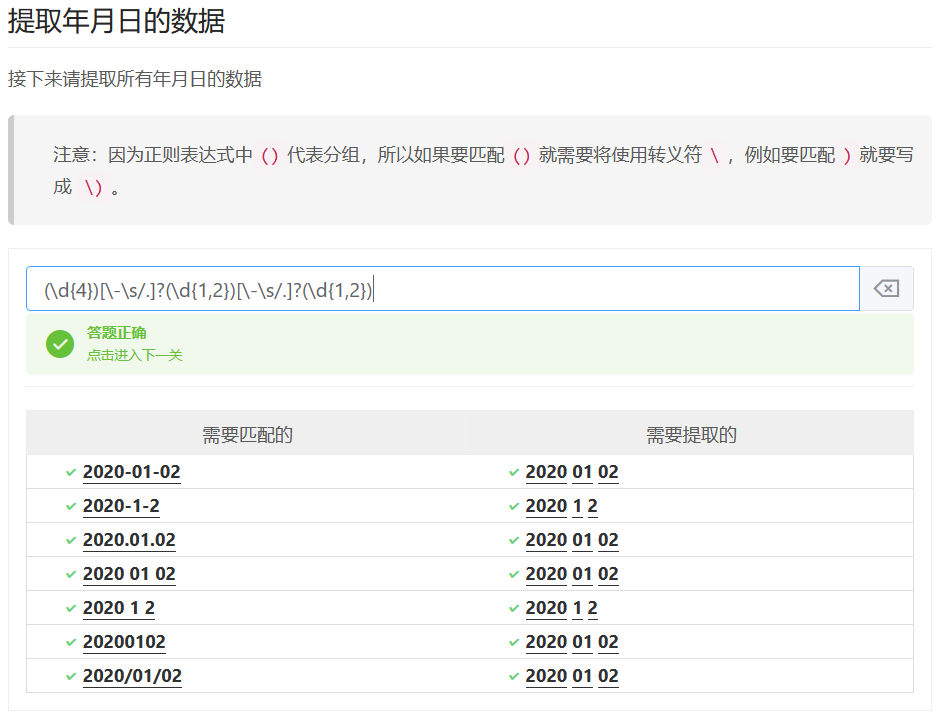
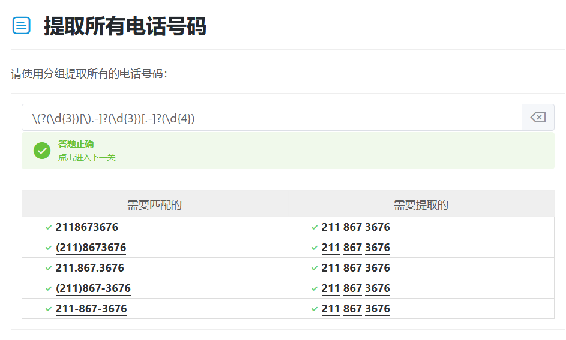

# 正则表达式入门视频笔记

> 正则练习网址： https://www.codejiaonang.com/
>
> 正则在线测试网站： https://regexr-cn.com/
>
> 教程链接：https://www.bilibili.com/video/BV19t4y1y7q

## 正则表达式入门

一个应用例子：从html提取\<span\>内容、提取手机号

### 字符组

- 方括号：匹配中括号中出现的任意元素一次——`[Py]yhon`

  - 方括号简化区间：横杠——`[0-9]`数字；`[a-z]`小写字母；`[a-zA-Z]`大小写字母

  - 转义字符`\`可以匹配特殊规定的字符`-\()[]`等
  - `^`代表取反——`[\^0-9]`所有非数字

### 快捷方式

- `\d`——所有数字
- `\w`——所有数字+英文字母+_
- `\s`——空白：空格、tab、换行
- `\b`——单词边界

取反：大写字母即可\D非数字

- 开始——`^`：在区间外面表示开始。放在正则开头，表示以匹配到内容开头的字符串
- 结束——`$`放在正则结尾，表示以匹配到内容结尾的字符串
- 任意字符——`.`：不能匹配`\n`
- 可选字符——`?`：放在末尾，表示可以出现可以不出现
- 可选任意字符——`.?`

### 匹配多个数据

- 重复次数——a{9}：大括号内部表示这个字符出现的次数
- 重复区间——`{M,N}`，`M`是下界而`N`是上界
  - 正则表达式默认是**贪婪模式**，尽可能的匹配更多字符。取消贪婪模式，在**表达式后面加上** `?`——表示慵懒

- 开闭区间——闭区间不写即可表示匹配一个或无数个
  - `+`——`{1,}`
  - `*`——`{0,}`

### 实践

`^0\d{2}-?[1-9]\d{6}`

`^王.+\d{4}`

### 总结

| 实例          | 描述                                |
| ------------- | ----------------------------------- |
| `[Pp]ython`   | 匹配 “Python” 或 “python”。         |
| `rub[ye]`     | 匹配 “ruby” 或 “rube”。             |
| `[abcdef]`    | 匹配中括号内的任意一个字母。        |
| `[0-9]`       | 匹配任何数字。类似于 [0123456789]。 |
| `[a-z]`       | 匹配任何小写字母。                  |
| `[A-Z]`       | 匹配任何大写字母。                  |
| `[a-zA-Z0-9]` | 匹配任何字母及数字。                |
| `[^au]`       | 除了au字母以外的所有字符。          |
| `[^0-9]`      | 匹配除了数字外的字符。              |

| 实例 | 描述                                                         |
| ---- | ------------------------------------------------------------ |
| `.`  | 匹配除 “\n” 之外的任何单个字符。要匹配包括 ‘\n’ 在内的任何字符，请使用象 ‘[.\n]’ 的模式。 |
| `?`  | 匹配一个字符零次或一次，另一个作用是非贪婪模式               |
| `+`  | 匹配1次或多次                                                |
| `*`  | 匹配0次或多次                                                |
| `\b` | 匹配一个长度为`0`的子串                                      |
| `\d` | 匹配一个数字字符。等价于 [0-9]。                             |
| `\D` | 匹配一个非数字字符。等价于 [^0-9]。                          |
| `\s` | 匹配任何空白字符，包括空格、制表符、换页符等等。等价于 [ \f\n\r\t\v]。 |
| `\S` | 匹配任何非空白字符。等价于 [^ \f\n\r\t\v]。                  |
| `\w` | 匹配包括下划线的任何单词字符。等价于’[A-Za-z0-9_]’。         |
| `\W` | 匹配任何非单词字符。等价于 ‘[^A-Za-z0-9_]‘。                 |

## 正则表达式进阶

> 分组、回溯和断言

### 分组

- 使用括号即可
- 分组有一个非常重要的功能——`捕获数据`
- 想要从匹配好的数据中提取关键数据的时候可以使用分组

`(\d{4})[\-\s]?(\d{4})[\-\s]?(\d{2})`也可以

`(\d{4})[\-\/](\d{1,2})[\-\/](\d{1,2})`

#### 或者条件：`|`

#### 非捕获分组：`(?:表达式)`

`(?:\d{2,5}|tel)[\-:](\d{5})`

#### 回溯引用（重要）：`() \N`

使用`\N`可以引用编号为`N`的分组

**这道题不太好做**

`(\w{2,})\1`也可以

#### 其他练习题

### 先行断言